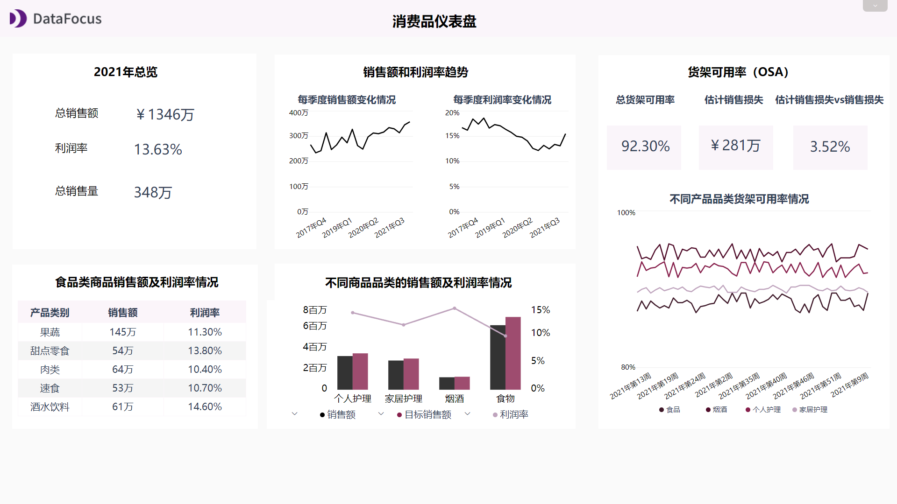

近几年疫情、贸易摩擦等不利因素叠加，很大程度上导致了快消行业总体增长呈放缓趋势。

头部企业纷纷采取数字化转型等应急战略以获取可持续的竞争优势。

如今的快消行业依靠消费者高频次、重复的使用与消耗，并通过较大规模的市场量来获得利润与价值。快消厂商的管理要求也在不断提高，提升管控能力的数字化工具也变得不可或缺。 快速消费品仪表盘作为可靠的数字化工具，可以帮助优化采购和销售策略，及时满足消费者需求，最终实现具体的财务目标。

下面将安利3个快速消费品可视化大屏示例。

## 快速消费品关键KPI仪表盘

当管理供应链涉及到货运、库存等问题时，对于管理者来说可能是比较头疼的问题。上述快速消费品KPI仪表盘主要跟踪了业务库存和流程的指标，而为了及时跟进情况，这些指标必须在短时间内衡量。

首先仪表盘上最左侧显示的指标显示了2021年概览状况，分别是存货周转率、OTIF平均值和缺货率平均值。OTIF是货物按时按量交付率，从客户的角度来看，体现的是交付的能力，即正确的产品在正确的时间和正确的地点以正确的数量和质量标准交付。

仪表盘的下一个指标体现的是缺货情况。计算缺货率可以帮助您准确了解库存状态。对于快速发展的商品业务来说，任何“长期”缺货情况都会对销售产生巨大而直接的影响。一旦放松警惕，面临产品反复缺货的客户可能将永久放弃您的商店，继而转向另一家。此外，研究表明，商品缺货率达80%，意味着问题出在货架补货，而不是库存短缺。实施有效的人员配置，或许能有效地解决问题，从而提升整体销售额。

对于快消行业来说，“平均销售时间”与“保鲜期内售出的商品百分比”这两者都是比较重要的指标，因为销售周期时间会更短，并且受到如有效期、卫生规定等限制。同时这也是采购部门和现金流管理的重要指标，您可以比较不同类别商品的销售时间，结合商品固有属性，设法在保险期内尽可能地销售以避免浪费和增加库存。未售出商品的库存会增加账面成本，这主要体现在存储和管理成本上。

所以，这需要在商品供给和潜在损失之间权衡。到底是保证商品的供给，还是宁愿有一个100%的销售率以降低损失？而这通常是折扣店和高级超市之间最主要的区别。

## 快速消费品财务仪表盘

这个快速消费品财务仪表盘主要分析的是公司财务状况。可以看到左侧三个主要KPI：总净销售额、总供应链成本和现金周转周期。

大屏中显示供应链总成本高达860万人民币，我们可以对其按类别及其比例进一步细分。最大的预算项目是仓储成本，为240万，其次是运输220万，库存置存成本190万，客户服务110万，库存管理100万。

我们还可以将供应链总成本与销售额进行比较，看看在供应链上花费了多少，而不只是关注带来了多少利润。如果在供应链上花费的百分比太高，则可以找出节省成本的方法。但是，如果没有事先仔细的分析，光一味地减少成本，可能又会增加其它地方的成本，最终只是浪费时间和精力。最合适的做法是将此百分比与行业平均水平进行比较，设定目标并保持在该水平线以下。

除此之外，大屏中还涉及到指标现金转换周期。它体现了现金在主要消费和生产领域（库存、应付账款、应收账款）的捆绑时间。该指标以天数计算，通过将应收账款和库存天数相加，并减去应付账款天数计算可得。如果您想确定需要多少现金来为现在进行的运营提供资金，那么参考现金转换周期将很有帮助。通常而言，该指标越低越好。大屏上我们可以看到周期随着时间变化从48天下降到了35天，这是一个较大的进步，运营会变得更加顺畅。而现在，公司的现金仅存货39天，这意味着有效的销售和高效的收款。

最后一个指标体现的是库存的账面成本，包括仓储、运输、管理等。我们可以看到风险成本和运输成本是最重要的持有成本，分别占了36.7%和29.2%。这个指标是按库存价值的百分比计算的，表示在一段时间内保留和存储库存所引发的成本。也就是说，知道成本代表了多少比例，也就知道了可以从当前的库存中获得多少利润。

## 消费品仪表盘

最后一个大屏是快速消费品仪表盘，这个大屏更多的是从单个超市的角度来看。大屏中可以看到商店销售和可用的产品以及每个产品类别表现的情况。

首先是2021年的总览，指标包括总销售额、销售量和销售利润率。销售利润率表示在考虑了所售产品的成本后，销售中投入的每块钱中有多少是作为毛利润留在业务中的。它体现的是您产品的盈利能力。例如在大屏中，您可以看到食品和饮料的销售利润率非常低，而个人护理产品以及烟酒的销售利润率较高。通常情况下，利润率较低的产品通常更便宜，总销量也会更多。

您还可以在大屏中看到货架可用性（OSA），该指标评估商品在货架上显示给购物者购买的时间百分比、他们期望购买商品的位置以及他们想要购买的那一刻。OSA是一个应该持续监控和跟进的重要指标，货物一旦不可用，将会导致客户选择另外一家店。OSA也和前面提到的KPI缺货率有关，因为缺货的主要问题不是单单库存问题，而是缺乏货架补货。通过降低OSA，您可以减少预估销售损失。但就像销售时间一样，货架上的可用性并不总是100%，否则这意味着并非库存都会被出售，而是会产生其它成本。

如果您是分销商或是快速消费品贸易商，使用可视化大屏来管理您的日常运营将减轻您的工作压力。将所有信息放置于一张大屏上并实时分析，商店管理、供应链管理以及财务决策都会变得更轻松。您可以随时随地深入分析，并提取所需的商业见解，达成最终的业务目标。

立即试用DataFocus，开启您的数据分析之旅吧!
