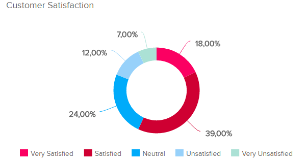
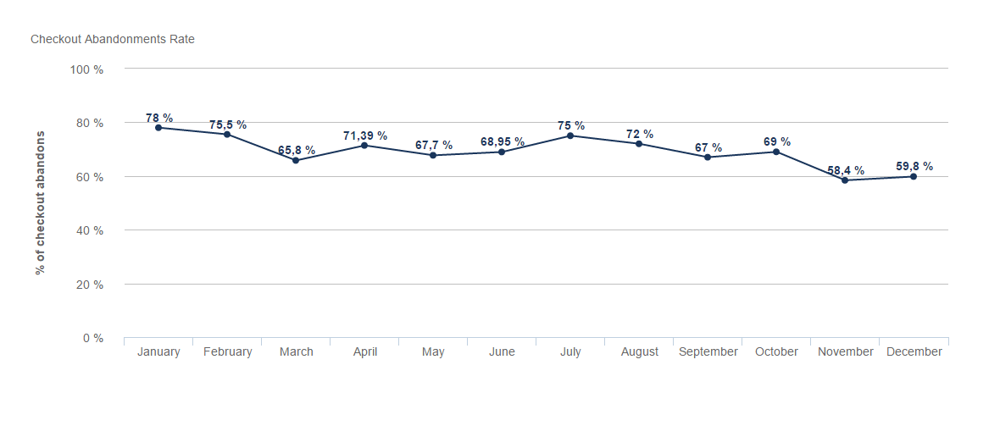
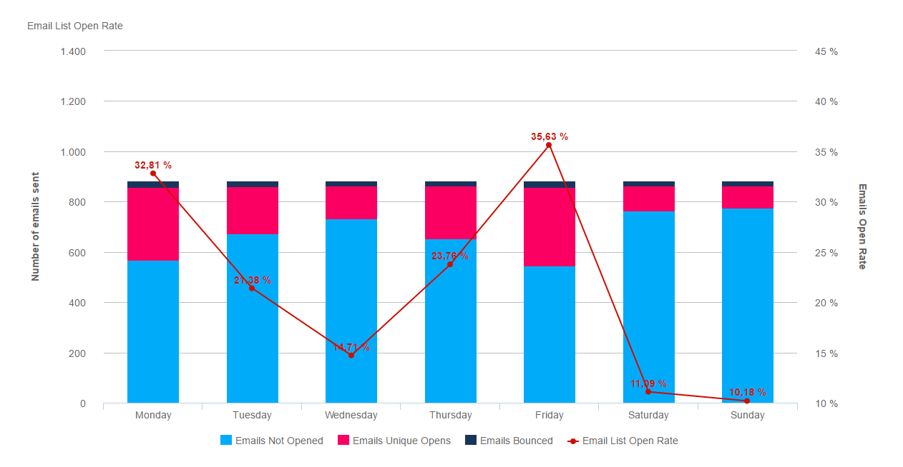
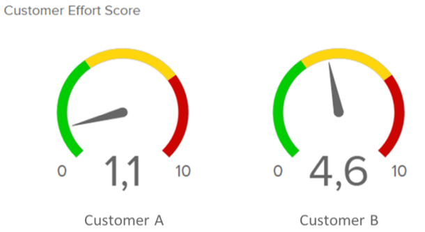

在客户关系管理中，关键绩效指标（KPI）是衡量和优化企业与客户之间互动效果的重要工具。这些KPI不仅揭示了客户对企业的真实感受和需求，还指导企业如何更好地服务客户，从而推动业务增长。接下来，我们将逐一深入探讨七个至关重要的客户KPI，并通过实例说明如何运用它们来优化客户关系。

**一、客户满意度**

客户满意度是衡量客户对产品或服务整体满意程度的指标。它直接反映了企业在客户心中的形象和地位。为了更具体地了解客户满意度，企业可以设计详细的调查问卷，询问客户对产品、服务、交付和售后等各个环节的满意程度。

**实例**：某电商平台通过在线调查，发现客户对物流配送的满意度较低。针对这一问题，平台优化了配送流程，提高了配送速度，并增加了实时物流跟踪功能，从而显著提升了客户满意度。

**二、净推荐值（NPS）**

净推荐值反映了客户对企业的忠诚度和推荐意愿。通过询问客户“您有多大可能性会向朋友或同事推荐我们的产品或服务？”来获取这一数据。NPS的计算公式是：（推荐者数量 - 贬损者数量）/ 总调查人数。

**实例**：一家餐饮连锁店通过NPS调查发现，部分客户因为等位时间过长而不满。于是，餐厅引入了预约系统，优化了等位流程，成功提高了NPS。

**三、客户获取成本（CAC）**

客户获取成本是企业为吸引新客户所花费的平均成本。降低CAC对于提高营销效率和盈利能力至关重要。

**实例**：一家在线教育平台通过社交媒体广告和口碑营销，以较低的成本吸引了大量新客户。与传统的广告投放相比，这种方式显著降低了CAC。

**四、客户生命周期价值（CLV）**

客户生命周期价值是指在整个客户关系期间，企业从客户那里获得的总收入。提高CLV意味着企业需要与客户建立长期、稳定的关系。

**实例**：一家健身房通过提供个性化的健身计划和定期的健康讲座，成功吸引了会员长期续费。这不仅提高了CLV，还增强了客户忠诚度。

**五、结账放弃率**

对于电商和在线服务平台来说，结账放弃率是一个关键指标。它反映了客户在购物或预订过程中放弃的比例。

**实例**：一家旅游预订网站发现其结账放弃率较高。经过分析，原因之一是支付流程过于复杂。于是，网站简化了支付步骤，并增加了多种支付方式，从而降低了结账放弃率。

**六、电子邮件打开率和点击率**

对于依赖电子邮件营销的企业来说，这两个指标至关重要。它们反映了客户对企业邮件内容的兴趣和参与度。

**实例**：一家时尚零售品牌通过定期发送个性化的促销邮件，成功提高了电子邮件的打开率和点击率。这些邮件不仅包含了客户感兴趣的商品推荐，还提供了专属优惠和时尚资讯。

**七、客户服务满意度和响应时间**

优质的客户服务是建立良好客户关系的关键。客户满意度和客服响应时间是衡量客户服务效果的重要指标。

**实例**：一家电信运营商通过设立24小时在线客服和快速响应机制，成功提高了客户服务满意度。当客户遇到问题时，客服团队能够在最短时间内给予解答和帮助，从而增强了客户对企业的信任感。

综上所述，这七个客户KPI对于衡量和优化客户关系至关重要。通过深入了解这些指标并采取相应的改进措施，企业可以更好地满足客户需求，提升客户满意度和忠诚度，从而推动业务的持续增长。希望这些实例能够帮助您更好地理解和应用这些客户KPI，为您的企业创造更美好的明天！
