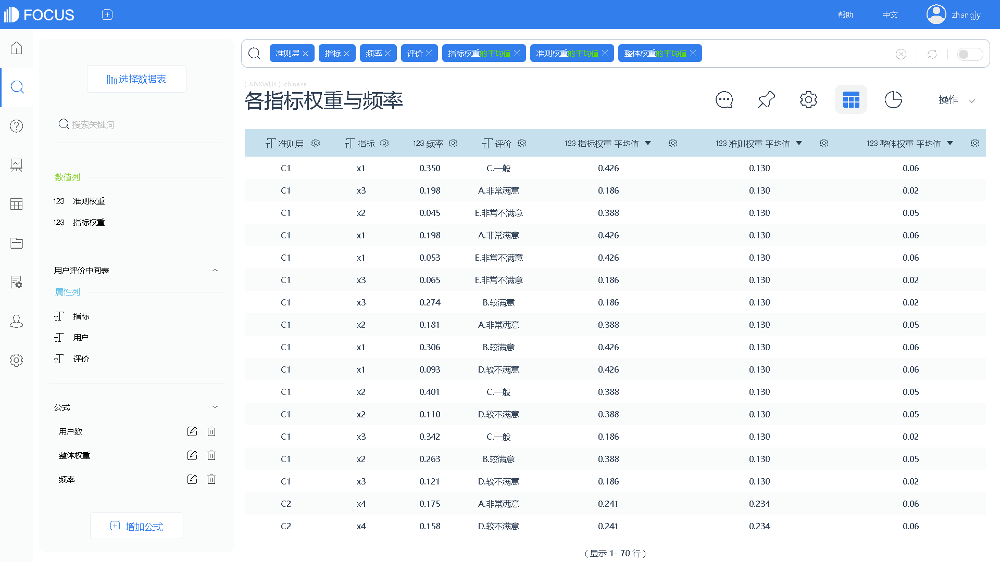
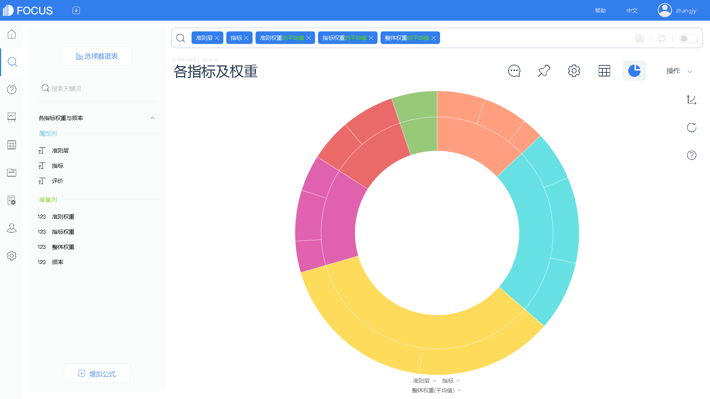
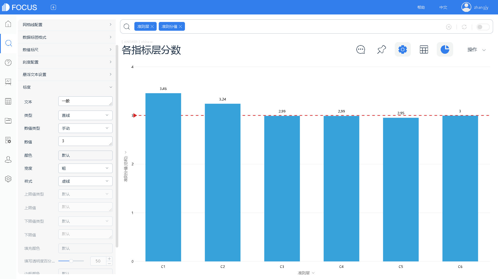
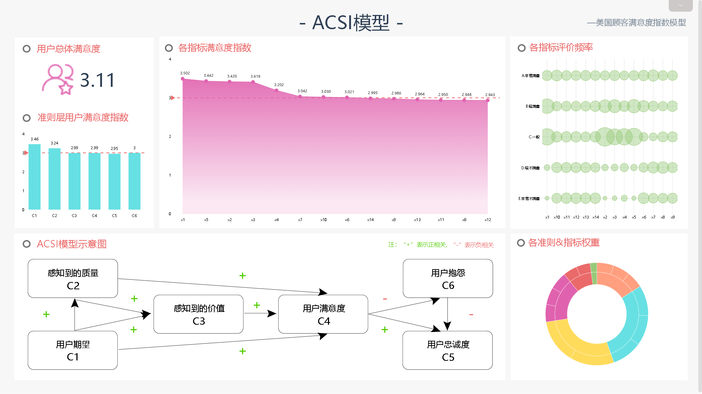
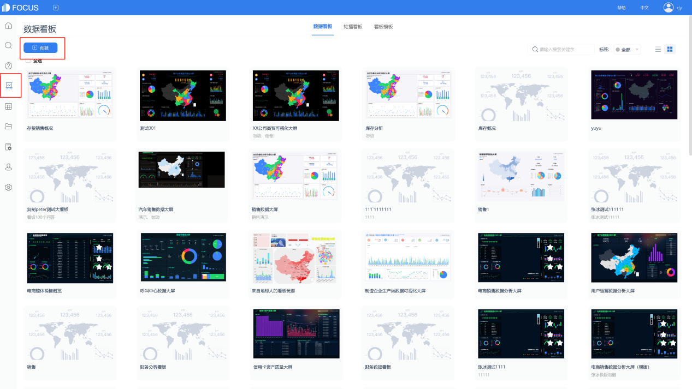
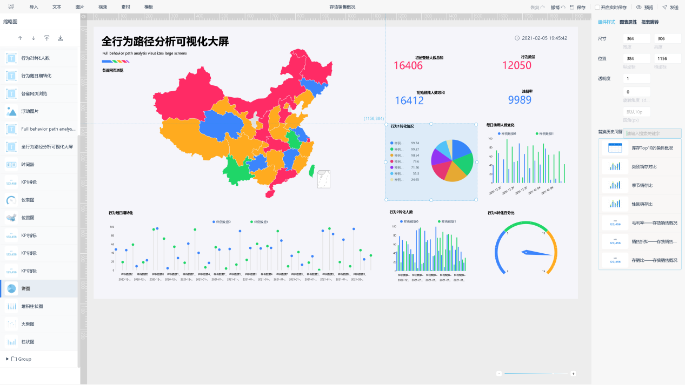

_大疫当前，匹夫有责。_

_作为国内领先的大数据分析系统，DataFocus将持续推出疫情分析的系列文章。一方面，我们希望能深度挖掘公开数据，总结疫情演变的规律；另一方面，我们也希望这些数据能为一线“战士”们提供参考，贡献微薄之力。（备注：本系列分析数据均摘录自国家卫健委及各省市卫健委的公开报告）_

_今天，我们来分析本次“风暴”的起源地——湖北省。_

1. 拐点将现：胜利的曙光就在眼前

自1月初起，作为疫情中心区，湖北省感染确诊人数呈快速增长态势。尤其是1月29日至1月31日，单日新增确诊人数已连续三天突破2000人次；至1月31日，公开确诊的总人数已达715_3人。这说明疫情攀升劲头依然“高涨”，第一个增长峰值还未来临。我们在1月27日的文章中预测了这一趋势，有兴趣的朋友可自行阅读。（链接）_

在1月27日的文章中，我们也提到，不能单看确诊人数来推断疫情的发展，一定要结合疑似人数、医学留观人数、密切接触人数等可能转化为“确诊人数”的数据来做统筹分析。我们对湖北省的医学留观人数进行了时间维度的分析（如下图），可以看出近3天的日增长量呈现下降趋势；这说明“感染疫情怀疑人群”的范围蔓延速度正在减缓，呈现出乐观的态势。

一边是继续攀升的日确诊数，一边是逐渐得到控制的医学留观数。这截然相反的趋势下，湖北省疫情走向究竟何去何从？各位请勿着急，容小编再深入分析。

从公开信息可知，新型冠状病毒引起的肺炎症状，平均潜伏期为7天。也就是说，上周感染上病毒的人群，大约会在这周呈现出明显症状；考虑到我国目前的一级响应状态，表现出症状人群会被立即检测并体现在“确诊人数”这一数据中。

如下图所示，确诊人数的周增长率在2020年第4周进入第一个峰值，并于第5周大幅回落；而医学观察人数的周增长率也呈相似态势。结合上篇文章对于SARS（非典）疫情的回顾分析，小编认为有理由乐观估计，确诊人数将在第五周结束后进入平台期。

2、县市情况不容忽视：湖北不止一个武汉！

作为新型冠状病毒的发源地，武汉一直是确诊人数的主要来源。但是，自1月28日起，武汉地区的日确诊人数增长量进入第一个下降通道，而周边地区却开始迅速增长。

为了更细致地观察数据，小编剔除武汉地区后对各市县进行统计分析（如下图）。从图中可以看出，黄冈、宜昌和孝感地区确诊人数日增量排名前3；尤其是宜昌，病例数自1月22日以来呈现直线式攀升趋势，这说明医疗和行政干预手段未能发挥良好的遏制态势的作用；而孝感地区则有下降趋势（还需继续观察），此外，荆州、随州、襄阳等地也是持续高发区域。

武汉周边地区疫情发展情况

从确诊人数的比例来看，武汉从一开始的100%迅速下降至1月31日的45%。在湖北省确诊数量占全国比例略有回升的情况下，新增确诊病人大部分来自于武汉周边省市，合计占比55%。这些数据足以证明周边县市的抗疫“战争”情形险峻，这些医疗条件不如武汉的地区也需要政府、媒体和群众给与更多的关注和支持。

湖北不止一个武汉，齐心协力才能共克时艰！

湖北各市确诊数量占比趋势

3、严控严防初现效果：疫情向外省蔓延的态势放缓

截止2020年1月31日24时，湖北确诊病例7153人，占全部确诊人数61%，较1月30日占比略有回升（59.9%）。从下图中可以看出，在24日、25日、26日的全国性扩散后，疫情重新开始以湖北为中心。这说明其它各省的严格防控措施初现效果。同时，这也提醒我们仍应首要关注湖北地区，尤其是除武汉以外的三、四线城市疫情的发展。这些城市经济水平和医疗条件不如武汉，然而确诊人数却追平甚至超越除湖北以外的其它各省；对于这些地区，该如何行之有效地保障其医疗水平、提高民众防护意识呢？这些问题都是亟需思考的。

_湖北省确诊病例的全国占比统计_

4、切莫掉以轻心，防护依然重要！

虽然从整体的疫情数据来看，2019-nCoV病毒的死亡率比2003年的非典弱得多，但是这并不代表我们可以掉以轻心。如下图所示，武汉市每万人感染近15人，死亡0.8人；而紧随其后的鄂州、随州等地每万人感染率也较高（如鄂州每万人感染数超过5人）。而潜江地区的数据则略显古怪——万人感染率和死亡率背道而驰，这不禁令小编疑问：是否因为医疗条件未能跟上，导致感染人员的排查和确诊存在疏忽之处？

最后小编为大家展现一张漏斗图。从图中可以看出，密切接触人数、医学留观人数、确诊人数、住院（治疗）人数和重症及死亡人数呈现逐渐递减的趋势。尤其请大家留意一个数字，将近20%的密切接触人群都被诊断为“确诊人群”！因此，提醒大家做好基本防护，切莫中招，保护好自己就是对社会最好的贡献。

