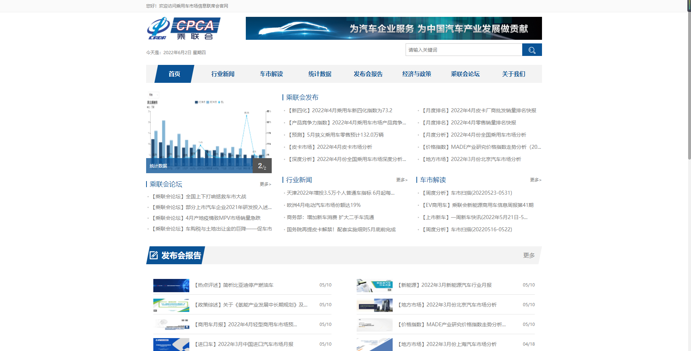
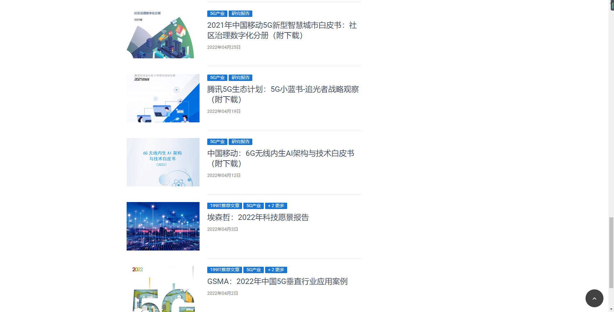
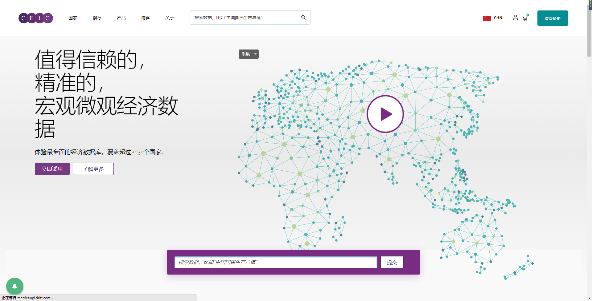
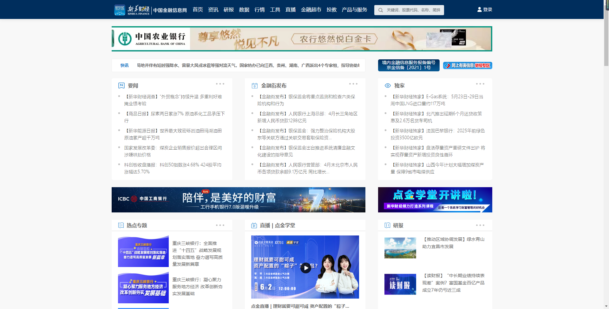
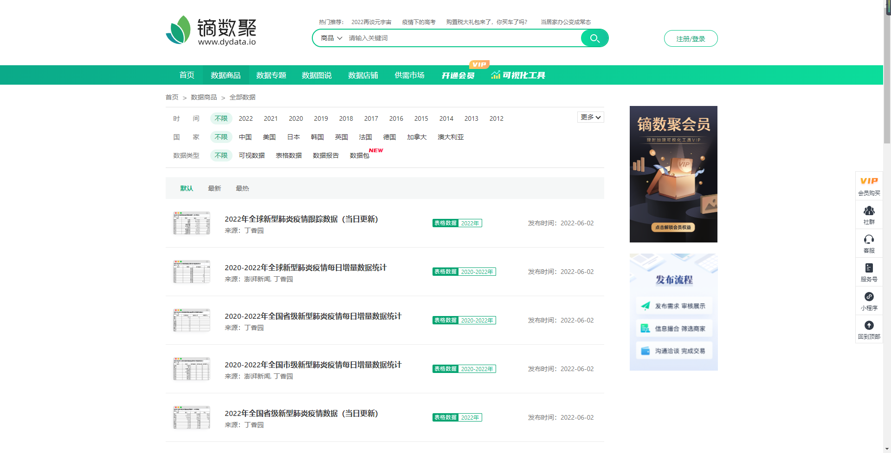
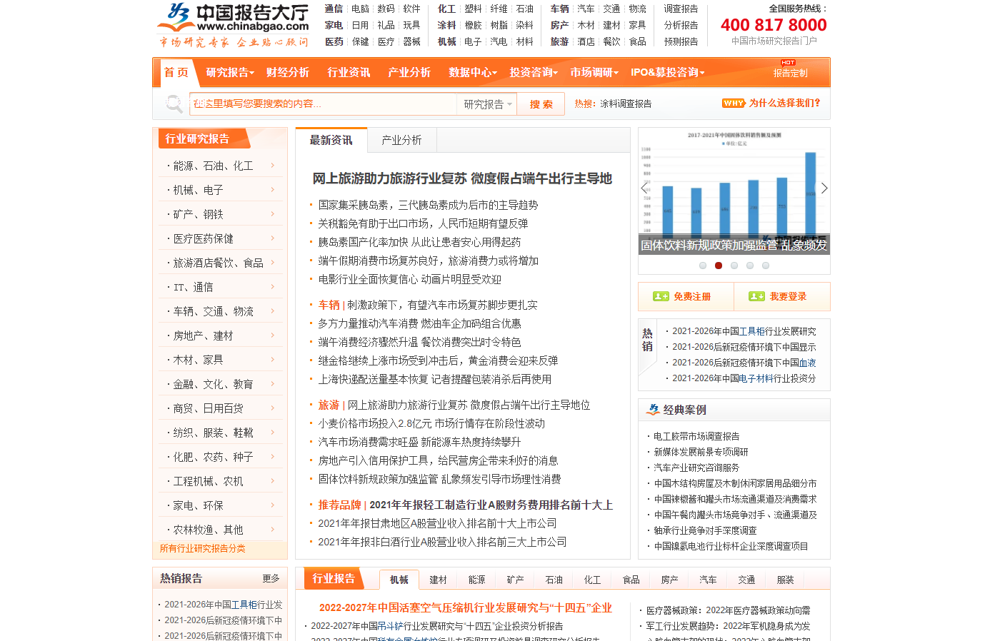
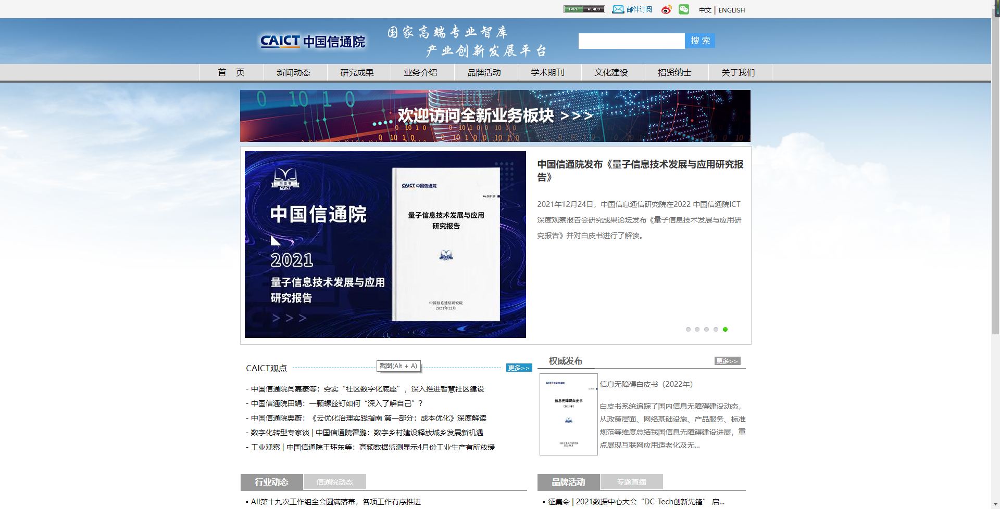

我们常说数据分析是一项职场精英必备的技能，在学习了很多数据分析的方法后，自然就需要通过实际中具体的数据实操了。

但很少小伙伴能找到合适的数据，也没有方法找数据。其实获取数据可以通过数据源网站下载现成的数据，也可以通过手动“扒”数据，就是这种方法效率比较低。

现在为大家整理好了15个免费又实用的数据源网站，直接去网站下载下来就可以了。

**1.国家统计局**

[http://www.stats.gov.cn/](http://www.stats.gov.cn/)

国家统计局是最权威的国内统计机构，主要统计全国各地区、各部门国民经济和社会发展等方面数据，可以在上面找到人口、农业、工业、建筑业等等不同数据指标。

**2.乘联会**

[http://www.cpcaauto.com/](http://www.cpcaauto.com/)

乘联会全称为乘用车市场信息联席会，是国内汽车行业信息交流和市场研究平台。可以在上面找到一些不同品牌、不同型号汽车的产销量数据。

**3.世界银行**

[https://data.worldbank.org/](https://data.worldbank.org/)

世界银行是联合国专门的机构，这上面可以查找到世界发展指标、统计能力指标、教育统计指标等世界各国发展相关数据。

**4.韬问**

[https://www.talktodata.cn/](https://www.talktodata.cn/)

韬问既是一款高效的可视化工具，又是一个多元的数字观点传播和分享平台。在这上面的开源数据中可以找到来自各个数据渠道的免费数据，涉及教育、社会、科技、经济等多个领域。

**5.199IT**

[http://www.199it.com/](http://www.199it.com/)

199IT是互联网数据资讯平台，上面提供了足量的研究报告、数据图表，行业涉及新兴产业、金融科技、共享经济等，但如果要获取数据表的话，需要加入会员社群才可下载。

**6.CEIC**

[https://www.ceicdata.com/zh-hans](https://www.ceicdata.com/zh-hans)

CEIC是全球的经济数据库，数据覆盖超200多个国家，涉及20多个行业的宏观经济指标，可以找到货币、外贸、劳动力市场等方面数据。

**7.同花顺数据中心**

[http://data.10jqka.com.cn/](http://data.10jqka.com.cn/)

同花顺数据中心主要提供的是股票市场数据服务，涉及到的是股票债券金融数据。

**8.中国金融信息网**

[https://www.cnfin.com/](https://www.cnfin.com/)

中国金融信息网是中国财经金融信息领域的权威发布和服务平台，涉及到的数据是股票、 、基金、外汇等。

**9.艾瑞网**

[https://www.iresearch.cn/](https://www.iresearch.cn/)

艾瑞网是国内的互联网数据资讯平台，上面主要是数据报告、数据图表等形式的数据，主要内容是市场动向相关信息。

**10.镝数聚**

[https://www.dydata.io/datastore/search/](https://www.dydata.io/datastore/search/)

镝数聚是国内的数据综合服务平台，提供了亿级数据量，涉及不同国家和地区、不同行业的数据，但上面数据仅部分免费。

**11.中国统计信息网**

[https://www.cnstats.org/](https://www.cnstats.org/)

中国统计信息网提供全国各地各行业最新的统计年鉴、统计公报、经济信息、GDP 资料等。 部分数据是免费的。

**12.中国报告大厅**

[http://www.chinabgao.com/](http://www.chinabgao.com/)

中国报告大厅是互联网市场研究报告平台，汇集各行业研究报告及行业年鉴等数据资讯，数据对外免费开放。

**13.中研网数据**

[https://d.chinairn.com/](https://d.chinairn.com/)

中研究网全称为中国行业研究文库，是专注市场研究的权威资讯平台，涉及行业包括医疗医药保健、IT、机械电子等。

**14.中国信通院**

[http://www.caict.ac.cn/](http://www.caict.ac.cn/)

信通院全程中国信息通信研究院，主要涉及的领域是信息通信领域。

**15.中国统计年鉴**

[http://www.stats.gov.cn/tjsj./ndsj/](http://www.stats.gov.cn/tjsj./ndsj/)

中国统计年鉴在国家统计局官网，涉及年份从1999年至今，数据可直接下载。

**总结**

以上就是本次分享的数据源网站了，如果觉得对您有帮助，欢迎转发分享。
