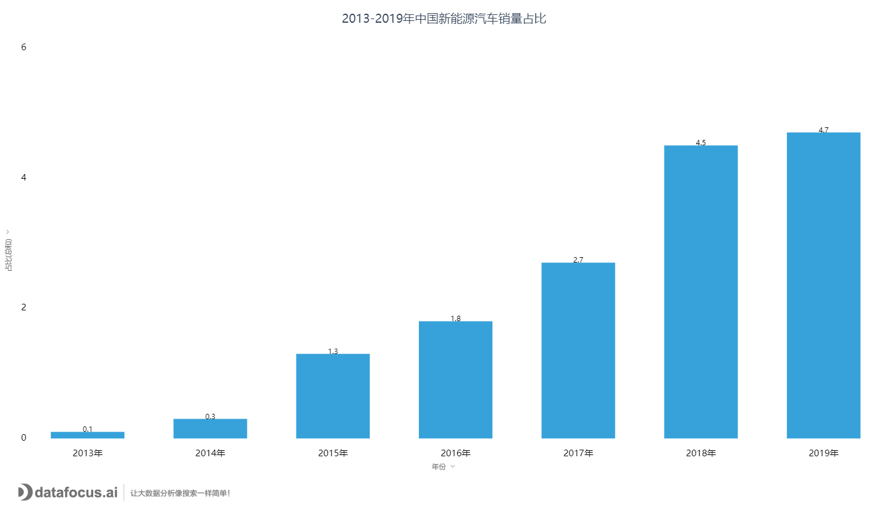
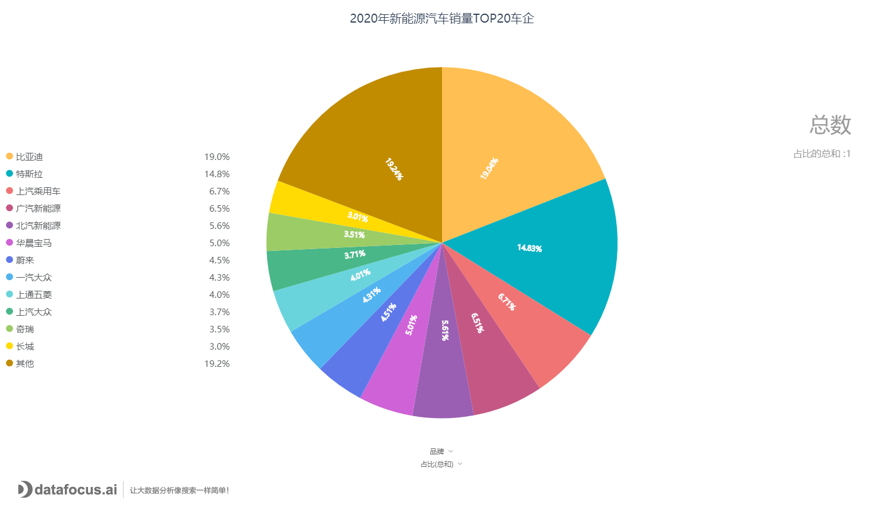
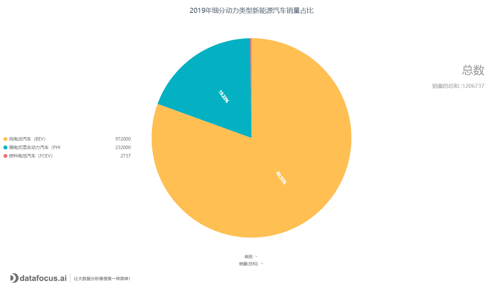

近日，国内汽车圈热点持续被国产特斯拉Model Y所点燃。元旦当天，特斯拉中国官网上线了国产版Model Y，**与此前在官网预售的进口Model Y售价相比最高下调16万元！**

特斯拉Model Y大降价的消息，持续引发网友的热议。好多国内新能源汽车的大佬也发表了自己的看法。比如汽车行业的大佬——ARCFOX事业部总裁于立国就说，国内所有做新能源汽车的，都应该感谢特斯拉，自己的看法和蔚来李斌一样，特斯拉是对手，也是队友。

今天的新能源汽车领域，颇有百家齐放的发展趋势。**蔚来、理想这样同赛道的造车新势力，也吸引了国内大批“忠粉”。**据乘联会统计，11月，我国乘用车市场零售量达到208.1万辆，同比增长8.0%，实现了连续5个月8%左右的近两年最高增速。其中新能源乘用车批发销量18.0万辆，同比增长128.6%，实现了销量翻番，第5次刷新当月历史记录。**这一简短信息表明，我国新能源汽车可能真正迈出了从政策主导型向市场主导型转变的步伐。**

strong>今天就用DataFocus的图表说话，一起看看国产新能源汽车的发展吧！

一、市场规模连续五年居全球首位

2019年我国新能源汽车销量达120. 6万辆， 占全球总销量的53% , 较2018年57%的全球占比有所下降,，但总产业规模连续五年居世界首位。

strong>  数据来源：中国汽车工业协会

二、 新能源汽车市场谁与争锋？

新能源乘用车生产企业按照背景可分为三大阵营：**传统自主品牌、本土造车新势力、外(合)资品牌。**据乘联会统计，2020年销量TOP20车企从高到低分别为：比亚迪、特斯拉、上汽乘用车、广汽新能源、北汽新能源、华晨宝马、蔚来、一汽大众、上通五菱、上汽大众、奇瑞、长城、理想、威马、吉利、上汽通用、长安、广汽丰田、合众、小鹏；对应市场占比19.0%、14.8%、6.7%、6.5%、5.6%、5.0%、4.5%、4.3%、4.0%、3.7%、3.5%、3.0%、2.6%、2.5%、2.4%、2.1%、2.1%、1.8%、1.6%、1.3%；合计占比97.2%。**其中传统自主品牌8家，合计占比48.8%；本土造车新势力5家，合计占比12.5%；外(合)资品牌7家，合计占比35.9%。**

strong>造车新势力发力猛烈，市场竞争加剧，集中度下降。从市场集中度来看，2020年中国新能源乘用车第1名、前3名、前5名、前10名占比分别为19.0%、40.5%、52.6%、74.3%；相比2016年31.6%、57.3%、70.1%、95.6%，**分别下降12.6、16.8、17.5、21.3个百分点。**比亚迪、上汽、北汽**三家老牌车企市场地位稳固；其余厂商排名波动明显，造车新势力表现亮眼，**2020年上半年特斯拉、蔚来、理想、威马、合众、小鹏销量排名分别为第2、7、13、14、19、20，可见整体行业进入市场良性推动的阶段。

三、纯电动车型市场优势明显

近年来，新能源汽车市场动力类型分布较为稳定,，纯电动车型长期占据主导地位。2019年, 我国纯电动汽车（BEV）、插电式混合动力汽车（PHEV）、燃料电池汽车（FCEV）销量分别为97.2万辆、23.2万辆和2737辆, 占比分别为80.6%、19.2%和0. 2%。

strong>  数据来源：中国汽车工业协会

四、从政策驱动转向市场驱动

新能源汽车由于享受不限行、不限购等政策优惠，发展初期主要依靠**政策优惠**带动市场增量。 随着产品技术日益成熟，消费者接受度逐步提升，二、 三、 四线城市及非限购地区消费潜力日益凸显。2019 年限购地区 (包括北京、 上海、 广州、深圳、天津、杭州、海南) 新能源汽车销量为40万辆， 占全国整体销量的比例约为39% , 较2018年下降2个百分点。但从城市排名来看，深圳、北京、广州、上海、杭州、天津六大限购城市仍是我国主要的新能源汽车市场。

2020年以来, 国家和地方层面密集出台多项政策拉动新能源汽车市场消费。从国家层面来看，工信部、财政部、交通运输部等多部门发文推动新能源汽车持续发展，国务院会议明确将新能源汽车补贴免税政策延长2年。从地方层面来看，为保障新能源汽车行业平稳渡过疫情，各地持续加大扶持力度。国家与地方政策形成合力，为推动新能源汽车持续发展提供了有效保障。

而正如ARCFOX事业部总裁于立国所说，**“今天的中国企业已经不是以前的中国企业了，这一代企业的技术功底更扎实，企业家更自信。华为没有输给苹果，淘宝没有输给亚马逊，我坚信中国智能汽车一定也不会输给特斯拉。”**

相信国产新能源汽车会在政策和技术的合力推动下，开创出更好的局面。
