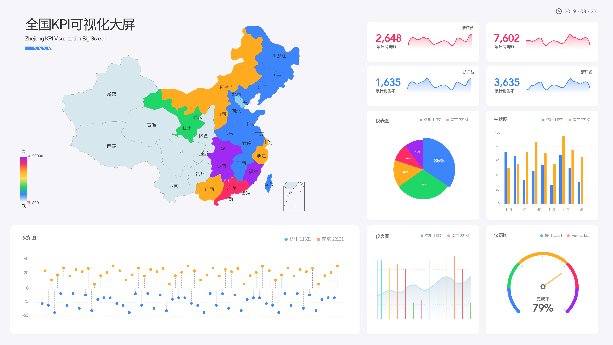

现如今进入大数据时代，无论是企业还是个人，都能深刻的感受到节奏在加快，信息在爆炸，知识在迭代。对于企业来说，有很多方法去应对大数据时代所产生的机遇和挑战，比如雇佣数据分析师或干脆使用DataFocus或tableau等数据分析工具。而我们以前说过，无论是对企业还是个人，从新手到大师，就是对自己本身不断的数据分析以及策略实施行为。

但在这个时代的企业里，很多数据分析师其实是在“玩”数据，意思是以“轻松”、“有意思”、“无脑”来操作着数据分析，比如很多拖拽式数据分析工具，每天的工作就是重复性的托拉拽，毫无思维提升可言。而你会看到，国内外大师级的数据科学家，每天都在不停的思考新的分析方法和分析模式，比如搜索式分析，便捷的同时，能够给人空间去思考新的关键词和逻辑。

我们可以这样理解，每天“玩”数据，可能是1的365次方，还是1。而“训练”数据，最少可以是1.01的365次方，是37.8。对于数据本身和决策者来说，都能够有提升。还是举一个我们以前举过的开车的例子。对于有着熟练驾龄的人来说，开车会让他们感到痛苦吗？不会，因为他们已经形成了既定的套路。但是如果让他们像一个专业车手那样开车，他们会觉得痛苦吗？会的，但是只有像专业车手那样开车，实力才会得到最大化的提升。可能很多人并不理解其中的区别，我们来对比一下。

普通人驾驶：1、开始学习驾驶的时候，会去刻意的记忆如何换挡、刹车，当遇到情况需要刹车的时候，就会回忆起刹车的要领，并在头脑中执行。2、遇到情况会立刻刹车，这个动作是脑子自己完成的，你根本意识不到是如何刹车的。3、一旦进入了“自动完成”的状态，对驾驶技术的改善会不断降低并停止。

专业车手：1、普通人驾驶的第一点。2、每过一个弯，都会刻意思考刚才用了什么技巧，表现的如何，怎么提升。3、什么情况需要刹车，什么情况不需要刹车，刹车刹多少。4、技术长足发展并不断趋向极致。

数据分析也是一样，普通分析员和决策人到了后面就会利用既定的套路和模型去自动分析，若是有变则会非常被动。大师级数据分析员就会不断地思考新思路去搜索新的分析路径，并应用到决策。所以我们平时应尽可能的“训练”数据。
