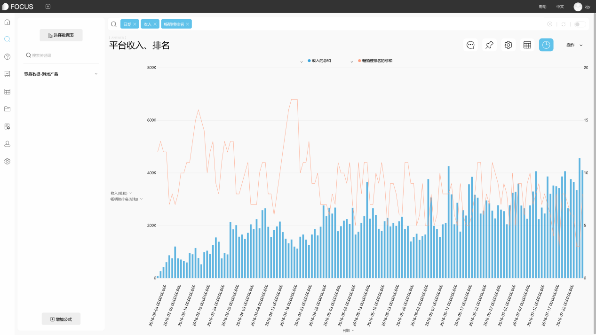

随着互联网的普及，慢慢的各行各业越来越趋向数字化，数字化给我们的生活带来更多便捷的同时也为企业带来大量的数据。更加便捷的网络传输速度以及大量的数据，将我们带到了大数据时代。在这个大数据时代，我们需要考虑的是如何将这些复杂的数据进行整理分析，将里面具体的信息更加清晰明了的展现出来。可视化便是数据分析结果呈现的重要步骤，或者说是重要技术。

如何才能更加便捷的利用大数据可视化技术？怎么做好大数据可视化呈现？现在便给大家推荐一些实用的大数据可视化工具，让大家能够更快捷的进行可视化：

1、 ChartBlocks

ChartBlocks是一款在线使用网页版可视化图表生成工具。用户通过导入电子表格或者数据库等形式来构建可视化图表。构建图表的过程中可以直接根据向导的指示来完成。在HTML5的框架下，它可以通过强大的JavaScript库D3.js来创建图表。构建出来的的是响应式图表，可以兼容各种显示屏幕的尺寸及分辨率。而且还可以嵌入在网页进行显示。

2、 D3.js

D3是个图表库，主要是针对前端工程师，D3.js可以说是当前最好的可视化工具图表库。D3.js的运行方式是在JavaScript上，并且使用HTML，CSS和SVG。D3.js是开源工具，使用数据驱动的方式创建漂亮的网页，D3.js可实现实时交互，这个库非常强大和前沿。

3、 Tableau

Tableau是一款数据分析软件，使用非常简单，通过数据的导入，结合数据操作，即可实现对数据进行分析，并生成可视化的图表直接展现给人们想要看到的通过数据分析出来的信息。可以用它将大量数据拖放到数字“画布”上，转眼间就能创建好各种图表。

4、 DataFocus

DataFocus是一款大数据分析可视化系统，使用非常的简单于智能。区别于其他的可视化工具，datafocus 不需要要拖拽，而是通过关键字组合搜索或者点击字段来进行操作，便可以生成合适的可视化图表直接展现出数据分析出来的相关信息。学习成本较低不需要学习复杂的编程技术和sql语句，业务人通过简单学习便可以直接上手分析。而且由于datafocus更加的符合国内的业务生态环境，更加符合国内市场。
