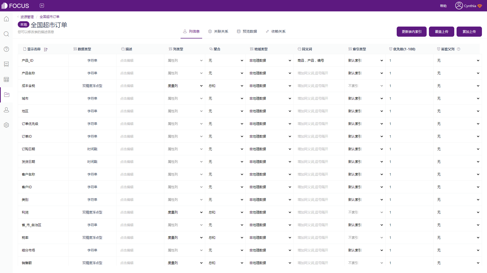
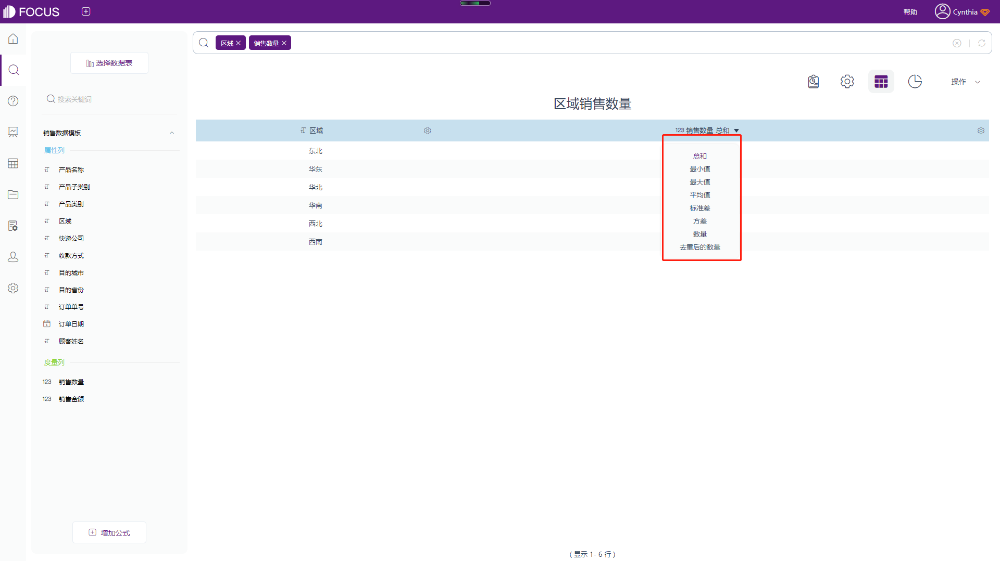

无论是产品还是运营，数据分析都是其日常工作中不可忽略的一个板块，但是新手小白该从哪个点切入进行数据分析，数据分析的整体流程框架又该如何搭建呢？

今日内容要点以支付业务为例，简单介绍业务数据分析框架的搭建过程，用到的数据分析工具是DataFocus系统。

首先，需要先确定数据分析框架的大纲，将业务数据分析分成五大步骤，分别是：数据生成、数据处理、数据建模、数据分析和数据应用。

### 1.数据生成

用户从进入网站开始，每一步的行为操作都会生成对应的后台数据，我们可以将这些数据大体分为三类：用户数据、行为数据和业务数据。用户数据和行为数据可以直接从网站后台获取，业务数据则一般需要公司内部搭建。

以支付业务为例，用户在完成支付后，会形成两张核心表格：订单表和交易表，一笔订单可能对应多笔交易（选择不同的订单支付方式）。

### 2.数据处理

后台获取的数据一般都是非结构化数据，因此在进行分析之前需要将数据通过清洗转换、空值处理等转化为结构化数据，为后续的数据分析打下良好的基础。

DataFocus系统可以通过系统自带的中间表、数据转换等功能协助用户实现大部分数据处理的需求，相当于一个轻量级的ETL工具，因此无需再通过其他第三方工具进行数据处理。

### 3.数据建模

所有数据进到数仓以后，需要根据实际待分析的业务数据进行数据建模。

为什么要进行数据建模？

那是因为在庞大的数据仓库中，数据一般都会按照其涉及的业务，储存在不同的数据表中，例如用户数据存储在用户基本信息表，用户在网站的操作存储在用户行为表，订单数据存储在日销售订单表等。但涉及数据分析时，需要提取所有的数据进行合并分析，因此需要将数据通过建模，关联起来，将多个表的数据连接起来，一同进行数据分析。

除了添加表与表之间的关联关系，我们还需要对数据字段进行一个基础分类，添加属性和度量字段：

属性（Attribute）

度量（Measures）

在统计学定义上，数据可以分为离散型和连续型。在数据分析过程中，离散型对应属性，用来代表有限数量的值，例如产品名称、产品类别等；连续性对应度量，无法例举变量值，例如销售额、销量等。

如下图的截图所示，DataFocus系统会自动将数据表的列名字段划分成对应的属性列和度量列。

### 4.数据分析

有了维度和度量的概念后，我们需要在数据分析阶段引入聚合概念。聚合，简单来说就是将数据源中的多行数据按照一定的规则合并计算为一个数据。因为对于查看数据的人来说，他们往往会更关注数据的总体态势。

DataFocus系统预置了最常见的集中聚合规则，

如：

求和：sum(列名)

计数：count(列名)

计数去重：uniqe\_count(列名)

求平均值：average(列名)

选择对应的聚合方式，数据结果会按照其对应的维度自动进行聚合运算。

### 5.数据应用

最后，可以将得到的结果按照可视化图表或数据看板的方式进行展现，实时监控，寻找异常数据或成功的机会。

数据从用户中来，通过一系列的数据沉淀、处理和分析找出机会点做决策再回到用户中去，提升用户体验，带动业务增长，此即为数据驱动业务。

本篇文章的重点是介绍了数据分析的大体流程框架以及每个步骤设计的功能点，但是如何搭建数据指标体系以及具体的指标案例等还没有涉及。欢迎感兴趣的小伙伴订阅关注哦~
