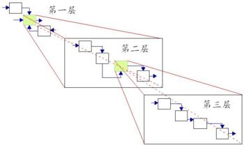
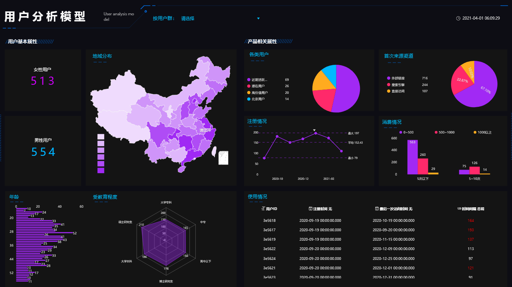
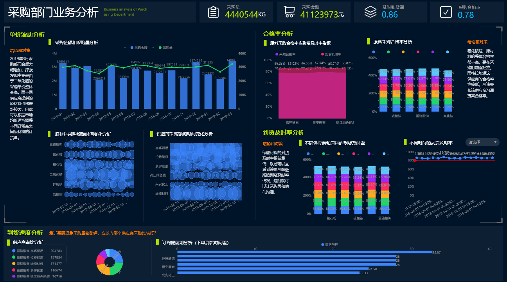
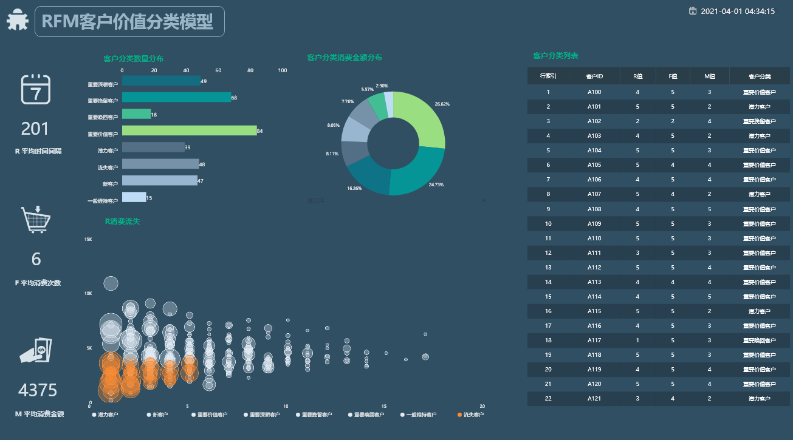

**目的 ：**影响北京PM2.5形成的自然空气因素分析

**摘要 ：**PM2.5是粒径小于 2.5μm的空气中的悬浮物。 微小的可溶性固体、可溶性气体是形成 PM2.5的首要因素。本报告使用datafocus系统，对北京市2010——2015年空气质量数据进行分析。首先了解5年间北京市PM2.5平均浓度的变化趋势，接着探究5年间四个季节PM2.5的平均浓度，最后分析自然空气因素和PM2.5浓度之间的相关关系和组合风向对PM2,5浓度的影响。得到夏季PM2.5的浓度达到最低，夏季的每小时降水量、温度、湿度、露点均大于冬季，而空气压力反之；温度和每小时降水量与PM2.5浓度呈正相关，湿度、露点、压力和PM2.5呈负相关等结果。因此认为自然空气因素对PM2.5的形成存在着一定程度影响。

**关键词：**datafocus,PM2.5浓度,趋势,相关系数

一、案例背景

气象专家和医学专家认为，由细颗粒物造成的灰霾天气对人体健康的危害甚至要比沙尘暴更大。粒径在2.5微米以下的细颗粒物，直径相当于人类头发的1/10大小，不易被阻挡。被吸入人体后会直接进入支气管，干扰肺部的气体交换，引发包括哮喘、支气管炎和心血管病等方面的疾病，而PM2.5就是这样的细颗粒物。北京市PM2.5浓度较高的城市，本文主要通过数据可视化及相关分析来了解自然空气状态对PM2.5形成的影响。

二、案例问题

本文所用数据为2010年-2015年的北京空气质量的数据，使用datafocus产品可以快速处理大量数据，并进行自定义公式，可以极大的减少人力和物力。

三、案例分析

进入datafocus 产品系统，从数据管理页面中导入数据源“北京空气质量数据”，并在数据看板页面创建新的数据看板，命名为“影响北京PM2.5形成的空气状态分析”。

A.2010-2015年北京市PM2.5浓度变化总情况。

1.年平均浓度趋势

年平均浓度趋势统计图选择使用折线图，可以看到随着年份的递进，北京PM2.5浓度的变化。

图 1年平均浓度趋势

从图1中可以清晰的看到，北京的PM2,5浓度近五年来在一定范围内上下波动，其中2013达到顶峰为100.76ug/立方公尺，2015年达到最小值为79.85ug/立方公尺。

2.季平均浓度趋势

季平均浓度趋势统计图依旧选择使用折线图，可以看到5年间每个季节的北京PM2.5浓度的变化。

图 2 季平均浓度趋势

如上图所示，可以看到在夏季时PM2.5浓度较低，在冬季时PM2,5的浓度值最高。因此，PM2.5浓度是否与不同季节的自然空气条件有关呢？

B.PM2.5浓度与空气状态的交叉分析

1.各季节的空气状态

首先通过折线图比较各季节的自然空气状态变化。

图 3各季节的空气状态

由上图可以看到，夏季的每小时降水量、温度、湿度、露点均大于冬季。 

图 4各季节的压力状态

由上图所示夏季的空气压力低于冬季。

2.空气状态与PM2.5浓度相关性分析

通过添加相关系数公式计算得出各自然空气状态与PM2,5浓度的相关系数。公式具体如下：

相关系数r=(sum ( x\* y )-51766\* average ( x ) \* average ( y )） /（（sqrt ( sum（sq（x）））-51766\*（sq（ average (x ) ））\*（sqrt ( sum（sq（y））））-51766\*（sq（ average ( y )） ） ）） 

图 5空气状态与PM2.5浓度相关系数

由上表可以看到，温度和每小时降水量与PM2.5浓度呈正相关，湿度、露点、压力和PM2.5呈负相关。

3.组合风向对浓度的影响

根据平均浓度降序排列的柱状图可以快速清晰的看到组合风向下的PM2.5浓度。

图 6 组合风向对浓度的影响

如上图所示，组合风向为西南风时，PM2.5的浓度最高，组合风向为西北风时，PM2.5浓度最低。

将这6个结果图表导入“影响北京PM2.5形成的空气状态分析”数据看板中，布局如下：

图 7 数据看板

四、结论

1.2010-2015年，北京PM2.5浓度一直在一定范围内波动，并且在2013年达到最高，在2015达到最低；5年间，在夏季时PM2.5浓度较低，在冬季时PM2,5的浓度值最高；组合风向为西南风时，PM2.5的浓度最高，组合风向为西北风时，PM2.5浓度最低。

2.夏季的每小时降水量、温度、湿度、露点均大于冬季。

3.温度和每小时降水量与PM2.5浓度呈正相关，湿度、露点、压力和PM2.5呈负相关。

五、对策与建议

降低和防控PM2.5含量是一项系统工程，需要社会各个方面去协调运作，我们治愈动员全社会共同参与，保护环境，改善空气质量，才有可能有效降低PM2.5含量，起到实质性的防控作用。具体建议如下：1.植树种草；2.火电厂、工业排放、汽车污染源控制；3.农作物的燃烧处理；4.制定严格的监控体系。
