我们生活在一个数据丰富的世界，对于希望简化流程、更准确地监控各个绩效领域以及在更深入、更个人的层面上了解受众的企业来说，收集、分析和利用这些丰富的见解对于成功至关重要。KPI报告步骤是实现组织目标的关键要素。

此外，由于来自越来越多的来源提供了如此多的信息，您如何理解这些信息 - 以及如何从中提取价值？最有效的方法之一是利用 KPI[报告工具](https://www.datafocus.ai/infos/online-reporting)。

 

在这里，我们将更详细地解释 KPI 报告，探索 KPI 报告的含义，了解如何创建成功的报告，并考虑业务提升 KPI 报告模板的动态。

让我们首先考虑什么是 KPI 以及它们在业务环境中的含义。或者，换句话说，回答问题，“什么是关键绩效指标（KPI）？”和“什么是KPI报告？

您的机会：[想要完全免费测试KPI报告软件吗？](https://www.datafocus.ai/console/)立即探索我们的 14 天免费试用版并享受出色的 KPI 报告！

## 什么是关键绩效指标？

KPI 是衡量一个值，用于评估项目或公司在实现其业务目标方面的效果。换句话说，KPI 为组织提供了衡量业务各个方面与其战略目标相关的表现的方法。

从根本上说，KPI 提供基于绩效的关键信息，使组织及其利益相关者能够了解它是否在正轨上，从而采取相应的行动。在这里，您可以找到根据其功能和行业分类的 KPI 示例的不同列表，这有助于缩小范围并选择您需要的最关键[示例](https://www.datafocus.ai/infos/kpi-examples-and-templates)。

选择正确的仪表板后，您可以创建一个广泛的[KPI 仪表板](https://www.datafocus.ai/infos/best-kpi-dashboard-examples)，并确保您的部门和业务战略走在正确的轨道上。

无论是利用[人力资源 KPI](https://www.datafocus.ai/infos/kpi-examples-and-templates-human-resources)还是任何其他部门和行业，了解这些基本定义至关重要，以便创建和分析可以提高公司的底线。

现在我们已经快速了解了组织上下文中的 KPI 是什么，让我们看一下官方 KPI 报告的含义。

## 什么是 KPI 报告？

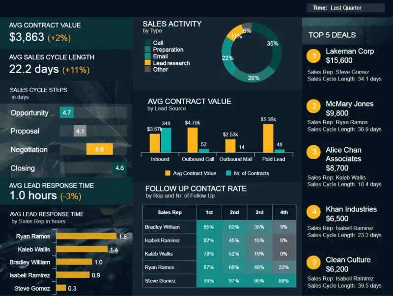

KPI 报告（或 KPI 报告）是一种管理工具，有助于衡量、组织和分析最重要的业务关键绩效指标。这些报告可帮助公司实现业务目标，确定优势、劣势和趋势。

此类报告通常以[交互式仪表板](https://www.datafocus.ai/infos/interactive-dashboard-features)的形式呈现，提供与一组预定的关键绩效指标相关的信息的可视化表示。

KPI 仪表板以逻辑、易于理解的格式呈现关键见解，可以轻松提取重要信息并对其进行回顾和实时处理。从根本上说，这种报告是一种战略跟踪方法，将为您的业务最基本活动提供一个窗口。

## KPI 报告示例和模板

现在我们已经检查了定义并将关键绩效指标的值放在显微镜下。现在是时候提供一组示例来可视化 KPI 报告的力量了。以下是十个精心挑选的 KPI 报告示例，这些示例特定于任何现代企业的一些最关键领域：财务、管理、采购、客户服务、制造、人力资源和销售。如果您想知道如何衡量 KPI，这些示例将作为全面的路线图。

### 1\. 财务损益KPI报表示例

我们的第一个 KPI 报告示例是财务。损益是任何组织底线中最重要的两个因素。这个特定的财务[报告示例](https://www.datafocus.ai/infos/daily-weekly-monthly-financial-report-examples)在综合财务仪表板上可视化，提供了从收入到净利润的企业损益表的易于理解的概述，并辅以适当的绩效比率。

货币损失和利润仪表板磨练毛利率、运营支出率、营业利润率和净利润率，提供触手可及的大量定制信息。

通过持续监控此财务 KPI 报告，您将全面了解企业的整体财务业绩，并能够采取措施改善您认为薄弱的领域，同时利用优势领域——对于任何希望随着时间的推移增加利润并报告对金融行业或部门至关重要的[KPI](https://www.datafocus.ai/infos/kpi-examples-and-templates-finance)的企业来说，这些指标是必不可少的指标。

使用的关键绩效指标：

- 毛利率百分比：

这个 KPI 非常简单：更高的利润率意味着您从销售收入中保留更多的收入。从本质上讲，它显示了您的运营流程的有效性，如果您正在报告金融行业或部门内的 KPI，那么这是需要定期包含和监控的最关键流程之一。

要计算此 KPI，您需要从总收入中扣除所有已售商品或服务的成本，然后将其除以销售收入。

- 营业利润率百分比：

为了充分利用财务关键绩效指标报告，您需要监控营业收入。它将显示息税前利润，也称为息税前利润，以百分比表示。它不包括税收影响或投资，因此，如果要计算它，则需要将营业利润除以销售收入。

正如我们在上面专注于盈利能力的示例 KPI 报告中所看到的那样，营业利润率以明确的百分比表示，但您可以立即看到随着时间的推移而发展。

- 营业费用率：

运营效率是财务专业人员需要考虑的另一个重要指标，以改善和提高公司的盈利能力。

在一个简单的仪表图中，颜色作为一种交通信号灯，您可以立即发现您的运营费用是否与总收入处于健康的比例，或者您是否需要调整运营成本。从本质上讲，如果您的运营费用较低，则可以达到的盈利能力就越高。

### 2\. 员工绩效仪表板

我们的下一个动态 KPI 报告示例是以人才为中心的员工仪表板，因为它提供了平衡的 KPI 组合，旨在对特定时间范围内的[员工](https://www.datafocus.ai/infos/dashboard-examples-and-templates-human-resources)绩效进行基准测试。这种完美的可视化信息风暴可帮助人力资源经理监控缺勤率，同时深入研究基于绩效的基本领域，包括培训成本、加班时间和整体生产力。

通过使用这些最有价值的 KPI 报告，人力资源经理可以在需要的地方提供支持、培训和指导，同时做出明智的战略决策，以提高全面参与度和生产力水平。

使用的关键绩效指标：

- 缺勤率：

不是每个人都知道这一点，但缺勤率与员工敬业度和积极性密切相关。这种高度可视化的员工绩效 KPI 提供了五年内缺勤情况的清晰快照，提供了对整体员工积极性的重要见解，同时提供了找到问题根源并将任何降低生产力的障碍扼杀在萌芽状态的工具。这是任何[人力资源数据分析](https://www.datafocus.ai/infos/workforce-people-hr-analytics)流程的基本 KPI 报告指标。

- 员工生产力：

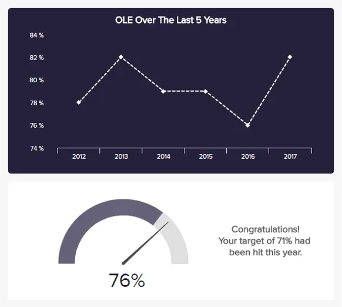

KPI 报告的另一个基本人力资源指标是员工生产力更深入地钻取员工产出，提供指定时间段内整体劳动效率 （OLE） 的可访问快照。考虑到许多维度，这个有效的指标展示了您的团队的生产力时间长度以及销售水平和产量。此 KPI 以图表和百分比的形式显示，可让您一目了然地比较每月或每年的生产力，并采取明确的措施来提高 OLE 可持续性。

### 3\. 财务关键绩效指标报告模板

每个成功的现代企业的核心都拥有一个有凝聚力、管理良好且数据驱动的财务部门。我们的第二个基于财务的 KPI 报告示例，[财务仪表板](https://www.datafocus.ai/infos/dashboard-examples-and-templates-finance)提供了您组织内部和外部货币活动各个领域的全面概述。

此 KPI 报告模板仪表板由尖端[的财务分析](https://www.datafocus.ai/infos/finance-analytics)软件提供支持，旨在回答以流动性、发票、预算和业务的总体财务稳定性为中心的基本问题。

这个动态报告工具广泛、平衡且富有洞察力，能够通过处理 KPI（包括营运资金、现金转换周期、预算差异等）深入了解公司财务状况的各个方面。

使用的关键绩效指标：

- 营运资金：

此 KPI 报表样本不显示比率或比例，而是显示从流动资产中扣除流动负债后剩余的直接美元数。可视化表示形式如下所示：

这是一个简单的表格，将向您显示组织的运营效率和短期财务状况，因为债务和债务是一年内到期的流动负债。

- 现金转换周期：

现金转换周期应包含在 KPI 监控和报告中，因为它是评估管理流程效率的关键组成部分，这意味着将库存资源转换为销售现金流需要多长时间。

在我们上面的视觉中，您可以看到随着岁月的流逝，周期越来越短，这是一个明显的积极信号，公司应该保持良好的工作。周期越低，管理和运营流程越好。如果在任何情况下，周期开始增长，那么进行额外的分析并找到原因是有意义的。通过使用现代[在线数据](https://www.datafocus.ai/infos/data-visualization-tools)可视化，所有这些计算都以直观、可视化的方式呈现，您无需滚动浏览传统电子表格的无休止的行和列。

- 供应商付款错误率：

处理发票也是财务部门或组织中处理开具发票和向债权人、供应商或供应商付款的重要元素。需要考虑这些错误，因为有时可能会发生应付账款部门向错误的实体开具发票的情况，例如

关键是要尽可能将错误百分比保持在最小值内 - 这样，发票按时支付，它们包含准确的指标，并且公司之间的关系变得更加牢固。否则，可能会发生争议，这不符合任何人的利益。我们已经看到详细的[财务图表](https://www.datafocus.ai/infos/financial-graphs-and-charts-examples)可以作为自助式报告 KPI 解决方案，因为我们所有的样本都可以轻松自动化并提供实时数据。从本质上讲，您不需要手动执行或更新信息，而是让[BI 仪表板软件](https://www.datafocus.ai/infos/bi-dashboard-tools)完成艰苦的工作。

### 4\. 制造成本管理仪表板

接下来，在我们的现代 KPI 报告示例列表中，我们将查看成本管理[制造仪表板](https://www.datafocus.ai/infos/dashboard-examples-and-templates-manufacturing)。这个强大的报告工具对于任何在内部创建自己的产品的企业都是必不可少的，具有平衡的见解组合，使您的成本和营业额始终如一地保持在目标上。

在重资产行业，牢牢控制您的单位和维护成本以及生产率和回报率至关重要。这个最重要的 KPI 报告示例分为明确的部分，将确保您保持维护活动正常进行，同时始终保持投资回报 （ROI） 健康。

使用的关键绩效指标：

- 单位成本：

作为无价的制造管理KPI，单位成本提供了与单个产品或项目相关的各种支出的全景快照。考虑到包括设备、材料和仓储在内的因素，这个富有洞察力的指标将使您能够访问和分析制造过程的特定部分，并随着时间的推移减少任何不必要的成本。对于任何以制造业为重点的现代企业来说，这是一个节省资金和资源的指标。

- 资产回报率：

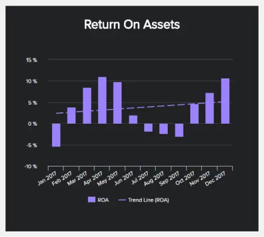

您的 ROA 是最关键的制造指标之一，因为它为您提供了组织从您[制造](https://www.datafocus.ai/infos/kpi-examples-and-templates-manufacturing)和销售的商品中获利的能力的工作衡量标准。

通过高度易理解的基于图形和图表的设计，此 KPI 将清楚地表明您如何有效地利用资产根据您从投资的资本中获得的收益来产生收入。跟踪您的 ROA 并旨在提高您的百分比最终将优化您的制造流程，以加速增长和成功。

- 维护成本：

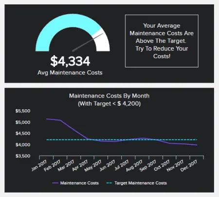

这种以成本为中心的 KPI 可以准确地告诉您您的设备在定期运行和维护方面对您的业务有多大的阻碍。通过经常跟踪此指标，您可以达到目标成本，完善您的工作以保持机器和工具平稳运行，同时确定任何预算消耗成本。

无论是有缺陷的机器还是持续缺乏维护响应，此 KPI 都将使您能够快速识别问题并采取有效措施来降低总体成本，从而在此过程中保持整个运营的生产力。

您的机会：[想要完全免费测试KPI报告软件吗？](https://www.datafocus.ai/console/)立即探索我们的 14 天免费试用版并享受出色的 KPI 报告！

### 5\. 管理KPI报表模板

这个以管理为中心的 KPI 仪表板除了基于消费者的收入外，还专门关注总收入，同时提供重要的见解，帮助您为组织设定明智的销售目标。

在此[管理仪表板](https://www.datafocus.ai/infos/dashboard-examples-and-templates-management)上提供有关客户获取成本、CLV 和销售目标信息的可视化信息，您将能够进行智能管理预测、发现趋势并了解您需要改进业务流程的地方。为各行各业担任高级管理职务的人员提供的无价的KPI工具。

使用的关键绩效指标：

- 获客成本：

处理销售数据并阐述获取新消费者的成本的最关键指标之一。成本通常根据您的特定行业而有所不同，但此 KPI 报告绝对应该包含在您的报告流程中。

正如我们在视觉对象中看到的那样，成本用简单的仪表图一目了然地表示，但您也可以看到特定时间范围内的图形发展。

- 客户终身价值：

当您想要创建仪表板 KPI 报告实践时，包括预测消费者与公司之间关系的潜在价值是成功指标管理的另一个关键组成部分。问题是没有人能100%预测这种关系将持续多长时间，因此，将其声明为周期性值（例如6个月，12个月或24个月）是有意义的。

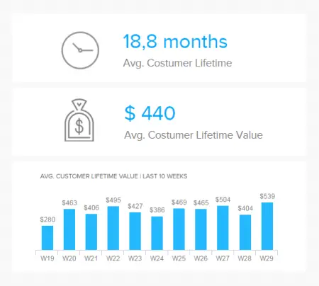

上面的视觉效果向我们展示了平均数字的快速概述以及关系持续的时间，而底部则描绘了随时间推移的发展。

- 销售目标：

一般管理层通常对目标是否实现或过程中是否存在问题感兴趣。销售目标就是其中之一，但您也可以为每个管理指标单独设置目标。

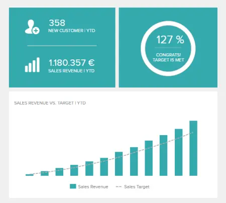

这是我们的KPI报告示例之一，阐述了实现预定义目标，并与整体销售收入进行了比较。关键是要达到目标，但也要进一步检查您是否落后。

### 6\. 销售业绩仪表板

在商业世界中，销售范围很广，为了确保您在巩固增长的同时实现目标，收集正确的情报至关重要。

此 KPI 报告示例提供了销售部门进度的理想概述，深入分析销售 KPI，例如销售增长、[销售](https://www.datafocus.ai/infos/kpi-examples-and-templates-sales)目标、ARPU、CAC 和 CLV。

通过提供销售组合各个方面的详细可视化，此报告使销售经理能够在不丢失任何信息的情况下全面了解其销售运营，使他们能够创建广泛的[销售报告](https://www.datafocus.ai/infos/sales-report-kpi-examples-for-daily-reports)。

在这里，您可以全面了解您的销售业绩或分析特定的信息对您有利，从而增加 CLV 和每单位平均收入等指标。

使用的关键绩效指标：

- 销售增长：

销售增长是包含在您的报告计划中的重要[销售图表](https://www.datafocus.ai/infos/sales-graphs-and-charts-for-managers)，它将向您显示您的业务是稳步发展还是需要进一步调整。

跟踪此指标对于任何需要提供新收入并确保可持续发展的销售专业人员或经理都很重要。在上面的视觉效果中，我们看到了过去 12 周内销售代表的时期和发展之间的比较。

- 阿普：

每单位的平均收入显示了您从所有销售中从消费者那里获得了多少收入。目标是保持ARPU上升，但如果您发现与购置成本相比它越来越高，则应进行其他调整。

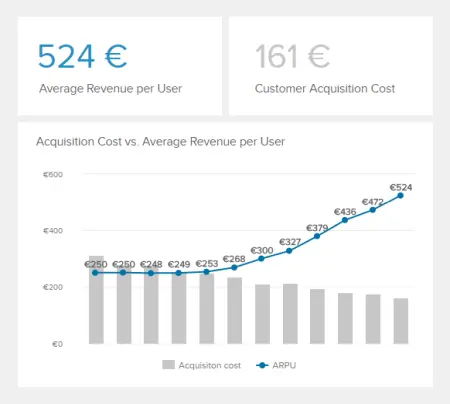

在上面的例子中，我们可以看到ARPU正在稳步增长，这是一个积极的增长指标。例如，这可能意味着您正在与大公司或消费者达成交易。

我们在上面的管理 KPI 报告解决方案中解释了其他关键指标，例如 CLV、销售目标和购置成本，因为从一般管理的角度来看，它们也很重要。

### 7\. 客户服务团队仪表板

在当今信息丰富、高度互联的数字时代，消费者要求各行各业的品牌提供卓越的服务水平。只有最好的才能做到——没有例外，没有妥协。

我们的交互式[客户服务仪表板](https://www.datafocus.ai/infos/dashboard-examples-and-templates-customer-service)是一个 KPI 报告样本，其中包含宝贵的信息，可用于简化您的服务部门并正面满足客户的需求。

这个 KPI 报告模板配备了丰富的每周和每月服务绩效可视化，是实时响应任何潜在服务问题的完美工具，同时进行战略调整以实现长期成功。通过菜单上的呼叫解决和响应时间以及座席绩效洞察和问题编号计算，您拥有从面向消费者的一线角度提高响应速度、效率和价值所需的一切。

使用的关键绩效指标：

- 平均响应时间：

这是一个重要的 KPI 报告示例，因为它使您能够根据工作日衡量客户处于暂停状态的时间长度。通过访问这些有价值的信息，您可以准确地看到性能率的提高和减少，并通过服务增强策略做出响应，以随着时间的推移缩短响应时间（并保持响应时间）。

- 顶级支持代理：

您的服务代理是您整个部门跳动的心脏。为了确保您提供始终如一的无缝支持，精确监控个人绩效至关重要。

这种基于服务的 KPI 报告指标允许您向下钻取到特定的绩效级别，了解哪些座席表现最佳。获得这些知识将使您能够奖励始终表现出高水平绩效的座席，同时支持那些需要激励或额外服务培训的座席。

- 首次呼叫解决：

呼叫解决是任何蓬勃发展或不断发展的客户服务部门的基本[客户服务 KPI](https://www.datafocus.ai/infos/kpi-examples-and-templates-customer-service)之一。在这里，您可以查看您的服务团队在第一次联系时如何成功找到消费者问题的根源。您的 FCR 越好，您的支持水平就越有生产力和有效性。如果您发现出现负面趋势，您可以采取战术措施，包括指导、研讨会或结构变革。

### 8\. 采购 KPI 仪表板

您的采购计划对于整个组织的持续生产力和成功至关重要。链条中的一个障碍，您将面临失去时间和金钱的风险，同时损害您的品牌声誉。

我们的采购 KPI 报告提供了平衡的指标组合，可确保您的活动始终流畅、有凝聚力且合规。这是一个 KPI 报告模板，旨在使您的采购分析流程尽可能丰富和简化，使您能够加强供应商关系、缩短周期时间并避免任何不必要的[采购](https://www.datafocus.ai/infos/business-intelligence-procurement)问题。

使用的关键绩效指标：

- 合规率：

这种可访问的合规率可视化允许您根据不同的分支机构或供应商整体设置和基准测试您的合规水平。因此，您可以正面解决任何新出现的合规问题，同时使用知情信息来指导您的决策，同时评估您现有的关系。

- 供应商数量：

作为 KPI 报告中的某种进化元素，供应商的数量将帮助您通过合作伙伴组合满足您的每一个采购需求，这些合作伙伴将始终保护您的链条、高效和流畅。在这里，您可以检查您的企业随着时间的推移获得了多少供应商，探索每种关系的价值，将额外的供应商添加到组合中，或“削减脂肪”以达到最佳水平。

- 采购订单周期时间：

下一个 KPI 报告示例将涵盖端到端订购旅程。我们的采购订单周期时间KPI包含您分析并最终简化流程所需的视觉信息。通过这样做，您将使您的整体采购活动更加高效，使您能够专注于大量其他业务促进战略和计划。

### 9\. SaaS 执行仪表板

对于希望在数字时代蓬勃发展的 SaaS 企业来说，我们专用的 KPI 仪表板至关重要。通过在执行级别上关注与任何基于 SaaS 的组织相关的三个最关键领域——客户、经常性收入和成本——您将能够促进持续增长和发展，从而在您的领域取得持续成功。

此 KPI 报告示例中包含的 KPI 提供了每个关键区域的详细视图。这个强大的报告工具有助于对整个 SaaS 组织进行流畅和主动的管理。

从客户获取成本到流失率、生命周期价值等，这个易于理解的仪表板是 SaaS 业务高级人员的首选工具，也是完整形式的 KPI 报告，阐述了企业最关键的方面。

使用的关键绩效指标：

- MRR：

[每月经常性收入](https://www.datafocus.ai/infos/monthly-recurring-revenue)是 SaaS 公司跳动的心脏。它为老年人提供了SaaS企业在给定月份预期的定价计划和可预测收入的“检查”。从本质上讲，此 KPI 报告模板需要包含在制定“经常性”组件战略的财务方面，并使您能够预测未来的业务状态。

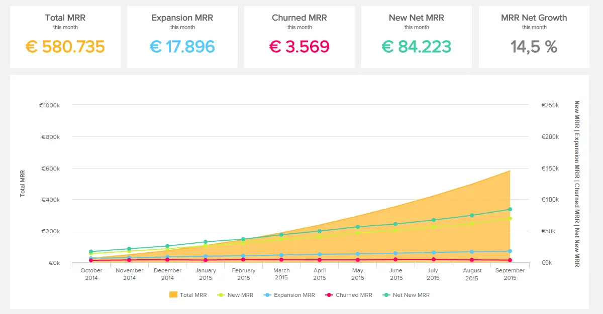

您的机会：[想要完全免费测试KPI报告软件吗？](https://www.datafocus.ai/console/)立即探索我们的 14 天免费试用版并享受出色的 KPI 报告！

### 10\. 销售转换仪表板

发展业务的最佳方法之一是提高转化率。当然，完成销售有许多阶段，从获得和培养潜在客户到促使转化——这个特定的 KPI 仪表板可让您详细了解流程的每个关键阶段。

通过一系列全面的见解和基于潜在客户的信息，此 KPI 报告示例将使您能够简化销售流程、增强销售策略并提高最重要的转化率结果，您还可以在我们的[销售仪表板模板](https://www.datafocus.ai/infos/dashboard-examples-and-templates-sales)上更详细地查看。

使用的关键绩效指标：

- 潜在客户与机会比率：

此指标是销售漏斗中要检查的第一个元素。为了确保最佳的实时 KPI 绩效监控，潜在客户与机会比率应该在您的列表中很高。它将帮助您确定您是否在实现收入目标的轨道上，并在此基础上更好地管理您的营销和销售团队。

在上面的示例中，您可以清楚地看到比率的概述，以及时间范围内潜在客户和机会的确切数量。可以将此视觉对象用作每月 KPI 报表或每周报表，具体取决于你的首选项和策略。

- 机会制胜率：

显示有多少合格的潜在客户促成了交易或签订合同，这在您的销售漏斗中至关重要。现代[在线数据分析工具](https://www.datafocus.ai/infos/data-analysis-tools)使您能够轻松分析和获得见解，如以下示例所示：

我们快速查看团队的百分比和效率，而在视觉对象的底部，您可以快速查看过去 10 周内 KPI 的行为。

- 潜在客户转化率：

转换率应该是稳定的，这个数字在行业和职能之间可能会有很大差异。在某些行业中，1%的转化率是成功的，而其他行业可以达到10%并创下成功纪录。目标是找到一个基线并将其与行业基准进行比较。

目标是提高转化率或保持稳定。如果您注意到它正在减少，是时候开始提出问题并深入挖掘原因了，因为任何转化都不会造成严重的业务损害。

### 11\. 人力资源招聘仪表板

为您的组织寻找和留住合适的人才对于您的持续成功至关重要。如果没有明确的分析策略，您不仅有可能为您的企业雇用错误的人，而且您的员工流动率也会飙升。这就是为什么您需要一个基于招聘的[人力资源仪表板](https://www.datafocus.ai/infos/dashboard-examples-and-templates-human-resources)来进行招聘工作。

这个宝贵的 KPI 报告模板填充了高度可视化的招聘指标的凝聚力组合，将为您提供更深入地了解招聘漏斗、招聘成本和人才招聘转化率所需的所有信息。使用这些 KPI 报告指标将使您能够做出更好的招聘决策，同时简化整个招聘流程以获得最大的成功。

使用的指标：

- 每次雇用成本

这个特定的 KPI 报告指标将让您清楚地表明您根据资历水平专门用于雇用新候选人的资源数量。跟踪这一关键的人力资源指标将让您掌握雇用优质候选人的成本，同时帮助您根据基于员工流动率和绩效率的其他关键绩效指标了解招聘的价值。

- 招聘转化率

作为任何招聘 KPI 报告模板的重要补充，此转化率指标旨在直观地表示您的人力资源人员的招聘绩效。通过查看您的人力资源主管将多少申请人转变为成功的候选人，您可以采取有针对性的措施来减少不必要的招聘，同时从您的人才搜寻工作中获得更好的投资回报 （ROI）。

- 填充时间

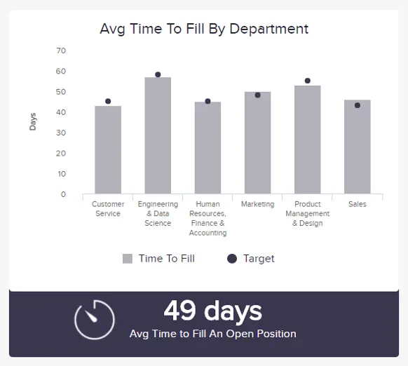

作为人力资源或招聘专业人员，填补时间是您在 KPI 绩效报告中需要的指标。细分为每个关键部门，您可以在此处准确查看雇用新员工所需的时间。通过为每个部门设定基准，您可以发现任何阻碍招聘流程的低效率，并制定明智的策略来减少招聘时间，同时做出更有价值的招聘决策。

您的机会：[想要完全免费测试KPI报告软件吗？](https://www.datafocus.ai/console/)立即探索我们的 14 天免费试用版并享受出色的 KPI 报告！

### 12\. 运输仪表板

如果您经营有形商品或服务，拥有高效的端到端运输策略是您持续组织发展的关键。

我们的[运输仪表板](https://www.datafocus.ai/infos/dashboard-examples-and-templates-logistics)是扩展组织的宝贵 KPI 报告和分析，可全面了解您的脚效率、交付状态、目的地和负载统计数据。保持运输链良好且真正正常运转所需的一切。

使用的指标：

- 交货时间

KPI 报告具有醒目的地理视觉效果的样本，您可以在此处根据路线或地区详细查看交货时间。这样，您可以通过提供更准确的交货时间细分来管理消费者和供应商的期望，同时始终如一地满足期望。

- 运输费用

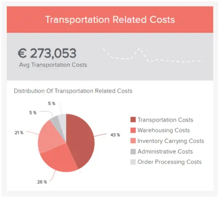

这个方便的 KPI 报告示例指标以易于理解的饼图形式呈现，提供了与运输相关的成本的精确细分。通过定期跟踪这一关键物流指标，您可以确切地了解在保持最优质服务的同时可以负担得起减少不必要成本的地方。

### 13\. 营销绩效仪表板

作为我们最有价值的品牌知名度KPI报告示例之一，我们的[营销仪表板](https://www.datafocus.ai/infos/dashboard-examples-and-templates-marketing)将优化您的促销活动和策略。

这是一个 KPI 报告示例，提供对关键营销绩效数据的深入洞察，有助于确保您从跨渠道和接触点的营销活动中获得健康的投资回报率。

在这里，您将生动地了解最能引起受众共鸣的广告系列和内容，同时掌握成本以及如何在产生影响的同时降低成本。

使用的指标：

- 点击率

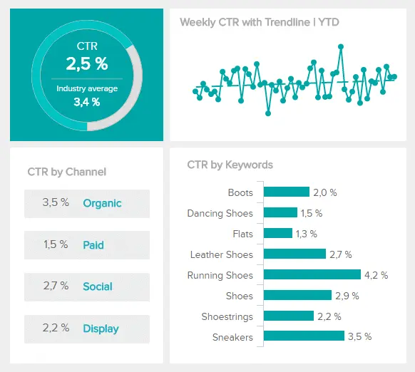

作为营销人员，点击率是数据的一个重要分支，因为您可以根据一系列因素发现有多少用户实际点击了广告、文章、博客文章、电子邮件或促销内容。通过定期分析此指标，您可以了解哪些渠道、关键字或广告系列产生了最佳效果，并更新策略以进一步提高点击率。

- 每次点击费用

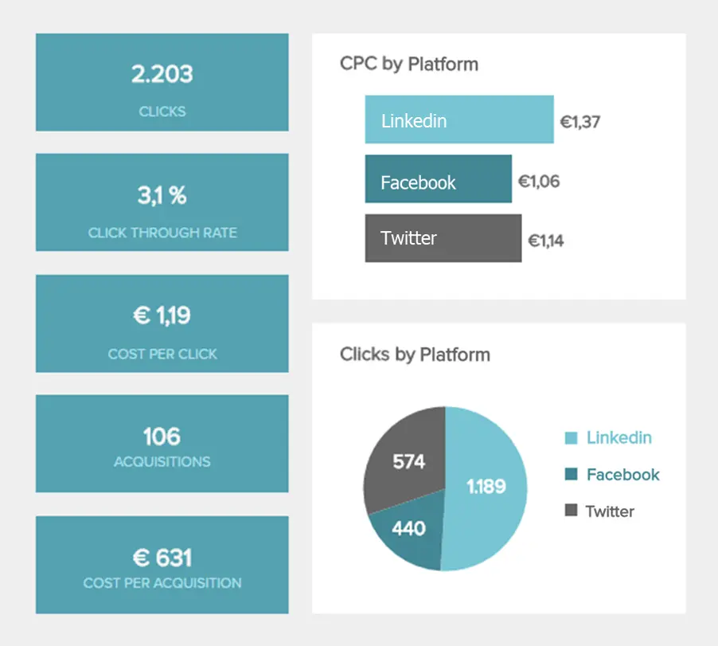

CPC 是基于营销的月度 KPI 报告或每周仪表板的绝佳补充，它是必不可少的信息，因为它将帮助您优化各种广告系列的投资回报率。这样做的目的是随着时间的推移逐渐减少每次点击费用，使您的广告系列或促销活动尽可能有影响力。

- 每次获取成本

这种营销数据可视化对于您正在进行的绩效管理策略至关重要，因为它提供了每个渠道获得新消费者的成本的可访问细分。定期访问这些信息将确保您能够优化获取成本，同时享受持续的消费者增长。

### 14\. 客户人口统计仪表板

KPI 报告的存在是为了提供对特定组织流程、部门或职能的更深层次的背景和洞察力 - 我们的[市场研究仪表板](https://www.datafocus.ai/infos/dashboard-examples-and-templates-market-research)也不例外。

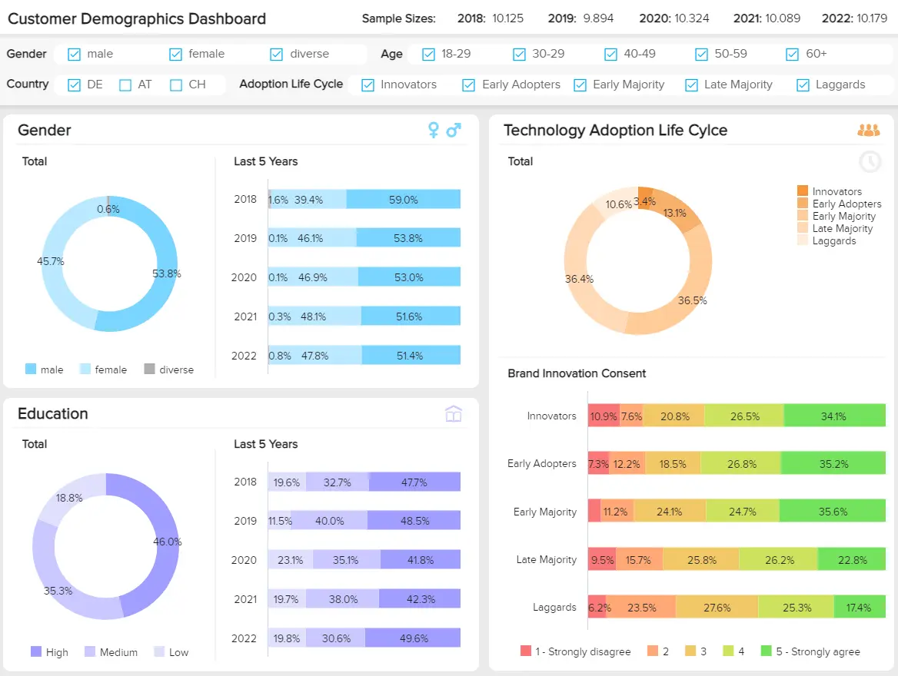

如果您想提高忠诚度和保留率，了解您的消费者人口统计数据至关重要。通过访问这个基于人口统计的视觉效果宝库，您将实际了解与特定受众群体产生共鸣的策略和战术类型。

这个令人难以置信的交互式仪表板将帮助您深入了解核心消费者群体，提供提供满足其确切需求的产品、服务和内容的工具。

使用的指标：

- 按性别划分的客户

KPI 报告软件指标，可帮助您随着时间的推移跟踪和衡量客户群的性别份额，在这里您可以分析您的品牌形象和信息以及您提供的内容，以确保您具有包容性和公正性 - 这对业务不利。

- 按教育水平划分的客户

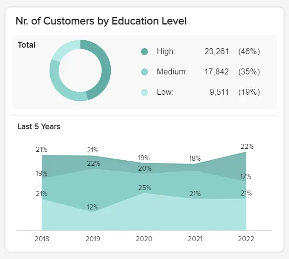

通过富有洞察力的市场研究可视化，您可以在这里一目了然地深入了解客户群的教育水平。经常跟踪此指标将为您提供工具，以查看客户的教育水平是否随着时间的推移而增加、降低或保持不变，以便您可以相应地调整消息传递和策略。

- 按技术采用率划分的客户

对于任何基于市场研究的 KPI 报告流程来说，了解客户的技术采用水平或状态也将帮助您更新产品、服务或消息以满足他们的特定需求。定期衡量这一点，您将确保您的新产品或服务发布为您的客户提供最佳体验。

- 客户年龄组

这个基于年龄的关键绩效指标显示为易于导航的条形图，将为您提供现有客户的年龄组或代际状态（婴儿潮一代、千禧一代、Z 世代等）的完整细分。有了这些信息，您就可以看到在哪里投入精力和资源来巩固现有的忠诚度或进入令人兴奋的新市场。

### 15\. 网络安全仪表板

在我们高度互联的数字时代，让您的公司免受网络犯罪威胁应该是您的首要任务。

网络犯罪使世界经济损失了世界GDP的1% - 这是一个惊人的数字。为了确保您的组织安全并确保其长期蓬勃发展，使用基于网络犯罪的[IT 仪表板](https://www.datafocus.ai/infos/dashboard-examples-and-templates-it)至关重要。

通过旨在帮助您跟踪潜在恶意软件攻击、网络钓鱼测试成功率、解决时间等的视觉效果的平衡组合，在这里您可以确保将任何潜在威胁扼杀在萌芽状态。

使用的指标：

- 平均检测时间 （MTTD）

此 KPI 报告示例指标将为您提供工具来跟踪检测不同类型的攻击所需的时间。随着时间的推移跟踪此可视化将确保您可以将任何潜在的灾难扼杀在萌芽状态，并最终节省时间、金钱和组织破坏。

- 网络钓鱼测试成功率

基于趋势的指标将展示您的员工检测潜在网络钓鱼攻击的能力，这对于确保公司的每个部门都尽可能无懈可击至关重要。如果您发现任何明显的低谷或低谷，您可以采取行动提供更好的培训和指导。

- 网络安全评级

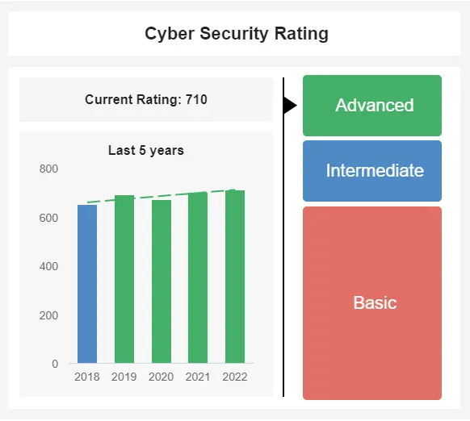

这个非常有用的指标将让您快速了解您的网络安全管理策略如何基于三个关键评级。在这里，您可以使用其他网络安全指标的组合，根据技术或行业变化分析策略的进度。如果您发现自己的评分正在下降，您可以在问题失控之前采取行动。

我们提供了 15 个有价值的示例，介绍如何在不同业务功能中呈现 KPI，现在我们将专注于创建此类报告并提供基本的提示和技巧。

## 如何准备 KPI 报告？

这些报告是交互式的、动态的，并根据个人用户、部门或组织的运营需求、战略、目的、目的和目的量身定制。它们是可定制的，因此提供了一种深入钻取非常具体信息口袋的强大方法。图片采购指标–您需要知道供应商是否满足您的需求，他们响应紧急需求的能力，订单成本以及许多其他[指标](https://www.datafocus.ai/infos/kpi-examples-and-templates-procurement)，以有效跟踪公司的绩效。但是您需要知道在准备报告时要考虑什么。

在考虑如何准备 KPI 报告时，重要的是要了解为了获得最佳成功，您必须遵循一个流程。

在我们继续之前，以下是构建 KPI 报告时要涵盖的基本要素的快速摘要：

- 与各种利益相关者一起定义您的战略业务目标。
- 选择几个指标来跟踪和评估性能。
- 考虑您的数据源。
- 设置一个可以使用[在线仪表板](https://www.datafocus.ai/infos/online-dashboard)可视化的报告。
- 不要对您选择的[数据可视化类型](https://www.datafocus.ai/infos/how-to-choose-the-right-data-visualization-types)感到困惑。

现在，为了帮助您走上数据驱动的启蒙之路，以下是对以下几点的更详细的解释：

1）定义您的业务目的和目标

每个企业，根据其规模、部门和核心目标，都有自己的一套专门针对组织内不同学科的 KPI。要了解哪些 KPI 将被证明对您的业务最有价值，您应该与关键利益相关者坐下来，在开放的协作环境中讨论您的业务目的、目标和目标。

通过这样做，您将获得一个全景视角，了解您的努力目标以及值得衡量的成功指标和见解。这将构成您最终报告成功的基础。

2） 选择您的关键绩效指标

一旦您定义了组织的所有最关键目标，报告之旅的下一阶段将根据您正在进行的计划和策略选择您想要使用的关键绩效指标。

幸运的是，在数字时代，存在大量宝贵的 KPI，以帮助从营销和帐户到客户服务、履行等多个领域的增长。

此外，请浏览我们的[KPI 管理](https://www.datafocus.ai/infos/kpi-management-and-best-practices)指南，并从一系列有用的最佳实践中学习。

3） 考虑您的数据源

该过程的下一阶段归结为详细了解数据源。

今天的仪表板借助数据连接器整合来自各种平台或来源的所有[数据](https://www.datafocus.ai/infos/data-connectors)，与您分配的 KPI 配合使用，以提供增长、改进和可持续成功所需的见解。因此，对数据源执行审核至关重要。

在实际创建数据仪表板之前，应考虑哪些数据源符合您的业务目标，哪些数据源最适合您的 KPI。任何超出要求的东西都应该被禁用或省略使用。

通过这样做，您将简化您的工作，并确保您的报告仪表板仅提供值得分析的信息或见解。例如，在实践中，这意味着[会计报告](https://www.datafocus.ai/infos/accounting-reports)应与您需要从中生成见解的特定财务数据相对应。

4） 设置和自定义您的报告

确定要使用的 KPI 并检查关键数据源后，即可设置报表并根据您的要求对其进行自定义。

整理和管理绩效指标的最有效方法是通过[KPI 软件](https://www.datafocus.ai/infos/kpi-dashboard-software)，因为它使您能够从各种指标创建全面的摘要报告，并通过强大的仪表板将它们可视化。在所有可用的数据可视化媒体中，仪表板是最有效、最高效且易于导航的格式。

此外，一旦您设置了用户访问权限、报告、关键绩效指标，并根据您的喜好定制了报告的外观、感觉和功能，您就可以通过台式机、平板电脑或智能手机等媒介快速 24/7 全天候访问您最有价值的数据。

为了帮助您进行创建和自定义工作，这里有一份全面的数据[仪表板设计原则](https://www.datafocus.ai/infos/dashboard-design-principles-and-best-practices)指南，供您阅读。

5） 向下钻取数据可视化

数据可视化是一个强大的概念，对于任何形状或大小的报表都至关重要。通过数据可视化，您可以一目了然地从最重要的数据中提取价值，使用您的指标或见解讲述故事，并以易于理解和鼓舞人心的方式与组织内外的其他人共享关键信息。

报告启动并运行后，定期监控并根据需要调整或改进报告工作非常重要。

此外，我们关于如何制作[仪表板](https://www.datafocus.ai/infos/how-to-make-a-dashboard-with-ease)的附加文章将帮助您将决策提升到一个新的水平，并提供有关制作、开发和呈现公司报告的大量信息。

## 为什么KPI报告很重要？

 

您知道“KPI 报告的含义”——现在让我们看看它们在现代商业时代的作用。如前所述，我们生活在数据驱动的时代，要想在当今的商业战场上获胜，如果您想在今天、明天和未来长期蓬勃发展，就必须根据数字洞察（KPI 数据）做出明智的决策。以下是这些类型的报告在现代商业时代如此重要的关键原因。

设定强大的目标和基准：可衡量的仪表板非常重要，因为它们使企业能够设定有意义的目标和基准，这些目标和基准将帮助他们改进、发展、扩展并在不断变化的数字环境中变得更有适应性。通过设置和衡量 KPI 并通过报告对其进行自定义，您将获得对业务的丰富见解，从客户行为到财务效率低下和内容绩效。

获得更大的愿景：除了设定可靠的基准外，基于关键绩效指标的仪表板还将帮助您识别隐藏的模式，最终推动您的业务向前发展。所有这些相关指标，当组织在直观和可视化的报告仪表板中时，不仅可以让您在模式展开时发现它们，还可以深入了解历史数据并进行战略调整和更改，最终可以成就或破坏您的业务。

更好的协作和沟通：企业中的每个人（不仅仅是技术人员）都更容易访问基于可视化性能的指标，使其成为优化性能的宝贵工具。当每个人都能利用数据发挥自己的优势时，孤岛就会瓦解，沟通就会蓬勃发展，这反过来又会加速您的业务增长。

您的机会：[想要完全免费测试KPI报告软件吗？](https://www.datafocus.ai/console/)立即探索我们的 14 天免费试用版并享受出色的 KPI 报告！

## 关键要点 KPI 报告

我们已经研究了如何准备 KPI 报告，现在，让我们来看看一些关键要点和行业研究。

专家预测，到2025年，每年将产生约175泽字节的数据。此外，在短短五年内，全球智能连接设备的数量将超过220亿台，所有这些都将产生物联网分析在其行业报告中声称的大量可收集，可处理和分析的数据。

在提出“什么是 KPI 报告”这个问题并更详细地探索 KPI 报告的含义、花时间了解如何制作它们并查看现实世界的示例之后，很明显，这些宝贵的工具提供了对任何业务关键领域的丰富见解。像这样的报告提供了设定可行目标的方法，努力实现渐进式基准，并利用大量宝贵的信息为您带来优势。

无论您是希望专注于制造 KPI 还是修补[物流分析](https://www.datafocus.ai/infos/logistics-analytics)，强大的 KPI 仪表板都将为您的所有运营和战略需求和发展奠定基础。

通过了解如何创建报告并以逻辑、视觉上引人入胜的格式呈现最有价值的以绩效为中心的信息，您将开发无缝流程、改进决策、改善内部沟通，并最终推动自己领先。

要了解有关专用于从管理到营销的学科的常见 KPI 报告示例的更多信息，您可以查看我们的[业务仪表板](https://www.datafocus.ai/infos/dashboard-examples-and-templates)示例和模板。

要从在线仪表板软件可以为您的业务提供的所有功能中受益并开始创建您自己的报告，请参加我们的 14 天[免费试用](https://www.datafocus.ai/console/)！
