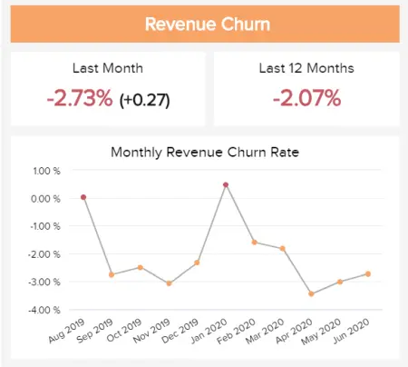
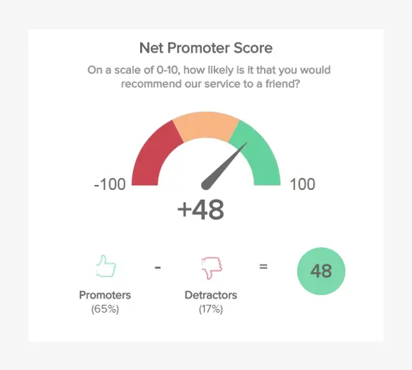
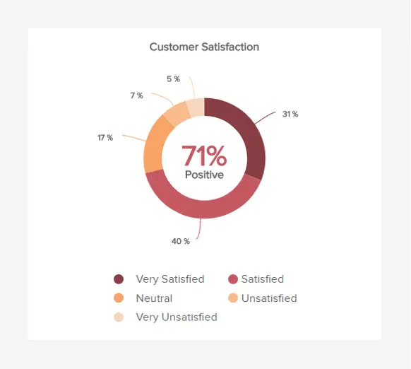

公司、组织、企业、大型或小型企业——您属于哪个类别并不重要;密切关注您的客户对于您的业务成功至关重要。

如果您想了解并满足客户的需求，客户保留仪表板及其相关指标将帮助您监控、分析和管理多个以客户为中心的点，同时向您展示它们如何在您的业务中回响。

 

客户保留指标在SaaS和B2B领域尤其强大，不同的套餐和订阅模式在定义公司质量，在市场上建立自己的可能性以及产生可持续发展的机会方面具有巨大的价值。

为了帮助您了解留存指标的价值，我们将详细介绍现代客户留存仪表板和 KPI。我们还将探索使用仪表板工具创建的报告，并深入研究为什么客户保留[仪表板](https://www.datafocus.ai/infos/online-dashboard)在当今的数字世界中如此重要。

让我们开始吧。

## 什么是客户保留仪表板？

客户保留仪表板是一种可视化工具，用于跟踪以客户为中心的关键指标，例如保留率、流失率、MRR 增长和忠诚客户数量。这样，企业就可以生成有关其健康和增长机会的详细见解。

为了在竞争激烈的环境中取得成功，企业必须将客户放在首位。这个概念不仅对SaaS公司很重要，而且在B2C领域也很重要，例如在线商店。虽然我们将把我们的示例集中在B2B SaaS业务上，但每家公司，无论规模或商业模式如何，都应该集中精力留住客户，并不断优化客户保留分析流程，以节省时间和金钱。众所周知，获取新客户可能很昂贵，因此，不应忽视客户保留指标，相反，应定期监控。专业的[仪表板制造商](https://www.datafocus.ai/infos/dashboard-creator)可以在此过程中提供帮助，但让我们通过一些客户保留的视觉示例来了解这一点。

## 我们的客户保留仪表板示例

使用现代专业软件衡量客户保留率对于任何希望与客户建立健康关系、与内部团队共享知识并保持积极业务开发环境的 SaaS 企业都至关重要。让我们仔细看看 SaaS 环境中的留存仪表板的外观。

此[业务仪表板](https://www.datafocus.ai/infos/dashboard-examples-and-templates)首先简要概述了净推荐值 （NPS）、忠诚客户率、高级用户百分比和客户生命周期价值 （CLV）。这些 SaaS 保留指标取决于特定公司的策略以及它们定义客户是忠诚还是优质的方式。通常，高级分类被视为订阅SaaS业务提供的最大软件包的客户，但如前所述，它也可能取决于。在此快速概述下方，您可以看到上个月与上一时期之间的比较，因此，您可以得出结论，净推荐值略低，而此[SaaS仪表板](https://www.datafocus.ai/infos/saas-dashboard-examples-metrics-templates)的其他顶级指标则取得了积极的发展。

为您的客户和客户做出色的工作是此仪表板的关键点，因为如果客户对您的业务不满意并简单地去其他地方，他们将取消订阅。接下来的部分分为 4 个主要领域，将向您展示您的策略如何成功运作的详细信息：客户和收入流失、净保留率和 MRR。

保留率和流失率是成功业务优化的支柱，因为两者密切相关，但描述的是不同的东西。我们的客户流失分析示例显示，过去 12 个月的总百分比接近 17%。开发清楚地显示在折线图中，用户可以立即看到它在特定时间范围内的行为。在这里我们需要强调的是，在此计算中，取消和降级都包括在内，因为它们都会影响收入，特别是如果较大的包裹被降级为可能造成重大影响的最小包裹。

在仪表板底部，您可以看到其他 2 个专注于净留存和 MRR 的区域。左图显示业务相当稳定，与上一时期相比略有下降，但下图的发展显示了流失客户数量、新客户数量和保留率之间的详细信息。有些月份的表现更好，而另一些月份可以在[BI 仪表板软件](https://www.datafocus.ai/infos/bi-dashboard-tools)的帮助下进行额外的检查，为未来创建更好、更有利可图的策略。

最后，每月经常性收入（MRR）是发展和维持盈利的SaaS公司越来越重要的部分。这些类型的客户保留仪表板应显示 MRR 的详细信息：上个月的增长、总计和 11 个月内的增长率。您可以看到 1 月份的增长率下降，这可能意味着客户在年底取消了订阅。

如果你渴望创建此类交互式视觉对象，我们建议你阅读有关如何[创建仪表板](https://www.datafocus.ai/infos/how-to-make-a-dashboard-with-ease)的指南。

在本文的下一部分中，我们将重点介绍保留指标示例，类似于上面客户服务保留仪表板上描述的示例，但也可以针对特定的业务用途进行调整，如前所述。

您的机会：[想要构建一个客户保留仪表板吗？](https://www.datafocus.ai/console/)试用我们的专业仪表板软件 14 天，完全免费！

## 客户保留指标示例

由于我们解释了确切的客户保留仪表板定义，因此为您提供了稳定的 SaaS 业务的数据故事，可以集思广益以进一步发展。现在，我们将详细讨论每个指标，以及为什么它们对于建立有关如何衡量客户保留率的适当流程很重要。

### 1\. 净客户保留率

每月净留存率是有助于增长的关键指标，它可能会导致较长时间内创收的显着差异。如果你不珍惜和与客户建立积极的关系，它会显示在数字上，并对底线产生影响。

为了更好地了解潜在的客户动态，净留存率将显示流失的客户数量、新客户数和净留存率，但在上面的视觉效果中，计算仅包括取消，以清楚地了解客户对产品的行为。您可以看到有些月份比其他月份取得了更大的成功，但这不一定令人沮丧，它只是表明企业应该更详细地检查客户取消的原因并改进未来的产品或服务。例如，如果您发现客户对与客户服务联系以解决问题的难度感到沮丧，请考虑投资统一通信等技术即服务系统。

### 2\. MRR增长率

MRR 是为 SaaS 公司提供最准确的状态检查的指标。经常性组件将使您能够更好地预测财务未来，并让您清楚地了解您的业务发展以及是否需要进一步调整。

在上面的例子中，我们可以看到，在过去的12个月中，MRR增长了7%以上，并且在较长时间内的速度似乎稳定，但与往常一样，还有进一步增长的空间。要了解有关MRR的重要性和管理的详细信息，我们建议您阅读我们关于[每月经常性收入](https://www.datafocus.ai/infos/monthly-recurring-revenue)主题的指南。

### 3\. 客户流失

客户流失是影响 SaaS 客户保留流程的另一个关键指标。也称为客户流失，此指标将显示停止使用您的产品或服务的确切客户百分比。保持尽可能低的百分比至关重要，因为较低的流失率意味着您的客户忠诚度高，对产品感到满意，并且不会背弃您。

上面的视觉对象是使用客户保留仪表板工具创建的，显示了每月流失率，其中包括取消和降级。从广义上讲，流失也可能意味着关闭帐户、决定停止购买和使用其他提供商等，但这取决于您从事的行业。关键是要保持低流失率，并通过定义明确的目标、不断超越客户的期望和倾听客户的需求来提供卓越的客户服务。

### 4\. 收入流失

收入流失也指损失，但收入流失。它可能由于合同丢失、降级、破产等而发生。它评估客户在一段时间内的支出程度，如果他们在当前期间的支出高于上一期间，则显示为负收入流失。

在上面的例子中，我们可以看到上个月和去年的流失率为负，这表明出现了积极的发展。每月期间的进度显示在一个简单的折线图中，您可以在其中立即确定哪些月份表现最好，并从尚未取得成功的月份中学习。

### 5\. 客户终身价值 （CLV）

CLV 是与客户保留相关的重要[销售 KPI](https://www.datafocus.ai/infos/kpi-examples-and-templates-sales)之一，它提供了明确的视觉指示，表明您的回头客或忠诚客户为您的业务带来了多少收入。与每次获取成本 （CAC） 指标密切相关，经常跟踪您的 CLV 将使您能够了解在你们的关系中您可以从客户那里获得多少收入。该指标将帮助您识别趋势、做出准确的预测，并采取有价值的措施随着时间的推移稳步提高您的 CLV 费率。

### 6\. 净推荐值 （NPS）

NPS 是任何现代企业最重要的用户保留指标之一，它告诉您人们如何看待您的业务及其提供的服务水平。作为评估推荐力量的有力手段，您的NPS分数将告诉您有多少人可能推荐或推广您的品牌。以下是它的工作原理：

您询问客户以 1-10 的等级推荐您的品牌的可能性有多大。他们的回答将他们分为三个NPS组之一：

- 发起人 （9-10）
- 被动 （7-8）
- 批评者 （0-6）

通过获取属于“推荐者”类别（9 - 10）的客户百分比，并从“批评者”（0 - 6）中减去该数字，您将获得最终的NPS分数。如果您定期跟踪此指标，则可以评估业务中以客户为中心的正确领域，并采取措施提高 NPS 分数。当您这样做时，您将留住更多客户，并在此过程中发展您的业务。借助[客户服务分析工具](https://www.datafocus.ai/infos/business-intelligence-service-support)可以轻松计算 NPS。

### 7\. 月活跃用户

要包含在客户保留报告中的另一个相关指标是每月活跃用户数。它跟踪您的产品或服务的活跃用户数。正如您在此示例列表中所看到的，您的保留工作涵盖很多领域，虽然 MUA 与您的保留策略没有直接关系，但它可以揭示可以帮助您提升它的问题。例如，您可以分析他们面临的并发症、下降点以及他们不经常使用的功能。通过这样做，您可以优化体验并提高忠诚度。

### 8\. 重复购买比率

RPR 是任何流失率仪表板的完美补充，是一种保留指标，可清楚地指示多次从您的企业购买商品或服务的客户百分比。分析您的 RPR 是量化客户忠诚度的有效方法，可让您准确评估各种消费者保留计划的绩效和影响。使用 RPR，您可以查看哪些客户群的重复购买次数最多，调整营销活动和消息传递，以激发更广泛的受众群体的客户忠诚度。

### 9\. 客户满意度

在了解任何类型的用户保留率时，深入了解客户如何看待您至关重要。客户满意度是企业持续健康、增长和成功不可或缺的一部分，这个强大的客户保留率指标将帮助您查明任何损害您声誉的潜在问题。通过与这个客户满意度指标密切合作，您将获得客户对您的业务的感受的清晰快照，从“非常不满意”到“非常满意”。反过来，您可以了解任何潜在客户问题的核心，改善您的服务和沟通，并将您的满意度提高到顶峰。

### 10\. 产品退货率

我们的下一个客户流失分析仪表板 KPI 是产品退货率。如果您是一家销售有形商品和产品的企业，监控此指标将为您提供在特定时间范围内有多少商品被发回给您的全景快照。虽然人们出于多种原因退回产品，但退货很少是积极的，并且概述了服务或商品本身的问题。定期衡量您的产品退货率将使您更深入地了解特定的商品或服务问题，使您能够将任何问题扼杀在萌芽状态，降低退货率，并最终让您的客户满意。

### 11\. 客户忠诚度

客户忠诚度与重复购买率直接相关，是了解旅游客户对您的业务承诺程度的重要指标。它的计算方法是将多次购买的客户总数除以观察期间的客户总数。知道谁是您最忠实的客户很有用，因为他们是那些将传播您的品牌的信息以及为其带来更多收入的人。向忠实客户询问他们的体验并将其用作您的产品和服务质量的证明是一种有用的做法。

### 12\. 客户保留

这种最有价值的客户保留 KPI 提供了客户忠诚度的明确视觉标记。留住回头客比获得新客户便宜。此外，您拥有的忠实消费者越多，您的品牌声誉就会越好。也就是说，跟踪您的客户保留率很重要。这个强大的客户保留报告指标允许您设定目标，同时在设定的时间范围内监控您的保留率，为您提供持续提高忠诚度所需的工具。

### 13\. 购买间隔时间

在客户保留分析方面，了解人们从您的企业购买产品的频率将为您提供深层次的消费者洞察，同时允许您围绕您的销售、服务和营销计划做出准确的战略预测。通过将此指标与您的客户满意度和 NPS 分数进行比较，您将很快开始了解购买之间的大量停机时间是因为您的产品制造精良且坚固（正面），还是未能从竞争对手的产品中脱颖而出，而您的客户在其他地方购物（负面）。这种智能水平将为您提供评估您销售的产品以及如何销售的工具，使您能够做出有价值的战略决策，随着时间的推移增加重复购买频率。

### 14\. 退货原因

在了解客户流失的原因时，这种简单的 KPI 可以说是最有价值的 KPI 之一。当回报率太高时，人们很可能会对你的公司失去信任，不再从中购买。因此，深入了解退货原因可以帮助您解决最常见的问题，以避免它们再次发生。当然，有些退货原因超出了您的控制范围，例如商品不合适，但其他退货原因（例如有缺陷或错误的商品）可能会严重损害您与现有和潜在客户的关系，因此仔细评估这一点很重要。

### 15\. 周转销售天数

DSO是一个客户保留分析指标，用于描述应收账款在从客户处收取之前保持未偿付的平均天数。虽然该指标主要用于显示公司有效管理其应收账款的能力，但它也可用于评估您的保留工作。DSO越长，客户支付账单所需的时间就越多，这可能意味着很多事情，例如付款人对您的产品或服务不满意，或者您的销售团队与财务不足的潜在客户达成交易。

您的机会：[想要构建一个客户保留仪表板吗？](https://www.datafocus.ai/console/)试用我们的专业仪表板软件 14 天，完全免费！

## 为什么客户保留分析很重要？

现在您已经了解了客户保留分析的概念以及使用可视化 KPI 更深入地了解消费者的力量，让我们考虑一下为什么使用[在线仪表板](https://www.datafocus.ai/infos/online-dashboard)和报告来提高忠诚度至关重要。

首先，在当今高度互联的数字世界中，消费者期望品牌提供完美的客户服务和体验。没有例外。如果您优先考虑您的服务、体验和消息传递，您将留住更多客户。当你这样做时，你的业务就会增长，你会让自己与众不同。

通过投资保留仪表板和分析，您将能够了解阻碍客户忠诚度的因素，并采取有针对性的措施来提高保留率。以下是留存分析值得您花费时间和精力的原因：

### 增长和盈利能力

分析客户的行为和满意度将为您提供鼓励忠诚度的工具。这是一项有价值的举措，因为不仅留住客户比获得新客户更具成本效益，而且忠诚的客户还将充当品牌推荐人或拥护者，帮助您以最少的支出更快地发展业务。现有客户购买的可能性比全新的潜在客户高出约 70%：证明您了解他们的需求，您将提高销售额。留存分析将帮助您做到这一点。

### 品牌声誉

扩展我们之前的观点：通过将一次性客户转变为重复购买拥护者，您还将提高您的品牌声誉。推荐他人的快乐回头客将使您的品牌闪耀，在线分享正面评论、推荐和内容。反过来，这将提高您在搜索引擎中的权威，建立消费者信任，并使您能够有机地增加受众（以更少的营销支出），同时在竞争中获得优势。

### 进化与责任

客户保留分析是跟踪相关趋势和了解受众不断变化的需求的最有效方法。在客户保留方面，目标总是在移动。通过使用正确的[数据分析工具](https://www.datafocus.ai/infos/data-analyst-tools-software)组合，您将能够应对不断变化的情况，并不断发展您的努力，以不断留住客户并激发忠诚度。这样做将确保您不仅在短期内而且在未来长期保持领先地位。

## 如何使用数据提高客户保留率

现在您已经了解了为什么仪表板和指标对于获得客户的 360 度视图如此有价值，我们将指导您完成一些提示和最佳实践，以便使用数据提高保留率。研究表明，将客户保留率提高 5% 可以导致利润增加 25% 到 95%。考虑到这一点，投入资源来提高这一领域的绩效是不费吹灰之力的。下面我们将告诉您如何实现它。

### 1\. 评估您当前的情况

当然，在计划任何策略之前，评估您当前的情况很重要。为此，您应该首先使用当前数据来计算您的客户保留率和流失率以及两者的财务影响。这将作为了解您需要改进的地方以及您将采取哪些行动来实现您想要的目标的指南。

有了客户保留数据，您可以问自己一些问题，以帮助您确定要实现的目标。例如，其中一些问题可能包括：客户生命周期是否太短？他们中有多少人在翻腾？他们需要多长时间才能再次购买？有了这些问题的答案，您应该能够定义明确而现实的目标以及您应该集中精力的领域。

### 2\. 细分您的客户

如果您是此博客的常规读者，那么您就会知道什么是强大的工具数据。许多企业未能瞄准合适的客户，因为他们使用的是在当今快节奏的世界中无效的旧方法。也就是说，数据触手可及，它隐藏了许多关于客户行为和偏好的见解，这些见解可以引导您产生独特的体验。

如果您没有针对合适的客户，那么您的流失率很可能会更高。为避免这种情况，请根据年度支出、职称、教育水平或对您的业务有价值的任何其他特征对您的客户群进行清晰的细分。完成此操作后，您将能够只关注高质量的潜在客户并构建可提高保留率的体验。例如，您可以根据目标客户的喜好将他们分成更小的组，并为他们提供个性化的促销活动。

### 3\. 使用预测

企业使用许多方法和技术从客户保留数据中提取最大潜力。其中之一是预测分析，用于识别趋势和模式，并生成有关未来可能发生的事情的准确预测。它通过分析当前和历史数据并查找信息中的关系来做到这一点。

在客户保留方面，使用预测分析模型在各种情况下都特别有用：

- 它可以帮助您查明常见的流失原因，以便防止它们再次发生。
- 它使您能够了解保留的可能性，以便您可以分离客户并根据他们的忠诚度水平以不同的方式定位他们。例如，向有流失风险的人发送重新参与活动。或者将活动重定向到忠诚的人。
- 它还可以帮助您分析过去的购买决策，以了解客户何时可能再次购买。以及哪些产品更相关。
- 它可以帮助您计算每个客户的收入价值，以便您可以将精力集中在带来更多价值的那些事情上，以及许多其他事情。

### 4\. 使用文本分析

与预测分析相结合，从客户那里收集有价值的见解的另一种方法是使用文本分析。从本质上讲，这项技术使用机器学习和自然语言处理来分析任何类型的文本数据并理解其背后的情绪。分析调查回复、产品评论和社交媒体评论特别有用，仅举几例。

通过使用文本分析工具，您可以找到痛点，并了解客户对您的业务的一般情绪以及他们的一般期望。没有比倾听客户告诉你更好的改进方法了。

### 5\. 选择您的关键绩效指标和指标

现在您已经清楚地了解了客户对您的期望以及成功是什么样子的，是时候开始跟踪您的努力是否成功了。为此，有必要选择将用作绩效跟踪器的 KPI，并告诉您距离实现目标还有多远。正如您之前在我们的示例列表中看到的那样，您可以跟踪各种指标和 KPI 来衡量保留工作的成功。虽然许多企业可能正在跟踪相同的企业，但重要的是要设定可实现且符合公司当前状态的目标或基准。如果你不这样做，你很可能会让自己失败，因为你没有考虑你目前的情况。如果您想了解如何设置正确的[KPI 指标和目标](https://www.datafocus.ai/infos/kpi-targets-goals-examples)，请查看我们关于该主题的完整指南。

### 6\. 使用正确的工具支持自己

处理大量客户保留数据并非易事。再加上数据需要由多个部门为实现共同目标而共同努力处理，这使得它更具挑战性。话虽如此，有各种各样的[在线数据分析工具](https://www.datafocus.ai/infos/data-analysis-tools)可以让您的生活更轻松。

像DataFocus这样的仪表板设计器使您可以将所有客户保留数据源合并到一个仪表板中，该[仪表板](https://www.datafocus.ai/infos/dashboard-designer)可以通过Internet连接从任何欺骗者轻松共享和访问。这促进了部门之间的协作，使工作更具凝聚力和效率。此外，数据是实时显示的，以便在您的保留策略未按计划进行时更轻松地调整。这就引出了我们的下一点，也是最后一点。

### 7\. 必要时调整

最后但并非最不重要的一点是，我们建议您始终根据当前情况调整策略。相反，无论您是否实现了目标，我们生活在一个不断变化的快节奏世界中，如果您想保持成功，您需要在变化发生时立即采取行动。如果您发展了业务并开始提供新产品或服务，则有必要调整数据以确保充分利用所有可用资源。

您的机会：[想要构建一个客户保留仪表板吗？](https://www.datafocus.ai/console/)试用我们的专业仪表板软件 14 天，完全免费！

## 关于客户保留仪表板和指标的关键要点

我们已经解释了流失率和保留率的重要性，探索了许多强大的保留指标示例，查看了净保留率和客户保留KPI公式，有一点很清楚：保留或忠诚度分析对于持续的业务增长至关重要。我们生活在一个竞争日益激烈的时代，客户完全掌握了驾驶座。

更深入地了解您的业务流程和服务方法以及客户的需求或想法，您将从竞争对手中脱颖而出。使用正确的[BI 仪表板](https://www.datafocus.ai/infos/bi-dashboard-best-practices)、报告和 KPI，您将看到您的保留率飙升。当这种情况发生时，您将体验到比您想象的更多的成功。

要开始自己的旅程并利用现代客户保留仪表板软件，您可以注册 DataFocus 的[14 天试用版](https://www.datafocus.ai/console/)，完全免费！
