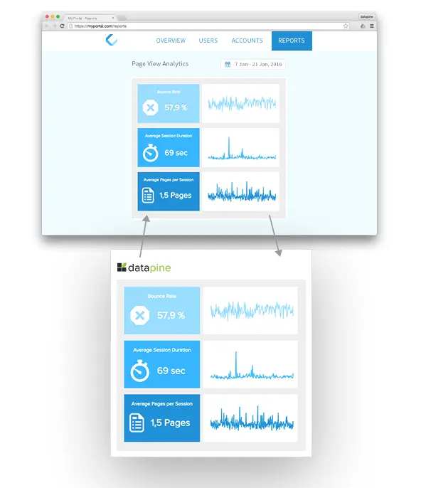
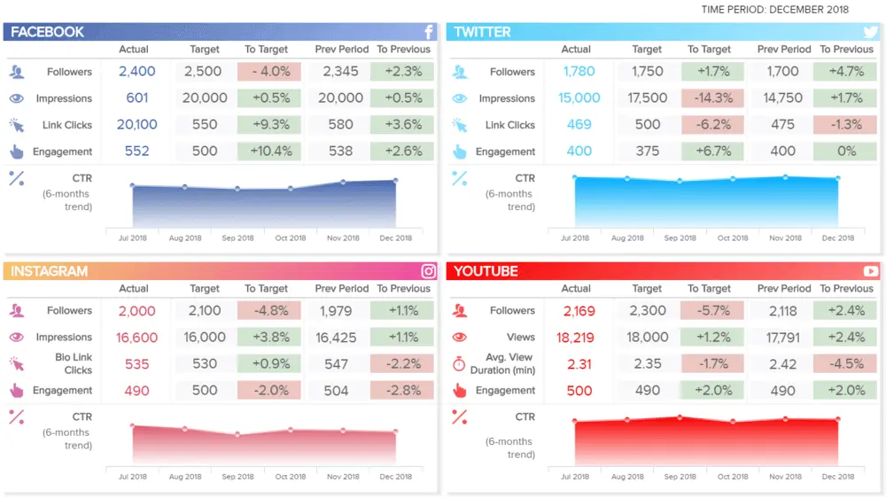
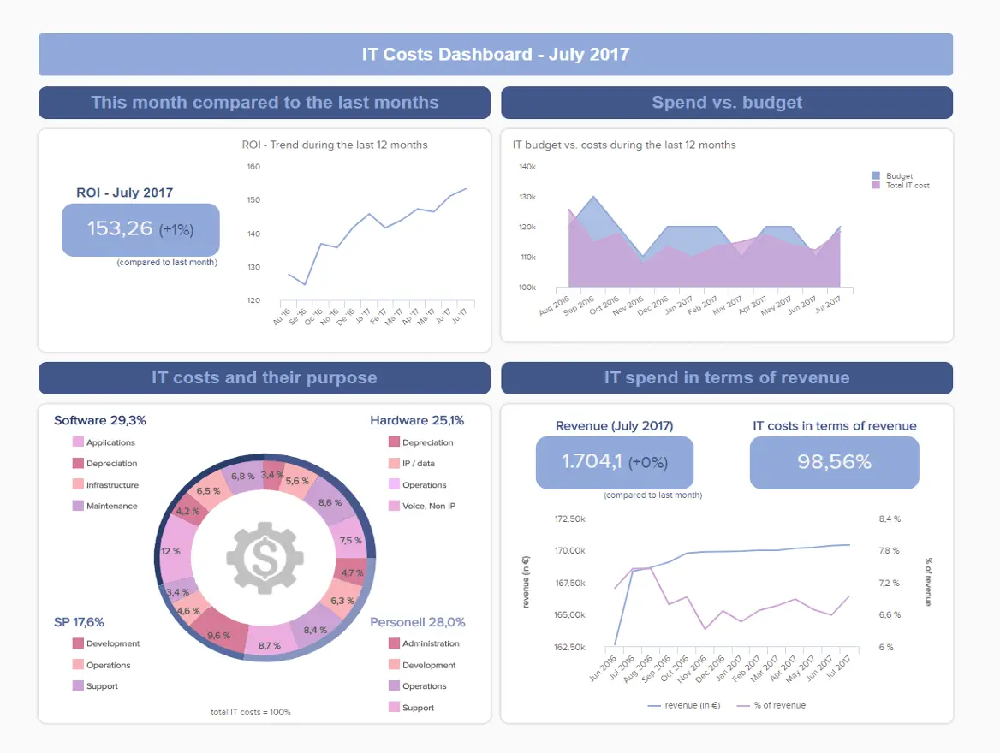
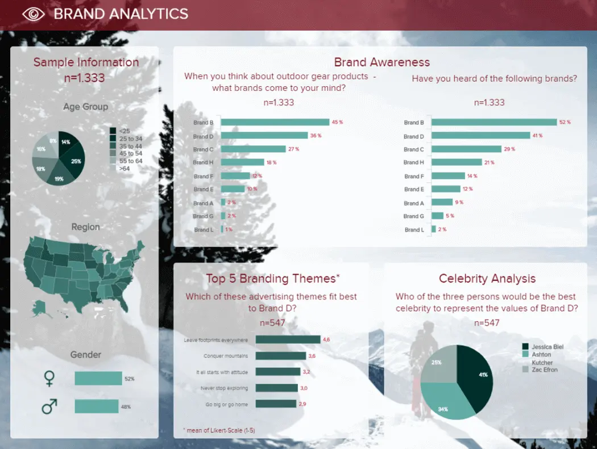
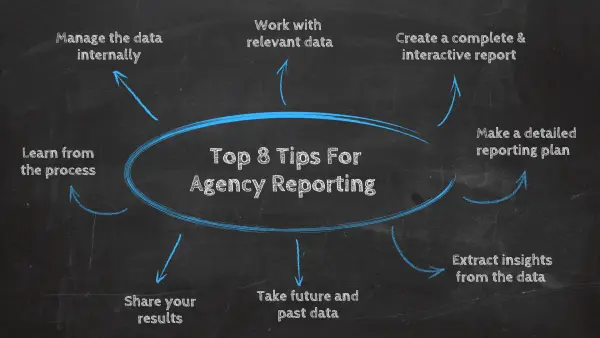

随着数字业务的指数级增长，将一些关键流程外包给数字机构的需求也在增长。虽然这对市场上许多类型的机构来说是积极的，但也使他们面临巨大的挑战。随着越来越多的潜在客户在寻找，代理商需要通过最优质的服务和独特的功能脱颖而出，这将使他们对客户来说是不可替代的。

但是，您如何管理所有新客户，同时仍然专注于为他们提供良好的服务和预期结果？答案是现代机构分析报告和交互式仪表板。

在本文中，我们将介绍利用代理分析的每个基本方面。从其定义开始，然后是代理报告、工具列表和一组代理仪表板示例的好处。然后，我们将以 8 个有价值的技巧结束，以实现成功的机构报告流程。

 

让我们深入了解代理分析的定义。

您的机会：[想要测试功能强大的代理分析软件吗？](https://www.datafocus.ai/console/)探索我们的 14 天免费试用并从互动代理报告中受益！

## 什么是代理分析？

代理分析是获取数据并将其转换为有价值的见解，然后与专业代理仪表板一起显示的过程。代理商受益于交互式仪表板工具，以向客户证明其战略和活动的成功。

与任何其他业务一样，代理商以调查、社交媒体指标、网站性能或与客户目标相关的任何其他信息的形式管理大量数据。除了使用他们的数据来支持决策外，机构还使用[指标](https://www.datafocus.ai/infos/operational-metrics-and-kpi-examples)作为他们与客户交谈的主要语言。因此，如果他们的见解被证明是积极的，它将提醒客户该机构值得投资。

我们不会进一步详细介绍代理分析的理论部分，相反，我们将直接进入正题，为您提供一些关于机构如何通过创建交互式、高质量的代理报告从其数据中受益的观点。

## 现代机构报告的好处

尽管制作独特的内容或详细的市场研究是任何机构成功的基本点，但真正展示您的团队价值并让您的客户信任您的是具体的结果——只有通过高质量的代理报告才能实现。

除了从客户的角度增加价值外，现代报告技术也可用于提高机构的内部绩效。通过在内部使用报表，不同的团队可以彼此保持联系并优化流程，从而使组织中的工作顺利有效。

长期以来，各机构都是手动开发[报告的](https://www.datafocus.ai/infos/data-report-examples)，这使得该过程既繁琐又耗时。今天，各机构应该专注于从他们的数据中获取有价值的见解，并以易于理解的方式呈现给利益相关者;换句话说，拥挤的Excel工作表或无限的PowerPoint演示文稿已经不够了。这就是现代机构报告出现的地方。

在这里，我们向您介绍几点，以开始阐明现代交互式机构报告的好处：

- 节省时间和资源： 毫无疑问，现代机构报告最显着的好处之一是它们节省时间的质量。通过使用自动化分析过程的报告软件，您可以花更少的时间报告，而将更多的时间集中在工作的创意部分。此外，通过在内部使用报告来跟踪不同团队的绩效，您可以优化流程并节省资源，避免不必要的会议或任务。

- 连接所有数据源：从多个营销渠道中提取数据也是[客户报告](https://www.datafocus.ai/infos/client-dashboard-report-examples)过程中一项耗时的任务。现代代理机构报告允许您在一个地方查看来自相关来源的所有数据。这样，您可以将精力集中在从客户的 KPI 中提取相关见解上，而不是每月手动准备数据集。

- 证明您的策略是否成功：这似乎是一个明显的好处，但是，如果做得正确，代理报告可以成为证明您的策略成功的宝贵工具。通过使用交互式仪表板等[在线数据可视化](https://www.datafocus.ai/infos/data-visualization-tools)工具，您可以使用数据讲述故事，并提取高级见解，以便在向客户展示工作时支持您的工作。

- 将代理机构报告集成到您的服务中：许多现代报告工具都在其服务中嵌入了功能。对于希望为客户提供[仪表板工具](https://www.datafocus.ai/infos/online-dashboard)但又不想投资开发自己的软件的机构来说，此资源非常宝贵。将这种技术集成到您的服务中为您的代理机构增加了巨大的额外价值。我们将很快更详细地讨论机构报告工具。

- 通过更好的活动洞察力留住客户：正如我们所说，如今，客户期待代理商的高级反馈。这使得沟通成为机构成功的关键因素。如果您以出色的代理报告让您的客户感到惊讶，您不仅可以与他们建立信任关系，而且还会为您的代理机构建立数据驱动的声誉，从长远来看可以吸引新客户。

- 提高客户满意度：正如我们之前所说，对内部流程采用良好的报告实践将立即为您的服务增加更多价值，从而提高客户满意度。通过使用现代报告技术，您可以更有效地传达信息，优化内部流程以更好地实现您的目标，并向您的客户投射更专业的形象。

您的机会：[想要测试功能强大的代理分析软件吗？](https://www.datafocus.ai/console/)探索我们的 14 天免费试用并从互动代理报告中受益！

## 基本机构分析报告工具

现在我们已经了解了代理分析的含义以及现代代理报告的好处，让我们更深入地了解一些代理机构报告工具。

商业智能工具使代理商只需单击几下即可将数据从多个来源提取到一个地方。DataFocus 是一款出色的[BI 软件](https://www.datafocus.ai/infos/best-bi-tools-software-review-list)，专注于通过友好的界面提供强大的在线分析功能，使其易于任何人使用。在其功能中，它允许您执行尖端的数据分析，创建实时自定义仪表板和交互式报告，以及使用AI技术将您的研究提升到一个新的水平。在这里，我们将更详细地介绍它的一些功能。

- 自动报告： 最有益的代理工具之一是自动报告。就像我们之前说的，每月从多个来源收集数据是一个乏味的过程。借助DataFocus的自动化功能，您的代理数据将自动更新，使客户或团队成员只需单击几下即可访问它。借助人工智能技术，该软件还可以监控您的指标并设置智能[数据警报](https://www.datafocus.ai/infos/business-intelligence-data-alerts)，让您知道数据中是否发生了任何异常情况。

- 自定义仪表板：自定义仪表板的强大之处在于其交互性。DataFocus 提供了一个强大的[仪表板制作工具](https://www.datafocus.ai/infos/dashboard-creator)，可以使用历史和当前数据创建交互式报告。像这样，您可以通过动态图表和实时指标用您的信息讲述故事。此外，由于在线报告工具的强大功能，代理商可以同时使用仪表板，从而改善与客户的沟通并增强机构中不同团队之间的协作。最后，通过自定义仪表板，机构团队成员或经理可以在几分钟内在一个地方访问客户的所有相关数据。稍后我们将看到一些交互式代理仪表板示例。

- 嵌入式功能：正如我们之前告诉您的，[嵌入式分析](https://www.datafocus.ai/infos/embedded-dashboards)可以证明为您的机构带来巨大的附加值。在DataFocus，我们提供软件的完整嵌入及其所有功能，像这样，您可以获得软件提供商的所有好处，同时仍然使用自己的界面（如下图所示）。使用嵌入功能将使您的机构节省传统报告的时间，提供个性化的仪表板，甚至通过向客户收取分析功能费用来发现新的收入来源，而无需创建自己的软件。

- 带有白标的品牌报表：与嵌入功能一样，白标是您的机构的另一个宝贵机会。此功能允许您在仪表板中实现自己的徽标、颜色和样式。这样，您的报告看起来会一致且更专业，从而改善机构的整体形象。您还可以使用特定客户的徽标为他们提供[个性化服务](https://becominghuman.ai/the-importance-of-personalization-in-customer-service-51174053ffd3)，并让他们感觉自己是您组织的一部分。

- 用户友好的界面：在报告工具出现在市场上之前，分析过程繁琐且耗时;只有团队内部的专业分析师才知道如何处理数据。今天，情况不同了。任何报告软件的原则之一应该是其用户友好的界面。使用 DataFocus，您团队中的任何人都可以管理数据并创建高质量的代理报告，而无需高级知识。

- 预测分析：与市场上许多其他[BI报告工具](https://www.datafocus.ai/infos/bi-reporting)不同，DataFocus提供了集成的预测分析功能;遵循用户友好界面的路线，以便机构中的任何人都可以使用它。这种类型的机构报告工具使您能够简化复杂的分析流程，并对数据中可能的发展进行预测。像这样，您可以让您的客户对您的策略的未来可能结果感到惊讶。

您的机会：[想要测试功能强大的代理分析软件吗？](https://www.datafocus.ai/console/)探索我们的 14 天免费试用并从互动代理报告中受益！

## 代理仪表板示例和报告模板

为了继续我们的代理分析之旅，在本节中，我们向您展示了六个交互式代理仪表板示例，重点关注代理商目前最关注的三个行业：营销、IT 和市场研究。这些示例将帮助您直观地了解您的机构如何从现代报告实践中受益。

### 1\. 社交媒体代理仪表板

从我们的代理仪表板示例列表开始，我们为您提供了这个完整的[社交媒体报告](https://www.datafocus.ai/infos/social-media-reports-examples-and-templates)模板。它非常适合在任何企业的 4 个关键社交媒体平台上跟踪活动的进度和成就：Facebook、Twitter、Instagram 和 YouTube，使其成为完美的营销机构仪表板。

此仪表板的工作原理是获取一组运营指标，例如关注者、展示次数、参与率和平均订单价值，并将其与上一时期的目标值进行比较。像这样，您可以通过查看数据如何波动来跟踪特定实现在特定时间段内的性能。红色和绿色标签使视觉上很容易理解指标中的积极或消极结果。

除了显着减少代理商从社交媒体中提取信息所花费的时间外，指示的营销报告对于作为绩效[报告](https://www.datafocus.ai/infos/daily-weekly-monthly-marketing-report-examples)呈现给客户也非常有用。它总结了他们需要查看的主要指标，以了解他们的社交媒体性能，并且作为一种自动化工具，它将使他们能够在需要时检查实时最新数据。

### 2\. 营销关键绩效指标仪表板

我们的下一个示例也是一个营销机构仪表板，它总结了与成本和收入相关的最重要指标。

上面的示例显示了一组代理分析，例如总收入、潜在客户、投资回报率百分比、每次获取成本 （CPA） 和每次获取利润 （PPA），按渠道划分。通过分析这些指标，您可以得出诸如哪些渠道对您的客户更有利可图的结论。在这种情况下，我们可以看到社交带来了较低的 CPA 476 欧元，也是最高的 PPA 之一，为 636 欧元。像这样，我们看到有机会在社交渠道中增加更多预算，从长远来看，可以提高投资回报率。

在所有营销仪表板中，这个[仪表板](https://www.datafocus.ai/infos/dashboard-examples-and-templates-marketing)对于客户协调员来说特别方便。通过概述这些指标，他们可以专注于执行组织任务，例如跟踪预算、正在进行的项目和研究新机会，以确保实现客户的目标。此外，这是一个非常有用的工具，可以向正在进行中的会议中的客户展示，因为您可以清楚地显示预算的去向。

### 第3章 IT项目管理概述

进入机构分析的发展领域，我们向您展示我们的IT项目管理仪表板，旨在跟踪项目成功所必需的每个必要步骤和任务。

与我们的其他一些机构仪表板示例一样，这个示例对内部和外部目的都有帮助。一方面，由于要参加的客户名单很多，各机构需要小心和有条理地管理时间和截止日期。在这里，他们可以找到过期任务和即将到来的截止日期的完整摘要，以及每个团队成员的工作量。机构经理可以与整个 IT 团队共享此报告，并确保每个人都井井有条并了解与项目相关的所有内容。

另一方面，此仪表板在向客户呈现项目更新时也很有用。例如，在谈论相关的IT项目（例如站点开发）时，客户希望具体参与并了解项目的所有阶段。为此，这份机构报告展示了一组[IT 指标](https://www.datafocus.ai/infos/kpi-examples-and-templates-it)，例如项目启动日期的估计、进度开发百分比和详细的预算图表，其中细分了已用和剩余金额，以及超额目标百分比。

您的机会：[想要测试功能强大的代理分析软件吗？](https://www.datafocus.ai/console/)探索我们的 14 天免费试用并从互动代理报告中受益！

### 4\. IT 成本仪表板

我们下面的机构仪表板示例也侧重于[IT 分析](https://www.datafocus.ai/infos/business-intelligence-it)，这次提供了全年成本指标的更详细视图。

自项目实施以来已经过去了一年，是时候执行[KPI 跟踪](https://www.datafocus.ai/infos/kpi-tracking-software-and-tools)以了解哪些有效，哪些无效。机构经理可以使用此 IT 报告模板作为更深入分析和进一步决策的指南，例如重定向预算或实施行动以使客户的投资物有所值。此 IT 仪表板显示一组 4 个与成本相关的 KPI：IT 部门的投资回报率、支出与预算、IT 成本细分以及[IT](https://www.datafocus.ai/infos/dashboard-examples-and-templates-it)成本与收入。通过跟踪这些指标，您可以了解 IT 部门的整体绩效。例如，如果投资正在回报，如果您正确控制了费用并确定来年的改进机会。

### 5\. 市场研究品牌分析仪表板

市场研究机构在进行调查或广泛调查时必须处理大量数据。然后需要组织这些数据并将其呈现给客户，通常会导致带有静态指标的无限PowerPoint演示文稿，从而使过程更加缓慢。通过此机构仪表板示例，您将了解为什么交互式报告是[市场研究分析](https://www.datafocus.ai/infos/market-research-analytics)的理想解决方案。

该仪表板是完美的[市场研究报告](https://www.datafocus.ai/infos/market-research-results-and-reports-example)。它展示了来自户外装备市场品牌分析调查的一组指标。在一侧，我们看到一列显示按年龄组、地区和性别划分的示例信息。另一方面，仪表板通过品牌召回和识别问题提供有关品牌知名度的详细信息。它最终以两张图表结束，显示公众对品牌D的看法，这是调查受访者中最受欢迎的品牌，以及一张名人分析图表，以展示哪些名人代表了品牌D的价值。

这个机构仪表板的强大之处在于它的交互性，这些指标中的每一个都可以被过滤和钻取，以仅展示特定讨论所需的信息。像这样，整个演示过程可以在一个屏幕上顺利完成，从而更容易专注于相关结论，并有可能回答客户在演示过程中可能提出的任何其他研究问题。使用像这样的交互式仪表板来呈现您的数据将使您的机构看起来更专业，让您提供更好的服务，并通过避免无限的静态演示来优化时间，这些演示不仅会混淆而且会让您的客户感到厌烦。

### 6\. 客户满意度机构仪表板

在我们的代理仪表板示例列表的末尾，我们不能遗漏任何机构要跟踪的最重要领域之一：客户满意度。

上面的仪表板显示相关指标以跟踪客户满意度。从每月净推荐值 （NPS） 和客户努力得分 （CES） 开始，两者都分为三类，从正数到负数。然后，您会看到一个图表，比较这两个指标以及它们在一年内的波动情况。在底部，您可以找到四个关键领域的满意度得分指标：质量、定价、设计和服务。

虽然这份报告对市场研究机构向客户展示是有益的，但它也可以成为任何机构内部使用的强大工具。正如我们在本文中提到的，高质量的报告是成功的客户与代理关系的关键。在为您的服务实施新流程和功能后，您可以跟踪代理机构的[客户满意度指标](https://www.datafocus.ai/infos/customer-satisfaction-metrics-effort-score-nps-csat)是提高还是减少。

您的机会：[想要测试功能强大的代理分析软件吗？](https://www.datafocus.ai/console/)探索我们的 14 天免费试用并从互动代理报告中受益！

## 代理报告的 8 大技巧

如果您达到这一点，那么您已经对管理代理分析的成功方法有了基本的了解。作为我们完整指南的结束部分，我们为您的代理机构报告流程留下了 8 个有用的提示。

### 1） 内部管理数据

我们对代理机构报告的第一个提示旨在改善代理团队内部与信息交互的方式。通过为机构中的每个团队创建具有特定指标的不同报告，您可以优化流程，以及改进和实施以结果为导向的策略。

### 2） 处理相关数据

在向客户展示您的代理报告时，您不想用一堆他们可能不感兴趣的信息来打击他们。相反，直接切入正题，并根据他们的目标使它们成为[KPI 仪表板](https://www.datafocus.ai/infos/best-kpi-dashboard-examples)。例如，如果您是营销机构，则可以显示投资回报率或潜在客户转化等相关指标。确保您不使用不相关数字的另一种方法是与客户一起选择关键指标。询问他们的主要目标和 KPI 是什么，并开始谈论它们。如果您不同意他们的某些观点，作为该领域的专家，您可以提出某些重点领域或阐明您的客户可能没有意识到的方面。

### 3）制定详细的报告计划

通过这篇文章，我们已经说明了代理分析在与客户沟通时的重要性。因此，不应轻视报告进程。在计划当月的任务时，请确保您始终节省足够的时间来执行详细和高质量的分析。您还可以从[自动报告](https://www.datafocus.ai/infos/automated-reporting-system-and-tools)工具中受益，这些工具将使分析过程更快、更容易，因为它可以为您节省大量不相关数据的痛苦。

### 4）创建完整和互动的代理报告

没有人希望看到一组指标堆积在 Excel 工作表中。这就是为什么机构报告的另一个有用提示是注意报告的视觉方面。正如我们之前提到的，在代理报告工具的帮助下，您可以使您的报告具有交互性、品牌化，并使用不同类型的图表，使它们更吸引眼球。此外，您可以将各种广告系列的图片添加到[仪表板](https://www.datafocus.ai/infos/data-dashboards-definition-examples-templates)中，这样您就可以帮助客户直观地记住您正在分析的内容或策略。

### 5）从数据中提取见解和结论

创建具有视觉吸引力的报告只是机构报告的冰山一角。仅仅将所有可用数据放在一个[性能仪表板](https://www.datafocus.ai/infos/performance-dashboard-examples)中是不够的。数据分析部分是该机构证明其实际价值的地方。通过向信息添加上下文和分析，您可以提取见解和结论以创建新策略，找到可以利用的新机会，当然还可以向客户展示您的实施的成功。

### 6）获取未来和过去的数据

我们的下一个提示是提醒您永远不要忽视旧数据的价值，因为它可以帮助您可视化以前的操作并将其与今天的结果进行比较。此外，过去的数据可以帮助您为未来的结果做好准备，例如假日季期间的流量下降。在创建报告时，请确保您始终根据过去的数据包含一些未来预测，这样您就可以向客户展示您的策略的发展方向。

### 7） 分享您的结果

虽然通过电子邮件共享报告是一个关键步骤，但当我们谈论共享您的结果时，这并不是我们的意思。我们建议花时间讨论指标，并确保所有相关人员都理解它们。共享代理分析的另一种方法是借助[在线报告工具](https://www.datafocus.ai/infos/online-reporting)让客户永久访问数据。这样，您就可以对流程透明，并与客户建立信任关系。

### 8）从过程中学习

正如我们之前提到的，机构报告不仅对向客户展示结果有价值。从内部角度来看，它也非常有用。创建报告后，团队可以将其用作学习工具，以了解哪些流程不起作用并对其进行更改。如果某件事对客户来说效果很好，也许你可以把它应用到其他人身上。

您的机会：[想要测试功能强大的代理分析软件吗？](https://www.datafocus.ai/console/)探索我们的 14 天免费试用并从互动代理报告中受益！

## 代理商分析的关键要点

随着代理分析之旅的结束，我们希望您清楚地了解报告策略对于提高客户的信任、沟通和保留的重要性。以及，良好的内部报告实践如何有利于团队合作并优化机构的整体绩效。

我们介绍了代理机构报告工具的一些最重要的功能，向您展示了一些仪表板示例，并为您提供了宝贵的报告技巧，以开始提取代理数据的最大价值。

如果您准备自己深入研究代理分析，请立即试用我们功能强大的[仪表板软件](https://www.datafocus.ai/infos/best-dashboard-software-features)进行[14 天试用](https://www.datafocus.ai/console/)\- 它是完全免费的，将为您打开机构报告的所有主要好处。享受！
