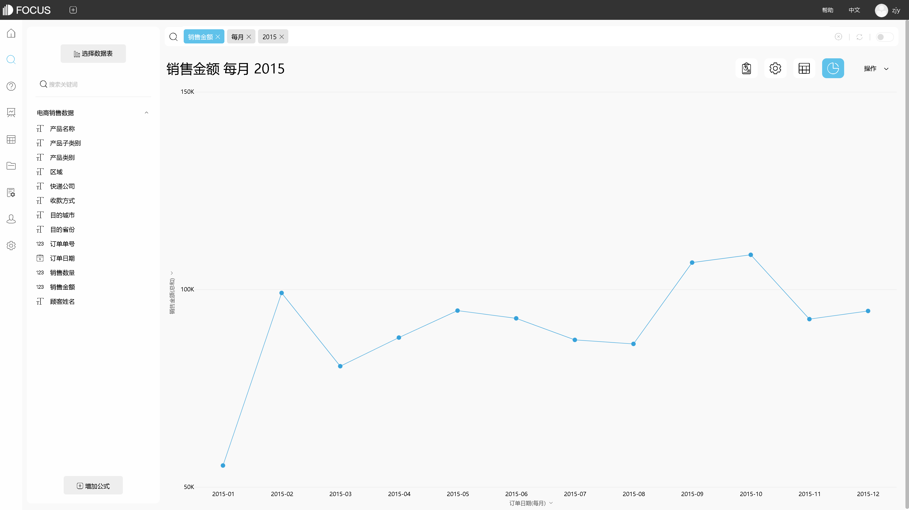
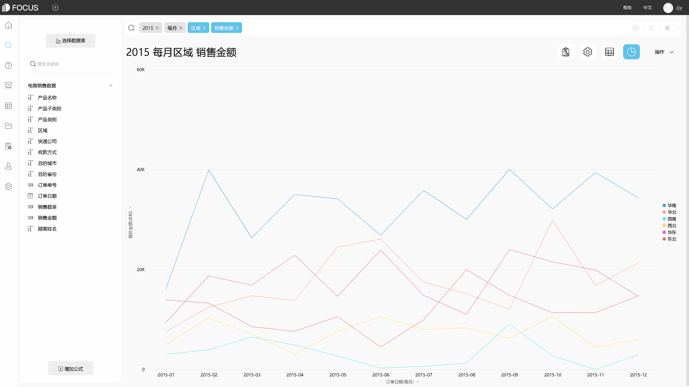
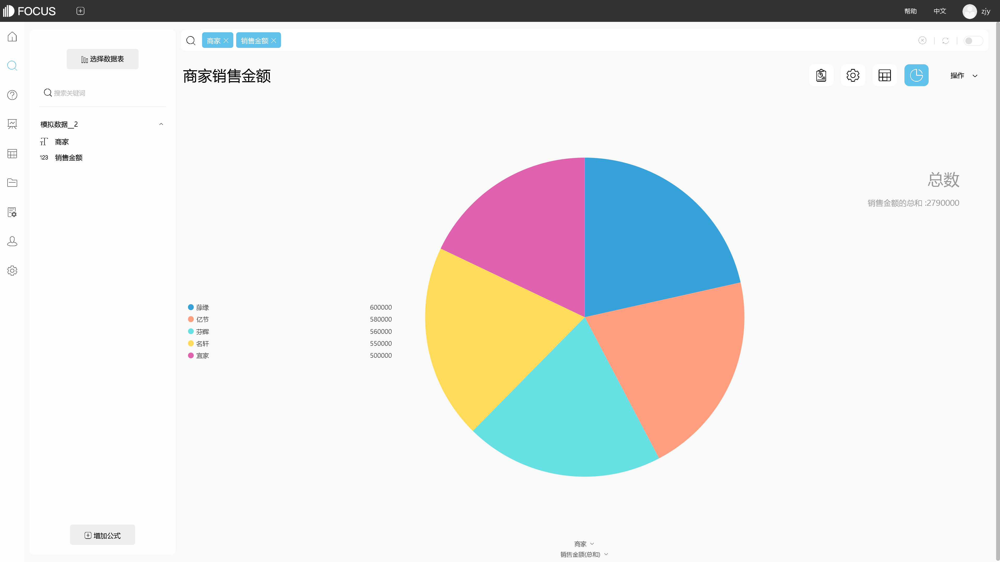

用DataFocus将Excel数据绘制图表时需避免哪些误区?

在日常工作中，无论是制作销售业绩报表，还是对年度工作的汇总，亦或是制作研究报告，我们都需要将Excel表中数据绘制成图表。但是，正确的数据并不代表绘制的图表一定正确，若绘制图表时出错，可能会导致传达的信息错误。

接下来，我们借助DataFocus系统，来看下绘制图表时可能出现的几个误区。

## 过于复杂的图表

专业的图表，一般只用来说明一个观点，且美观精致。若将过多的数据放在一个图表中，且没有明确的主题，会让人无法直观看出图表要表达的信息。

图表 1. 1 复杂的图表

## 容易造成误导的图表

图表需要反映真实的数据情况，不能夸大其实或隐藏。

例如，折线图用来表达变化趋势时，y轴从0开始和不从0开始，呈现的起伏是不同的。所以在制图时，一般不将y轴截断。只有完整地呈现y轴，才能显示合乎比例、完整的数据。

图表 2. 1 完整图

图表 2. 2 更改y轴最小值

图表 2. 3 更改y轴最大最小值

## 错误的图表

例如下图所示，线条过多的折线图，线条交织在一起效果很差。折线图中一条线代表一个图例，图例过多时不适合使用折线图。

图表 3. 1 线条过多

## 不必要的图表

图表需要有明确、必要的目的，不能为了显示分析报告的专业而使用多余的图表凑数。若图表呈现出的效果不能让数据分析结果更加直观、便于理解，那么这张图表就是不必要的图表。如图所示，饼图没起到任何比较的作用，各扇面感觉大小都差不多。

图表 4. 1 没起到比较的作用

以上，是借助DataFocus系统简单介绍的几个将Excel数据绘制图表时可能出现的误区。在进行数据分析并制图时，我们需要注意图表的选择使用。尽可能从 简洁、明确、细节、外观 等方面进行考量。
