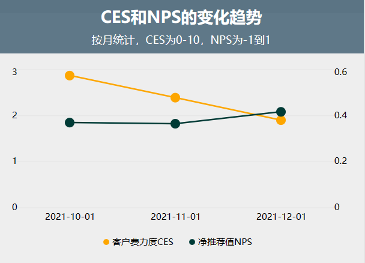
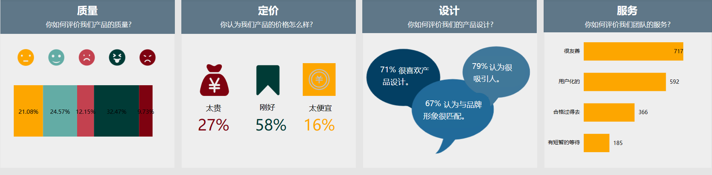

客户满意度调研是企业在发展过程中必不可少的环节，通过了解客户满意度，可以为企业制定更科学合理的发展计划，提高企业竞争力。

## **1\. 客户满意度指标详解**

在客户满意度调研中，最常用的2种调研指标是CES和NPS。CES即“客户费力度”，利用问卷对客户进行调查，了解其在使用企业产品或服务时所需努力的程度，借此评估客户满意度。NPS是“净推荐值”，通过问卷调查客户对企业的忠诚度和推荐度，评估企业在市场中的竞争力。

- **净推荐值（NPS）**

净推荐值，或称为NPS值，NPS展现的基本核心理念是，一个企业的所有用户都可被划分为3类：推荐者、被动者和批评者。推荐者是投入且重复使用产品的用户，他们会热情地向其他人推荐你的产品或服务。被动者是对产品满意，但缺乏热情和忠诚度的用户，他们很容易转而投向使用竞争者的产品或服务。批评者是那些明显对企业的产品或服务不满意的那部分用户。

举个例子，你可以问用户“您有多大可能向您的朋友推荐我们（的产品或服务）？”然后让用户从0-10分中选择一个分数，0分代表“完全不可能”，10分代表“非常有可能”。

用户选择的分数用于将该用户进行归类：批评者的分数范围是0-6分，被动者是7-8分，推荐者是9-10分。

首先计算出推荐者所占比例，然后减去批评者的比例，就可得到NPS值（取值范围为-1到1）。推荐者与批评者的比例差越大，则企业的NPS值越高，代表可能推荐企业产品或服务的人越多。

- **客户费力度（CES）**

CES关注的是企业会让用户费多少力气去满足自身需求。你可以问用户“您需要花多少力气去实现自己的需求?”然后让用户从1-10分中选择一个分数，1分代表“非常轻松”，10分代表“非常费劲”。计算所有用户的答案的总和，得到的总分低说明企业降低了用户满足需求的难度，而总分很高则说明用户在与企业互动的时候花费了太多力气。

CES的优势之一是只关注“用户费力程度”这个要素的解决办法。计算CES分数的唯一目的是消除或减少用户服务中的障碍。CES已被证实是评估用户忠诚度的最佳指标。

除了以上两种方法，还应该对企业产品的**质量、定价、设计和服务**等方面进行调查。在质量方面，客户需要的是高品质的产品和服务，在企业制定计划时应该重视产品和服务的质量问题，提高客户的满意度。在定价方面，企业要合理定价，不仅要考虑成本，还要考虑市场需求，以及客户的购买力，以增加客户的忠诚度。在设计方面，企业应该注重产品和服务的创新性，根据市场需求进行开发设计，以提升客户的体验感。在服务方面，企业要注重客户体验，提供优质的售前、售中、售后服务，从而提高客户对企业的信任度和忠诚度。

## **2\. 可视化监控**

客户满意度的调研是一个持续进行的过程，因此动态的数据指标监控可视化大屏，可以帮助你实时展示客户满意度指标，在数据的指导下，制定合理的客户满意度提升方案。你还可以在大屏上实现日期的筛选，整个大屏的数据会根据你筛选的日期而联动展示。

## **3.实现过程**

本案例清洗后的数据下载：[客户满意度原始数据.xlsx](https://bbs.datafocus.ai/article/74.html)

### **3.1计算NPS**

<table><tbody><tr><td><strong>字段</strong></td><td><strong>计算公式</strong></td></tr><tr><td>推荐者</td><td>if 推荐分数=9 or 推荐分数=10 then 1 else 0</td></tr><tr><td>推荐者占比</td><td>sum(推荐者)/count(问卷编号)</td></tr><tr><td>被动者</td><td>if 推荐分数=7 or 推荐分数=8 then 1 else 0</td></tr><tr><td>被动者占比</td><td>sum(被动者)/count(问卷编号)</td></tr><tr><td>贬损者</td><td>if 推荐分数&lt;=6 then 1 else 0</td></tr><tr><td>贬损者占比</td><td>sum(贬损者)/count(问卷编号)</td></tr><tr><td>净推荐值NPS</td><td>推荐者占比-贬损者占比</td></tr></tbody></table>

分别用仪表盘图和KPI指标图来展示各指标。

****

### **3.2 计算CES**

<table><tbody><tr><td><strong>字段</strong></td><td><strong>计算公式</strong></td></tr><tr><td>客户费力度CES</td><td>average(客户努力得分)</td></tr><tr><td>轻微努力</td><td>if 客户努力得分=1 or 客户努力得分=2 then 1 else 0</td></tr><tr><td>轻微努力占比</td><td>sum(轻微努力)/count(问卷编号)</td></tr><tr><td>中等努力</td><td>if 客户努力得分=3 or 客户努力得分=4 then 1 else 0</td></tr><tr><td>中等努力占比</td><td>sum(中等努力)/count(问卷编号)</td></tr><tr><td>较大努力</td><td>if 客户努力得分&gt;=5 then 1 else 0</td></tr><tr><td>较大努力占比</td><td>sum(较大努力)/count(问卷编号)</td></tr></tbody></table>

与3.1类似，此处不再赘述。

### **3.3 NPS&CES变化趋势**

搜索「客户努力得分的平均值」、「日期」、「净推荐值NPS」，用折线图展示CES&NPS的变化趋势。

### **3.4其他指标**

对质量、定价、设计、服务的结果统计比较简单，可以尝试自己按照数据来实现，展示的图表也可以按照自己的喜好结合数据情况来选择。

## **4\. 总结**

客户满意度分析是一个持续开展的过程，我们需要定期去了解企业的产品或服务是否达到客户的心理预期，还有哪些值得改善的地方。

这样的可视化大屏可以像北极星一样，知识我们目前的方向何在。想要快速上手搭建这样一个动态交互联动的大屏，就注册使用DataFocus试试吧。

大屏访问地址：[https://cloud001.datafocus.ai/df/s/5EatWmRpMdRBe0i7TaDX8wR?name=客户满意分析大屏](https://cloud001.datafocus.ai/df/s/5EatWmRpMdRBe0i7TaDX8wR?name=客户满意分析大屏)
