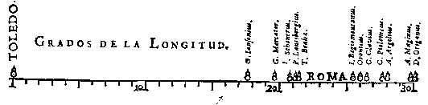
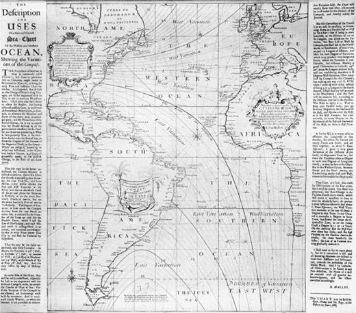

—你知道什么叫数据可视化吗？ —数据可视化啊，就是把数据转化成图形图像的过程。 —嗯嗯，简单来说，可以这么理解。不过，你知道霍乱的治愈、门捷列夫的元素周期表都跟可视化有关吗？ —哦？这么神奇?! —别看数据可视化听起来很“潮”，其实广义的可视化是一门非常古老的学问。

从欧洲中世纪开始，人们就使用包含等值线的地图、表示海上风向的箭头图等。可视化发展史与测量、绘画、人类现代文明的启蒙和科技的发展一脉相承。在地图、科学与工程制图、统计图表中，可视化理念与技术已经应用和发展了数百年。

我们常说“一图胜千言”，没错，**人的视觉感知是最主要的信息界面，它输入了人从外界获取的70%以上的信息，可视化的重要性不言而喻。**  图1：视觉拥有强大的信息获取能力 图片来源：网络

今**天我们就来一起了解一下可视化的发展历史，感受一下可视化的发展进步带给我们的魅力吧~**

**10世纪：可视化的开篇**

首先我们来看这张《行星运动图》，据说是人类有据可考的第一个数据可视化作品，也是人类文献中最古老的线形图。这幅作品是由公元10世纪一位天文学家绘制的，它被用来描绘行星轨道随时间变化的趋势。虽然年代久远，但图表中已经包含了很多现代统计图形元素：坐标轴，网格，时间序列。

 图2：人类有据可考的第一个数据可视化作品 图片来源：网络

**16-17世纪：可视化正式拉开帷幕**

16-17世纪，欧洲正处在一个伟大的时期，即文艺复兴时期。这段时期里欧洲出现了很多现代科学和艺术的牛人。17世纪理论上有了巨大的新发展：笛卡尔解析几何的兴起，测量误差的理论、概率论的诞生，以及人口统计学的开端和政治版图的发展。到17世纪末，数据可视化方法必不可少的要素已经具备了，一些具有重大意义的真实数据，有意义的理论及视觉表现方法出现，这些科学和艺术的发展，为数据可视化正式拉开了帷幕。

1644年，迈克尔·范·兰格伦（Michael van Langren）描述了从托莱多到罗马的12种经度确定：这幅图现在被认为是第一幅（已知的）统计图形。这幅图以一维线图的形式绘制了在托莱多到罗马之间12个当时已知的经度差异。在经度上标注了观测的天文学家的名字。**这幅图有效地安排了数据的表达方式，堪称里程碑之作。**

 ​图3：人类第一幅（已知的）统计图形 图片来源：网络

1686年，哈雷（Edmond Halley ）绘制了第一个已知的气象图，在地球的地理地图上显示主流风场分布。这也是向量场可视化的鼻祖。

 ​图4：人类第一幅向量场可视化图形 图片来源：网络

**18 世纪：图形符号的发展**

进入18世纪后，微积分，物理，化学，数学都开始蓬勃发展，统计学也开始繁荣发展。数据的价值开始为人们重视起来，人口、商业等经验数据开始被系统地收集整理，记录下来，各种图表和图形也开始诞生。

1702年，哈雷彗星的轨道计算者，著名天文学家哈雷，在地图的网格上用等值线标注了磁偏角。我们可以看到其中已经运用了等值线，即同一条线上某项数值是相同的，我们通过线与线之间的距离和疏密程度，可以在总体上感知一个分布情况。

 图5：1702年地球等磁线可视化 图片来源：网络

18世纪也是统计图形学繁荣发展的时期，其奠基人——苏格兰工程师William Playfair创造了今天我们习以为常的几种基本数据可视化图形：折线图，条形图，饼图。  图6：英格兰 1700-1780 年进出口情况 图片来源：网络

**19世纪上半叶：统计图形大爆发**

19世纪上半叶，统计图形、概念图等迅猛爆发，此时人们已经掌握了整套统计数据可视化工具，包括直方图、柱状图、饼图、折线图、时间线、轮廓线等。主题图方面，主题地图和地图集成为这个年代展示数据信息的一种常用方式，应用领域涵盖社会、经济、疾病、自然等各个主题。

其中一个著名的例子就是霍乱的发现。1831年起，欧洲大陆暴发霍乱，当时的主流理论是毒气或瘴气引起了霍乱。英国医生John Snow着手调查病例发生的地点和取水的关系，发现73个病例离布拉德街水井的距离比附近其他任何一个水井的距离都更近。在拆除布拉德街水井的摇把后不久，霍乱停息。Snow绘制了一张水井的散点分布图，清晰地显示了病例集中在布拉德街水井附近，这就是著名的鬼图（Ghost Map）。

 图7 “鬼图”帮助发现霍乱流行原因 图片来源：http://www.datavis.ca/gallery/historical.php

另一个数据可视化的经典案例，就是1858年南丁格尔在克里米亚战争后，统计的英军伤亡人数，这个可视化图形就以她的名字命名为南丁格尔玫瑰图。

玫瑰图不仅清楚展示了军队死亡人数的变化，而且更重要的是，她将三种死亡情况也分别用不同颜色标记出来：蓝色表示死于可预防的疾病、红色表示死于战争伤害、黑色表示死于其它原因。这样可以清楚知道军队伤亡原因的结构，真正影响战争伤亡的并非战争本身，而是由于军队缺乏有效的医疗护理。

 图8：南丁格尔玫瑰图 图片来源：网络
