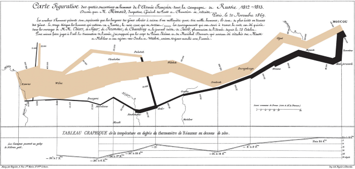

**19世纪下半叶：[数据可视化](https://www.datafocus.ai/view "“数据可视化”")的黄金时期**

19世纪下半叶，可以说是数据可视化的黄金时期。值得一提的是法国人Charles Joseph Minard，**他是将可视化应用于工程和统计的先驱者**。其最著名的工作是1869年发布的描绘1812-1813年拿破仑进军莫斯科大败而归的历史事件的流图，这幅图如实地呈现了军队的位置和行军方向、军队汇聚、分散和重聚的地点与时间、军队减员的过程、撤退时低温造成的减员等信息。

图8：拿破仑1812 年远征（1869 年出版）

图片来源：网络

**20世纪：多维数据可视化和心理学的介入**

20世纪上半叶对于可视化而言是一个缺乏创新的时期，数据可视化的第一个黄金时期也终结了。随着数理统计诞生，追求数理统计的数学基础成为首要目标，而图形作为一个辅助工具，被搁置起来，而多维数据可视化和心理学的介入成为这个时期的重要特点。

图9：1904年关于太阳黑子随时间扰动的蝴蝶图验证了太阳黑子的周期性

图片来源：网络

20世纪70年代以后，桌面操作系统、计算机图形学、图形显示设备、人机交互等技术的发展激发了人们编程实现交互式可视化的热情。处理范围从简单的统计数据扩展为更复杂的网络、层次、数据库、文本等非结构化与高位数据。与此同时，高性能计算、并行计算的理论与产品正处于研制阶段，催生了面向科学与工程的大规模计算方法。数据密集型计算开始走上历史舞台，也造就了对数据分析和呈现的更高需求。

**2004年至今：可视分析学**

进入21世纪，随着大数据时代到来，现有的可视化技术已经难以应对海量、高维、多源和动态数据的分析挑战，需要综合可视化、图形学、数据挖掘理论与方法，研究新的理论模型、新的可视化方法和新的用户交互手段，辅助用户从大尺度、复杂、矛盾甚至不完整的数据中快速挖掘有用的信息，以便做出有效决策。这门新兴的学科称为可视分析学。数据可视化即将进入一个新的黄金时代！

图10：由DataFocus制作的可视化大屏

图片来源：DataFocus Cloud

需要特别注明的是：本文中大量内容来自_浙江大学陈为教授与沈则潜博士、陶煜波博士_等编著的_《数据可视化》_一书。此书非常系统全面地介绍了[数据可视化](https://www.datafocus.ai/view "“数据可视化”")的相关知识。

书中陈为教授指出：“从20世纪90年代开始，我国的各大可见单位和科研人员已经在可视化领域投入了极大地精力，为应用领域认识和使用可视化奠定了坚实的基础。**尽管如此，先进的可视化分析软件和算法在国内尚未得到普遍的理解。应注意我国的数据采集、分析与应用应当通过自主研发，不能任由国外垄断公司来采集和处理，否则将危及国民生活与国防安全。**我国急需对可视化分析的基础理论和方法展开研究，对涉及国家大工程、国家安全、国民经济等重要领域数据的可视分析研究应自主进行。”

要实现这一目标，第一步就需要普及可视化知识和概念，让更多人了解可视化、关注可视化、使用可视化。

DataFocus作为全球首个中文类自然语言数据搜索分析系统，可以让不懂代码、不会SQL语句的业务人员在3秒内完成图表制作，10分钟创建出美观的可视化大屏，让企业进入数字化管理新模式，成为推动企业数字化转型的重要力量。
