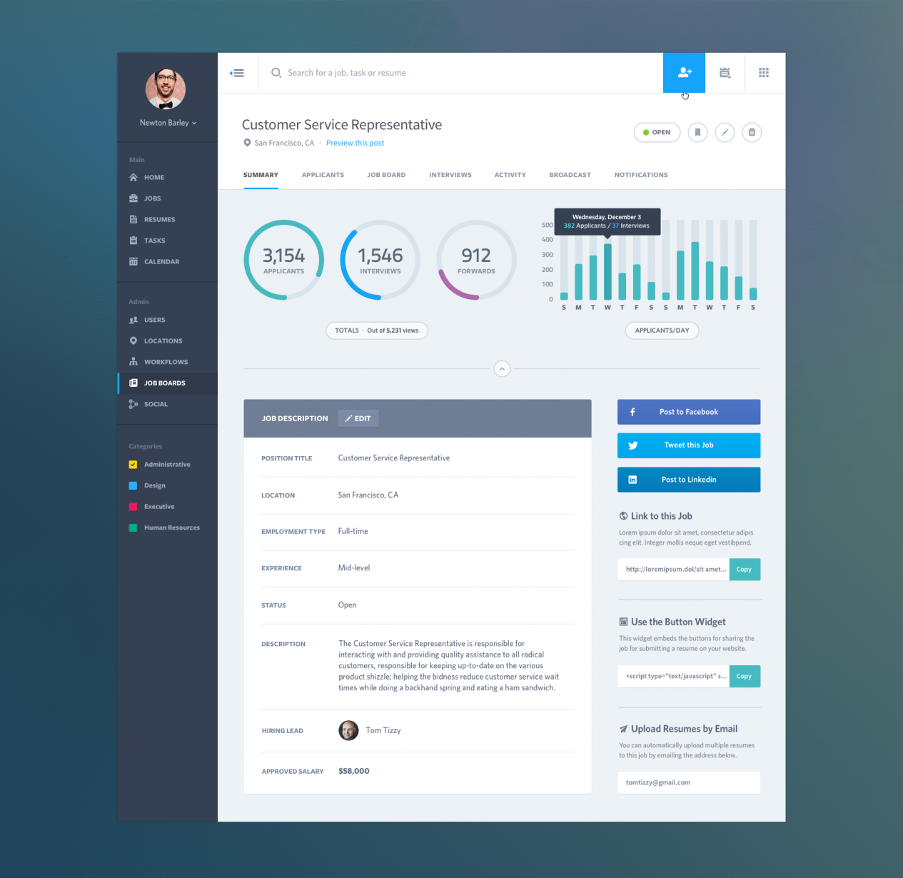
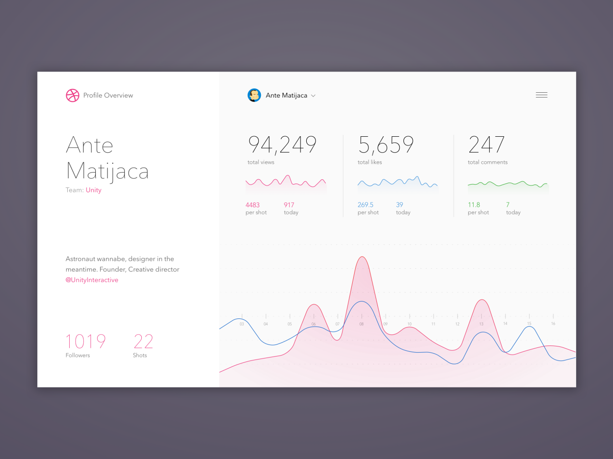
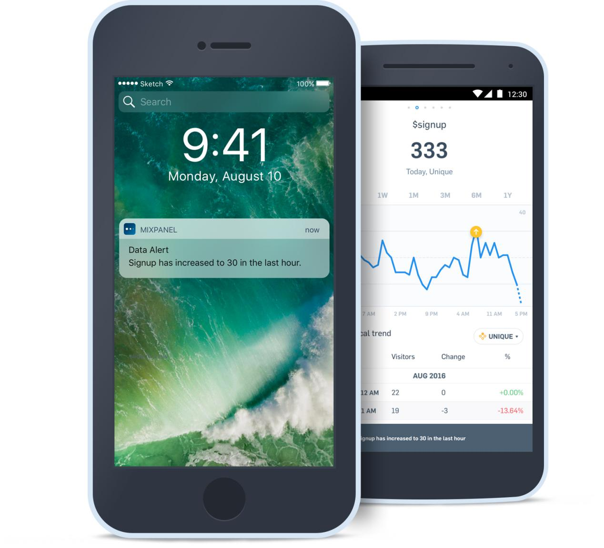
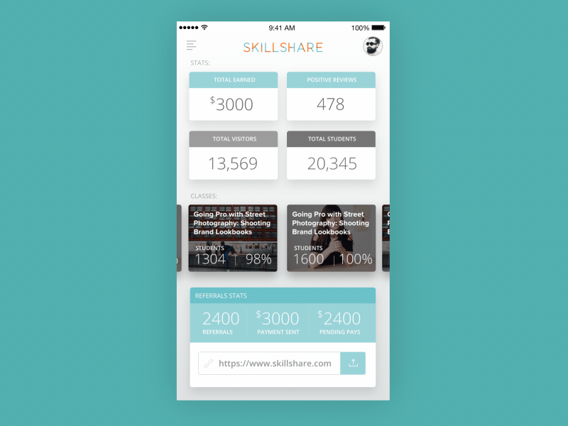
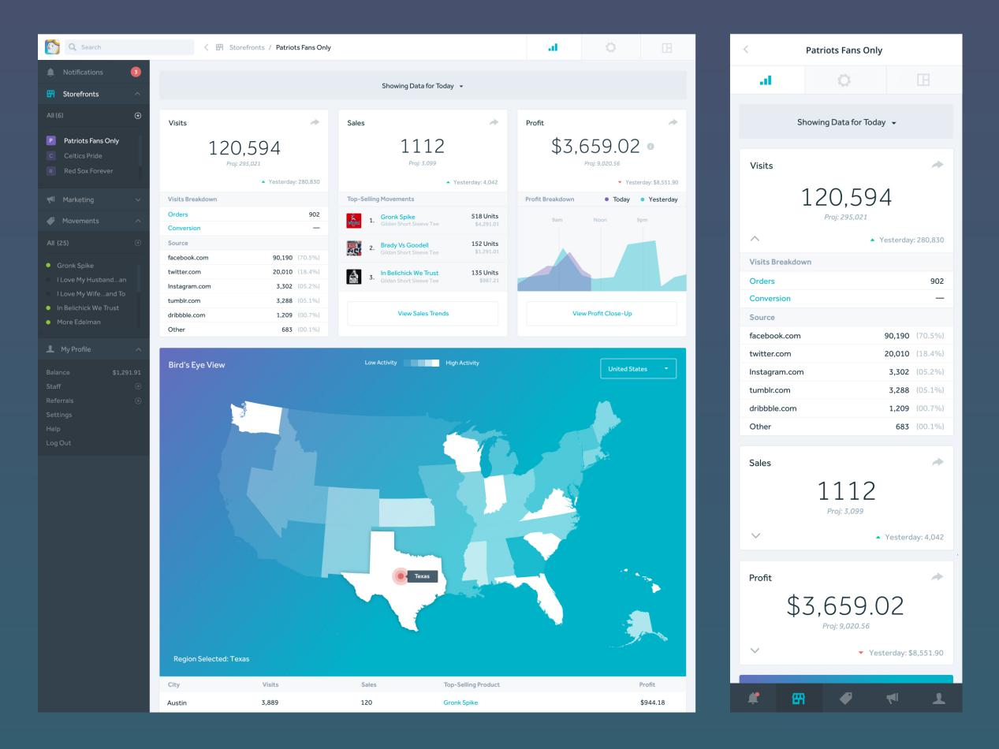

您经营企业时，您需要通过分析复杂的数据集来准确，快速地做出决策。精心设计的仪表板让您可以准确地查看您所需的视图，从而做出明智的决策。但是，构建有效的仪表板并非易事。

要设计有效的仪表板，设计人员必须准确理解数据的使用方式和使用者。用户想要“分析”，但是为了完成他们的工作，他们需要的实际上是洞察力；仪表板（数据看板）的用途多种多样，然而企业组织却很难正确理解哪种解决方案最适合他们的需求。

本文收集一些优秀的数据看板设计，希望能带给你灵感，enjoy！

## **Mixpanel**

_图片来源：Mixpanely_

通过Mixpanel的移动应用程序，您可以创建最重要指标的仪表板，这样您就可以随时随地轻松办理业务登记。通过轻松地向仪表板添加关键指标，您可以在需要时立即获取数据。

## **Dashboard Job Summary Web App**

_图片来源：Mason Yarnell_

这是一个管理仪表板，显示组织中未结职务位置的分析。最重要的数据既可以相互关联，也可以随着时间的推移，让组织深入了解职位发布的成功。

## **Dribbble Stats仪表板**

_图片来源：Ante Matijaca_

一个很棒的仪表板，Ante Matijaca用Dribbble配置文件的实验就是一个很好的例子。仅显示基本信息，并且最小调色板允许Matijaca在图表上指示值而无需额外标记。

## **Plasso仪表板**

_图片来源：Drew Wilson_

许多组织在线产生某种收入，因此了解转换率的分析至关重要。此仪表板提供每日和每周的绩效洞察，以便用户可以快速了解其行为的财务后果和好处。

## **工业分析传感器地图**

_图片来源：Oleg Melnykov_

有些组织不仅需要数值分析，还需要可以在地理上可视化的信息。这种类型的仪表板可以应用于一系列业务，从关注城市范围项目的本地化承包公司到跟踪已安装产品的区域工业供应商。

## **Intercom: How Busy are We?**

_Credit: Intercom_

Intercom询问有关其数据分析的问题表明，他们对美学的关注度较低，而且对数据给用户的洞察力更感兴趣。此基本条形图显示了新对话的易于扫描条形图和中位响应时间。这些图表可以按日期查看趋势（峰值和我们的大版本发布有关联吗？），以及星期几（星期五我们有多忙？）和时间（我们需要什么时间在线？），协助用户了解其支持模式。

窗体顶端

窗体底端

## **智能警报**

_图片来源：Mixpanel_

应用程序正在慢慢变得过时，这不再是技术秘密。此数据仪表板遵循该趋势，并将最重要的信息作为通知一目了然地推送给用户。

## **InsightsPro - 代理和主管仪表板**

_Credit: Balkan Brothers_

对于可能需要花费更多时间使用仪表板的管理人员来说，这是一个更加技术性的仪表板，因此从极简主义美学中获益更少。在这种情况下，仪表板用于票证CRM，您作为公司获得票据/问题报告，该报告将发送给您在现场的技术人员。主要功能是让您查看打开的门票/索赔并安排修复。作为主管，您可以查看有关贵公司如何处理任何未解决问题的所有报告。

## **Skillshare教师统计应用程序**

_图片来源：Vasjen Katro_

教学课程正成为数字设计师越来越受欢迎的收入来源，Vasjen Katro认为管理自己表现的产品可能会更好。教师可以很容易地看到他们的班级相互排名，以及他们的收入总额。

## **店面仪表板**

_图片来源： Josh Martin_

在此仪表板中，您可以查看组织的一个（或全部）店面的分析，以及调整其设置和外观。仪表板提供从地理分析到特定产品性能的强大数据。此仪表板对于小型企业所有者来说可能过于复杂，同时它可以处理大型组织的一系列需求。

## **用您的数据制作仪表板**

可能没有完全适合您的组织或客户的分析工具，因为每个工具以不同的方式提取数据，并且通常专注于不同的指标。但了解每个工具提供的功能将有助于您为团队或客户提供正确的见解

基本上不同的数据需要用不同的仪表板来表达。有没有不需要预先设定数据的场景和类型，就可以进行数据仪表板的开发呢？何不试试DataFocus，你可以运用它从数据处理开始，直至完成属于你自己的数据仪表板制作。

Source：翻译自https://www.toptal.com/designers/ui/upgrade-analytics-dashboard-design-inspirations
