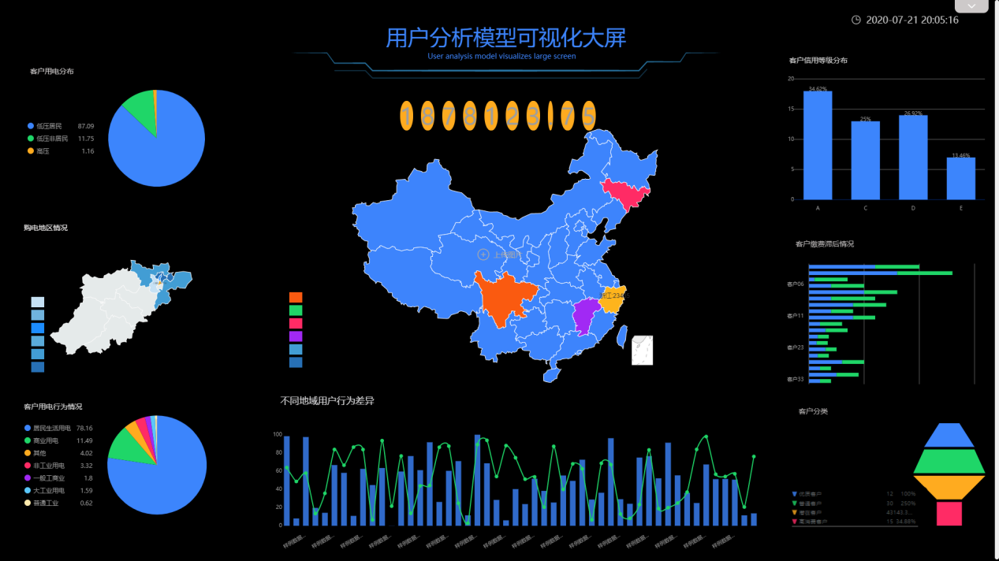

前几天在做智慧电力数据分析的调研，用DataFocus做了两个可视化大屏。

一、运营实时监测可视化大屏

制作大屏所用的主要的数据为发电、供电、售电产生的各种数据。通过智慧电力运营可视化大屏，既可以掌握发电、供电、售电的总体情况，也可以满足即时获取某一时刻某一地点的具体数据的需求，同时企业在用电数据和相关影响指标的对比分析下建立区域用电预测分析，最终生成电量预测结果。准确预测需求有利于企业合理安排经营计划，降低运营成本，提高经营效益，有助于电力规划，利于协调供电与社会需求之间的关系。

二、客户模型分析可视化大屏

电力企业的客户有着多元化需求，通过对客户用电量和负荷、客户基础信息、客户投诉、客户缴费、等数据分析和挖掘，全面了解客户的客户行为，发掘不同标签用户的用电行为差异，准确掌握客户的用电特点与潜在需求，制定满足客户个性化需求的服务，从而有效提升客户的用电体验与用电满意度。

