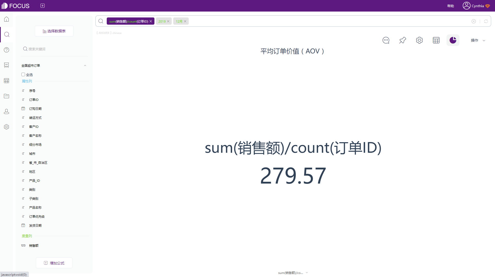

电商卖家们的KPI是什么？毫无疑问，一定是自家店铺的销售业绩。如何在不增加工作量并且不添加广告营销成本的前提下，给企业增加更多的收入呢？

小编给大家出个主意:**增加订单平均价值**。

平均订单价值（Average Order Value,AOV）是一个典型的电子商务指标，跟踪客户从网站或移动应用购买花费的平均货币金额。平均订单价值对于在线零售商而言，可以归结为利润的增长和品牌的持续成功。因为平均订单价值的增加和利润的增加有很强的相关性，当客户在每个订单上消费更多时，零售商也可以获得更多的整体利润。

### **如何计算平均订单价值：**

**总收入($)/已下订单数=平均订单价值($)**

平均订单价值是通过将总收入按月统计（也可以按周或者按天）后除以当月（当周或当天）所下的总订单数来计算的。

例如，您本月从61个订单中获得的总收入为17053元，那么您的AOV就是279.57元。

截图来源：DataFocus（数据已脱敏）

### **提高平均订单价值的方法**

上述介绍的是最简单的计算AOV的计算公式，但这个公式是没有考虑营销成本的。因此我们可以通过积极地制定营销策略，提高平均订单价值，争取获得更高的利润回报。

1\. **设置免费送货门槛。**这是最有效提升AOV的方法，一般来说，设置免费送货门槛为平均订单价值提高30％，这是最有效的。

2\. **交叉销售和追加销售。**交叉销售是指提供互补产品，最直观的是一些网红店铺会将一整套搭配好的上衣、裙子、配饰和鞋子都添加到商品中，客户看到后就更有可能会一起购买。追加销售是指为客户提供统一商品的更高版本，或者推荐客户购买更贵的商品。

3\. **提供捆绑销售或批量折扣。**在交叉销售和追加销售不起作用的情况下，一般会使用捆绑销售，最常见的捆绑销售就是买三免一，买五免二等。批量折扣就是买两件9折，买三件83折。该策略需要确保不会对产品的利润空间影响太多。

4\. **提供满减或消费券。**以此类推，可以提供满减和优惠券活动。客户为了“凑单”就会花得更多。

5\. **提高客户忠诚度**。获取一个新客户往往比留住一个老客户更难。相比不熟悉你品牌的人，回头客会更有可能从你的店铺购买更多的商品。

除开上述介绍的5类方法，还可以衍生出很多方法用以提高平均订单价值，诸如现在热门的直播带货、618、双十一等等。

跟踪平均订单价值对于电子商务企业了解和监控客户购买模式至关重要，有助于帮助卖家确定最佳营销和定价策略。增加AOV是增加收入的最有效（通常也是最便宜）的方法之一，因为交易不会产生额外成本。

鉴于在线提供的产品范围广泛，平均订单价值的行业基准也将因公司和产品而异。

关于平均订单价值（AOV）大家还有什么疑问，欢迎在评论区踊跃发言~
