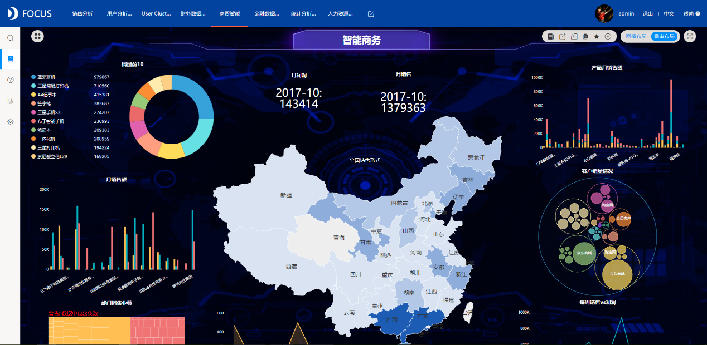

在这个大数据时代，很多企业都开始利用企业大数据进行数据化运营，无论是对外营销还是内部管理。最常见的利用数据化运营的行业就是新零售行业了，因为数字化的交易让数据量和数据价值都在上升。但是很多企业只是为了做数据化运营而做，就像空壳机器没有灵魂。无论是用DataFocus等智能数据分析工具还是聘请专业的数据分析师，决策者都应有灵魂，应从根本上做出改变。

为什么要从观念上做出改变，因为其实每家店背后都有大数据，不是容量大，而是价值大。有一句说烂的话叫做数据本身没有价值，数据的应用才有价值。而当我们在考虑数据需求、设计数据维度的时候，应该从从“易获取、代价小、价值高”的角度出发，考虑当前使用的软件或是人员成本，并且最大效率的得出数据结果。

以使用DataFocus为例，获取数据到可视化，只需要像百度一样搜索想要的维度，回车就会自动可视化。有一点优势是，电商和传统商家相比，建立数据体系更容易、更完整、更准确。就算数据分散在各个数据工具，也不需要有专门岗位或去采集，因为现在的BI工具已经足以对接成一个数据仓库。就算企业没有很大的数据库，也应该认识到数据的沉淀和积累，可以从小到大、循序渐进，要形成有规律的数列或其他，有对比，有可视化，才能知道异常或做出预测和决策。
