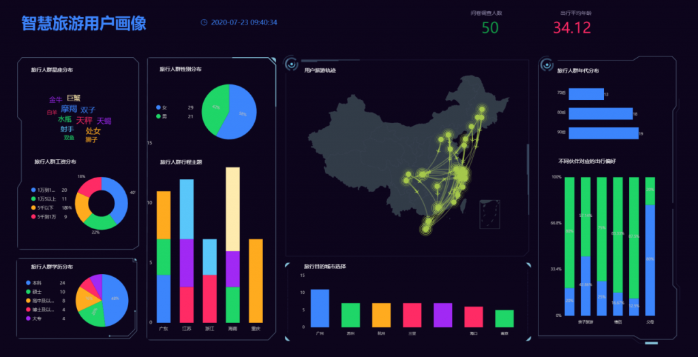

电子商务行业从以客户为中心的数据分析的爆炸式增长中获益匪浅。行业领导者已经能够利用它取得巨大效果，推动他们各种营销、广告和网站内容个性化的努力，从而产生改变游戏规则的销售转化提升。

当代的网上购物公司甚至猖獗地收集、跟踪甚至购买有关个人购物意图、跨平台浏览行为和自有媒体互动的数据，以编制动态的、可怕的详细客户档案。然后，这些配置文件用于创建有针对性的营销活动，从而有效地勾引客户。人们只需要看看Facebook广告和亚马逊产品推荐似乎与一个人的需求完全吻合，并想知道这些方法是多么有效，甚至怪异。

然而，消费者对这些做法的反弹正在增强势头。越来越多的用户现在越来越了解其个人数据的使用方式。此外，GDPR 和 CCPA 等隐私法规现在对公司如何收集、存储和使用消费者数据有严格的规定，因此现在很难使用这些"侵入性"营销方法。第三方cookies正在逐步淘汰，阻止所有数据收集的网页浏览器越来越受欢迎。

因此，商家现在正处于一个关键时刻，他们必须在最大化数据投资和在确保消费者隐私得到尊重的同时，有效地吸引客户之间找到平衡点。

## 为什么数据隐私成为一个首要问题

数据隐私法规现在被视为对公共利益的重要保障，也是数字时代个人权利的支柱。

这种趋势的很多可归因于涉及企业的数据失误的抢头条事件的数量，例如：

- **面对面的广告。**公司通常购买和销售消费者数据以创建有针对性的广告。他们通常依靠浏览器 Cookie 和跟踪器来收集足够的信息来创建受众的个人资料。谷歌和Criteo等网络使用的广告也会对消费者感到侵扰。高达79%的人表示，他们觉得自己被跟踪是因为他们以前寻找过的项目的广告，一种称为"重新定位"的定位方法。
- **令人毛骨悚然的经历。**消费者报告说，由于使用个人信息，他们对品牌感到不安。约21%的千禧一代表示，他们有过令人毛骨悚然的品牌体验，40%的品牌承认自己令人毛骨悚然。
- **滥用数据。**据报道，数据公司剑桥分析公司获得了超过8700万Facebook用户的私人信息，以帮助影响几个地区的选举。前剑桥分析公司业务发展总监布列塔尼·凯撒发布的最新文件甚至表明，公司收集的敏感数据仍在被用来影响全球政治。Facebook 的算法以基于他们的价值观来显示鼓励人们之间分裂的帖子的方式， 仍然受到火的射击。
- **数据泄露。**企业成为数据泄露的受害者，这些数据泄露使用户面临网络犯罪和欺诈。例如，酒店集团万豪酒店在 2018 年遭受了重大数据泄露，影响了超过 5 亿客户的记录，其中包括邮寄地址、付款和联系信息以及护照号码。

## 电子商务如何从客户数据中获得好处

电子商务公司使用数据来推动个性化和有针对性的广告和营销，以推动他们在竞争激烈的市场中转化和销售。事实上，40%的高管表示，他们的个性化工作对电子商务等直接消费者渠道的销售、购物篮规模和利润最大化产生了直接影响。

数据还帮助企业识别最有可能购买其产品的某些群体。因此，他们将能够将营销目标定位到感兴趣的客户，并且不会将资源浪费在不太可能从品牌购买的团体上。

此外，公司还可以跟踪消费者活动，为他们提供更好的客户体验，并根据他们的环境推荐产品和服务。目前约有75%的买家希望_企业_能够预测他们的需求并提出相关建议。

例如，在线时装零售商 ASOS 具有一个动态界面，该界面会根据用户浏览和搜索历史记录进行更改。例如，如果用户以前搜索过男装，则用户下次浏览到 ASOS 主页时将自动重定向到男装部分。

## 合规的数据使用只是表态而已

数据隐私法规的出现促使许多企业重新考虑其数据工作，因为这些法律具有诉讼和巨额罚款的真正威胁。鉴于数据对于企业成功的重要性，他们别无选择，只能调整自己的方法和采用使数据工作合规的工具。

但遵守法规只是开始。如今，世界各地的贸易组织和立法机构似乎不断审议其他条例。也可以保持合规，同时仍然吓坏您的客户，因此电子商务数据经理们应该始终在侵入性较小的方面犯错，而不是更多。

寻求访问者的许可和数据使用策略的透明度是所有这些的关键。这意味着公司在收集用户数据之前必须始终征得同意。网站现在必须包含 Cookie 权限通知，说明将收集哪些数据以及出于什么目的。客户可以选择接受或拒绝，这一点很重要。公司甚至必须保留客户实际同意的记录。

同样，还必须让客户选择加入或退出促销材料。他们必须首先确认他们愿意在组织向他们发送营销电子邮件之前收到营销电子邮件。此外，公司必须只要求相关信息，并在注册表格中收集的数据中保持透明。

根据隐私保护法，消费者还可以撤回同意，要求提供数据记录，并要求删除其历史记录。公司必须为客户提供取消订阅邮件列表、拒绝访问数据收集以及删除其网站上的历史记录和记录的选项。企业还必须能够在提出请求后 30 天内提供收集的消费者数据的副本，其中包括与哪些方共享数据以及收集目的的信息。

实现合规性并非易事。幸运的是，法规遵从工具和平台的出现可以帮助公司实现所有必要的渠道更改。其他合规性应用程序甚至可以自动生成数据报告，以帮助公司满足来自用户的数据请求。

隐私法规还使公司对保护消费者数据更加负责。采用防病毒应用、防火墙和访问控制等安全解决方案可以保护敏感信息不被截获。

总体而言，公司还必须回顾其用户体验产生的印象。客户在整个旅程中必须感到安全，并且他们没有任何网站或应用程序的行为。用户测试和反馈对于构建此类体验至关重要。

## 寻找正确的平衡点

尊重人们的隐私确实是一个做正确的事和遵守法规的问题，但商业领袖的目标是优化销售转换的界面和付费媒体活动也是可以理解的。毕竟，他们是在经营企业。

电子商务公司需要尽职尽责，保持合规，同时使用仔细的个性化来推动其销售。归根结底，最重要的是您的客户总是觉得他们的隐私受到尊重，你照顾他们的最佳利益，并且没有越界。
