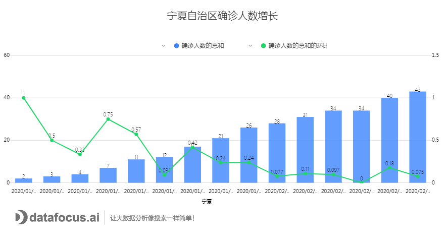
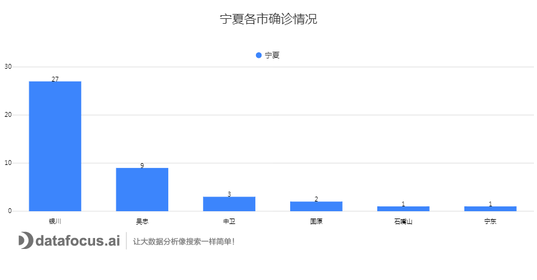
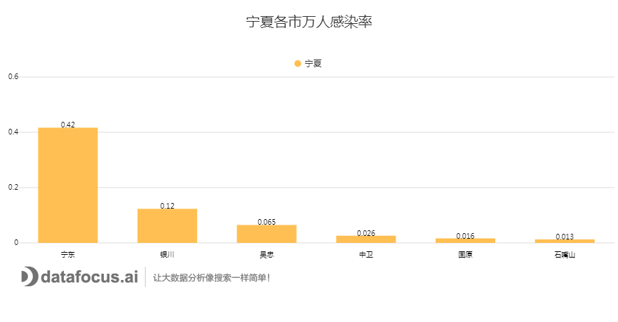
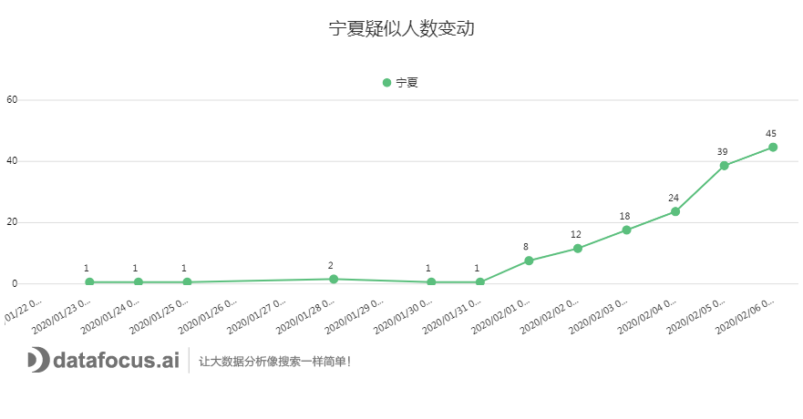

时至今日，广大民众最关心的事件无非就是，疫情拐点什么时候到来以及抗病毒药物的研发进程如何？从数据上看，2月4日至2月6日新增确诊病例是下降的，正在大家觉得形势一片大好的情况下，2月7日下午，前往广东省卫健委出席会议的钟南山院士再次成为了媒体关注的焦点。钟院士回答到：新增确诊病例的下降还不能证明拐点到来。确实，新增病例是最关键的指标，没有继续明显增长当然是个好事。但因此就觉得疫情拐点已经来了却还言之过早。

同样的，就在前一天下午3时，宁夏自治区也举行了新型冠状病毒感染的肺炎疫情防控工作的第二次新闻发布会，发布会上主要讲述了宁夏疫情目前处于缓慢上升的阶段，拐点仍未到来。

接下来，我们就宁夏迄今为止的确诊病例数据，对宁夏的疫情进行分析，使得大家能对宁夏的疫情现状有一定的了解。截至2月6日24时，宁夏自治区累计报告确诊病例43例，现有重症病例1例，出院1例，疑似病例45例。

1.病例确诊小幅攀升，拐点未至

观察下面这张组合图，柱状图代表确诊病例数随时间的数量波动，折线图则是确诊病例数的环比增长情况。从图中可以看出，宁夏自治区在发现首例新型冠状病毒感染的肺炎病例后，每日的确诊病例数量都在持续低量小幅增长。但反观确诊病例的日均增长率，可以发现，宁夏的确诊病例日均增长呈现出一个非常明显的下降趋势，并由原先的波动逐渐趋于平缓。

图1：确诊人数增长情况

接下来，结合宁夏自治区的区域信息，了解具体的病例分布情况。从图中可以看到，银川的确诊病例数是最多的，大约占宁夏全部确诊人数的62.8%；排名第二的则是吴忠市，剩余的地区确诊病例基本都是1-3例。

图2：各市今日确诊情况

依据图2给出的信息，再结合人口普查给出的人口数据，继续分析人口密度对疫情的影响。在得到的图3中，可以看到，银川虽然拥有着最多的确诊病例，但却不是万人感染率最高的地区，宁东虽然确诊的病例只有一名，但是其万人感染率非常高。结合图2、图3，有些地区的确诊人数虽不起眼，但可能其感染率却一点也不弱于确诊人数偏高的地区，疫情感染与人口密度息息相关。

图3：万人感染率情况

2.放宽疑似病例诊断标准，数量出现增幅

图4：疑似病例变动情况

从图4中我们可以非常明显的看到，疑似病例的增长大致可以分为两个阶段，第一阶段的疑似病例非常少，并且几乎没有增长；第二阶段的疑似病例则开始呈阶梯式上升。经查阅资料了解到，宁夏自治区在不久前放宽了疑似病例的诊断标准，并且将诊断报告的权限下放，这才导致了疑似病例出现了一定数量的增幅。

虽然宁夏自治区的确诊病例和疑似病例与全国其他地区相比并不算多，但是发热及接受医学观察的人数总计仍居高不下、增长略有下降，疫情总体处于缓慢上升阶段。

图5：各环节转换情况

据宁夏回族自治区人民政府副秘书长、办公厅主任、疫情防控指挥部办公室主任马金元介绍，目前宁夏疫情的发展大体上可以分为两个阶段。第一阶段从1月22日到春节假期结束。主要表现为前期输入病例累积，中后期新增病例主要为本地续发，疫情由前期单纯输入为主，转为输入与续发相互叠加，呈现出家庭聚集特点。第二阶段则在假期结束后，随着人员返程和企业复工，疫情防控工作将进入新的阶段，预计新一波输入病例将会再次累积，加上轻症和无症状感染者出现，病例发生数和疫情波及县区有继续增加趋势，社区疫情传播风险将会持续增大，防控任务更加艰巨，形势更为复杂严峻。

3\. 坚守一线，争当“最美逆行者”

正是在上述这样艰巨的挑战下，仍然有无数“最美逆行者”在涌现出来。沙坡头区新时代文明实践中心第一时间号召志愿者们承担社会责任，全力协助乡镇、村（社区）及卫生防疫等有关部门开展疫情防控工作。截至目前，沙坡头区已经召集了2446名党员干部志愿者和1372名社会志愿者奋战在疫情防控阻击战的第一线，积极宣传防控知识，排摸疫情线索摸排，全天候轮守值班。正是这些可爱又可敬的人们，迅速构建起一条条抗疫保障的防线，成为“最美逆行者”。
