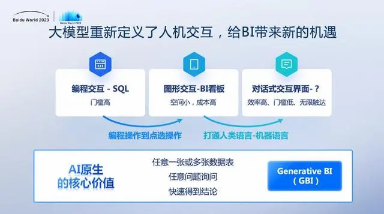

随着大数据时代的到来，数据已成为企业决策的重要依据。然而，传统的商业智能工具往往存在着操作繁琐、分析效率低下等局限性。而搜索式BI的兴起，则为企业提供了更加快速、灵活的数据访问和分析能力。

## 一、传统商业智能工具的局限性

传统的商业智能工具通常需要用户具备较高的数据分析技能，同时操作繁琐、分析效率低下，难以满足企业对快速、灵活数据访问和分析的需求。而搜索式BI的兴起，则为企业提供了更加高效、智能的数据分析方式。

## 二、百度GBI的搜索式BI功能介绍

百度智能云的GBI是一款生成式商业智能产品，具有搜索式BI功能。它的自然语言搜索功能可以让用户通过简单的语句快速获取所需数据，智能推荐功能则可以根据用户的历史行为和偏好，为用户提供个性化的数据分析和查询建议。同时，GBI还支持即席查询，让用户可以随时随地进行数据分析和查询。

## 三、百度GBI的搜索式BI如何为企业提供快速、灵活的数据访问和分析能力

百度GBI的搜索式BI功能可以让企业通过简单的语句快速获取所需数据，同时提供了更加灵活的数据访问和分析方式。企业可以根据自身需求自定义查询和分析方式，提高了数据分析的效率和准确性。这有助于企业更好地应对市场变化和业务需求，实现数据驱动的商业智能。

## 四、DataFocus作为搜索式BI产品的优势

DataFocus同样是一款搜索式BI产品，具有灵活的自定义查询、智能化的数据探索和可视化呈现等功能。它可以帮助用户快速发现数据中的商业价值，提高数据分析效率。同时，DataFocus还支持多种数据源整合和强大的数据可视化能力，让用户可以更加直观地了解数据分析结果。

## 五、结合百度GBI和DataFocus，实现全面的搜索式BI体验

通过结合百度GBI和DataFocus，企业可以更加全面地实现搜索式BI体验。两款工具的优势互补，可以满足企业在不同场景下的数据分析需求。企业可以借助它们的搜索式BI功能，快速获取所需数据和分析结果，做出更有利的商业决策。

## 六、实际案例展示百度GBI和DataFocus在商业智能应用中的成功案例和成果

许多企业已经成功应用百度GBI和DataFocus进行数据分析，并取得了显著的成果。例如，某电商企业通过使用GBI和DataFocus，实现了实时监控销售数据和顾客行为，从而及时调整营销策略，提高了销售额和客户满意度。这些实际案例充分展示了百度GBI和DataFocus在商业智能应用中的成功案例和成果。

## 七、未来搜索式BI的发展趋势

随着技术的不断进步，未来搜索式BI将更加智能化、高效化和可视化。更智能化的搜索功能将帮助用户更快速地获取所需信息，提高决策效率。同时，更丰富的数据源整合和更强大的数据可视化能力也将让用户更深入地理解数据背后的故事，提高决策准确性。这些趋势将进一步推动企业在市场竞争中获得成功。

## 结语：

百度GBI和DataFocus作为搜索式BI工具，能够用数据驱动商业智能，帮助企业实现更高效、更智能的数据分析和决策。在未来的商业竞争中，企业应充分利用这些工具提高决策效率，从而在市场竞争中获得成功。
