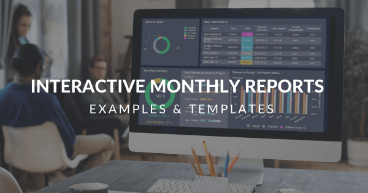
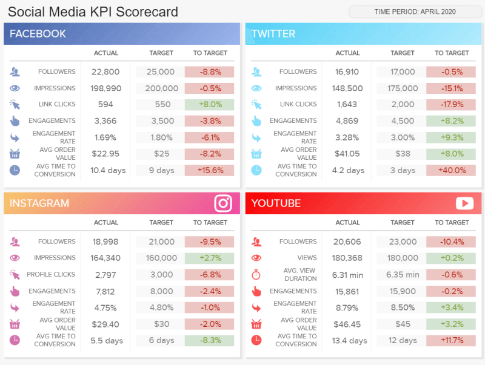
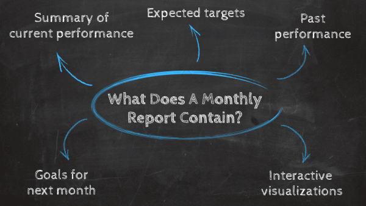

从初创企业到大企业，企业每天都在收集越来越多的数据，众所周知，谁不利用它，谁就会落后。几十年来，公司一直受益于月度报告，以分享他们从数据、成就、当前任务和目标中提取的见解，但主要是为了让每个相关利益相关者都投入和了解情况，因为这是在当今拥挤和快节奏的世界中取得成功的关键要求。

虽然传统报告通常以书面形式包括摘要、正文和结论，但这篇文章将重点关注于由专业[仪表板创建者](https://www.datafocus.ai/infos/dashboard-creator)创建的交互式月度报告。在直观的数据可视化的推动下，这些现代的月度进度报告帮助经理和团队成员以尽可能高效和有效的方式管理其数据，同时增强协作和健康的业务增长。

为了正确看待带有交互式[在线仪表板](https://www.datafocus.ai/infos/online-dashboard)的月度报告的力量，在这里，我们将介绍月度报告的定义，告诉您为什么它们对业务发展很重要，为您提供一些在创建它们时要考虑的技巧和窍门，并涵盖不同功能、行业和平台的9个强大的月度报告模板。

让我们开始吧！

## 什么是月度报告？

月度报告是一种数据分析工具，可以总结几个业务流程的性能。有了强大的数据可视化功能，经理和团队成员使用这些报告来跟踪业务目标的进度和绩效。

有几个业务场景，月度报告很有用。例如，经理将它们用作工具，以监控项目状态或员工的绩效。另一方面，每月绩效报告也可以作为[客户报告的](https://www.datafocus.ai/infos/client-dashboard-report-examples)宝贵工具。通过清晰直观地展示策略的执行情况，客户可以快速看到其投资的价值。

为了继续正确看待交互式报告的力量，我们将讨论企业每月使用这些报告的一些主要目的。

## 每月报告的目的是什么？

如上所述，企业会产生大量数据，其中隐藏着待发现的强大见解。为此，公司使用月度报告从其数据中提取最大潜力，但主要用于跟踪其战略和目标的状态和进展。传统的报告方式繁琐且耗时，报告需要数小时甚至几天才能完成，通常需要IT部门的大量工作。使用现代[自助BI](https://www.datafocus.ai/infos/self-service-bi-tools)工具，任何人都只需点击几下即可创建报告，而无需技术技能。让我们看看使用这些报告的其他好处。

- **改进决策：**通过提供来自多个来源的实时数据，每月报告将显著改善决策过程。根据事实数据提取业务洞察力，而不仅仅是简单的直觉，将引导公司优化几个流程并确保可持续发展。
- **评估状态和进展：**如前所述，月度报告对企业如此有用的最相关原因之一是根据具体的业务目标评估其战略的状态和进展。这使他们能够微调战略并实施新的战略，以确保健康和高效的业务增长。
- **基准绩效：**由于有了历史数据，每月生成报告提供了见解，使企业能够生成目标作为绩效基准。像这样，您可以密切监控当前的值，并将其与预期目标进行比较，以找到改进机会并提高您的绩效。此外，您还可以使用它们将您的业务绩效与竞争对手或市场标准进行比较。
- **管理预算编制**：交互式月度绩效报告的另一个重要目的是，它们是在投资者或其他相关利益相关者面前证明预算合理的宝贵工具。不仅如此，通过直观地了解所有预算要素，您还可以确保每一美元都正确使用，并监控其他行动的剩余金额。
- **通过不断监控数据来降低风险：**使用[在线报告工具](https://www.datafocus.ai/infos/online-reporting)创建的现代月度进度报告可以快速了解企业最重要的业绩指标。通过每月获得这种洞察力，公司可以通过发现效率低下的问题并在它们成为更大的问题之前解决它们来显著降低错误的风险。

现在您已经知道什么是月度报告及其主要用途，我们将浏览不同行业、功能和平台的9个业务月度报告模板列表。所有这些报告都是使用直观的[BI仪表板软件](https://www.datafocus.ai/infos/bi-dashboard-tools)精心创建的。

## 9大月度报告模板和示例

### 1.每月财务报告

我们的第一个例子是跟踪首席财务官（CFO）相关指标的月度[财务报告](https://www.datafocus.ai/infos/daily-weekly-monthly-financial-report-examples)。首席财务官负责公司的财务状况，这意味着他们需要专注于监控关键的财务KPI，以及可能影响公司财务的任何其他外部因素，如客户留存率或员工满意度。这个月度报告模板将所有这些基本财政数据整合到一个中心位置，以确保健康的财务增长。让我们更详细地研究一下。

_\*\*点击放大\*\*_

这个月度进度报告模板侧重于首席财务官的4个主要领域：成本、销售目标、毛利润和净推广者分数。从顶部开始，仪表板提供了收入、毛利润、EBIT、运营支出和净收入等相关指标的概述。每个指标都显示在[仪表图](https://www.datafocus.ai/infos/gauge-chart-examples)中，将每个指标的当前值与绿色和红色的设置目标进行比较，以快速了解该值是负值还是正值。每月一目了然地获得这些见解是有用的，因为它可以让CFO或任何其他利益相关者快速看到自上一时期以来数字的改善情况。如果某件事从一个月到下一个月急剧下降，你可以更深入地挖掘原因。

接下来，每月财务报告提供了3月份不同业务部门的成本和收入细目，允许您密切监控支出和预算。与此同时，我们看到两张图表显示了员工和客户的NPS。每月重新审视这些分数很重要，因为不满意的客户或员工可能会带来严重的经济困难。

### 2.客户留存月度报告模板

客户是任何企业的跳动的心脏，为他们提供有针对性的服务可以造就或破坏一家公司。我们的下一个示例是专注于留存指标的仪表板。获取新客户比保留旧客户要贵得多，这个月度报告样本将帮助您做到这一点。

_\*\*点击放大\*\*_

这个月度报告模板配备了强大的[客户留存率指标](https://www.datafocus.ai/infos/customer-retention-dashboard-metrics)，提供了所有必要的信息，以跟踪您的留存策略的绩效，并找到提高业务留存率的改进机会。

仪表板主要关注4个指标：净推广者得分（NPS）、忠诚客户率、高级用户百分比和客户生命周期价值（CLV）。每种值都与上个月的值进行比较，以便您可以快速了解自上次报告以来您是改进还是退步。接下来，[服务仪表板](https://www.datafocus.ai/infos/dashboard-examples-and-templates-customer-service)提供了过去12个月每个指标的详细细目。如前所述，在报告中包含历史数据将帮助您更好地了解自己的表现，找到数据中的趋势和模式，并根据事实信息提升您的策略。

### 3.每月销售报告

此月度销售报告用于监控、分析和确定每月的销售趋势和绩效，以便销售部门顺利运作。它的主要重点是对c级高管、经理和销售副总裁来说最感兴趣的高级[销售KPI](https://www.datafocus.ai/infos/kpi-examples-and-templates-sales)。

_\*\*点击放大\*\*_

更深入地了解这个每月销售报告样本，我们首先可以了解收入、利润和成本等关键销售数据。把它们与设定的目标以及上个月的表现进行比较。像这样，您可以轻松了解企业是否正在实现其目标，并且战略是否正在取得成功。

接下来，我们将根据当前和过去的绩效对这些指标进行更详细的细分。这是包含在每月状态报告模板中的宝贵信息，因为它为经理提供了对每个销售流程的完整视角，使他有可能更深入地挖掘数据，以找到可持续业务发展的机会。例如，通过查看每月的增量销售额，您可以了解哪些渠道带来了最多的收入，而排除了那些没有收入的渠道。如果每季度跟踪一次，企业将无法及时注意到一些不值得投资的渠道。

### 4.SaaS每月管理报告

下一个月度报告示例侧重于管理，特别是在技术驱动的软件即服务公司的高管运营中。任何SaaS业务都应该关注的最相关的领域是客户、经常性收入和运营成本，这个仪表板提供了每一个方面的概述。

_\*\*点击放大\*\*_

这份月度管理报告拥有去年的历史数据，深入了解业绩和成本，让高管了解可以帮助企业保持盈利的每一项相关指标。仪表板左侧的折线图，用于显示付费客户、丢失和流失率。这里的目标应该是通过有效的策略(备注:这些策略需要每个月都进行密切监控和改进)尽可能地降低用户流失率。流失率的标准值应该大约是每月0.5%或每年5-7%。

接下来，[SaaS仪表板](https://www.datafocus.ai/infos/saas-dashboard-examples-metrics-templates)提供了每月经常性收入（MRR）的细目。这可以说是任何SaaS业务最相关的指标之一，因为它们需要创造更多的收入才能增长。如您所见，这些都是每月要跟踪的基本指标，因为它们使您能够更深入地研究正在进行的运营成本，以优化您的流程，并在更高层次上了解您的客户。

### 5.项目月度报告

我们的下一个例子是用于项目控制的非常有价值的月度报告表。这个交互式仪表板为经理和团队成员提供有关项目开发的每个细节，让每个人都了解不同阶段和每个阶段的绩效。

_\*\*点击放大\*\*_

这个使用专业[KPI报告软件](https://www.datafocus.ai/infos/kpi-reporting)创建的月度报告模板的价值在于其交互性。首先，您会看到时间框，表示客户端的名称、项目状态和要可视化的时间段。所有这些都可以根据对之前阶段或项目获得更深入了解的需求进行过滤。接下来，我们概述了与实际和预期价值的成本和收入相关的3个关键数据，以快速了解项目在资金方面的进展。

与这些成本相关的指标配对，[项目仪表板](https://www.datafocus.ai/infos/project-management-dashboards-examples-and-templates)提供了与任务和时间规划相关的KPI。以视觉上吸引人的方式获得这种水平的详细见解将有助于团队保持联系，更好地执行任务，并随后提高项目效率。

### 6.每月社交媒体报告

社交媒体永远不会停止。在一个人们每天都与智能设备和社交帐户连接更紧密的世界里，那些没有从渠道中提取每一滴潜力的品牌只会被淘汰。这份充满相关[营销KPI](https://www.datafocus.ai/infos/kpi-examples-and-templates-marketing)的每月媒体报告将帮助您做到这一点。

_\*\*点击放大\*\*_

这份每月[社交媒体报告](https://www.datafocus.ai/infos/social-media-reports-examples-and-templates)拥有强大的指标，如关注者、展示次数、参与率、点击率等，概述了Facebook、Twitter、Instagram和YouTube等4个主要频道的表现。每个频道分为7个基本指标，这些指标根据设定的目标和前一个周期进行跟踪，并以红色或绿色显示，以快速了解该值是负值还是正值。

这份有见地的每月营销报告是测试您的社交媒体策略成功以及目标受众最喜欢哪种类型的内容的完美工具。每月跟踪这些将帮助您向经理或作为每月客户报告提供准确的进度报告，同时为您提供足够的时间来微调您的绩效，并为您的受众提供最佳的社交体验。

### 7.能源月度报告

我们的第七个月度活动报告模板侧重于能源公司的管理。从按部门分列的总销售额和消费到生产成本和停电次数，这个[能源仪表板](https://www.datafocus.ai/infos/dashboard-examples-and-templates-energy)为您提供了不同工厂性能的全貌。

_\*\*点击放大\*\*_

月度报告模板从每个部门的总能源消耗细目开始。这是一份宝贵的信息，可以包含在您每月的报告中，因为它告诉您谁是您的主要消费者，以便您可以提前准备资源和生产以满足他们的需求。接下来，您有按部门和能源分列的销售和成本相关数据，这些数据使您更深入地了解哪些应该是您关注的重点。在这种情况下，可再生能源是家庭最想要的，因为消费者倾向于转向更可持续的生活方式。

如果没有一些运营的KPI，这个能源月度报告将不完整，每月跟踪的停电次数及其平均持续时间将帮助您规划和安排受监督的停机时间，并提醒您的客户，在发生任何不必要的停机时做好准备。

### 8.每月服务报告

如果没有特定于平台的示例，我们的月度报告样本概要就不完整。这个[Zendesk仪表板](https://www.datafocus.ai/infos/dashboard-examples-and-templates-zendesk)跟踪客户支持团队过去30天的绩效，其指标特定于每个代理，以及团队的一般指标。

_\*\*点击放大\*\*_

通过入住率、净推广者评分、平均首次联系解决方案等指标，此月度进度报告模板为支持经理提供了所有必要的信息，以确保最佳的客户服务体验。客户可以组成或破坏公司，因此确保您在他们旅程的每个阶段都支持他们，这对业务成功至关重要。考虑到这一点，每月报告这些[Zendesk KPI](https://www.datafocus.ai/infos/kpi-examples-and-templates-zendesk)至关重要，因为任何低效率问题都需要立即解决。例如，如果支持代理表现不佳，他的经理可以提供培训机会，这样就不会影响整个团队的绩效。

### 9.谷歌分析月度报告

我们上一个月度分析报告模板是最有用的[谷歌分析仪表板](https://www.datafocus.ai/infos/dashboard-examples-and-templates-google-analytics)之一，它旨在通过跟踪会话、新用户、跳出率、目标完成率等指标来监控网站的性能。

_\*\*点击放大\*\*_

虽然标准的谷歌分析月度报告被营销人员广泛使用，但它们确实有一些局限性，例如图表类型或高级分析功能的选择。上面的示例是使用[仪表板设计器](https://www.datafocus.ai/infos/dashboard-designer)创建的，该[设计器](https://www.datafocus.ai/infos/dashboard-designer)具有高级过滤选项，因此您可以直观和交互式地处理数据。

这个月度报告示例不仅提供了过去30天的数据，还提供了每天和每周的数据，以便您可以更深入地了解自己的表现。查看数据是如何根据国家或渠道波动的，将帮助您微调策略，并以最有效的方式分配资源。例如，在这里，我们看到美国拥有最高的会话次数，这意味着这是一个你应该集中精力进行转化的国家。

现在我们已经为您提供了强大的月度报告模板，您可以申请不同的领域和功能，我们将看到一些您应该考虑的关键要素，以便每月创建成功的报告。

## 月度报告包含哪些内容？

成功的月度报告应简明扼要且易于理解，以保持所有利益相关者参与分析过程。虽然包含报告的格式和KPI将因您要处理的主题或部门而异，但月度进度报告中需要包含一些标准元素，才能高效和成功。例如，在创建它们之前，您需要问自己一些重要问题，例如：我向谁报告？哪些 KPI 与跟踪我的目标最相关？我需要包括哪些数据源才能完成我的报告？在这些问题中，一份成功的报告应该包含：

- **当前表现摘要：**这似乎是一个显而易见的问题，但实际上是最重要的一点。正如本文通篇所述，每月状态报告的唯一目的是根据具体目标提供有关您业务当前绩效的信息。重要的是要考虑到，并非所有KPI都有助于描述您的目标，因此您需要仔细选择每个指标，以帮助您以最有效和清晰的方式讲述数据故事，而不是在报告中过多地使用无用的数据。
- **预期目标：**根据设定的目标衡量进度是激励团队成员提高绩效以及衡量您距离实现目标还有多远的好方法。为此，基准值应始终包含在每月报告中。热门目标通常是上个月的绩效或行业标准。在这里，您应该确保您的基准值是现实的，并且您的业务可以实现。
- **过去的业绩：**历史数据在月度报告中起着重要作用，因为它为改善当前绩效提供了宝贵的见解。通过分析您的历史数据，您可以找到关系、趋势和模式，帮助您更好地了解业务的几个方面。例如，客户的行为。
- **交互式可视化：**交互式可视化不仅使您的报告一目了然，还为您的数据提供了环境，以便您可以更深入地挖掘并提取相关见解。正如您从我们的月度报告模板列表中看到的那样，一套良好的数据可视化使您能够以全面和可访问的方式讲述您的数据故事，使任何看到它的人都易于理解。请注意，折线图或柱状图并不总是所有绩效指标的最佳视觉效果。在使用专业的[在线数据可视化工具](https://www.datafocus.ai/infos/data-visualization-tools)构建报告时，请仔细选择最准确地描述您的KPI和业务目标的视觉效果。
- **下个月的目标：**如果您不从中得出结论，跟踪您的数据将毫无用处。为此，您的月度报告应包含下一个阶段的明确目标。像这样，您将清楚地了解未来一个月在哪里集中精力，并避免在过时的战略上浪费时间和资源。

## 彻底改变您报告的关键要点

到目前为止，您应该知道如何在现代解决方案的帮助下创建交互式报告，从而将您的业务报告提升到一个新的水平。在这篇有见地的文章中，我们为您提供了您应该在业务中实施月度报告的有力理由，并为您提供了交互式示例列表，包括销售、财务和月度营销报告。如果您想查看其他示例，如IT月度报告或人力资源月度报告，请浏览我们几个行业和功能的[仪表板示例](https://www.datafocus.ai/infos/dashboard-examples-and-templates)列表。

总而言之，每月创建交互式报告将引导您的企业通过加强决策过程来提高绩效，最重要的是，通过强大的数据可视化，来更深入地了解趋势和模式，将使每个相关利益相关者参与到每个阶段。

如果您准备在专业的BI仪表板工具的帮助下开始创建交互式月度报告，以提高您的业务绩效，那么请完全免费试用我们的[30天试用](https://www.datafocus.ai/console/)产品，并立即开始从质量报告中受益！
