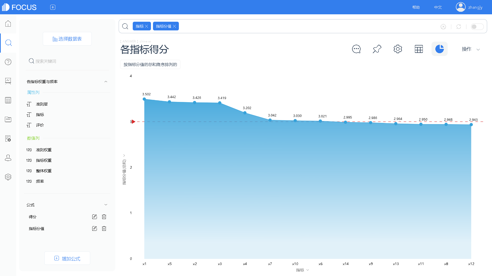
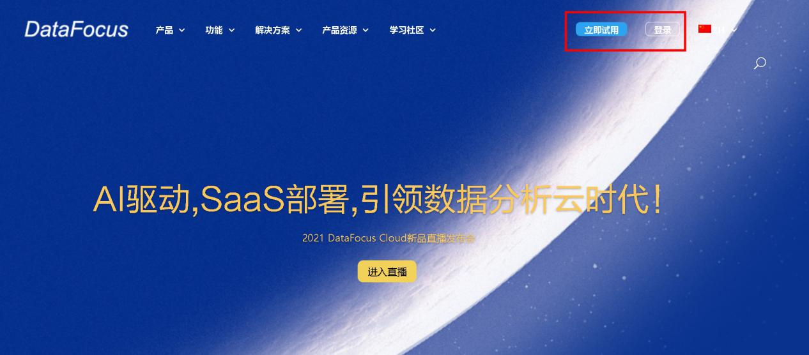

用户行为分析隶属于用户数据分析的一个模块，所以做用户行为分析比较领先的主要是一些知名BI工具的生产公司，比如像帆软、**DataFocus**、微软、Tableau等。

一般国内做数据分析的公司会更加贴合国内企业的需求和思维模式，举个例子，我在**DataFocus**的官方网站上看到过关于八大分析的模型的案例内容介绍，其中包含的事件分析、热图分析、全路径行为分析等就十分贴合题主所提到的用户行为分析。

事件分析模型是用户行为数据分析的核心和基础。用户在产品上的行为我们定义为事件，它是用户行为的一个专业描述，用户在产品上的所有获得的程序反馈都可以抽象为事件进行采集。

热图分析模型主要应用于用户行为分析领域，分析用户在网站显示页面的点击行为、浏览次数、浏览时长等，以及页面区域中不同元素的点击情况，包括首页各元素点击率、元素聚焦度、页面浏览次数和人数以及页面内各个可点击元素的百分比等等，通过上述分析，找出页面设计的合理性。

全行为路径分析主要是根据每位用户在APP或网站中的行为事件，分析用户用户行为状态以及从起点到终点各阶段用户转化率的情况，找出各个模块的流转规律与特点，挖掘用户的访问或浏览模式，进而实现一些特定的业务用途。

**DataFocus**还有其特有的可视化搜索引擎，通过对自然语言的搜索输入，即可呈现可视化结果；该公司也是慷慨的将多行业的案例分析报告免费向用户呈现；BI工具的图表类型十分丰富，除了基础图形外，还涵盖了很多新颖且独具特色的图表类型；数据看板组件元素的添加也为整个大屏的设计提供了更多可能性，完全可以打造一个非常美观炫酷且实用的可视化大屏。

