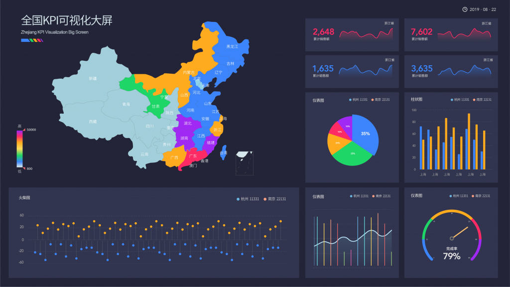

因各个行业不断的数字化交易属性，以及各个数字化转型的企业在此过程中积累了大量的数据，是大数据诞生很大的因素。在此基础上，企业并不止步于积累数据本身，而是并不断的利用大数据进行数据分析，以赋能企业决策，让企业决策更为精准更为高效。对于很多企业来说，数字化是一切大数据进程发展的基石，商品数字化、客户数字化、销售数字化等等。这样一来，就有大量企业开始使用如DataFocus、Power BI等大数据工具分析数字化的企业场景，亦或是聘请专业的大数据分析团队。

而对于很多TO C企业来说，消费者的消费趋势分析，是能对企业决策造成影响的重要因素之一，而随着消费群体的年轻化、购物的轻量化等因素，消费趋势也在不断地变化，对于很多企业分析师来说，思考的角度也应发生变化。本文以去年双十一数据彰显的消费趋势为窗口，为大家分享现有消费趋势的思考思路。由于部分数据保密性，仅以文字描述。

我们可以从七大方面入手，衣食住行用育娱。举三个方面反映加购数量的例子。从衣服的角度，我们可以看到，包含“撞色”数据标签的服饰增长了134%，包含“不对称民俗刺绣”数据标签的增长了360%，包含“拼接”数据标签的增长了110%。因此，对于衣类数据来说，分析应更着重于个性化、小众的流行趋势，对于实施来说服装行业也可以更加的朝这方面进行业务优化或拓展。

在食方面，我们可以看到，包含“自热”数据标签的增长了1400%，包含“半成品美食”数据标签的增长了61%，包含“即食”数据标签的增长了87%。也就是说，数据显示，人们越来越希望能够5分钟搞定满汉全席，美食的获取最好无关时间地点，无需任何工具，而且想要丰富营养却无需辛苦。因此，相关企业可以更多的朝这一方面分析和应用。

在住方面，我们可以看到，包含“迷你”数据标签的增长了92%，包含“1人用”数据标签的增长了190%，包含“智能乐趣”数据标签的增长了446%。大体反映了“一人居住恰到好处”的特点，比如为单身人士打造的迷你家电以及各类智能家居。因此，数据分析员可以更多地洞察这一类消费者的特性，以更好的结合此特性进行实时分析，优化策略。
