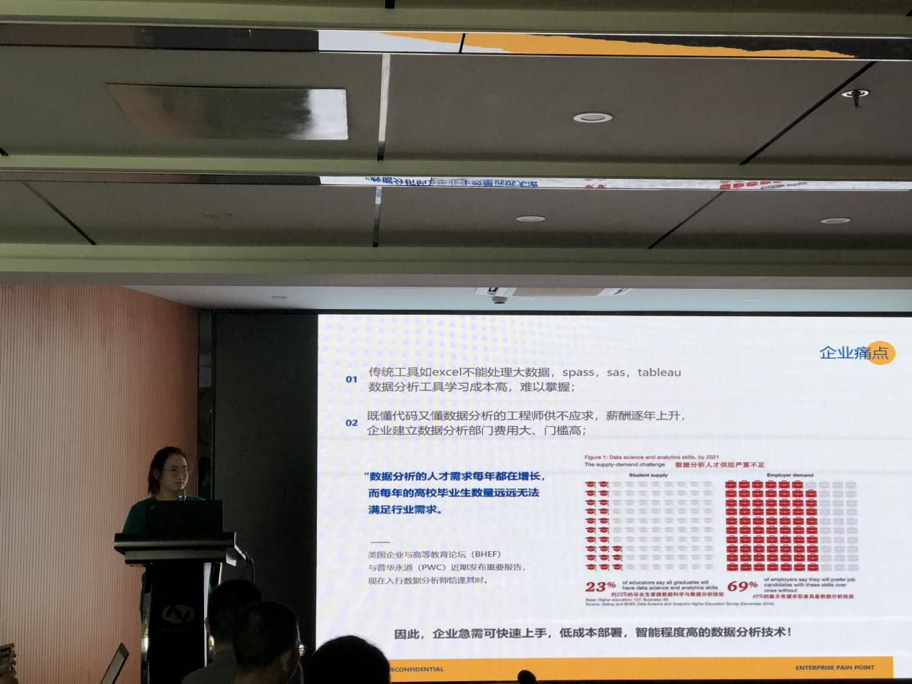
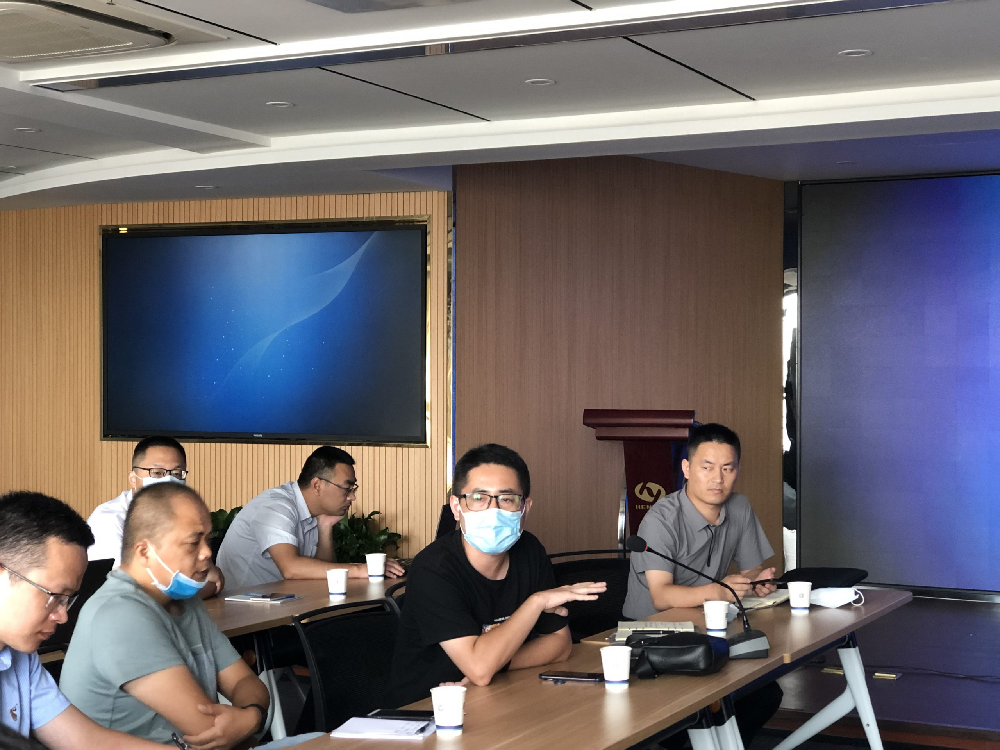
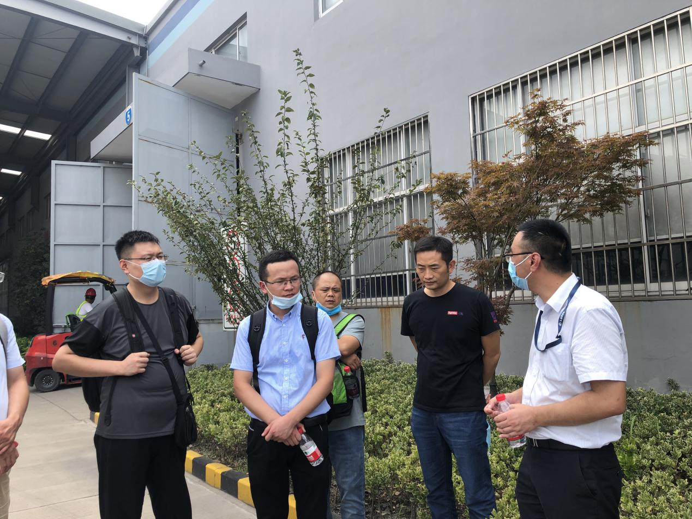
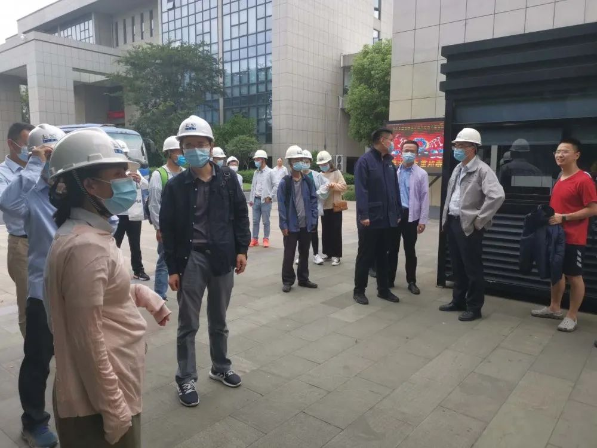
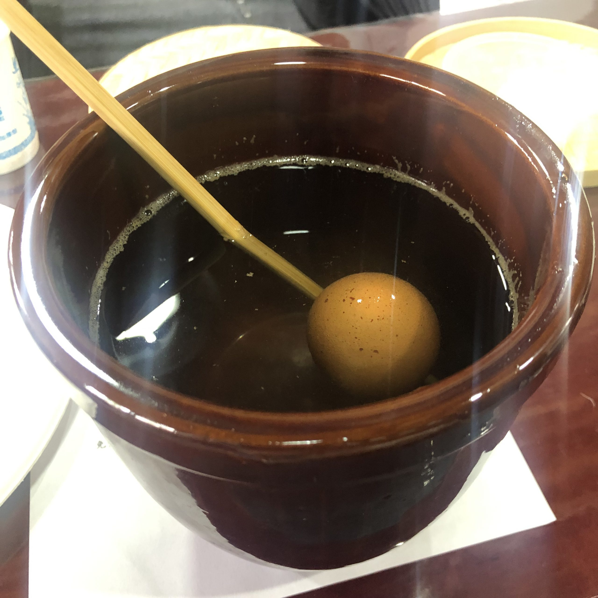
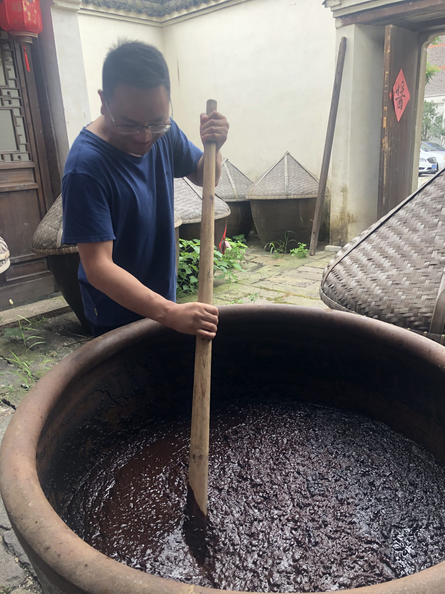

“想看云表是怎么深入实施的！”

“想一睹互联网数字化转型标杆企业的风采！”

“想去恒逸集团学习交流一下云表实践经验！”

FissionCUBE：好嘞！这就安排！

云表平台因其表格式开发的便利性，可以根据用户需求快速定制各类从简单到复杂的业务系统。该平台历时10年迭代打磨，架构设计臻于完美，经过500强客户的检验，比传统代码开发效率提升5倍，成本降低70%以上，业务人员也可以深度参与开发，是集团企业数字化转型的加速器和推进器。

8月7日，浙江、江苏各大知名企业的CIO们，携手走进浙江恒逸集团，展开了一天的游学研习活动。此次活动由恒逸集团主办，江苏CIO协会和杭州云表汇通科技有限公司协办。

浙江恒逸集团是中国最大的纺织原料供应商，历年雄踞浙江省综合百强企业榜单前十位，年产值近2000亿元，被誉为民营化纤领域的“石化巨头”。

活动中，恒逸集团信息与数据中心总经理蔡总分享了恒逸集团打造化纤行业工业互联网平台的整体规划以及未来数字化蓝图，恒逸集团MES高级顾问董老师分享了如何通过云表开发平台，打造从单体工厂的ERP系统，到集团管控体系，再到跨组织的工业互联网平台。

（恒逸集团信息与数据中心总经理 蔡萍）

在上线云表之前，恒逸集团在信息化发展的20多年间，陆续上线了50多套业务系统，这些系统错综复杂，系统之间接口繁多，有些系统因为年代久远，系统维护和系统迭代困难重重，同时维护成本太高。而随着企业的快速发展，业务的快速演进、企业处于数字化转型的重要阶段，以往的业务系统要么过于陈旧无法满足业务需求、要么维护成本高昂，无法为企业提供高效的作业环境，必须要有新的突破新的业务模式。因此，在2019年初，经过前期一系列的探索选型后，恒逸集团最终选定了云表开发平台。现如今，经过一年多的迭代打磨，恒逸集团形成了以客户为中心，以精益管理为目标，依托SAP、云表两大平台，不停地创新数字化业务，推进公司数字化转型发展，真正实现一张网络、一个体系，打通集团从采购、资金、仓储、生产、营销、物流等数字化的闭环，为进行集团标准化的管控和统筹打下基础。

（恒逸集团MES高级顾问 董天翔）

在活动中，恒逸集团MES高级顾问董天翔老师分享了工业互联网平台的建设经验。针对化纤行业特点，他介绍了如何根据标准模型统筹规划，如何寻找数字化转型的切入点，通过云表平台分步实施，与自动化设备集成，从而实现生产计划与跟踪、设备效率、库存和质量的管控。董老师着重指出：云表的开发速度之快，灵活性之高，功能之强大，全都超出了他的预期，高峰时期恒逸利用云表平均10天开发一套业务系统，3天完成项目上线实施，开创了前所未有的“恒逸速度”。

（云表项目总监 邱园）

董老师表示，接下来对恒逸的数字化转型升级，有更深入的规划。目前，恒逸正在尝试使用DataFocus打造数据中台驱动的运营和生产。随后，云表项目总监邱园为大家介绍了DataFocus——中国首个中文搜索式数据分析系统。作为数据分析的多面手，DataFocus被称之为下一代BI产品，智能分析机器人。DataFocus不仅拥有传统商业智能系统所具备的全部功能，更可以针对较高维度的大数据集展开分析，通过灵活的搜索分析功能，解决大多数高频的数据分析需求，搜索式分析大大地降低了数据分析的门槛，真正实现了自助式数据分析，极大地释放了数据库工程师的压力，使后者能有更多的精力放在加速企业信息化发展上。

（云表平台创始人 张军）

最后，与会成员积极地讨论交流，云表平台创始人张总在讨论中介绍了云表是如何在企业中进行开发实施，云表最佳实践场景以及DataFocus之于其它市场BI产品的核心优势。

如何制定数字化转型的总体策略？如何有效地推进数字化转型的脚步？如何找到合适切入点？与会企业在其数字化发展道路上都陷入了深度的思考，甚至难以做出抉择和完成数字化转型的实施。

对此，恒逸集团以自身经验做出了回复，一是在前期推行时，需要企业CIO们坚定信念和方向，领头人不坚定，团队其他人更不知道如何推进了；二是在前期选择场景切入时，需要找一个业务需求比较成熟或者需求相对较简单的项目来落地，这样当所有人都看到项目快速实现时，整个团队的信心增强了，团队积极性就可以调动起来了。恒逸集团在不断地探索过程中，规划了未来数字化发展的蓝图，并且通过云表PaaS平台的有效实践，为大家趟出了一条高速公路。

结束了上午的分享活动，7日下午，在恒逸项目经理胡炜帆的带领下，与会CIO们分别参观了恒逸集团的己内酰胺工厂与锦纶工厂，更加直观地了解到每个工厂信息化运转的过程，以及它们是如何统一到工业互联网平台，做到数据无缝对接与全局分析。

 

（恒逸项目经理胡炜帆带领与会企业参观工厂）

参观考察完工厂之后

你以为这次的研习游学就结束了？！

我们聊完了学习

接下来进入到

现代智能制造与千年手工传承的碰撞之旅

第一站：海宁南关厢历史文化街区

海宁南关厢历史文化街区，位于海宁市硖石镇区东南部，北起大瑶桥，南至塘桥、会源庵，东临洛塘河，西靠人民路。南北长350余米，东西宽50余米，占地总面积约1.7公顷。为目前硖石镇区仍保持江南明清时期街道风貌为特征，保存较为完整的，所剩为数不多的历史街区之一。

第二站：海宁裕丰酱园

俗话说，“调和酱为首，五味醋为先。”中国人制作酱的历史超过1000年，而在海宁最为出名的酱是出自一座有着百年历史的酱园——裕丰酱园。

“裕丰酱园”坐落于海宁长安大运河畔的杏花村里，始创于1836年，创办人是诗人徐志摩的祖父徐星匏。180 多年来，裕丰人恪守祖训，坚持以传统工艺专心酿造，坚持自然发酵，以获取自然的、鲜艳的色泽和鲜美的风味。酱园出产的手工酱油，黄豆酱，玫瑰米醋等远近闻名。

研习游学的学员们一起聆听酱的起源与酱文化。

体验酱的制作，从学习古人智慧自制制酱盐水，到翻江倒醋，迎面扑来十足的酱香味！

 

我真的是来打酱油的！

学习酱画，大显身手！

 

品正宗【江南酱宴】，酱画配美食，岂不妙哉！

现代智能制造学习与传统手工传承之旅！学员们表示被安排的明明白白，感觉自己比昨天更博学了！

没有参与本次游学的小伙伴有没有感到一丝丝的遗憾

没有关系！

提出你的需求！FissionCUBE立刻马上安排！

下一场研习游学之旅期待看到你的身影！
