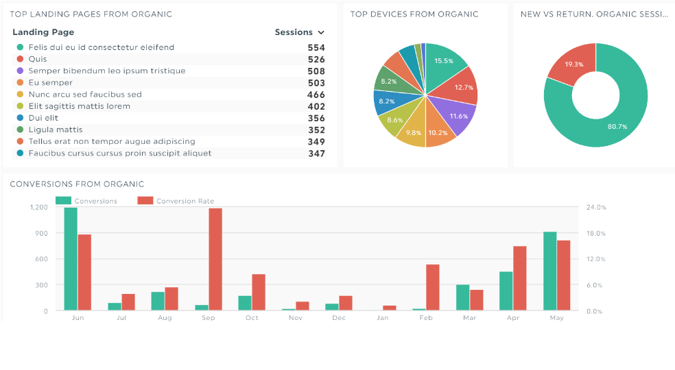
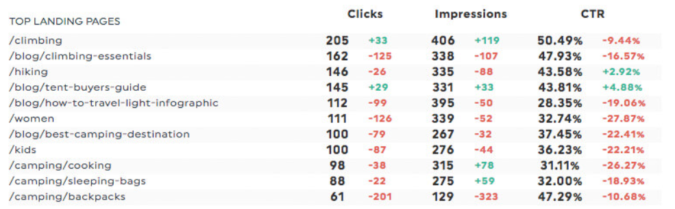

在搜索引擎界面输入目标关键词，我们发现，搜索结果页面的第一篇文章的平均点击了（CTR）为31.7%，吸引点击的可能性是第十位贴子的10倍。

这一发现证明了目标关键词排名靠前对吸引用户是十分关键的。

从自然关键词到搜索流量，在高质量的搜索引擎优化（SEO）报告中追踪和报告这些数据，都可以帮助目标用户快速引导到您的网站中。

通过搜索引擎优化报告，我们可以快速判断您的SEO工作是否有效。

## **什么是搜索引擎优化报告？**

SEO报告跟踪网站的SEO性能。

它会告诉您哪些SEO营销工作正在发挥作用（例如，识别自然搜索的特定关键字）并推荐增长机会。

一份出色的SEO报告包括概述、关键指标（通常以图形和图表的形式显示）以及有关下一步做什么的高级机会。

seo报告示例

## **SEO报告中应包含哪些内容**

承接上文，我们通过SEO报告中包含的概述、关键指标和机会，来检查SEO报告是否简洁、细分为清晰的部分并且具有视觉吸引力。以下是SEO报告三个部分的详细介绍：

### **1.概述**

将概述视为目录。一份出色的SEO报告概述清楚地解释了将要涵盖的内容。

DataFocus大屏概述参考

概述充当执行摘要。它通过总结要点帮助客户熟悉报告，当与SEO知识较少的客户合作，通过概述将帮助他们轻松浏览信息。

### **2.关键绩效指标**

这是SEO报告中“最丰富”的部分。

KPI展示了实现客户目标的效率。通过衡量这些以目标为中心的指标，可以知道优化是否正在取得进展（或者如果前进方向错误需要如何改进）。

主流的搜索引擎优化KPI包括自然流量、转化率、点击率、关键字排名和链接建设。

上图是经营内容营销的机构专注的多类型着陆页分析，可以借此确定哪些能产生最合格的自然流量。

需要注意的一点是，KPI指标中需要避免列出虚荣的SEO指标。例如，公司的主要目标是增加潜在客户和销售额，可以忽略流量。因为，在这种情况下，没有任何转化的高流量没有什么价值，无法转化为收入。

### **3.机会**

最后一部分，机会，解释交付结果，并为公司未来发展制定了接下来的步骤。

没有洞察力，数据就毫无意义。

如果不将SEO数据用于制定战略，那么SEO数据将不会对收入产生影响。

## **如何创建SEO报告？**

创建SEO报告有两种主要方法：电子表格或自动化。

### **电子表格SEO报告**

最基础的，可以使用Microsoft Excel或Google表格创建SEO报告。

使用电子表格创建的SEO报告增删数据比较便捷，同时可以灵活添加字段；但创建过程比较好费时间，每周都需要重复操作，将来自多个SEO工具的数据复制粘贴到电子表格中，会严重影响工作效率，其次，报告的对比度不够强烈，并不容易看。

### **自动搜索引擎优化报告**

第二种选择是借助像DataFocus等公式实现SEO报告工具，可以更加精简和搞笑的帮助用户了解报告并创建价值。

通过数据分析工具，可以大大减少SEO营销报告的制作时长，同时可以设置定时间报告以电子邮件或PDF的形式进行发送，持续监测数据变动。

 

\[电子表格报告与自动报告\]

比较这两个SEO报告。你更喜欢哪个？

通过SEO报告，我们可以了解到哪些特定的SEO活动正在发挥作用，可以持续进行SEO投资，对投资运营策略起到了引导作用，始终知道下一步该做什么。

通过DataFocus，您可以整合不同来源的所有SEO数据，然后合并得出分析结果，并用数据看板的形式进行呈现。

将数据从一个SEO平台抓取到另一个平台并将它们粘贴到杂乱的电子表格中的日子已经一去不复返了。

想了解更多关于SEO报告的信息吗？欢迎持续关注~
