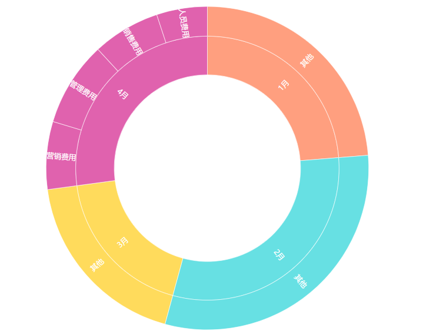
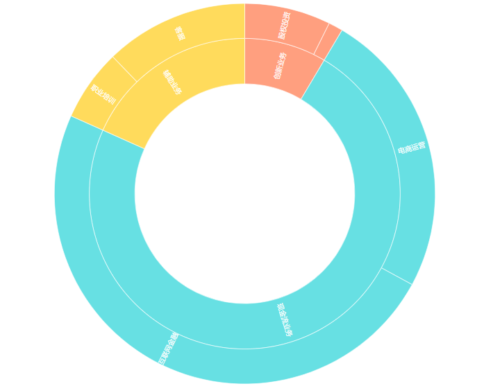
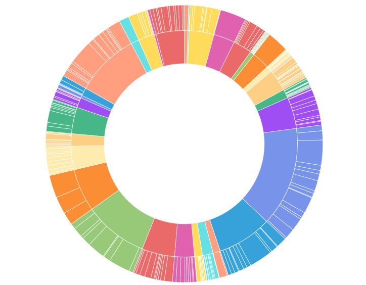

如果要计算公司各区域的销售比例、各业务利润比例等，大多数人下意识就会联想到饼图，来展示数据的占比关系。

但如果涉及到多层级的占比关系的时候，如果还继续使用饼图的话，就会直接忽略掉层级关系，反而无法清晰地展现数据了。

那这时候又该用什么样的图表呢？

相信数据分析大佬很快就能想到，旭日图。

### 什么是旭日图？

旭日图也叫做太阳图，是一种圆环镶接的图形。它每个级别的数据都会用圆环表示，离原点越近则代表级别越高。

最内层圆环级别最高，越往外级别越低，且分类越细。

### 旭日图的作用

旭日图不仅可以承载海量数据，还能展现数据复杂的层级关系。

通过梳理层级关系，旭日图就可以把数据清晰地展现出来。

此外，旭日图**完全不需要处理数据源中的数据**，直接拿来用就可以了。

就比如很多企业的ERP系统中的数据，都是一维表，可以直接用。

有时候会出现一些异常数据，比如含有空值的数据表，合并同类项后的数据表，也都不用进行处理，可直接制作成旭日图。

### 旭日图实际应用

这里放一些旭日图的实际案例以供参考，让你更直观地感受到旭日图的作用。

**公司每月费用支出**

公司 2022 年 1 月至 4 月的费用支出，可以看到这几个月的支出占比。

如果想要重点分析 4 月份的各项目支出占比，就可以制作旭日图分析了。

**公司各业务盈利分析**

根据公司不同业务情况，可以对其盈利分析。

**各地区销售额分析**

各个城市及地区的销售额情况，旭日图也会比较适用。

旭日图虽然有非常多值得夸赞的优点，但还是有些缺点的，尤其在某些情况下可不要盲目使用哦。

### **旭日图使用局限**

旭日图的局限主要体现在以下 3 点：

1.**没有层级关系或是明显的层级关系**，不太适用旭日图。

2.**时间属性的数据**，不太使用旭日图。

3.**数据标签显示有限**，尤其是最内层的占比数据往往很难显示出来。

那么我们在实际的使用时，可以根据自己的需要来选择合适的图表哦~

这里再推荐一款数据可视化工具，DataFocus，文中出现的图表都是用这款工具制作的。

通过搜索关键词即可完成数据分析，旭日图、桑基图等高级图表也是一键制作，非常轻松。

### 总结

别总用饼图来分析数据了，试试旭日图吧~

那么，你一般会在什么情况下使用旭日图呢？欢迎评论区评论、分享~
