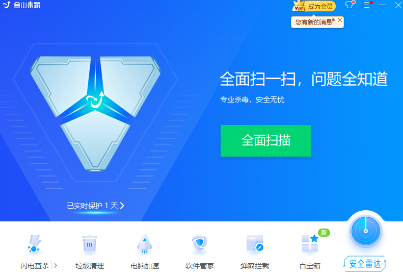
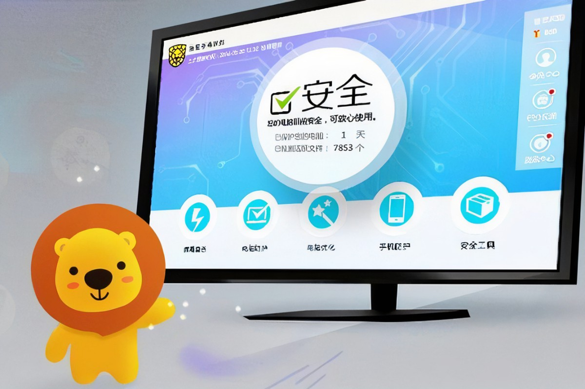
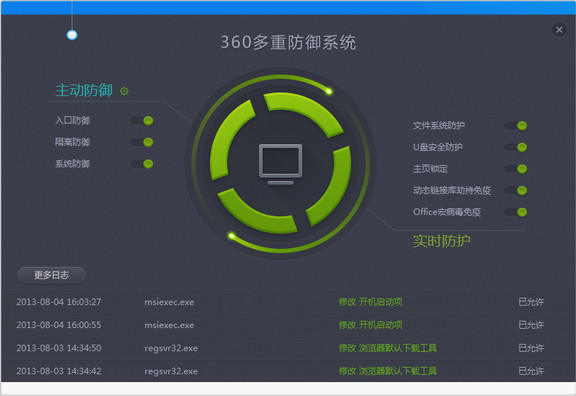

要在过去，说起国产实用的杀毒软件，金山毒霸必定首当其冲。不论产品技术水平还是团队水平，那都是顶尖的。可就在短短几年后，金山毒霸就淡出了市场，市场份额也逐渐被别的杀毒软件抢占，越来越多的用户也逐渐抛弃金山。曾经的成王如今的败寇，这中间发生了什么？

**国产杀毒软件的巅峰时期**

21世纪初的国产杀毒软件可谓三分天下，金山、江民、瑞星各占一方市场。而国外的杀毒软件有点名气的，只有卡巴斯基、麦咖啡等厂商，在国内市场仅占极少量份额。大多数互联网用户基本上也只认可国内的杀毒软件。

那时网络安全市场有多香？市场份额第一的瑞星软件月销量就有10万套，年入就有7个亿。这还是20年前呢，光卖软件就能卖出这么多利润。而金山和这样的企业做竞争对手，压力也挺大的。

提起金山就不得不提这位传奇人物——雷军，他1991年毕业于武汉大学计算机系，92年就加入金山软件公司，凭借计算机编程天赋和商业才能，8年后成为了金山软件的总裁。

看中网络安全这片蓝海后，他就开始蓄势抢占市场了。先是推出免费测试，后又将原本199的价格更是降到了50，宣称让人人都买得起高品质杀毒软件。不到三年，金山就迅速打败江民，成为市场占有率第二。

曾经的金山可谓是一度辉煌，可后来又是如何没落的呢？

**曾经的巅峰如何走向没落**

就在后来的某一天，一个陌生的名字周鸿祎出现在大家视线里，他带着一款免费版国产杀毒软件360惊艳了整个市场。免费怎么盈利？当时很多人都不看好360，认为不过是昙花一现。而正当大多数人都等着360垮台时，360却在短短时间内积累了3亿的用户量。

无奈之下，金山、瑞星都相继宣布推出免费版。没办法，再不免费用户就要跟着360走了。可是免费了，营收又成了难题。根据当时金山财报显示，宣布免费前的金山年入有2个亿，一旦宣布免费则意味着这2个亿将化为泡沫。

怎么解决营收问题呢？金山采用的办法是用浏览器+网址大全，期望通过广告实现流量变现。但就是方式有点粗暴了，强制用户捆绑安装软件、锁定主页，而且打开软件还会弹出很多广告弹窗。

虽说软件也要盈利，但如果过分影响到用户体验，那自然就成了用户眼中的“流氓”软件，从而被用户抛弃。

除此之外，360的病毒查杀技术也是一大突破，扫描速度不仅比其它软件快10倍以上，而且用户还不用频繁更新病毒库。360把病毒库放在云端，用户只需把电脑文件传到云端的病毒库匹配分析即可。

金山毒霸相比其它杀毒软件，反倒优势显现不出来，于是便渐渐走向了没落。

毕竟产品好用又耐用才是王道。

而如今，和360同为云端的国产BI软件DataFocus也是混的风生水起，推出的无代码搜索式分析受人追捧。

**无代码搜索式分析崛起**

90年代随着互联网数据量的爆炸，世界上出现了四架叱咤风云的马车，分别是BO、BIEE、Cognos、MicroStrategy，统领了全球BI数据分析工具。

正所谓一代没落一代起，像传统的Excel和报表系统，由于操作繁琐、容易卡顿、无法处理大数据，也已无法满足进一步的需求，而具备强大的数据管理能力和数据展现能力的企业级BI工具开始崛起了。现如今传统的数据分析工具逐渐又被更便捷、更轻巧、更美观的BI工具所取代，像新生代无代码搜索式分析云BI工具DataFocus展露头角。

现在，用户不用学习SQL、Python等代码知识，通过像谷歌一样搜索就可以完成数据分析。而且这个过程将在云端中实现，这意味着用户不用安装本地软件，也丝毫不占系统内存，一键登录即可随时随地数据分析。

如今DataFocus已成为国内知名5G供应商，也正被万向集团、恒逸等众多知名企业选择。

另外软件还推出个人免费版，让更多的个人和中小企业都能享受到数据分析的乐趣。

**小结**

不论是谁没落又是谁崛起，这一代代技术的革新最终受益的都是用户。

相信国产软件能持续帮助到用户解放生产和劳动，也会越来越好。对此，你怎么看？欢迎评论区评论。
