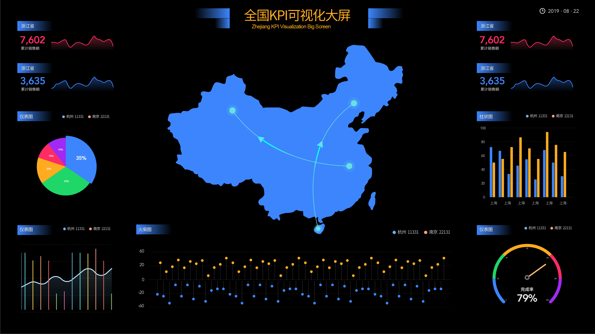

在这个大数据时代，粉丝作为很多企业商号或自媒体营销号的潜在客户，在口碑传播和购买转化等方面发挥着重要作用。也有很多自媒体人或是企业商号负责人使用一些轻量级BI工具，比如DataFocus Mini等，用来做自家粉丝的数据分析，以更好的扩大粉丝量和转化率。我们以前说过，工具再强大，也需要分析和实施思路的引导。而根据我们和各大擅长做数据分析的媒体人交流后，给出以下数据分析后的实施建议。

我们以自媒体为例。要知道，有了粉丝基础后，就需要打造值得分享扩散的内容。我们以前说到过促使人们转发扩散的内容类型，在数据分析后洞察了粉丝的喜好外，内容的独家、新奇、深度、全面也是不可动摇的原则。

另外需要保证自己的帐号一直处于粉丝用户的关系链数据内，传统媒体的“内容为王”“数据为上”在现在仍然适用。加入营销元素的自媒体，自然得考虑其成本。而不同类型的平台，通过数据分析后，优质内容的创造成本也是不一样的，数据上的直接体现为：内容创造的参与人数。比如：在微博中，我们所见多是一个小团队操作数十上百的帐号，而微信或视频平台则一般都是一个帐号由一个小团队打理。这是由内容的创意难度所决定的。

根据DataFocus合作的某网红自媒体数据显示，轻松的冷笑话等帐号崛起在微博中，而各类有用、专业的公众帐号则进入了微信公众平台，精彩的视频则大多根植于专业的视频网站，比起段子、吐槽等轻娱乐类，专业有用的精彩内容往往难度更高，而这些又都在视频制作下甘拜下风。许多人能够写一篇好文章，但不一定能拍出一段轻松幽默的小视频。自媒体人可根据自身可承受成本选择一个或多个平台。而除了主动自发地去构建粉丝关系链，自媒体也可以通过大帐号、大节点或两者相结合推荐的方式，引爆粉丝累计速度，但以此种形式积累（特别是大帐号，其本身与其大多粉丝间建立的就是弱关系）的粉丝势必缺乏信任，当营销盛行时，过多的广告信息，如影随形的过载压力则会令这一部分粉丝果断启动清理机制，驱除该自媒体帐号。所以这种类似于请明星代言的行为适合于自媒体帐号创建之初打下粉丝基础，然后在后期的运营中维护，增进信任与黏性。

我们以前讲到过关系链，有了稳固的粉丝关系链，自媒体营销才有其可行之道。粉丝关系链的稳固需要多久？这就取决于帐号的运营情况（帐号信用度等）。而在粉丝关系链稳固后，可以将粉丝可能会产生的一些主流动作，如评论、赞、收藏等与分享相结合。这些数据都可以归纳到自媒体数据库，以分析出最受欢迎的内容和活跃度最高的粉丝群体。依据以上数据分析结果，可以引导粉丝去分享，也可以让粉丝变相加参与到该自媒体帐号的运营中，如咪蒙的公号会经常向粉丝发起素材收集，这会让粉丝将情感投入进来，自发主动地去分享维护该帐号，使帐号拥有持续的生命力。
