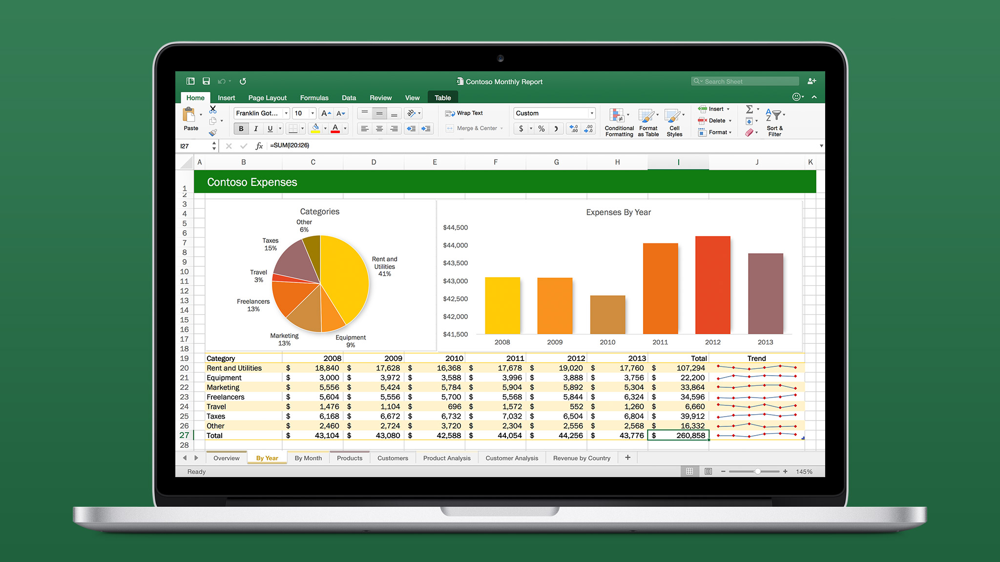
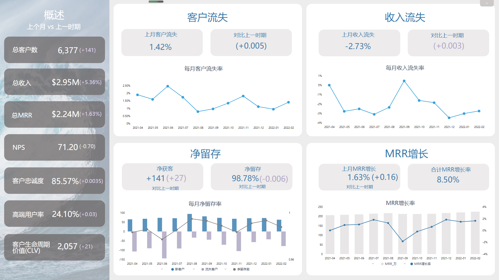
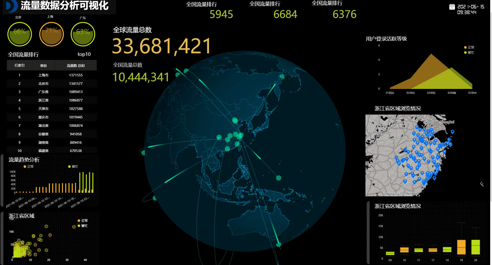
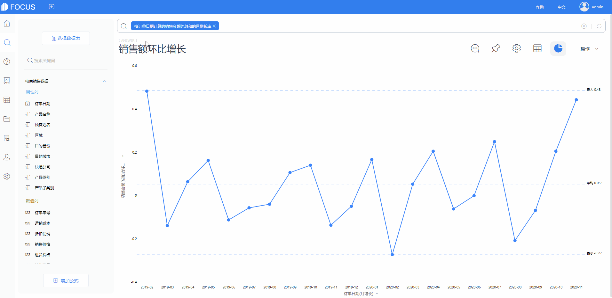

总有搞数据的朋友吐槽，明明身为数据分析师，却感觉啥也没分析出来，只是没日没夜地做报表，做完一个又一个。这几个月下来，他都已经做了500多份报表了。

做图做表倒不算什么难的，无非就是调调字体、颜色、表格等格式，再好好排排版，让整体看上去美观一点，可总也挡不住数量那么多的图表啊。结果就是一个接着一个图表做下去，疲惫的工作永无止境。

这时候就会有人不禁发问了，**明明自己已经很努力了，可为什么总感觉没什么工作成果？**

我想再问一句，**作为数据分析师，如果你光在弄数据，那分析哪去了？**

大多数人做报表只是在整合数据，并没有去思考统计整理这些数据的意义是什么，要达成什么样的目标，结果反馈又是如何。

不过，如果因为这一点去指责这类人群确实有点冤，因为说白了，他们只是**没时间**！时间都花在处理数据、整合数据上，那怎么会有时间去分析数据得出结论呢？

相信他们还是懂得这个非常简单的道理，**懂数据的本质是懂业务**。不是不想懂业务，而是真的没时间懂业务。

很多人做传统报表常常就需要用到“办公劳模”Excel，再使用其中数据透视表、函数、公式等功能制作而成。但数据稍微一多就卡顿，而且里面更高阶复杂的操作得学好久才会，不是精通Excel的高手根本就做不出来。

于是反反复复就把时间精力都放在这些小事上面了。

为何宁愿让时间和精力都白白耗费，也不换一款更简单易上手的工具呢？

说真的，可能你辛辛苦苦花几天的时间敲代码做报表，都比不上别人用几个小时就能做好的可视化大屏。

### 以下模板作为示例

     

不仅整体清晰美观，而且还能凸显业务重点。有重点关注的部分轻点一下，大屏自动联动。

用这款**无代码搜索式BI工具DataFocus**制作简易版大屏最快5分钟搞定，如果不想自己制作，那直接套用模板，替换里面的数据使用就可以了。

无代码，无繁琐的操作，像谷歌搜索关键词一样数据分析，系统几秒内就会识别人类自然语言，并以可视化图表应答。完全是傻瓜式操作，简单又便捷。

为了减轻你的工作负担，我特意整理了30份可视化模板，你要做的只需要替换一下数据即可制作成同款大屏。

以下是模板目录，需要的话下方**评论区评论”模板“**来获取哦~

立刻点赞、收藏、评论吧~
