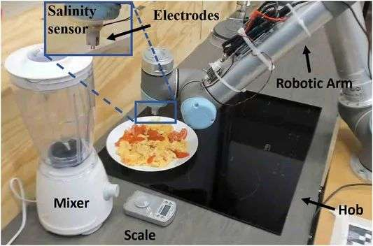
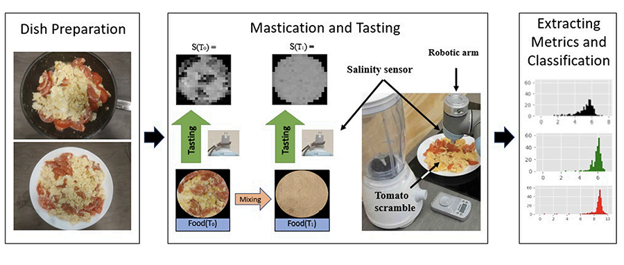
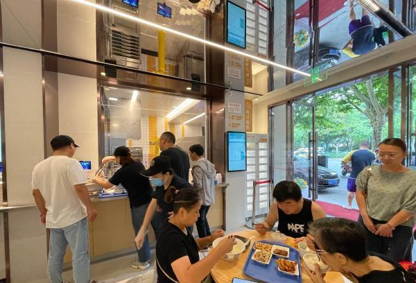
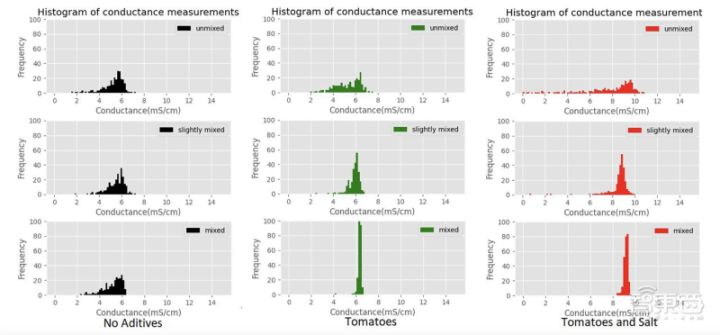

或许，人类终有一天会被人工智能取代。

你看现在的机器人都已经“卷”到厨师圈了。

近日，英国剑桥大学研究人员正试图训练一个厨师机器人不断“咀嚼”并品尝食物，以此来模仿厨师的烹饪过程。

虽然这件事听起来有点扯，但实验做的还真像那么回事。研究人员准备了一个装有基于电导的味觉传感器的UR5机械臂的实验装置，通过混合食物模拟咀嚼、电流传导复现盐的味道，这就成了机器人品尝食物“味道”的过程。

“我们希望机器人能够理解味道的概念，这将使它们成为更好的厨师。”剑桥大学工程系Grzegorz Sochacki这样解释道。

经过训练的机器人“厨师”可以在咀嚼过程的不同阶段品尝食物盐度，并将盐度信息生成数据发送给计算机，然后就可以生成可视化的味道数据图像。就像这样...

1. **机器模拟人类烹饪不在少数**

其实现在市面上就已经出现了机器人烹饪这样的现象，并不在少数。

北京冬奥会、冬残奥会主媒体中心的智慧餐厅的中餐和西餐烹饪、调制鸡尾酒工序都是由机器人完成。用餐者只需在餐桌上扫二维码点单后，菜品会通过餐厅顶部的云轨系统运送到餐桌上方，悬停在人们面前，供其取用。

最关键的是，这样的餐厅机器人烹饪水平并不亚于优秀厨师。要知道中餐烹饪过程比较复杂，煎、炒、烹、炸、煮......锅具选择和火候控制都是比较精细的工作，而锅具运动又分为晃、颠、划、翻、推、拉等，这无疑给机器人又增加了不同程度的难度。

同样在上海的一家机器人餐厅也能看到机器“厨师”大展身手的影子。

这家餐厅后厨全是机器人，看不到一个真人厨师。店里也没有服务员，顾客拿去菜品，放在自助结账机器上，机器人会自动识别出顾客所买的菜品，之后顾客扫码结账即可。

机器人炒菜这个概念确实不算什么新鲜事了，可像这样能品尝菜品的机器人还真是头一个。

机器人厨师和人类厨师在烹饪过程中最大的区别就是，人类厨师可以在烹饪中“边尝边做”，尤其是咀嚼食物时，可以品尝到味道和质地的变化，从而可以及时调整菜品烹饪方式。

而现在机器人也可以实现边品尝边烹饪的方式，那么机器人可以快速准确地评估菜肴咸味能力。

1. **9份菜各品尝3次，再将味道可视化**

人类通过多次咀嚼，一方面减小食物颗粒大小，一方面为消化酶提供更多表面积进而加快酶的催化反应，不断感受味觉、触觉来确认食物更多的信息，

研究人员为了模拟这个过程，准备了9种盐度和西红柿含量不等的番茄炒蛋，随后机器人使用探针来“品尝”菜肴，并在几秒钟内返回读数。

而读数作为味道的数据信息来生成可视化图像。由于无法控制每道菜是完全一致，实验中会让机器人品尝三次，以提高实验的可重复性。

1. **继机器“厨师”后，企业商业智能逐步“出圈”**

不用总觉得机器“厨师”是一件多么高大上的发明，就只觉得它和科研人员有关系。恰恰相反，像这样的人工智能类产品早已在企业中普及，企业商业智能在逐步“出圈”。

和机器“厨师”一样，只不过商业智能BI软件品尝的是数据，并将数据以可视化的形式呈现，最终制作完成一道数据之菜。

国内就有这样的一款黑科技产品，**人类只需要像搜索谷歌一样输入关键词，机器就会自动识别人类语言，并以数据可视化的形式回答人类**。

完全就是一种所见即所得的方式，不需要懂什么代码，也不需要什么复杂的操作。

这是一种几乎**所有职场人员都能接受的交互形式**。

**4.非专业人员，也能快速上手数据分析**

这种真正意义上解放人类的无代码搜索式BI平台的崛起，完全可以让我们这样普通业务人员和管理人员0门槛快速上手数据分析。

除此以外，这款叫做DataFocus的神器还提供数据仓库、多端协作、可视化大屏等多种服务，也非常适合企业内部人员团队协作。

当然，和目前国内其它BI平台相比来看，它最大的优势还是在于敏捷而简单。只不过缺乏宣传，还有很多人不知道。

就算是这样，也已经无法组织企业商业智能逐步“出圈”的步伐了。未来也必将是无代码搜索式分析这种人性化的时代！

最后，感谢您的阅读。有什么想说的，欢迎转发和评论。

关注我，更多精彩在主页和评论区哦~
