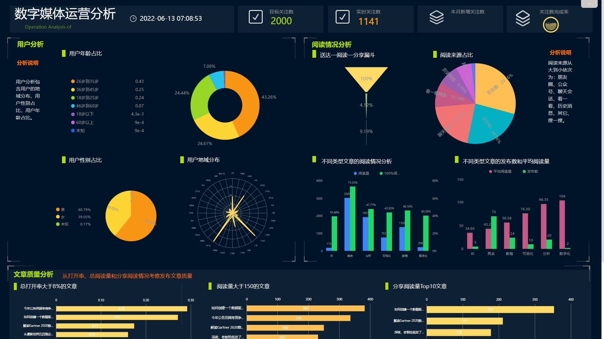

很多职场小白刚入职场大多时候都对自己的工作认知不太清晰，往往在几年后才明白工作应该怎么干。更多的人往往一开始一腔热血就难以持续下去，从而逐渐走向平庸。

今天和大家聊聊职场小白成为职场精英，该做好哪些方面，才能快速建立起自己的核心竞争力。

### 1.敬业精神：尽力做好每一件事

很多时候职场小白没有清晰的工作目标，会存在侥幸意识，做事态度还比较欠缺。但实际上，工作态度很大程度上决定了工作成果。所以对于新人而言，工作的敬业精神是不可或缺的。

有良好的工作态度才能塑造能让人信赖的形象，获得同事、上级的信任。

### 2.团队意识：不是一个人在战斗

企业内部便是组织，这意味着需要团队成员的配合共同达成目标。职场小白往往只会考虑到个人工作，而忽视团队工作。然而我行我素，不被团队接纳，终究会被淘汰。

将个人目标与团队目标统一后，你会发现职场中做事会变得很顺利。

### 3.分析能力：发现问题并解决问题

并不是只有数据专业人士才能完成数据分析，非数据从业者也需要拥有数据分析能力。例如产品运营，需要分析产品以及用户相关数据，结合用户需求不断迭代产品。

而这是职场新人非常缺乏的，甚至有人对此毫无概念，对业务也没有什么清晰的认识。那这样的人只会逐渐被时代所淘汰。

如今越来越多的工作都需要数据支持来完成决策，数据驱动业务的工作将会越来越多，数据分析技能也将成为未来人才应该具备的基本能力。

现在市面上也有非常多数据分析可视化工具，都不需要学习代码知识就能数据分析。像这款搜索式云BI工具**DataFocus**，**像谷歌一样搜索关键词，系统就会立即以可视化图表回答。**它就非常适合职场小白使用，学习成本低，轻松上手，培养分析能力不在话下。

有了对数据的基本认识，自身对于业务的理解才会逐渐深刻，工作起来才会更得心应手。

### 4.思考能力：敢于提出合理建议

很多职场小白没有明白的是，工作的本质就是为企业解决问题。你应该非常清楚你的工作在整个团队工作中占据哪一环，最终是要达成什么工作效果。为了达成这一效果，你遇到了什么问题，又付出了哪些行动，如果没有达成效果，那原因又是什么，以及你该怎么做。

新人一定要对自己的工作多加思考，为更好地工作而提出合理的建议。不用担心出丑，思考会逐渐沉淀下来，随着时间的推移，工作将会越来越熟练，获得工作成果也会越来越顺利。

### 5.汇报能力：传递自身价值获取更多信息

沟通能力往往是职场新人非常缺乏的能力，它不仅可以帮助你传递出自身的价值，还可以从领、同事那获取到更多工作上的信息。

而提升沟通能力的最好方式，就是工作汇报。注意一定要有理有据，最好有数据支撑观点，同时又能言简意赅。

很多朋友都在用PPT汇报工作，但这种方式费时费力，尤其是修改起来特别麻烦。相比几十页甚至上百页的PPT啰嗦繁琐的内容，更高效更实用的方式其实是一张数据可视化大屏。

直接在一张大屏上，按照讲述主题的不同模块，结合数据再以文字描述辅助来讲述，领导、同事看了一目了然，互相沟通起来也更清晰。而且相比PPT，大屏颜值也加分了不少。

还有各种不同主题的可视化大屏模板在这款**搜索式分析BI平台DataFocus**上，可以私信“模板”便可下载使用。

### **小结**

做到这五件事的职场新人是少之又少，如果你都具备了这些素质，相信未来职场的你必定有机会大展拳脚，发展潜力也是巨大。对此，你怎么看呢？欢迎评论区评论、分享。
