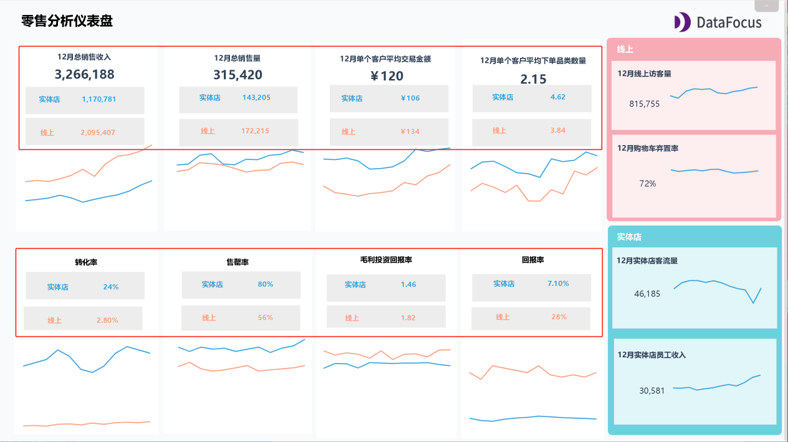
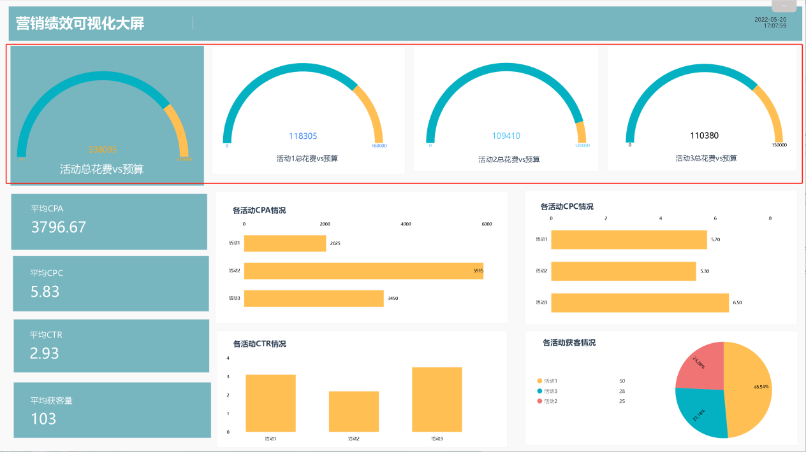
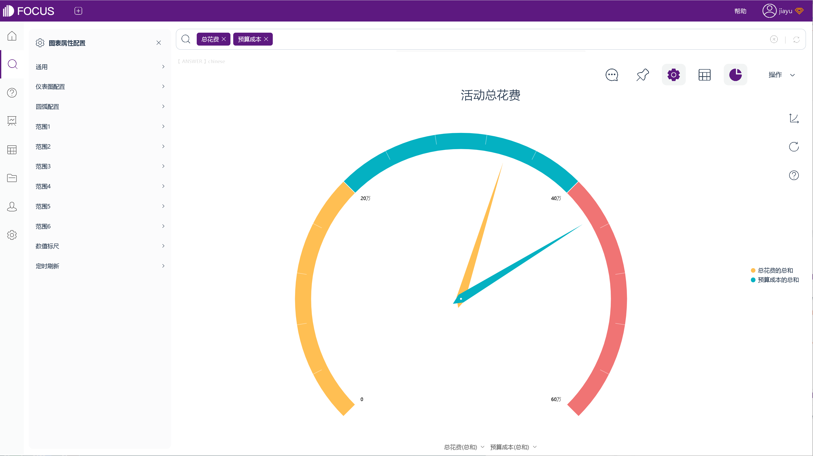
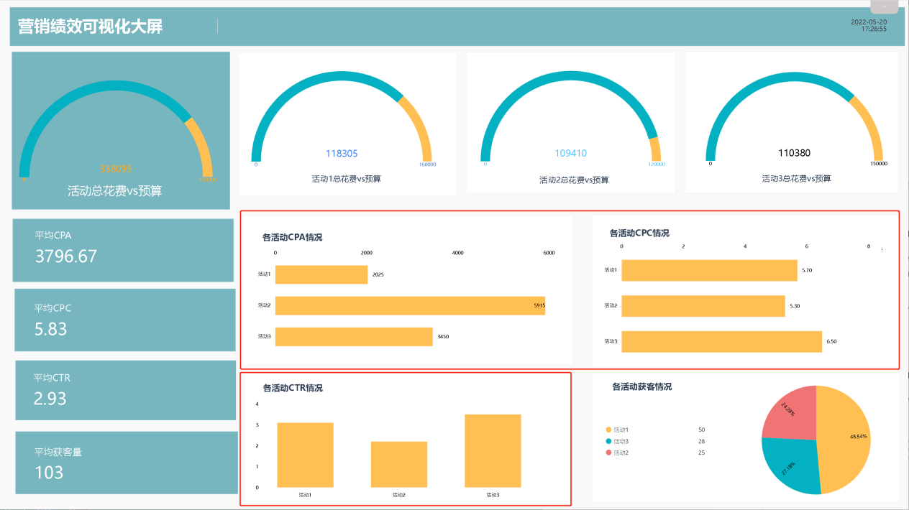

关键绩效指标 (KPI) 是一种很重要的、可量化的绩效衡量标准，通常用于查看目标进展。在现代企业管理中，关键绩效指标（KPI）管理已经受到普遍重视。

KPI可用于衡量不同战略级别的绩效。例如，一家公司可能会选择一组KPI来衡量其整体业务绩效，然后使用另一组KPI来衡量公司不同职能部门的绩效，如销售、营销、财务、人力资源和运营。除此之外，还可以使用KPI来衡量个人、项目、活动、流程甚至机器的绩效。

那么，KPI和指标之间有什么区别？

指标是衡量目标的参数。衡量一个东西是否达到预期，都会使用一个指标，无论是月收入、销售转化率、客户数量还是客户的平均年龄。

KPI是一种指标，但它是一种特别并且重要的指标，能够用来衡量绩效。

例如，客户的平均年龄可能是重要信息，但它不能衡量绩效，因此它不是 KPI

而销售转化率是一个指标，能够衡量绩效，并且很重要，可以将其称为 KPI。

但是，对于人力资源团队，销售转化率就不太可能成为 KPI。

因此，KPI 与指标不同，它具有一定程度的主观性。它们由被使用的环境以及使用它们的人员或公司决定。这就是为什么你可能会看到一些公司使用与其他企业完全不同的 KPI。这并不意味着某一方是错的，而另一个是对的。可能只是因为它们在不同的环境中被使用，具有不同的优先级。

一个好用的、区分指标与KPI的方法是，指标代表所有可能的度量选项。但 KPI 是你选择重点关注的绩效衡量指标，用以推动业务。

因此，在你的日常工作期间，可能会使用数百个指标。但是，如果你以正确的方式制定了 KPI，对于任何流程，都只需要使用少量、可管理的 KPI。

根据你的业务、团队或职能，有无限数量的 KPI可供选择。因此，选择正确的 KPI 可能是一项艰巨的任务。

但是，确定KPI后，如何才能快速统计KPI，并将KPI可视化呢？

我们可以使用可视化BI工具DataFocus来方便、直观地实现KPI可视化。

1、数字、文本形式

用DataFocus的KPI指标图、数字翻牌器，将KPI以纯数字或“数字+文本”的形式展现，简单直观，适用于展示核心指标，比如总销售收入、总销售量、转化率、售罄率等。

2、完成度、仪表图、子弹图

当需要对比计划与实际值，查看指标数值的进度时，可以使用完成度、仪表图或子弹图等来展现

 

3、条形图、柱状图

使用条形图、柱状图，能明显地展现对比

4、折线图

使用折线图，进行对比的同时，查看整体趋势

除此之外，DataFocus中还有很多图表可用于KPI的动态展示，系统简单易学，能够快速实现KPI可视化，协助我们更好地衡量绩效。
