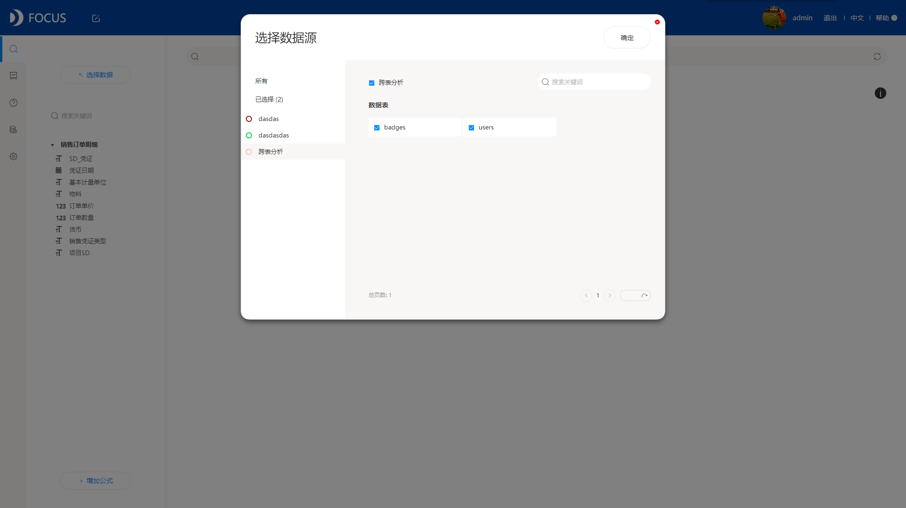

说到数据分析，自然就离不开数据分析工具。数据分析工具有很多其中，Excel也是最日常的一种，尤其是刚入门时，Excel的基础技能都是大家必会的了。但是笔者最近新接触了一款工具——DataFocus，瞬间弃用了用Excel做数据透视表，各种写公式。一般工具用的好需要专业的数据分析师，但DataFocus能让普通的业务人员也轻松上手。

Excel作为一直是使用最广泛的数据表格工具，在数据量日渐庞大的今天，开始出现它的短板。Excel数据清洗和计算效率低下，需要进行大量重复性、低附加值的人工操作，数据分析周期长；Excel几万条数据就会把一般性能的电脑弄卡；Excel入门容易，精通困难，尤其是做专业的数据分析，还能自动筛选，联动可视化势必要写大量的VBA。那么有没有一款可以在业务上代替EXCEL的产品呢？有，这就是今天想给大家推荐的DataFocus。

1 适用于企业级数据分析

Excel更多是个人办公数据处理工具。做企业级的商业数据分析，通常数据来自不同的业务系统，需要数据工程师整合到数据仓库或者介入大数据平台，然后清洗、在输出到数据层工前端的数据分析。整个过程涉及到业务部分——业务数据库——数据仓库——数据/BI部门——业务部门。而DataFocus可以连接企业数据库、数据清洗、整合数据，利用细致的权限分发数据和图表看板，多人合作形成可视化报告。

2、自然语言搜索，无代码无拖拽

我们使用excel做数据计算的时候，往往需要用户进行大量复杂繁琐的的平面单元格公式计算，而用DataFocus进行数据分析时，我们直接在搜索页面输入想要分析的内容，通过AI人机对话，系统自动分析出可视化图，图表也是根据分析情况自动给推荐的。

3、可视化大屏

Excel的可视化表现力有些弱，图表类型也不是很丰富。DataFocus除了提供无丰富多变的图表以外，数据看板还可供用户进行灵活地数据图表布局分析，轻松构建出你的数据图表思维逻辑，让你拥有独到的洞察性数据见解，进而达到有效沟通或者数据汇报的目的。

DataFocus制作出来的可视化大屏，数据之间可进行任意联动、钻取等分析操作。重点突出，逻辑清晰，具有深度见解和洞察力，可读性极高！

最后，关于DataFocus，多说无用，亲自下载体验才能感受更多，官网有免费试用申请，可以去体验一番，必有惊喜！
