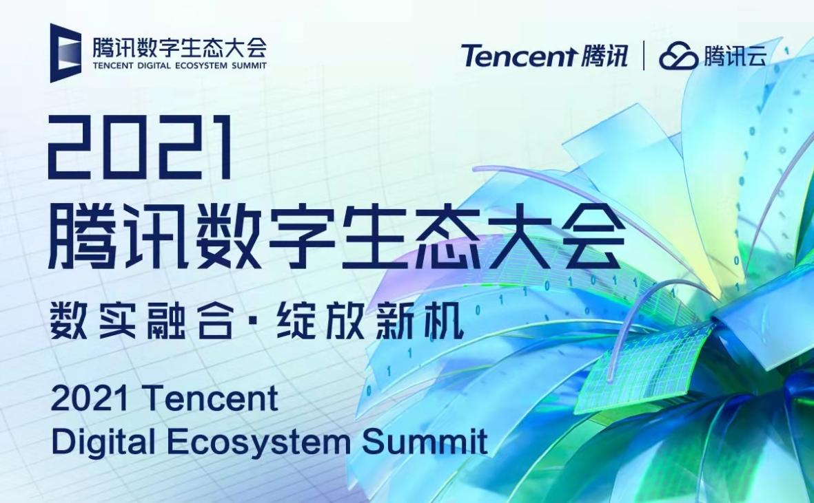
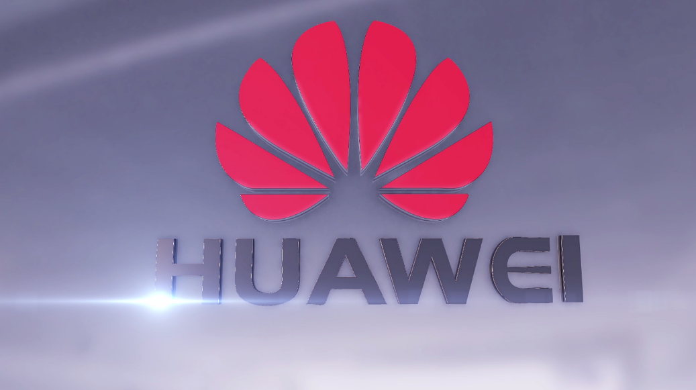
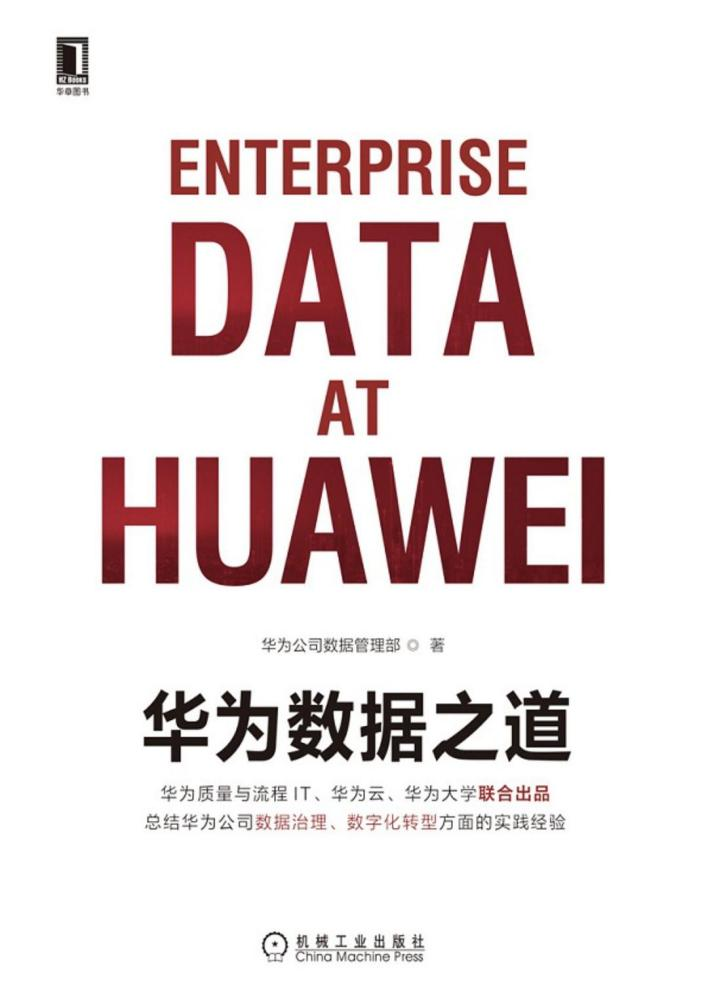

科技领域的企业竞争有多激烈，一看排名就知道了。

近期，福布斯公布了2022年《全球最大科技公司榜单》，它将从销售额、净收入、资产和市值四个指标综合评估全球各大科技向公司。

苹果又一次夺冠，以2.6万亿美元的市值高居第一，据了解，这已经是苹果连续七年成为科技行业龙头了。而全球最大Top20科技公司中唯一的中国公司，腾讯位居第五。（台积电属外资控股企业）

这让人不禁好奇，腾讯是怎么做到的？华为也算是实力雄厚的高新科技企业，为何榜单中没有看到？

实际上，腾讯一直长期稳居在第五的位置。对比了一下去年的福布斯全球科技企业榜单，前五分别是苹果、三星、Alphabet、微软、腾讯。尽管今年中国科技行业遭遇惨烈抛售，但腾讯还是一如既往地稳。

大多数人对于腾讯的了解，还是在社交和通信服务方面，比如家喻户晓的QQ、微信。但其实，除了社交方面的业务，腾讯还涉及金融、数字娱乐、工具等业务。

此外，近年来腾讯还是有挺多并非广为人知的突破性科技进展。

早在2021年腾讯数字生态大会上，腾讯就公开了100多种技术前沿成果，并将都会在不同领域中应用。**实时音视频技术、云原生技术、TDSQL技术、低代码工具**等其实都已经广泛应用在各行业领域。

而华为作为同样拥有高新技术的企业，为何不在榜单中呢？

原因是福布斯在综合评估全球各大科技公司时，其中有一个评估指标是市值，说白了，能上榜的必备条件是上市公司，有市值才可以评估。而华为目前仍未上市，自然不在榜单中。

华为的科技实力自不用说，除了基于linux内核全新研发的鸿蒙系统、获得专利的5G技术、自主研发的5G基带、华为手机的灵魂麒麟芯片外，还是**国内企业数字化转型的标杆**。

近期华为甚至推出了书籍《华为数据之道》，首次对外系统披露其数据治理与数字化转型的方法论。

和华为一样专注于打造核心技术的创新型企业**Data Focus**，近年来也与华为展开合作，助力华为实现数字化转型。

就像华为区别于其它手机的独特，DataFocus相比大多数拖拽式BI平台，这款**通过搜索实现数据分析**的BI平台DataFocus就显得有些另类了。

它是由一群热衷于技术的极客倾情7年打造，其功能涵盖了一体式湖仓、ELT、下一代智能搜索式 BI 系统，数据链接器和转换器，提供全功能的一站式数据分析服务。同时还掌握数据仓库、内存计算引擎、机器学习引擎、智能分析引擎、分布式集群、语义解析引擎等等核心技术，成为目前搜索式BI平台的领导者。

高新技术终究造福人类。相信华为背后有像DataFocus这样的企业做技术支持下，会带领整个中国科技登上更高的台阶。

当然，华为不需要急着考虑通过福布斯发布的榜单来证明国产企业的强大，而是把精力专注到技术突破上，走好当下的每一步，未来自然可期。

对此，你有什么看法呢？欢迎评论区留言。
