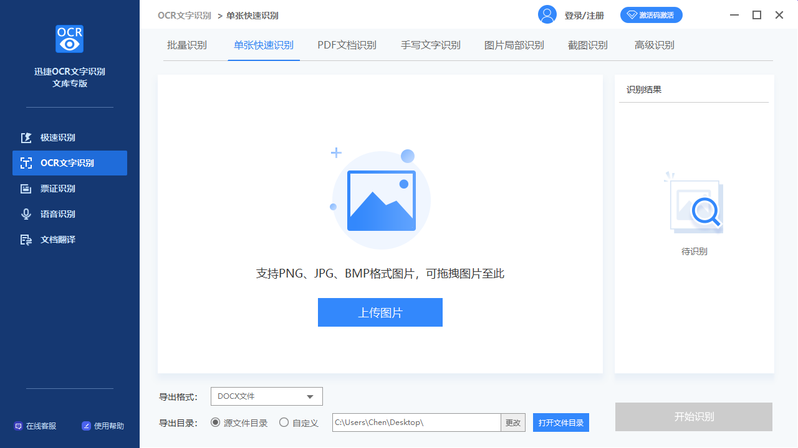
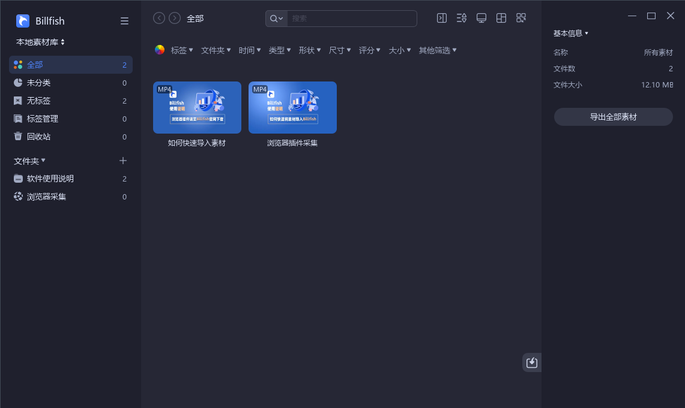
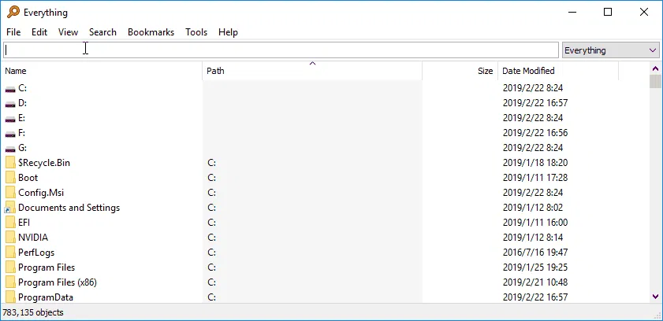
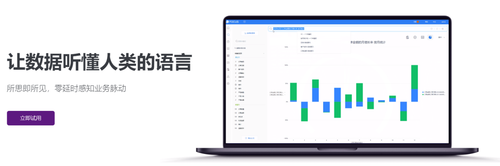

作为职场中的一员，是不是还常常加班到半夜？

工作效率快，何苦加班。是时候用上合适的工具，让自己早早下班了。

今天给大家推荐4款职场人必备的办公软件，让你的工作效率直接飙升。

1.

**迅捷文字识别**

**高效识别图片、音频中的文字，可还原文字排版**

工作中查阅资料的时候，结果只找到了图片格式，又或者找到了文字版也无法复制文字。很多人都是老老实实一个字一个字地手打输入，其实只要打开这个工具，使用【**拍照识别**】就可以了。

而且它还可以自动排版，原本文档的样式是什么样，扫描出来电子档的样式就是什么样。识别支持音频、票证，还可以精准检索纠错。

2.

**Billfish**

**快速搭建素材库，收集并整理海量素材**

工作中常常需要用到素材，比如工作会议、PPT演讲、述职报告，每次都需要找很久合适的素材。

而这款软件可以帮助我们快速搭建属于自己的素材库，快速采集浏览器上的图片，直接拖拽图片或者截图就可以保存至素材库。平时没事就可以多积累素材，这样要用的时候，直接在素材库里挑选就可以了。

另外你可以快速整理素材以及快速定位查找到素材文件，无需担心素材文件过于杂乱的问题。这样就能省下找素材的时间，并让素材的价值最大化。

3.

**Everything**

**本地硬盘秒搜神器**

工作过程中总接收到各种文件，保存在电脑各个位置。尤其是当时收到文件的时间过于久远，又要重新找的时候，虽然系统自带搜索功能，但是文件太多，搜索起来非常慢，搜不到的时候还要换个词重新搜，很让人心累。

Everything这款软件又强大又实用，无论你电脑里有多少文件，你搜索某个文件时候的速度，几乎都是秒搜，省心又省时间。

4.

**DataFocus**

**搜索式数据分析，秒级响应数据**

数据分析能力已经是职场精英必备的技能了。总结复盘项目成果、日常工作汇报等都要用到数据分析，但很多人不会代码，只能跟IT部门提需求，结果反馈来得慢，工作进行不下去，只能熬夜做Excel和PPT。

Excel虽然提供了数据处理功能，但是对数据汇报又要用大量文字说明；PPT虽然可以展示，可数据一旦有变动，又要重新弄。又要做Excel，又要做PPT，领导不满意又要重新修改，花１个月的时间都已经算正常水平了。

DataFocus就是一款强大的数据处理和数据展示工具，将数据导入进去，像百度一样搜索关键词，系统就会以可视化的效果告诉你答案。比如导入“全国超市订单”数据，搜索“2019年每月销售额”，就可以看到部门2019年每月销售额的情况。

再把所有需要的数据图表放到一张大屏里展示，就可以实现这个样子。

如果有需要修改的地方，直接替换导入的数据表就可以了，大屏会自动修改更新。此外，**大屏还是联动的**，比如当你选择“浙江省”，则整个大屏都是“浙江省”的数据。汇报某个地区的情况时，只需要点击一下大屏，可太方便了。

上手快，使用简单，不用学习代码知识。此外还有数据仓库、数据管理、数据预处理等等功能，更重要的是有**个人免费版**。

**小结**

**千磨万击还坚韧，任尔东西南北风。**

以上四款精心挑选的优质办公软件，每天多花五分钟学习研究并坚持使用，方能感受到工作效率的提升。
