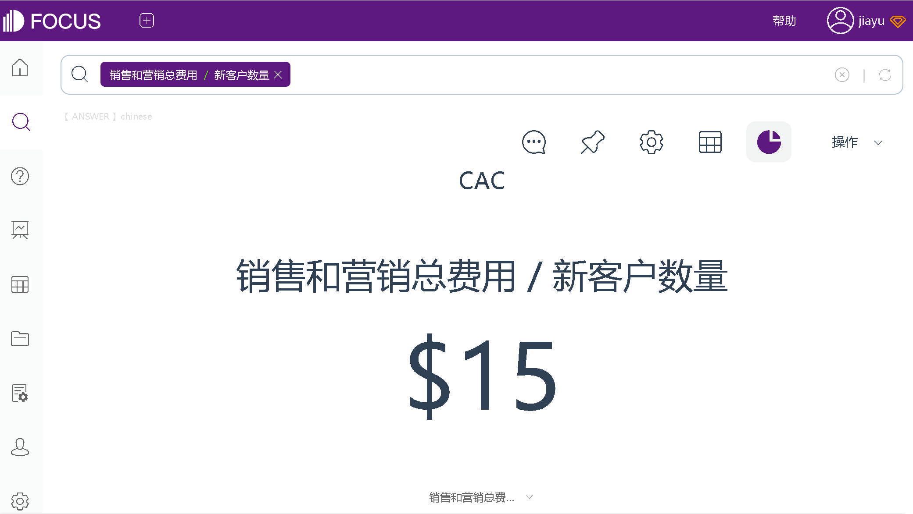
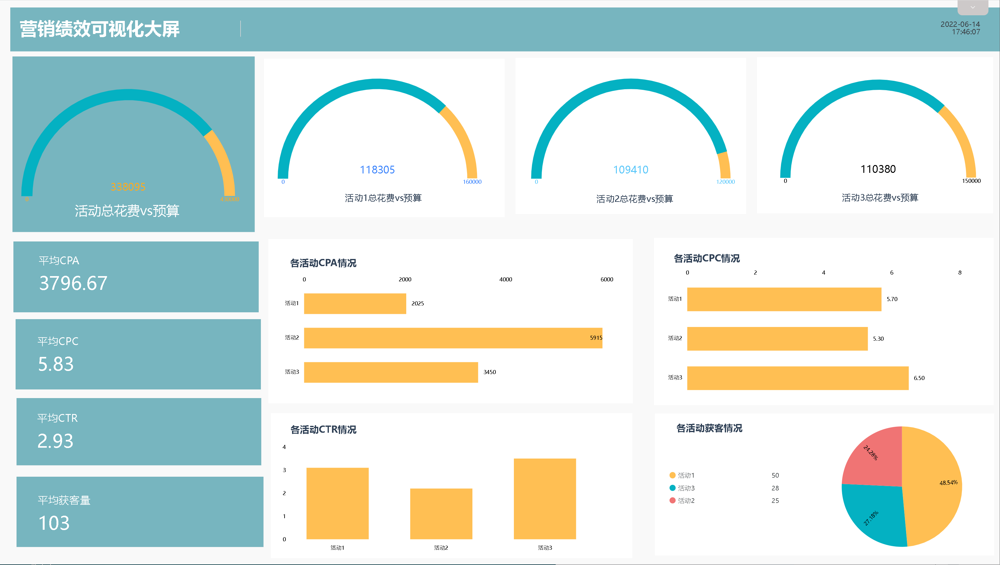

在前面的文章中，我们介绍了衡量企业健康状况的重要指标LTV:CAC比率，即 LTV/CAC，以及指标中的LTV（客户生命周期价值）。那么，这个黄金指标中的 CAC 是什么？如何进行计算呢？

## **什么是CAC （客户获取成本）？**

客户获取成本 (CAC) 是获得单个客户的平均费用。该指标包括营销和销售费用，以及为了吸引和转化访客为客户，而产生的相关工资和管理费用。

CAC不同于CPA（每次获取成本），CPA是指在特定渠道或活动中，获取新客户的总成本。

## **为什么客户获取成本至关重要——来自电子商务专家的语录**

_“未能正确适应产品/市场，很可能是创业失败的首要原因。但是……我认为创业失败的第二大原因是：获得客户的成本比预期的要高，并且超出了将这些客户货币化的能力。”_——David Skok

_“对于任何科技初创公司来说，最重要的指标之一是 CAC，即客户获取成本，或者有人称之为获取客户的成本。”_——Faiz Rahman

## **如何计算获客成本？**

**CAC=总销售和营销费用 / 获得的新客户**

获取客户的成本，是在给定时期内所有营销和销售费用（包括工资和间接费用）的总和除以同一时期新增客户的数量。

例如，如果你在过去一个月花费了 15,000 美元来获取新客户（包括营销、销售、工资和管理费用）并且带来了1000个新客户，那么你的 CAC 则为 15 美元。

分析工具：DataFocus

## **指标优点：**

跟踪电子商务指标 CAC 的价值，在于可以量化单个客户的销售和营销投资，帮助你了解业务的可持续性和可扩展性。降低获取成本是提高整体利润和提升每笔交易价值的有效途径。

当“客户生命周期价值”或“平均订单价值”与CAC指标一起跟踪时，它们可以为你提供必要的背景信息，以了解CAC是过高、平均还是过低。

## **指标缺点：**

单靠获取新客户的成本并不能提供足够的信息，来协助你做出明智的决定。如果你的 CAC 为 15 美元，而你的平均订单价值为 12 美元，那么你可能正在经历比较严重的问题。但是，如果你的平均订单价值为 50 美元，那么你的处境要好得多。

因此，在跟踪客户获取成本CAC时，一定要同时跟踪其他关键电子商务指标。利用DataFocus等BI系统，将这些指标汇总到仪表盘中，便于你获得清晰的、足够的信息，来考虑是否需要采取行动。

仪表盘来源：DataFocus（数据已脱敏）

仪表盘来源：DataFocus（数据已脱敏）

在前面的文章中，我们介绍了衡量企业健康状况的重要指标LTV:CAC比率，即 LTV/CAC，以及指标中的LTV（客户生命周期价值）。那么，这个黄金指标中的 CAC 是什么？如何进行计算呢？

## **什么是CAC （客户获取成本）？**

客户获取成本 (CAC) 是获得单个客户的平均费用。该指标包括营销和销售费用，以及为了吸引和转化访客为客户，而产生的相关工资和管理费用。

CAC不同于CPA（每次获取成本），CPA是指在特定渠道或活动中，获取新客户的总成本。

## **为什么客户获取成本至关重要——来自电子商务专家的语录**

_“未能正确适应产品/市场，很可能是创业失败的首要原因。但是……我认为创业失败的第二大原因是：获得客户的成本比预期的要高，并且超出了将这些客户货币化的能力。”_——David Skok

_“对于任何科技初创公司来说，最重要的指标之一是 CAC，即客户获取成本，或者有人称之为获取客户的成本。”_——Faiz Rahman

## **如何计算获客成本？**

**CAC=总销售和营销费用 / 获得的新客户**

获取客户的成本，是在给定时期内所有营销和销售费用（包括工资和间接费用）的总和除以同一时期新增客户的数量。

例如，如果你在过去一个月花费了 15,000 美元来获取新客户（包括营销、销售、工资和管理费用）并且带来了1000个新客户，那么你的 CAC 则为 15 美元。

分析工具：DataFocus

## **指标优点：**

跟踪电子商务指标 CAC 的价值，在于可以量化单个客户的销售和营销投资，帮助你了解业务的可持续性和可扩展性。降低获取成本是提高整体利润和提升每笔交易价值的有效途径。

当“客户生命周期价值”或“平均订单价值”与CAC指标一起跟踪时，它们可以为你提供必要的背景信息，以了解CAC是过高、平均还是过低。

## **指标缺点：**

单靠获取新客户的成本并不能提供足够的信息，来协助你做出明智的决定。如果你的 CAC 为 15 美元，而你的平均订单价值为 12 美元，那么你可能正在经历比较严重的问题。但是，如果你的平均订单价值为 50 美元，那么你的处境要好得多。

因此，在跟踪客户获取成本CAC时，一定要同时跟踪其他关键电子商务指标。利用DataFocus等BI系统，将这些指标汇总到仪表盘中，便于你获得清晰的、足够的信息，来考虑是否需要采取行动。

仪表盘来源：DataFocus（数据已脱敏）

仪表盘来源：DataFocus（数据已脱敏）
