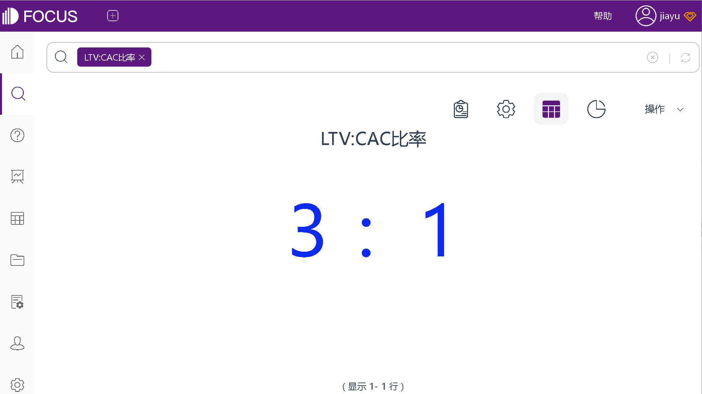

为了保持对营销绩效的高度了解，首席营销官往往会使用CMO仪表盘。在仪表盘中，通常包括品牌健康的长期衡量标准，以及表明当前营销计划成功的关键指标。其中，就包括LTV:CAC 比率。

## **什么是LTV:CAC 比率？**

要了解LTV 与 CAC 的比率，我们首先将其分为两个组成部分：生命周期价值 (LTV) 和客户获取成本 (CAC)。

生命周期价值 (LTV)，是单个客户预计在其帐户存续期内产生的平均收入。

客户获取成本 (CAC)是获得单个客户的平均费用。

生命周期价值与客户获取成本的比率，可帮助我们确定应该花费多少来获取客户。计算此比率可以看到你是否在每位客户身上花费过多，或者你是否因花费不足而错失机会。

## **如何计算 LTV 与 CAC 的比率？**

一旦你分别计算了 LTV 和 CAC，，只需将LTV和CAC相除即可。例如，如果你的客户终身价值为 3,000 元，而你获得客户的费用为 1,000 元，那么你的 LTV:CAC 比率将为 3:1

分析工具：DataFocus

## **指标优点：**

通过计算LTV：CAC 比率，可以查看你的公司是否处于可持续增长状态。这个比率作为一个晴雨表，可用于确定你应该在营销、销售上花费多少，以最大限度地提高你的增长并在与其他公司的竞争中保持领先地位。

## **指标缺点：**

LTV:CAC 比率是预测未来增长的一个重要指标，但这一预测很容易受到其它因素影响而改变。例如，如果有新的竞争对手进入市场，提高你的客户流失率，你的LTV可能会下降。或者，如果你的产品有了非常好的迭代，你的LTV可能会增加。

为了避免这一偏差，需要结合其它相关营销指标进行考量，例如客户增长、客户流失、每月收入增长等等。

## **行业基准**

对于成长中的 SaaS 公司，例如对于BI系统DataFocus Cloud，这个比率的行业标准是3倍或更高，因为更高的比率意味着你的销售和营销有更高的投资回报率。然而，更高并不总意味着更好，如果比率太高，你可能会因为支出不足而限制了增长，这就给你的对手带来了竞争优势。

1:1 的比率意味着你卖的越多，你就越亏钱。LTV 与 CAC 比率的良好基准是 3:1 或更高。一般来说，4:1 或更高的比例，意味着当前商业模式比较好。如果你的比率为 5:1 或更高，则你的增长速度可能是比较快的，并且在营销方面的投资可能不足。

到这里，你了解LTV:CAC 比率了吗？后续内容，我们将更详细地讲解“生命周期价值 (LTV)”和“客户获取成本 (CAC)”。
