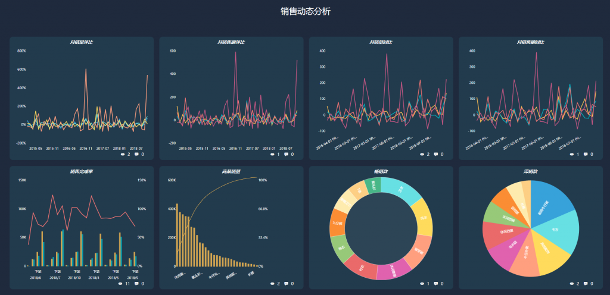

在这个大数据时代，很多行业都开始挖掘企业自身的大数据价值，而在数字化竞争越来越白热化、同质化的今天，对于企业的客户尤其是C端客户，如何让辛辛苦苦引进来的新客变成老客，老客不流失成了一大难题，尤其是电商行业。不仅如此，在数字化交易的背景下，越来越多的商家开始使用诸如DataFocus、集客CRM等做数据分析，以想要做数据化营销。但无论工具怎么先进，分析还是得靠数据分析师的人脑和思维，以思维驱动工具。思维驱动的意义就在于看到数据的呈现，能够了解其背后含义，并剖析其影响因素，从而辅助决策。那么本篇我们就以真实案例来列举一些常见的行业品类排名数据，讨论意义并剖析影响因素。

行业品类排名数据针对电商的比较多，以下将展示某真实快消品品牌的数据，由于保密性考虑，数据呈现以文字描述。

数据呈现：

1、从排名稳定性看，干性肌肤这个品类最稳定，美白淡斑其次。混合型肌肤最不稳定，在2017.8-12月及2018.2-6月排出前5。

2、滋养系列受季节性影响不大，基本全年需求稳定

数据意义：

评估店铺热销品类在指定时段的销售持续性

影响因素：

1、分类设置合理性 2、季节影响 3、推广力度

数据呈现：

1、从热卖度和客户认可度来看，面膜一直位居第一，但从15年4月开始，美白系列被春夏补水系列追赶，可见标题中含季节关键词会大大提升搜索。

2、澳洲类目在全年热销，并未受季节影响；去黑头洗面奶在18年10-12月（秋冬季）排名靠后，受季节影响度大。

3、双膜组合自从17年7月推出后，受认可度较高，可见一定程度上组合面膜中的美白、滋润功效利于选择障碍客户挑选。

4\. 付款率分析：身体乳液的付款率总体上升，突破84%；而其他两个商品的付款率有待提升。

数据意义：

评估店铺热销商品在指定时段的销售持续性，付款率如何

影响因素：

1、爆款策略 2、季节影响 3、推广力度 4. 催付措施

那么我们可以参考一下方法和步骤来具体实施数据分析后的战略。

1、品类设置：

首先，合理设计品类，忌讳品类过多且杂乱无章。其次，将商品归到对应的品类中，一个商品可归为多类，但是要有据可循，切勿乱归类。最后，定时管理品类，将热销品类置前。

2、商品标题设置

尝试在季节性产品前加入具有暗示和指导性的季节专有关键词。

3、适当推组合装

帮助选择性障碍、初次购买不确定客户进行选择，迎合客户“中杯心理”。

4、单独提升爆款付款率
