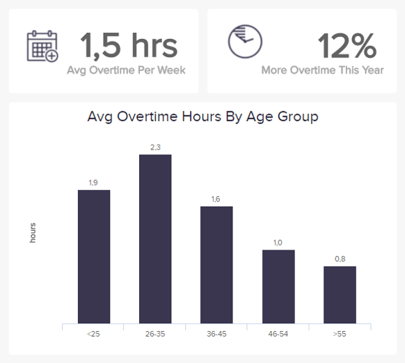
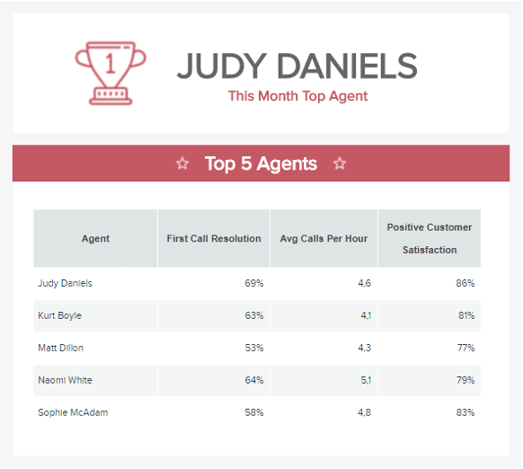
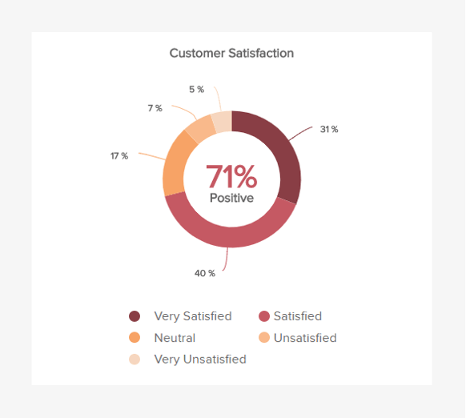
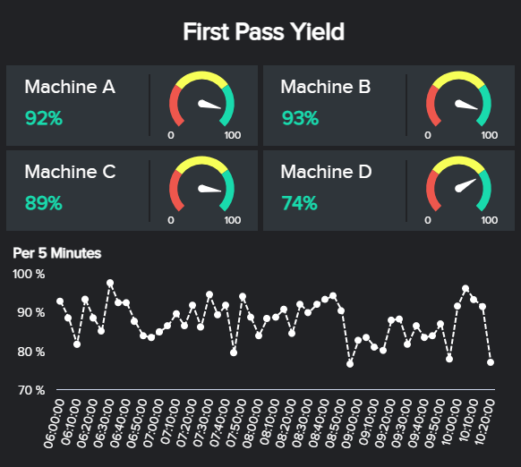
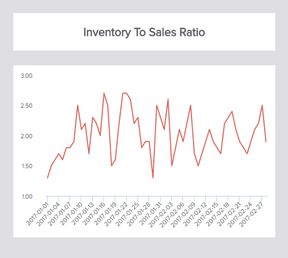
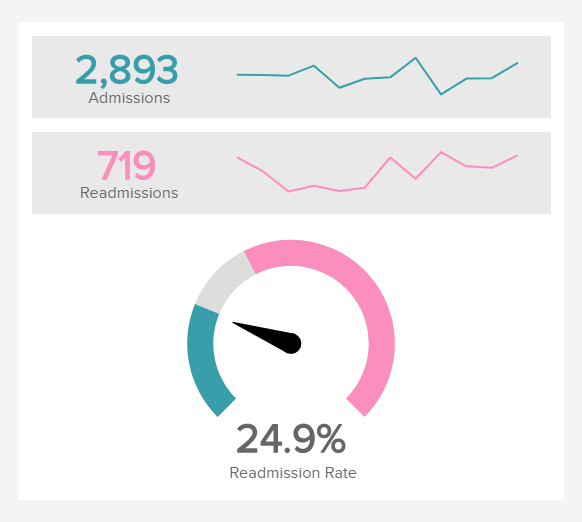

business needs

多年来，企业一直在尝试并缩小最有效的生产力衡量标准。生产力可以通过许多不同的方式和不同的水平来衡量，从生产设施中一项资产的原始工业产出到供应商的具体销售业绩。今天，员工的产出不再由模糊的描述来代表，而是由孤立的数字来代表，这些数字可以对特定领域的改进提供洞察力，这些可以在[人力资源仪表板上](https://www.datafocus.ai/infos/dashboard-examples-and-templates-human-resources)找到。

有很多 KPI 示例可以监控进度和评估生产力，同样，也有很多关于如何提高工作效率的指南。每个行业、业务和部门都为绩效指标可以评估的个人生产力定制了自己的定义：让我们看看我们选择的一些基本指标，您可以使用这些指标来提高组织在多个领域的绩效。

## 什么是生产力指标？

生产力指标是企业用来评估员工在与公司总体目标相关的各种活动中的绩效的度量。这些指标用于强调改进机会，并确保最大效率和生产力。

简而言之，生产力就是产出的有效性；度量是衡量的方法。根据定义，它们是企业评估生产力的方式，通常是员工的生产力。

KPI 和生产力指标通常可以作为相互交织的类别。销售目标和利润率都是企业参考的绩效指标示例，但远不止于此。销售带来利润；这些利润的管理在很大程度上受到用于衡量整个企业生产力的指标的影响。

因此，有一些绩效指标示例和指标可帮助提高每个部门的员工生产力。人力资源、管理、客户服务等领域的专业人士都可以从生产力指标中的数据中受益。

## 如何衡量生产力？

衡量生产力可能意味着许多不同的事情。员工是否按时按指示完成项目？这些努力的成果如何？如果他们按照被告知的做了所有这些事情，但仍然没有销售增长，那么哪里需要调整？找到答案通常需要不止一个指标。

我们衡量它的方式可能因企业而异。例如，一些企业认为让员工在工作日使用社交媒体是一种高效的习惯，而其他雇主则认为这是纪律处分的理由。如果没有这些测量，就很难以这样或那样的方式证实任何断言。

也就是说，虽然生产力确实意味着不同的东西，这具体取决于组织的目标和需求，但仍然有一些共同的准则，可以用来定义成功的生产率衡量标准。让我们看看其中的一些。

**不要只关注劳动力：**在衡量公司的生产效率时，您应该考虑的第一件事是使用正确的范围。根据《哈佛商业评论》的一篇文章，在现代商业环境中衡量生产力不仅要考虑直接劳动力，还要考虑许多其他非劳动力领域。正如作者所说：“一心一意地关注直接劳动会产生意想不到的后果”。因此，您的分析范围应包括除直接劳动力以外可能影响最终产出的因素。

**使用输出公式**：接下来，您需要了解输出公式：**_生产力=产出单位/投入单位_**。在传统的方法中，这个公式被用来理解总工作时间的收益。为此，企业将产出（特定时期的总收入）除以投入（该时期的总工作时间），以了解其整体生产力。也就是说，考虑到第一点，这种方法仅对监测劳动生产率有用。为了获得更广泛的范围，可以将投入定义为其他因素，例如每台机器的产量或每吨材料的产量。这样，您就能全面了解与公司生产效率相关的方方面面。

**收集数据：**一旦您了解了范围以及如何衡量它，就有必要收集所需的数据。您使用的信息当然取决于您的产出，但它很可能包括工作时间、完成的任务、在每项任务上花费的时间、产生的收益和成本等等。管理这些原始数据并非易事。为了确保信息的有效管理，您可以使用[在线数据分析工具](https://www.datafocus.ai/infos/data-analysis-tools)来支持自己，该工具可以帮助您构建数据并随时准备提取见解。

现在您了解了如何衡量您的组织的生产力，是时候查看一些涵盖不同领域的生产力度量类型的示例了。

## 您可以使用的生产力指标示例

这些生产力指标示例可以互换，因为它们具有针对性。您可以按部门进行自定义评估，同时仍然可以共享某些指标。以下是在衡量跨部门产出时的具体和通用的示例。如需更多指标，您可以在我们针对不同行业、平台和功能 的[KPI 示例](https://www.datafocus.ai/infos/kpi-examples-and-templates)列表中找到灵感。

### 1\. 员工生产力指标

**a.加班时间**

加班是衡量每个员工成本和产出的好方法，尽管考虑环境对于这个生产力指标很重要。例如，如果公司的销售额激增，人们就必须更加努力地工作来兑现他们所销售的承诺。如果加班时间是工作量增加的直接结果，这可能表明您需要雇用更多有才华的员工，而不是审查现有员工。

此外，通过结合其他员工生产力 KPI 示例（例如工作量）来进一步评估加班，您可以更仔细地观察，您可以看到并因此努力防止在过度劳累的团队中不可避免地发生的错误。过度劳累的团队的另一个常见症状是缺勤率较高。您可以通过查看我们收集示例和模板的[HR 报告](https://www.datafocus.ai/infos/monthly-and-annual-hr-report-templates)文章来深入了解该主题。

b. **整体劳动效率**

整体劳动力效率是一个多方面的 KPI，它连接了许多细节，例如员工数量、轮班效率等。这对于人力资源部门至关重要，因为它提供了他们回答复杂的人员配备问题所需的信息。

通过将总销售额除以员工人数来计算OLE （整体劳动力效率）是获得答案的一种非常直接和简单的方法。再一次，虽然这是一个很好的指标，但应该始终有其他指标来考虑影响生产产出的因素，例如交付的产品数量、质量控制等。这里的制造元素吸引了所有行业。计算整体劳动力效率的专业人士能够准确了解公司取得的成就，以及他们的员工在日常工作中的效率。

### 2\. 招聘人员生产力指标

a. 离职**率**

离职率是人力资源专业人员用来衡量员工留存率的一项重要生产力指标。营业额是经营企业的固有部分。无论好坏，员工都会根据自己的才能和愿望来来去去。流动率使管理人员能够预测人才更换的必要性，从而确保离职员工的剩余职责不会未分配。

要计算离职率，请选择一个时间段。按月计算是这里常见的方法。在此基础上，将离职人数除以该时间段内的在职员工人数。

低离职率是员工快乐的标志。它最终至少会降低招聘和培训成本。如果您的公司离职率很高，请让您的经理找出需要特别注意的地方。

**b.招聘转化率**

这是一个独特的指标，因为它衡量了人力资源人员的绩效。此外，使用此 KPI，您必须制定自己的标准；对与错将取决于您雇用的员工的质量。

要衡量您的招聘转化率，只需将求职者人数与招聘人数进行比较。如果您始终不费吹灰之力地找到优秀的人，请坚持您目前正在实施的比例。如果时间、人才和一致性成为需要关注的地方，那么将这些比例分散开来，甚至将这些因素与其他指标(如以下)隔离开来，可能会有所帮助。

**C. 招聘时间**

随着对完美员工的继续寻找，时间流逝得很快。这些工作可能会堆积起来，导致其他员工过度劳累和不堪重负，常常会导致工作表现不佳。为了给您的人力资源专业人员设置参考点，平均填补时间是一个有用的生产力指标。

要计算招聘时间，请记录从创建职位到招聘所需的时间。请记住，时间没有标准。只要以有限的公司成本选择合适的员工，这个数字就可以降低或提高。如果这些因素中的任何一个都没有到位，那么招聘的时间是值得试验的。

### 3\. 销售效率指标

**a. 销售增长**

对于销售部门和大多数企业而言，这是最值得评估的生产力指标。为了以一种可行的方式衡量销售增长，跟踪销售员工的个人绩效与他们的目标和区域。灵活一点，看看哪些有效，哪些无效，并根据需要进行调整，以确保您的销售员工提高工作效率。

**b.每个销售代表的收入**

下一个[销售 KPI](https://www.datafocus.ai/infos/kpi-examples-and-templates-sales)是另一个重要的生产力指标，因为它向您展示了您的销售代表为您的组织创造收入的能力。通过为您的代表设定雄心勃勃但切合实际的 KPI 目标和目标，你可以很容易地衡量他们的表现，并通过比较与基准月或上一个周期的生产力，找到改进的机会。

为了充分利用该指标，将您的销售代表划分为不同类别也很重要，例如资历级别、销售渠道以及任何其他相关方面。这样，您将确保在评估他们的进步时是公平的。

### 4.呼叫中心生产力指标

**a.最佳支持代理**

您的顶尖人才应该得到认可，依靠生产力 KPI 可以让经理在确定最强大的员工时保持客观。以下是一些基于客户服务的指标，您可以交叉参考以确定您的最佳支持代理：

- 第一个电话解决
- 每小时平均通话次数
- 客户满意度调查
- 成功销售

这些指标可以帮助您确定最有资格担任管理职位的团队成员，以及可能需要在特定领域接受更多培训的团队成员。

b. **顾客满意度**

可以说是最重要的客户服务或呼叫中心生产力指标之一，客户满意度可以提供对贵公司提供的服务质量的多种见解。与本文中的其他一些示例相比，满意度 KPI 可能有点难以衡量，因为它需要不同的数据收集方法，例如对客户进行反馈调查。

也就是说，有许多[客户服务分析](https://www.datafocus.ai/infos/business-intelligence-service-support)解决方案通过这个过程提供自动化技术来简化此流程。借助正确的工具，您可以设置不同的实例来收集客户的反馈，并确定服务可以改进的不同地方。

### 5\. 制造业的生产力指标

a. **产量**

当我们谈论制造业时，需要跟踪一个关键指标以有效评估生产力，这就是产量。通常，一个制造公司必须处理多个生产期限，以满足他们的客户的需求。考虑到这一点，这个简单的 KPI 将帮助您了解您是否能够实现目标以及如何改进。

现在，由于仅靠产量不足以告诉您哪里可以改进，因此对这个指标进行更深入的分析并比较不同机器的生产力是很重要的。这样，您将能够查看特定机器是否表现不佳，并找到解决方案以确保您的生产过程得到充分优化。

b. **首次通过率 (FPY)**

与前面的示例相同，我们有首次通过率 (FPY)。作为最相关的制造生产力指标模板之一，FPY可以 评估您的生产过程的质量和性能。它通过将完美单元的数量（没有返工或缺陷）除以在指定时间内进入同一过程的生产单元的总数来做到这一点。

在一个完美的世界里，一家公司的目标应该是 100% 的 FPY。但是，鉴于这并不完全现实，它可以作为一个很好的生产率衡量标准，以按时完成最终生产时间并达到所需的质量。该指标可以与其他重要指标（例如某时期生产量或废品率）进行比较，并在专业制造仪表板中一起可视化。

### 6\. 营销效率指标

a. **目标转化率**

转化率是衡量营销部门效率和生产力的最大指标之一，因为高转化率意味着成功的策略。简而言之，转换是访问者、用户或客户所需做的任何期望的操作，正如您所希望的那样。当然，转换的类型将取决于所衡量的业务和策略。它可以是订阅时事通讯、下载指南或注册免费试用等任何内容。

通过为不同的活动和渠道设置明确的转化目标，您可以轻松了解哪种策略最适合您的业务并优化资源，以确保出色的营销投资回报率。这就引出了我们的下一个例子。

b. **MQL 比率**

MQL（营销合格的潜在客户），是营销部门最重要的绩效衡量标准之一。从本质上讲，MQL 是营销团队招募的潜在客户，满足销售团队的所有标准，成为付费客户。

这是通过通过不同的策略（例如内容营销、付费搜索或社交媒体策略）收集多个潜在客户来完成的，一旦产生潜在客户，营销团队就会定义哪些潜在客户将变成 MQL。 MQL 的比率越高，您的公司在合格潜在客户方面最成功。

### 7\. 库存生产力指标

**a. 库存周转率**

库存周转率是一种生产力指标，用于衡量您的总库存在特定时期（通常是一年）内被销售和更换的次数。这是衡量生产管理、营销和销售等许多业务领域效率的一个很好的指标。

一般来说，低周转率可能意味着在您的供应链的某个阶段有些东西无法正常工作。然而，情况并非总是如此。一些公司的营业额可能较低，因为他们正在销售更昂贵的产品或服务，这些产品或服务在“货架”上的停留时间更长。因此，根据行业情况设定切合实际的营业额目标很重要。

b. **存销比**

和周转率一样，另一个很好的例子是库存与销售比率。这种最具洞察力的[物流 KPI](https://www.datafocus.ai/infos/kpi-examples-and-templates-logistics)跟踪商店中的库存量与销售数量的对比，并用于识别库存过剩以及衡量库存管理流程的绩效。

库存管理是组织中最昂贵的活动之一，库存中未售出的库存越多，成本就越高。考虑到这一点，一个好的做法是将您的库存和销量保持在相似的水平。如果您注意到您的库存太高，但您已经达到了销售目标，那么您生产的库存可能比您需要的多，这在时间和金钱上都是代价高昂的。

### 8\. 医疗保健中的生产力指标

**a. 患者满意度**

继续看医疗保健行业的一些例子，我们首先有患者满意度 KPI。就像客户是企业最重要的方面一样，患者也是医疗机构最重要的方面。因此，衡量他们的满意度是评估跨部门和跨领域效率和生产力的重要指标。

这个最重要的医院生产力指标包括膳食质量、平均等待时间和治疗效率等，它可以告诉医院设施需要在哪里进行改进。

b. **再入院率**

我们的最后一个例子是医院的再入院率，它可以让您深入了解您的医疗服务质量。该指标直接影响您的患者满意度，因为它衡量出院后短时间内返回医院的患者数量。

高的再入院率可以揭示一些管理问题，例如人手不足或超负荷的工作人员忽略了导致患者必须回来的细节。识别这些生产力问题可以减少重新入院带来的不必要成本，并提供更好的服务。

您可以借助直观的[医疗保健仪表板](https://www.datafocus.ai/infos/dashboard-examples-and-templates-healthcare)跟踪此指标和其他相关指标。

## 通过指标来提高员工生产力

现在您已经获得了数据，是时候应用这些知识并提高您的业务效率了。但首先，仔细检查您的数据。请记住，应始终考虑围绕这些测量的环境。机会当然是其中一种情况。例如，一个客户服务代理处理了大量愤怒的客户，可能不是导致问题的原因。一天中的时间、其他值班工人等因素可能会影响消极情绪的涌入。此外，处理所有这些情况的代理人可能会成为您未来解决冲突的领导者。

其次，确保您的数据涵盖了合理的时间段，以评估您选择的生产力指标。跟踪指标数月而不是数天，以便报告足够全面，以产生可执行的反馈。

最后，我们现在知道员工的幸福感在他们的生产力中起着重要作用。这就是为什么设置和跟踪[员工满意度指标](https://www.datafocus.ai/infos/measuring-employee-satisfaction-with-metrics)可以成为您采取的相关措施，以便了解您在此事上的不同举措如何影响他们的生产力。[人力资源分析软件](https://www.datafocus.ai/infos/business-intelligence-human-resources)是管理设置指标后收集的所有数据的理想工具。

一旦你反复检查了你的生产力kpi，是时候开始做一些改变了。您可以教给员工一些简单的习惯，以提高他们的工作效率。也许在人员配备、日程安排或运营方面需要进行改变。无论您决定如何处理您的数据，请确保您继续记录。未来的数据将证明您的补救措施的有效性，从而在未来提供更有成效的解决方案。

## 立即找到正确的指标

业务效率是每个公司随着时间的推移而建立的一个概念。员工生产力是提高效率的最大驱动力之一。为了提高绩效、降低成本并留住客户和员工，生产力指标应该是对话中加速的一部分。

在DataFocus，我们专注于帮助我们的客户提升他们的业务。要开始衡量您的生产力和绩效，请阅读有关我们[自助式 BI 工具](https://www.datafocus.ai/infos/self-service-bi-tools)的更多信息或立即注册 30天[免费试用](https://www.datafocus.ai/console)！
