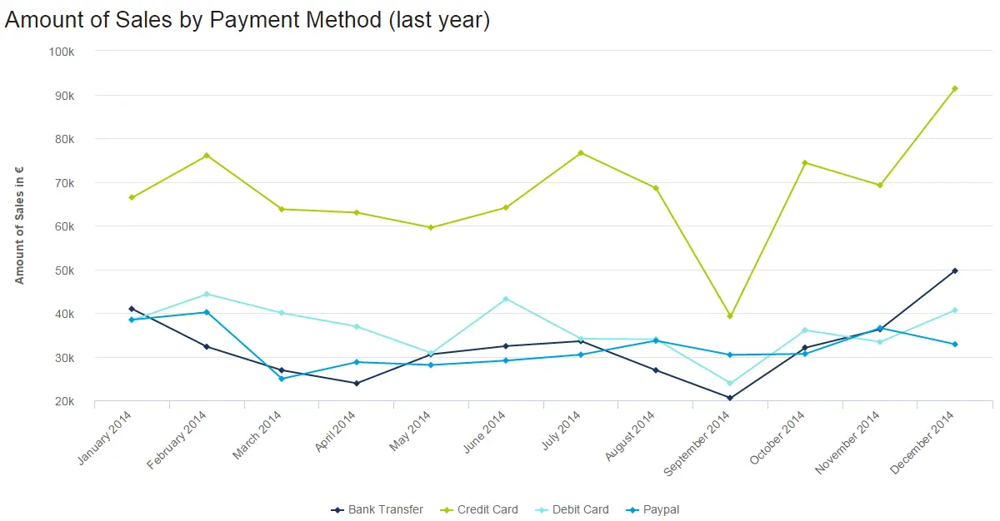
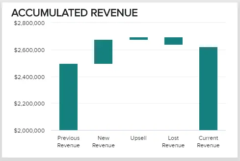
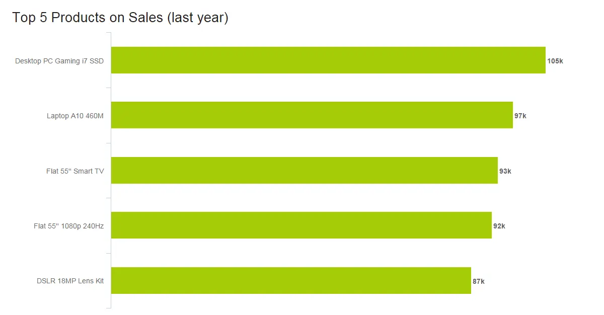
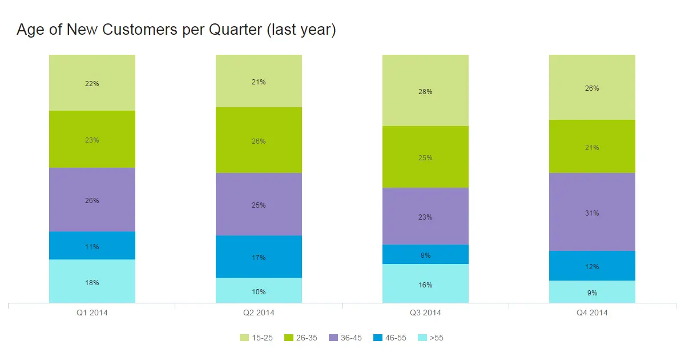
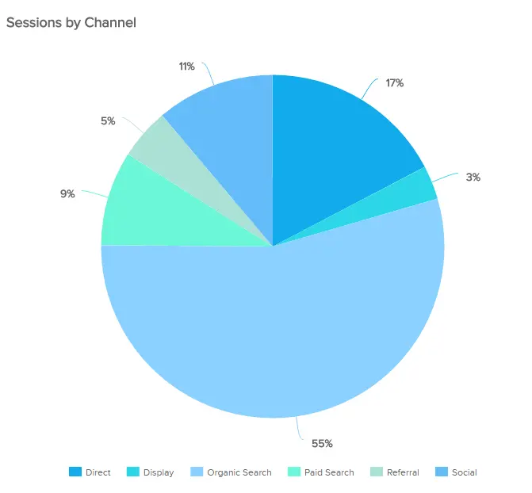
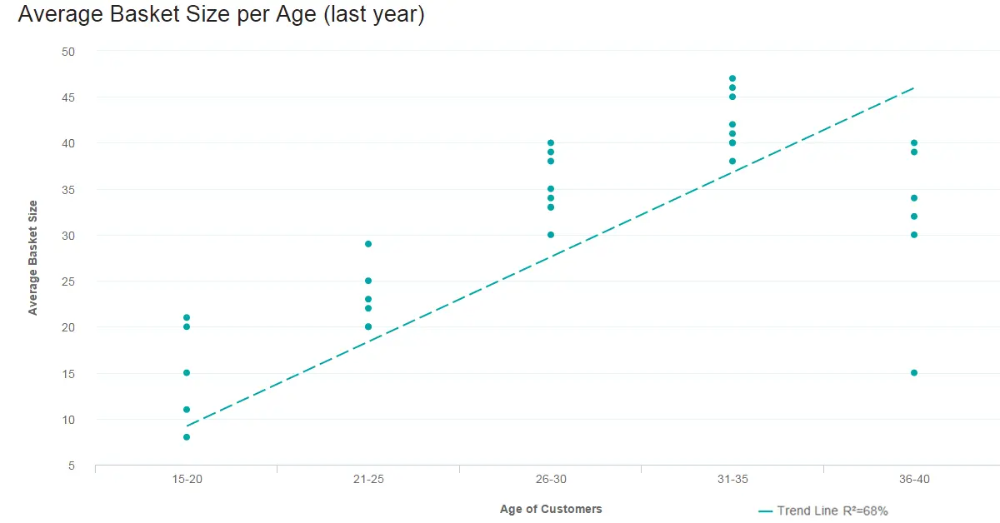
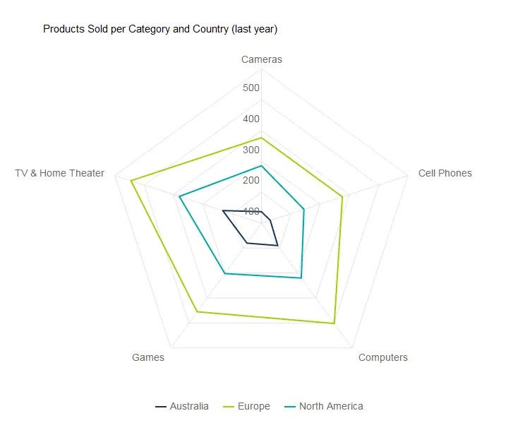
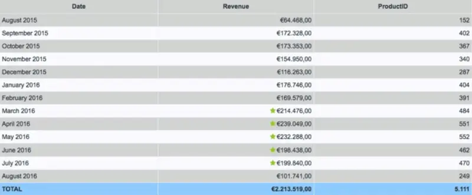
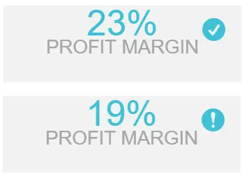

目录

[1） 寻找最佳数据可视化的问题](https://www.datafocus.ai/infos/designing-charts-and-graphs-how-to-choose-the-right-data-visualization-types#questions)

[2） 最常用的数据可视化类型](https://www.datafocus.ai/infos/designing-charts-and-graphs-how-to-choose-the-right-data-visualization-types#visualization-types)

[3）动态文本框和交互性](https://www.datafocus.ai/infos/designing-charts-and-graphs-how-to-choose-the-right-data-visualization-types#dynamic-text-boxes)

[4）数据可视化中的设计思维](https://www.datafocus.ai/infos/designing-charts-and-graphs-how-to-choose-the-right-data-visualization-types#design-thinking-data-visualization)

现代[仪表板软件](https://www.datafocus.ai/infos/best-dashboard-software-features)使合并和可视化数据变得比以往任何时候都更简单，其方式既鼓舞人心又易于访问。但是，虽然这样做很容易，但一个伟大的仪表板仍然需要一定程度的战略规划和设计思维。

了解您的受众是谁将帮助您确定所需的数据。知道你想讲什么故事（分析数据）会告诉你要使用哪种数据可视化类型。假设您拥有正确的数据和正确的[数据可视化软件](https://www.datafocus.ai/infos/data-visualization-tools)。现在您需要选择正确的图表和图形。希望这篇文章能帮助您创建更好的数据可视化和仪表板，这些可视化和仪表板更易于理解。

但首先，我们将从数据可视化图的思维元素开始 - 一系列问题将使您能够选择最佳类型的数据可视化。

 

您的机会：[想免费测试现代数据可视化软件吗？](https://www.datafocus.ai/console/)我们提供 14 天免费试用。立即从可视化数据分析中受益！

## 在决定数据可视化图表之前，您需要问的 7 个基本问题

如前所述，提出正确的问题将构成为您的项目、战略或业务目标选择正确类型的可视化图表的基础。区分这些问题的基本类别基于：

- 关系
- 分配
- 组成
- 数据比较

为了更详细地介绍，我们选择了您需要考虑的前 7 个问题，以确保从您的旅程一开始就取得成功。

### 1.你想讲什么故事？

[在线数据可视化](https://www.datafocus.ai/infos/data-visualization-tools)的核心是获取数据，并通过使用它来讲述故事，将其转化为可操作的见解。数据驱动的叙事是一种强大的力量，因为它需要统计数据和指标，并通过组织内外的每个人都可以理解的叙述将它们置于上下文中。

通过问问自己您想用数据讲述什么样的故事以及您想向受众传达什么信息，您将能够为您的项目或计划选择正确的数据可视化类型。最终，您可能会享受您想要的结果。

有关数据故事讲述的更多信息，请查看我们的[仪表板演示](https://www.datafocus.ai/infos/dashboard-storytelling-with-kpis-presentation-examples/)和故事讲述完整指南。

### 2.你想告诉谁？

选择正确的数据可视化类型的另一个关键要素是清楚地了解您想向谁讲述您的故事，或者换句话说，问自己一个问题，“谁是我的受众？

您可能将数据可视化工作针对组织内的特定团队，或者您可能正在尝试向选定的企业投资者传达一组趋势或预测性见解。花点时间研究您的受众，您将能够做出更明智的决定，即哪些数据可视化图表类型将与您将向其展示您的发现的人建立最切实的联系。

### 3\. 您是否希望分析特定趋势？

每个数据可视化项目或计划都略有不同，这意味着不同的数据可视化图表类型将适合不同的目标、目的或主题。

在更深入地了解您的受众以及您想要讲述的故事类型之后，您应该决定是否要在预定的时间段内传达与特定数据集相关的特定趋势。什么效果最好？

- 折线图
- 柱形图
- 面积图

### 4\. 您想演示数据的组成吗？

如果您的主要目标是展示数据的组成 - 换句话说，显示单个数据段如何构成整个事物 - 选择正确类型的数据可视化对于防止您的信息丢失或稀释至关重要。

在这些情况下，最有效的可视化包括：

- 饼图
- 瀑布图
- 堆积图
- 基于地图的图表（如果您的信息是地理信息）

### 5\. 您想比较两组或多组值吗？

虽然大多数类型的数据可视化允许您比较两个或多个趋势或数据集，但某些图形或图表将使您的信息更加强大。

如果您的主要目标是显示两组或多组信息之间的直接比较，则最佳选择是：

- 气泡图
- 蜘蛛图
- 条形图
- 列式可视化效果
- 散点图

数据可视化基于使用数据绘制图片，而不是将其静态地放在电子表格或表格中。从技术上讲，您选择的任何方式都很重要，但正如此处概述的那样，有一些图表可以更好地讲述特定故事。

### 6\. 时间线是一个因素吗？

通过了解您要从中提取价值的数据是基于时间的还是对时间敏感的，您将能够选择一个图形或图表，为您提供特定时期的数字或比较趋势的即时概览。

在这些情况下，由于其逻辑的、以数据为中心的设计、功能和特性，令人难以置信的有效是：

- 动态折线图
- 条形图

### 7\. 您希望如何显示您的 KPI？

重要的是要问自己，您希望如何展示您的关键绩效指标，因为这不仅决定了您的分析活动的成功，而且还将决定您的可视化或数据驱动的故事与受众产生共鸣的清晰度。

考虑您希望从营销活动或活动中的特定 KPI 中获得哪些信息，以及它们将如何与您共享信息的人产生共鸣 - 如有必要，请尝试不同的格式，直到找到完全符合您目标的图形或图表。

以下是两个简单的奖励问题，可帮助您使数据可视化类型更加成功：

- 您是在比较数据还是展示关系？
- 您想展示一种趋势吗？

在DataFocus，数据可视化是我们的强项。我们知道制作一个好的仪表板需要什么 - 这意味着制作一个视觉上引人注目且连贯的故事。

“可视化为你提供了你不知道的问题的答案。”

您的机会：[想免费测试现代数据可视化软件吗？](https://www.datafocus.ai/console/)我们提供 14 天免费试用。立即从可视化数据分析中受益！

## 前 12 种最常用的数据可视化类型

现在，您已经了解了在继续项目之前需要问自己的问题类型（并且在使仪表板具有视觉吸引力时需要考虑很多事项），现在是时候关注 12 种最流行的数据可视化类型，以最有意义的方式可视化数据。

## 1） 数字图表

何时使用数字图表

实时数字图表本质上是一个股票代码，可让您立即了解特定[KPI。](https://www.datafocus.ai/infos/kpi-examples-and-templates-)一目了然，您可以看到任何总数，例如销售额，进化百分比，访问者数量等。这可能是最容易构建的数据可视化类型，唯一考虑的是要跟踪的时间段。您想显示整个历史记录还是仅显示最新季度？清楚地标记时期至关重要，这样您的听众才能了解您在讲述什么故事。添加趋势指标会将您的数字与前一时期（或固定目标，具体取决于您跟踪的内容）进行比较。

要避免什么

数字图表通常是人们首先看到的东西，也是阅读最快的，所以如果数字太多，你的叙述就会被稀释。使用过多也会使您的仪表板有点肤浅。如果需要更深入的信息，请限制数字图表的数量，并为其他类型的数据可视化留出空间，以便更深入地向下钻取。

当您添加趋势指标时，我们建议您比较同一时期的数字。例如，如果您要跟踪当前季度的总销售额，请将该数据与去年同一季度（或上一季度 - 取决于您的故事）进行比较。如果您手动选择目标（也许您没有准确的过去数据），请务必设定切合实际的目标，以便能够掌握[您的 KPI 管理](https://www.datafocus.ai/infos/kpi-management-and-best-practices/)实践。同样，请记住清楚地标记趋势指标，以便您的受众确切地知道他们在看什么。

## 2） 折线图

何时使用折线图

折线图的目的是显示趋势、加速（或减速）和波动性。它们显示数据在一段时间内如何变化的关系。在上面的示例中，我们显示了 2014 年全年按付款方式划分的销售额。马上，您可以看到信用卡付款是最高的，并且一切都在 9 月份有所下降。这些要点很快注册，但有深度。

要避免什么

太多的线（变量）会使您的图表变得复杂且难以破译。您可能还会发现您的观众不断引用图例以提醒他们正在查看哪一个。如果你有太多的变量，是时候考虑第二个（甚至第三个）图表来讲述这个故事了。

在布局方面，请保持数字的相关性。设置轴刻度时，请使其靠近最高数据点。例如，如果我们将上面的 y 轴设置为一直跟踪到 200K（当我们的最高数据点刚刚超过 90K 时），我们的图表就会被挤压并且难以阅读。上半部分会浪费空间，数据会塞满。让您的数据喘口气！

还有一件事！

折线图的一个重要功能是您可以将它们与其他类型的数据可视化（如条形图）结合使用。使用双 y 轴（一个用于条形图，一个用于线条）允许您在一个图表中显示故事的两个元素。下面的主 y 轴显示订单（条形图），辅助 y 轴显示销售总额（线）。这些指标是不同的，并且独立有用，但它们共同讲述了一个引人入胜的故事。

## 3） 地图

何时使用地图

地图非常适合按位置可视化地理数据。地图上的数据通常显示在彩色区域地图（如上）或气泡图中。由于地图在讲述故事方面非常有效，因此它们被政府、媒体、非政府组织、非营利组织、公共卫生部门使用——不胜枚举。地图不仅用于显示数据;他们还指导行动。最近通过寨卡疫情就可以看到这一点。绘制疾病传播图有助于卫生官员跟踪疾病，并有效地将资源分配到最需要的地方。

即使您没有从寨卡病毒中拯救世界，地图也可以提供帮助！例如，他们擅长比较组织在不同地区的销售额。

避免什么

每个人都喜欢地图。但是，这并不意味着您总是需要显示一个。如果位置不是数据故事的必要部分，则不需要地图。它们占用很多空间，因此仅在必要时使用它们。另外，不要只是用数据点填充地图。Clickhole通过在地图上放置700个红点，很好地讽刺了这种常见的数据可视化类型。用数据点填充地图并不能说明数据故事;它只是让观众不知所措。

## 4） 瀑布图

何时使用瀑布图

这个非常有用的图表描述了以静态但信息丰富的方式可视化数据的强大功能。它显示了设定时间段内的数据组成，说明了有助于理解整体累积效应的正值或负值。递减和增量可能导致累积在不同点处低于或高于轴，从而清楚地了解初始值是如何受到影响的。它通常用于财务部门和分析目的，通常描述收入或利润的变化。例如，您的MRR（[每月经常性](https://www.datafocus.ai/infos/monthly-recurring-revenue/)收入）、新收入、追加销售、损失和当前收入。在上面的示例中，我们可以得出结论，我们当前的收入在设定的时间段内有所增加。

避免什么

瀑布图在其表示中是静态的，因此如果您需要显示动态数据集，那么堆积图将是更好的选择。此外，对于瀑布图（也称为级联图），显示所选多个变量之间的关系并不是最佳选择，因为气泡图或散点图将是更有效的解决方案。

## 5） 条形图

有三种类型的条形图：水平条形图（从左到右）、柱形图（向上和向下）和堆叠（可以是其中一种）。尽管它们都位于同一图表系列中，但每个图表都有不同的用途。

### a） 水平条形图

何时使用水平条形图

水平图表非常适合比较排名，例如前五名列表。如果数据标签非常长，它们也很有用。不过，将它们保持在有意义的顺序中。要么按值列出（就像我们上面所做的那样），要么，如果这不是优势，为标签选择一个有意义的逻辑，比如按字母顺序列出它们。

要避免什么

由于时间最好从左到右表示，因此最好保留显示柱形图的演变。此外，与许多图表一样，当您的值过多时，水平条形图很快就会变得混乱。

### b） 柱形图

何时使用柱形图

柱形图是显示按时间顺序排列的数据（例如特定时期的增长）以及跨类别比较数据的标准。在我们的[销售数据分析](https://www.datafocus.ai/infos/data-analysis-software)示例中，每个渠道和国家/地区的销售额（去年）很明显，我们正在比较六个地区和五个渠道。颜色编码使观众了解我们指的是哪个区域，适当的间距显示了频道（良好的设计是这一切的核心！一目了然，您可以看到 SEM 是收入最高的渠道，只要稍加努力，荷兰就会脱颖而出，成为可能享有最高销售额的地区。

### c） 堆积柱形图

何时使用堆积图

堆积图处理部分到整体的关系。这是当您将数据与自身进行比较而不是查看总数时 - 通常以百分比的形式。在上面的例子中，这个故事不是关于15-25岁的客户总数，而是2014年第一季度22%的客户是15-25岁（第四季度为26%）。我们正在处理的数字仅相对于我们的总数。

在显示单个部分到整体的关系时，饼图是最简单的方法。我们 22% 的客户是 15-25 岁，剩下的 78% 以某种方式融入蛋糕。人们得到饼图。它们很容易。但是，如果我们想在不同时期显示相同的信息怎么办？这将是一个多部分到整体的关系，为此，我们使用堆叠条形图。同样，我们正在讲述每个季度特定年龄段的客户百分比的故事。每个总数在这里无关紧要（尽管该信息用于计算）。通过适当的间距，我们可以清楚地看到每个季度，颜色编码显示，总体而言，46-55岁的客户是最难吸引的。

要避免什么

从美学上讲，当您拥有太多数据时，列会变得非常细和丑陋。这也几乎没有空间来正确标记图表。想象一下，我们每列有 10 个不同的年龄范围。有些结果，如果不是大多数，也只是条子。为了使图表易于理解，请使用良好的颜色、适当的间距和平衡的布局。这邀请人们查看您的图表，甚至享受它。漂亮的图表是使用数据的一种比眯着眼睛看桌子更好的方式。

您的机会：[想免费测试现代数据可视化软件吗？](https://www.datafocus.ai/console/)我们提供 14 天免费试用。立即从可视化数据分析中受益！

## 6） 饼图

何时使用饼图

备受诟病的饼图已经糟糕了几年。事实上，谈论饼图有多糟糕已经变得非常陈词滥调。我们知道饼图没有做很多事情，但它确实做得很好。在演示特定变量在静态时间范围内的比例组成时，饼图非常有用。让我们看一些特殊情况：

- 当部分加起来达到100%时：“部分与整体的关系”以一种明显的方式内置到饼图中。一目了然，任何用户都知道饼图将人口分成多个部分，并且这些部分的总和等于 100%。

- 近似时可以：当目测值足以让对话继续进行时，饼图特别有效。此外，与条形图相比，估算饼图的百分比值更容易。这是因为馅饼有一个看不见的刻度，在圆的四个点上内置了 25%、50%、75% 和 100%。我们的眼睛可以很容易地破译这些比例，推动关于变量占据和不占据大部分馅饼的讨论。您的受众不必猜测比例 - 您可以轻松添加数据标签或构建饼图的姐妹图，即圆环图，以显示其他信息。

- 当变量的比例不多或它们组合在一起时：饼图在回答诸如“哪两家最大的供应商控制着 65% 的市场份额？

您的受众并不总是由数据科学家组成。因此，您的数据呈现应针对您的特定受众量身定制。这给我们带来了饼图的另一个优势：人们熟悉饼图。任何观众都会对解释饼图所呈现的内容感到自在。作为奖励，圆圈会产生更多积极的情绪：我们的大脑喜欢看尖角上的圆圈。最后，饼图简化了数据故事并鼓励受众。

避免什么

数据可视化大师爱德华·塔夫特（Edward Tufte）有一句名言：“饼图很糟糕，唯一比一个饼图更糟糕的就是饼图很多。我们已经讨论了饼图的优点，以及为什么我们不坚持这种严格的无饼图哲学。我们还应该声明，在很多情况下，您不应该使用饼图。首先，饼图描绘了一个停滞的时间框架，因此使用这种可视化方法可以计算趋势数据。确保您的受众了解所描绘的时间范围，并尝试在某处记录或标记此应用的过滤器。

饼图也不是进行精确比较的最佳数据可视化类型。当馅饼有多个小块时尤其如此。如果您需要看到一个切片比另一个切片大 1%，最好使用条形图。关于馅饼的多块的另一件事——你不想要太多。饼图在仅显示两个部分时最有效。它们在六个段后失去呈现价值。六点之后，眼睛很难破译切片的比例。标记饼图也变得困难，并且在此过程中经常浪费宝贵的[在线仪表板](https://www.datafocus.ai/infos/online-dashboard)/报告空间。

这就引出了最后一个问题：圆圈占用空间。如果在仪表板中使用多个饼图，则最好更有效地将数据合并到一个图表中。我们建议查看这些情况的堆积条形图。您还可以查看常用的不同饼图，并探索[饼图的缺点](https://www.datafocus.ai/infos/notorious-pie-charts/)。

## 7） 仪表图

何时使用仪表图

仪表图也称为刻度盘或速度表图表。这些图表使用指针和颜色来显示类似于表盘/速度表读数的数据，并且它们提供易于消化的视觉效果。它们非常适合在定量上下文中显示单个值/度量，例如显示上一期间或目标值。仪表图通常用于[执行仪表板](https://www.datafocus.ai/infos/executive-dashboards-and-reports/)和报表，以显示关键业务指标的进度。您需要做的就是分配最小值和最大值并定义颜色范围，仪表图将显示即时趋势指示。

避免什么

仪表图非常适合 KPI 和单个数据点。在那之后，他们可能会变得有点混乱。只有一个数据点，您无法轻松比较不同的变量。您也不能使用仪表图对数据进行趋势分析。所有这些都使得从仪表图中获取可操作的见解变得困难。此外，它们占用大量空间——如果您的[实时仪表板](https://www.datafocus.ai/infos/live-dashboards)有宝贵的空间，那么用多个仪表图填充它可能不是最有效的。使用一个图表来汇总多个 KPI，您可能会获得更多收益。

## 8） 散点图

何时使用散点图

散点图不仅说起来很有趣，而且在大型数据集中寻找相关性时，它就是您所需要的。数据集需要与因变量和自变量成对。从属的（另一个所依赖的）成为 y 轴，独立的 – x 轴。当数据分布在图上时，结果显示相关性为正、负（每个程度不同）或不存在。添加趋势线将有助于显示相关性及其统计显著性。

要避免什么

散点图仅在具有大量数据点和相关性时才有效。如果您只谈论几条信息，散点图将是空洞且毫无意义的。只有当有足够的数据点来查看清晰的结果时，该值才会显现出来。如果您只有少量数据，或者您的散点图根本没有相关性，则此图表在[您的业务仪表板](https://www.datafocus.ai/infos/dashboard-examples-and-templates-)上没有位置。

## 9） 蜘蛛图

何时使用蜘蛛图

蜘蛛图或雷达图是显示具有三个或更多定量变量（方面）的多变量数据时使用的比较图。当您想使用三个以上的方面来评估两个或多个“事物”时，这很有用，所有这些方面都是类似的可量化的。这当然是拗口的，但当你投入使用时，它很简单。蜘蛛图非常适合排名、评估和评论。例如，我们在上面的电子商务示例中比较的三个“事物”是区域：澳大利亚、欧洲和北美。我们比较的方面是销售的产品是相机，电视，手机，游戏和计算机。每个变量都通过售出的单位数量进行比较 - 在 0 到 500 之间。欧洲在所有领域的销量都明显超过，澳大利亚在相机和手机方面尤其疲软。优势和劣势的集中是显而易见的。

要避免什么

这不是最容易完成的图表，但如果正确完成，它确实令人印象深刻。如果您的维度中有五个以上的值（要评估的五个“事物”），则使用此图表会使它难以阅读，这可能会使其完全毫无意义。无论使用实线还是阴影区域，过多的图层都难以解释。当然，当你想显示时间时，这不是一个选择（整个循环的东西......

## 10） 表格

何时使用表

我们知道 - 从技术上讲，表格不是一种数据可视化类型。但有时，您实际上只需要一个表格来以原始格式描绘数据。使用表格，可以显示大量精确的度量和维度。您可以轻松查找或比较单个值，同时还可以显示总计。当您的受众需要了解基础数据或进入“杂草”时，这尤其有用。如果您有不同的受众，每个人都想查看自己的桌子，则表格也很有效。它们也擅长描绘大量文本或字符串值。

请记住 - 仅仅因为您使用桌子并不意味着它不能在视觉上令人愉悦。您可以使用各种颜色、边框样式、字体类型、数字格式和图标来有效地突出显示和显示数据。

避免什么

使用表的原因有很多，但也有许多情况下，不同的数据可视化类型是更好的选择。这一切都归结为我们的眼睛和大脑。表格主要与语言系统相互作用——我们阅读表格。此读取包括按顺序处理显示的信息。用户向下阅读列或跨数字行，将一个数字与另一个数字进行比较。这里的关键词是阅读、处理和时间。表需要更长的时间来消化。

另一方面，图形是由我们的视觉系统感知的。它们赋予数字形状和形式，并讲述数据故事。它们可以以易于使用的方式快速呈现大量数据。如果需要数据可视化来识别模式和关系，则表不是最佳选择。此外，虽然在颜色、格式和图标上发挥创意很有趣，但请确保您的格式和演示文稿选择正在增加感知。表格很难按原样阅读！

## 11） 面积图

何时使用面积图

面积图与折线图密切相关。这两种图表类型都描述了时间序列关系，显示了整个数据集的连续性，并且适合查看趋势而不是单个值。也就是说，两者之间存在一些关键差异。由于这些差异，“何时使用面积图”不等于“何时使用折线图”。

折线图通过直线段连接离散但连续的数据点。这使得它们有效地促进趋势分析。面积图在技术上也执行相同的操作，只是绘制线下方的区域用颜色填充。在这种情况下，未堆叠的面积图与折线图相同 - 只是颜色更多。您在这里遇到的问题是遮挡：当您开始比较未堆叠面积图中的多个变量/类别时，上层会掩盖下层。您可以使用透明度，但在三个变量之后，未堆叠的面积图很难阅读。

这就把我们带到了最常用的面积图：堆积面积图。与堆积条形图一样，堆积面积图描绘了部分与整体的关系。堆积面积图的总垂直度显示整体，而每个不同数据集的高度显示部分。例如，堆积面积图可以显示每个地区的销售趋势和总销售趋势。有两种不同的堆积面积图类型可用于描绘部分与整体的关系。

传统堆积面积图：原始值堆叠，显示整体随时间的变化。

堆积百分比面积图：堆叠百分比以显示不同部分之间的关系如何随时间变化。这最适合用于将类别的分布显示为整体的一部分，其中累积总数不太重要。

避免什么

正如我们之前所暗示的，在大多数情况下，您应该远离未堆叠的面积图。如果您只是比较 2-3 个不会相互遮挡的不同变量，那么请继续。但总的来说，它们通常很混乱，不遵循数据可视化和[仪表板设计最佳实践](https://www.datafocus.ai/infos/dashboard-design-principles-and-best-practices/)。对于堆积面积图，当您不需要描绘部分与整体的关系时，不要使用它们 - 改用折线图。此外，如果您尝试比较 7+ 系列，堆叠面积图将变得难以阅读。在这种情况下，您应该再次转到折线图。

## 12） 气泡图

何时使用气泡图

气泡图或气泡图是最好的数据可视化图表之一，用于一目了然地比较多个值或数据集。如果您想显示不同产品类别、收入流、投资风险、成本或任何类似内容之间的关系，气泡图或绘图非常有效。

例如，我们的气泡图示例展示了零售产品类别组合之间的关系，主要是订单数量和利润率。

在这里，您可以说电视和家庭影院产品类别的订单数量最多（从左侧的数字比例中可以看到大约 3，000 个）以及最高的利润率，因此，它是图表上最大的气泡。相比之下，相机类别除了最小的利润率外，显示的订单数量最少，自然是图表上最小的气泡。

气泡图对于可视化具有多个维度的两个或多个变量非常强大。在这里，泡沫越大，利润率就越高。泡沫情节不仅在视觉上具有刺激性，而且在为特定受众构建比较叙事时也非常有效。

避免什么

气泡图很难出错太多，但这些类型的数据可视化图表最常见的错误是专注于改变值的“半径”，而不是它们在图表上占据的“区域”。这样做有时会使图上的气泡在图表上不成比例，使信息一目了然。简而言之，与值相比，您的气泡在大小方面应该是准确的。做对了，你会得到你应得的结果。

您的机会：[想免费测试现代数据可视化软件吗？](https://www.datafocus.ai/console/)我们提供 14 天免费试用。立即从可视化数据分析中受益！

## 使用现代动态文本框在图表和图形中创建其他值

在使数据可视化类型栩栩如生时，您可以向图表添加额外的价值或交互式元素，以使其更具吸引力和价值驱动力。

通过使用[交互式仪表板](https://www.datafocus.ai/infos/interactive-dashboard-features/)使数据可视化图表栩栩如生，您将使您的演示文稿和计划更加强大，以一种直接使您的组织受益的方式将您的信息带回家。

交互式仪表板是一种数据管理工具，可更详细地分析、跟踪和监控，直观地显示关键业务指标，同时提供与数据交互的机会。通过这样做，用户可以做出更明智、数据支持、促进业务发展的决策。

在强大的交互式仪表板中包含的所有有益功能中，动态文本框或图像是最有效的功能之一。

动态功能意味着您可以直观地扫描 KPI 指标，同时根据您设置的筛选器根据表现不佳或过高的值获得自动更新，而不是浪费时间并冒着遇到数据不准确的风险。如果您的设置值低于指定的标准，则清晰的感叹号将向您显示此基准需要您注意。如果设置的基准表现良好，复选标记将提供明确的提示，并让查看者知道该值在控制之中。这意味着无需手动计算，仪表板将提供必要的通知。

为了更详细地了解这一点，这里有一个基于我们十大交互式仪表板功能的视频，供您观看：

 

## 数据可视化中的设计思维

当涉及到不同的数据可视化类型时，没有任何东西可以替代可靠的设计。如果您花时间了解数据可视化工作的原因、您的目标人群以及您想采取的讲述故事的方法，您将产生很好的结果。

在DataFocus，我们为[我们的仪表板报告软件](https://www.datafocus.ai/infos/dashboard-reporting)开发了最佳设计选项，使它们易于导航，但足够复杂，可以以重要的方式处理所有数据。

借助我们的高级仪表板功能（包括一系列全局样式选项），我们使您能够使[仪表板](https://www.datafocus.ai/infos/best-dashboard-software-features)尽可能吸引看到您的数据的人。

在为数据可视化图创建有效设计的过程中，您的职责归结为选择正确的数据可视化类型来讲述连贯、鼓舞人心且可广泛访问的故事。您的听众很少会了解您在选择仪表板时投入了多少战略思想——与许多演示元素一样，设计往往被低估。但是，我们了解这有多重要，我们在这里伸出援助之手。

除了本指南中介绍的内容之外，为自己设置一组各种价值驱动的问题将为您提供以正确方式讲述数据故事的最佳开端。

我们之前可能已经介绍过这一点，但这是至关重要的，所以我们认为我们应该重申：了解你的受众是谁将向你展示你需要哪些数据，但了解他们将如何使用这些数据将有助于你决定哪些图表将加速你的数据可视化工作的成功。

您的受众是否会积极使用仪表板中的数据？还是他们只是为了做出更明智的业务决策而查看它？在开始设计图表之前建立这一点将帮助您确定要展示哪些 KPI 以及要在故事中突出显示最多的 KPI。

如果您的受众将积极使用呈现给他们的数据，也许作为一个团队，每个成员可能需要查看特定区域并进一步向下钻取，那么使用更复杂的图表和全局仪表板筛选器将效果最佳。

如果您的仪表板专注于展示一组特定的结果，那么数字图表和蜘蛛图（看起来令人印象深刻）可能是最好的方法，其中夹杂了一小部分更复杂的图表来支持您的故事。

您的机会：[想免费测试现代数据可视化软件吗？](https://www.datafocus.ai/console/)我们提供 14 天免费试用。立即从可视化数据分析中受益！

总而言之，以下是您应该了解的顶级数据可视化类型：

- 数字图表 - 提供特定值的即时概述。
- 折线图 - 显示一段时间内数据的趋势和变化。
- 地图 - 按地理位置可视化数据。
- 瀑布图 - 演示数据的静态组合。
- 条形图 - 用于比较许多项目的数据。
- 饼图 - 指示变量的比例组成。
- 仪表图 - 用于在定量上下文中显示单个值。
- 散点图 - 用于表示大型数据集的关系和分布。
- 蜘蛛图 - 比较图表非常适合排名、评论和评估。
- 表格 - 显示大量精确的尺寸和度量。
- 面积图 - 描绘一段时间内的一部分与整体的关系。
- 气泡图 - 可视化具有多个维度的 2 个或多个变量。

但是，在我们这个高度互联的数字时代，您可以使用更多类型的数据可视化来发挥自己的优势。

我们的高级[可视化分析软件](https://www.datafocus.ai/infos/visual-analytics)具有令人惊叹的视觉效果，可让您轻松创建和操作数据，精确地按照自己的方式创建数据，并根据受众进行定制。最好的部分是，您可以免费试用[14 天](https://www.datafocus.ai/console/)！
