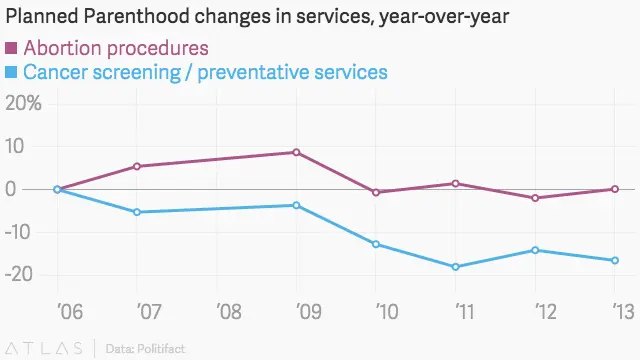
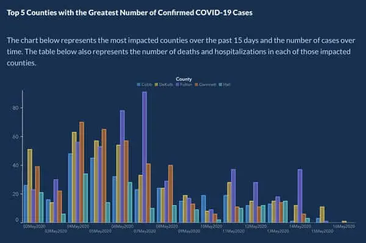
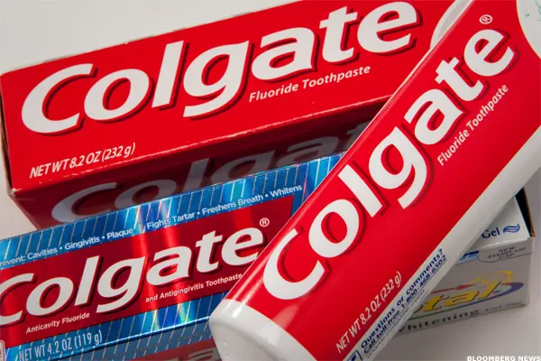
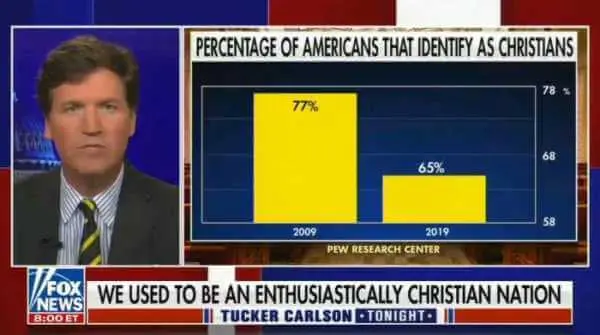
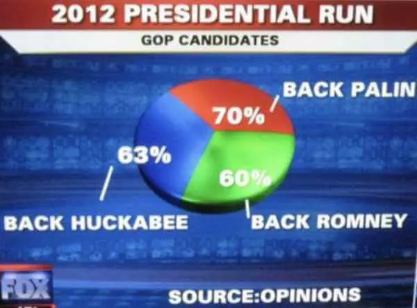
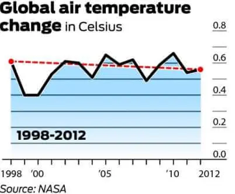
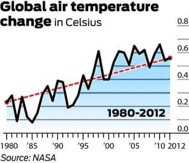
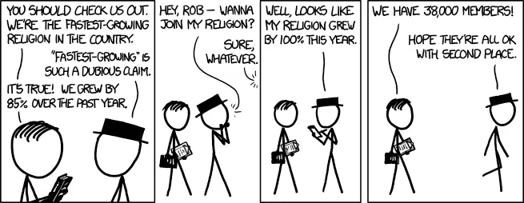
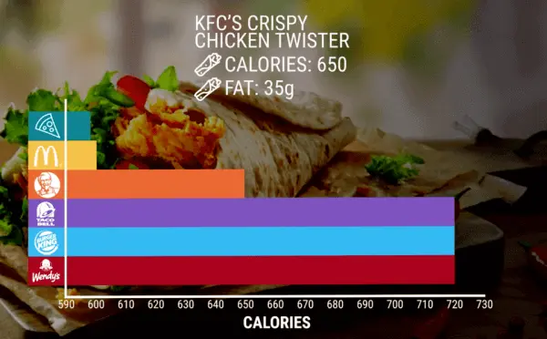
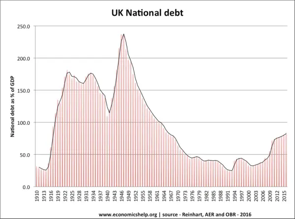

统计分析历来是高科技和先进商业行业的中坚力量，今天它们比以往任何时候都更加重要。随着先进技术和全球化运营的兴起，统计分析使企业能够深入了解解决市场的极端不确定性。研究促进明智的决策、合理的判断和根据证据而不是假设的权重采取的行动。

由于企业经常被迫遵循难以解释的市场路线图，统计方法可以帮助进行规划，这是驾驭充满坑洼、陷阱和敌对竞争的景观所必需的。统计研究还可以帮助商品或服务的营销，以及了解每个目标市场的独特价值驱动因素。在数字时代，只有通过实施先进技术和商业[智能软件](https://www.datafocus.ai/infos/best-bi-tools-software-review-list)，才能进一步增强和利用这些功能。如果这一切都是真的，那么统计数据有什么问题？

实际上，本身没有问题 - 但可以。统计数据因其作为误导性和不良数据的能力和潜力而臭名昭著。为了开始这段旅程，让我们看一下误导性的统计定义。

## 什么是误导性统计数据？

误导性统计数据是指故意或错误地滥用数字数据。结果提供了欺骗性信息，围绕某个主题创建虚假叙述。滥用统计数据经常发生在广告、政治、新闻、媒体等。

鉴于数据在当今快速发展的数字世界中的重要性，熟悉误导性统计和监督的基础知识非常重要。作为尽职调查的一项练习，我们将回顾一些最常见的滥用统计数据的形式，以及公共生活中各种令人震惊（可悲的是，常见）误导性统计数据的例子。

## 统计数据可靠吗？

73.6%的统计数据是错误的。真？不，当然，这是一个虚构的数字（即使这样的研究会很有趣 - 但同样，它可能同时试图指出所有缺陷）。统计可靠性对于确保分析的准确性和有效性至关重要。为了确保可靠性高，有各种技术可以执行 - 其中第一个是对照测试，在类似条件下重现实验时应该具有相似的结果。这些控制措施是必不可少的，应该成为任何实验或调查的一部分——不幸的是，情况并非总是如此。

虽然数字不会说谎，但它们实际上可以用来误导半真半假。这被称为“滥用统计数据”。人们通常认为，滥用统计数据仅限于那些寻求通过歪曲真相来获利的个人或公司，无论是经济、教育还是大众媒体。

然而，通过学习讲述半真半假的不仅限于数学业余爱好者。爱丁堡大学的Daniele Fanelli博士在2009年进行的一项调查发现，33.7%的受访科学家承认存在可疑的研究实践，包括修改结果以改善结果，主观数据解释，隐瞒分析细节，以及因为直觉而放弃观察。科学家！

虽然数字并不总是捏造或误导的，但很明显，即使是社会上最值得信赖的数字守门人也不能幸免于统计解释过程中可能出现的粗心和偏见。统计数据可能具有误导性的方式有很多种，我们将在后面详细介绍。最常见的当然是相关性与因果关系，它总是省略另一个（或两个或三个）因素，这些因素是问题的实际因果关系。喝茶会使糖尿病增加50%，秃顶会使心血管疾病风险增加70%！我们是否忘记提及茶中的糖含量或秃顶和老年相关的事实 - 就像心血管疾病风险和老年一样？

那么，统计数据可以纵吗？他们肯定可以。数字会说谎吗？你可以成为法官。

## 现实生活中的误导性统计示例

现在我们已经将统计数据的滥用放在上下文中，让我们看看各种数字时代的统计数据示例，这些示例在五个不同但相关的频谱中具有误导性：媒体和政治，新闻，广告，科学和医疗保健。虽然此处列出的某些主题可能会根据个人的观点激起情绪，但它们的包含仅用于数据演示目的。

### 1）媒体和政治中的误导性统计数据的例子

媒体上的误导性统计数据很常见。2015年9月29日，美国国会共和党人质疑计划生育协会主席塞西尔·理查兹（Cecile Richards）挪用每年5亿美元的联邦资金。上面的图形/图表是作为重点提出的。

犹他州众议员Jason Chaffetz解释说：“粉红色是乳房检查的减少，红色是堕胎的增加。这就是你们组织中正在发生的事情。

根据图表的结构，它实际上似乎表明，自2006年以来，堕胎数量大幅增长，而癌症筛查数量大幅减少。其目的是传达重点从癌症筛查到堕胎的转变。图表点似乎表明，327，000例堕胎的内在价值高于935，573例癌症筛查。然而，仔细检查会发现图表没有定义的 y 轴。这意味着放置可见测量线没有明确的理由。

事实核查倡导网站Politifact通过与计划生育联盟自己的年度报告进行比较，审查了众议员Chaffetz的数据。使用明确定义的刻度，信息如下所示：

像这样与另一个有效的比例：

一旦放在一个明确界定的范围内，很明显，虽然癌症筛查的数量实际上已经减少，但它仍然远远超过每年进行的堕胎手术的数量。因此，这是一个很好的误导性统计例子，考虑到该图表不是来自国会议员，而是来自反堕胎组织美国人生命联盟，有些人可能会争论偏见。这只是媒体和政治中误导性统计数据的众多例子之一。

### 2） 医疗保健领域的误导性统计数据示例

如果没有医疗保健行业的案例，这个误导性统计谬误的例子列表将是不完整的。随着 COVID-19 大流行，公众被迫以数据可视化的形式消费科学信息，以随时了解病毒的当前发展情况。但这并不容易。公众缺乏统计素养，加上组织并不总是共享准确的统计信息，导致对数据的普遍错误陈述。

Christopher Engledowl 和 Travis Weiland 写了一篇富有洞察力的文章，名为“数据（错误）表示和 COVID-19：利用误导性数据可视化来发展 6-16 年级的统计素养”。在这里，他们谈到了以误导方式使用 COVID-19 数据的两个用例。让我们仔细看看其中之一。

2020 年 5 月，即 COVID-19 开始在全球传播大约 5 个月后，美国佐治亚州公共卫生部发布了一张图表，旨在显示过去 5 天内 COVID-19 病例最多的前 15 个县以及随时间推移的病例数。

来源： 沃克斯

现在，如果我们仔细查看此图表，我们会发现一些错误，这些错误使信息非常具有误导性。首先，X 轴没有标签，即使根据图表，它旨在显示一段时间内的病例数，但这不会发生。

另一个问题，也许是最糟糕的，是条形下的日期不是按时间顺序排列的。相反，我们看到 4 月至 5 月之间的日期穿插其中，目的是让这张图表的观众相信病例正在逐渐减少。这与县并不总是以相同的顺序描述，而是按病例的降序排列这一事实相结合。这样做的目的与使案件看起来正在下降的目的相同。

该图表在社交媒体上引起了很大的争议，尤其是在推特上，用户指出佐治亚州卫生部在 COVID-19 爆发期间多次使用误导性统计数据。作为对这个问题的回答，乔琪亚州州长的通讯总监坎迪斯·Brian Kemp说：“x轴的设置是为了显示降序值，以便更容易地显示这些日期的峰值和县，我们的任务失败了。我们深表歉意。它是固定的”。该图表后来重新发布，并附有组织的日期和县。您可以在下面看到更新的版本。

源：商业内幕

这是医疗保健领域误导性统计数据的众多有争议的例子之一，说明了当局有责任准确告知受众。在全球大流行等关键情况下，这一点变得更加重要，因为错误信息可能导致更高的传播和更多的死亡。为了避免这种情况，有一堆[医疗保健分析软件](https://www.datafocus.ai/infos/healthcare-analytics)可以帮助分析师和普通用户为他们的数据创建令人惊叹的准确可视化。

### 3）广告中的误导性统计数据

接下来，在我们的不良统计示例列表中，我们有一个流行牙膏品牌的案例。2007年，高露洁被英国广告标准局（ASA）命令放弃他们的主张：“超过80%的牙医推荐高露洁。该标语被定位在英国的广告牌上，被认为违反了英国的广告规则。

该声明基于制造商对牙医和卫生员的调查，被发现是虚假的，因为它允许参与者选择一个或多个牙膏品牌。ASA表示，该索赔“...读者会理解为80%的牙医推荐高露洁而不是其他品牌，其余20%的牙医会推荐不同的品牌。

ASA继续说道：“因为我们了解到，接受调查的牙医推荐另一个竞争对手的品牌几乎与高露洁品牌一样多，我们得出结论，这一说法误导性地暗示80%的牙医推荐高露洁牙膏优先于所有其他品牌。ASA还声称，用于调查的脚本告诉参与者，该研究是由一家独立的研究公司进行的，这本质上是错误的。

根据我们介绍的滥用技术，可以肯定地说，高露洁的这种诡计是广告中误导性统计数据的一个明显例子，并且属于错误的民意调查和彻头彻尾的偏见。

### 4）新闻中的误导性统计示例

滥用统计数据的情况随处可见，新闻媒体也不例外。多年来，美国福克斯新闻网（Fox News）因展示误导性的统计图表而多次受到审查，这些图表似乎故意描绘了一个不准确的结论。最近的病例发生在几个月前的2021年9月。在Fow New的一次广播中，主播塔克·卡尔森（Tucker Carlson）展示了一张图表，称过去十年中认定为基督徒的美国人数量已经崩溃。

来源：www.rawstory.com

在上图中，我们可以看到一张图表，显示 2009 年有 77% 的基督徒美国人，这一数字在 2019 年下降到 65%。现在，如果这里的问题还不够明显，我们可以看到此图表中的 Y 轴从 58% 开始，到 78% 结束，这使得从 2009 年到 2019 年的 12% 下降看起来比实际更重要。

如前所述，这并不是福克斯新闻唯一一次因为这些情况而受到批评。媒体滥用统计数据的例子非常普遍。哥伦比亚大学新闻学院教授比尔·格鲁斯金（Bill Grueskin）甚至给学生上了一堂关于这个话题的课程，并使用了美国新闻节目中的几个误导性图表作为展示数据时不该做什么的例子。Grueskin在Twitter帖子中分享了一些有见地的误导性统计数据的例子，该帖子变得非常受欢迎。我们拿了一个非常明显的来给你看。对于2012年的总统竞选，新闻网显示了下图，我们看到一个饼图显示总计193%，这显然是错误的和误导性的，因为总数应该是100%。

来源：比尔·格鲁斯金

### 5）科学中的误导性统计数据

就像堕胎一样，全球变暖是另一个可能引起情绪的政治话题。它也恰好是一个通过研究得到反对者和支持者大力支持的话题。让我们来看看一些支持和反对的证据。

人们普遍认为，1998年全球平均气温为58.3华氏度。这是根据美国宇航局戈达德空间研究所的说法。2012年，全球平均气温为58.2度。因此，全球变暖的反对者认为，由于全球平均温度在14年期间下降了0.1度，全球变暖被证明是错误的。

下图是最常被引用的反驳全球变暖的图表。它展示了 1998 年至 2012 年气温（摄氏度）的变化。

值得一提的是，由于异常强烈的厄尔尼诺风流，1998年是有记录以来最热的年份之一。还值得注意的是，由于气候系统内部存在很大程度的变化，温度通常以至少30年的周期进行测量。下图表示全球平均气温的30年变化。

现在看看从1900年到2012年的趋势：

虽然长期数据似乎反映了一个平台期，但它清楚地描绘了一幅逐渐变暖的图景。因此，使用第一张图，而且只有第一张图，来反驳全球变暖是一个完美的误导性统计例子。

您的机会：[想测试专业的数据分析软件吗？](https://www.datafocus.ai/console/)探索我们的 14 天免费试用版并确保全面数据完整性！

## 统计数据如何具有误导性

请记住，滥用统计数据可能是偶然的或有目的的。虽然用误导性统计数据模糊界限的恶意意图肯定会放大偏见，但这种意图并不一定会造成误解。滥用统计数据是一个更广泛的问题，现在渗透到多个行业和研究领域。以下是一些通常会导致误用的潜在事故：

### 1） 轮询错误

问题的措辞方式会对观众回答问题的方式产生巨大影响。特定的措辞模式具有说服作用，并诱使受访者以可预测的方式回答。例如，在寻求税务意见的民意调查中，让我们看一下两个潜在的问题：

\- 你认为你应该被征税，这样其他公民就不必工作吗？

\- 你认为政府应该帮助那些找不到工作的人吗？

这两个问题可能会引起截然不同的回应，即使它们涉及的是政府援助的同一主题。这些是“加载问题”的示例。

更准确的措辞方式是，“你支持政府失业援助计划吗？”或者（更中立地）“你对失业援助有什么看法？”

原始问题的后两个示例消除了投票者的任何推论或建议，因此明显更加公正。另一种不公平的轮询方法是提出一个问题，但在问题之前有一个条件陈述或事实陈述。以我们为例，看起来像这样：“鉴于中产阶级的成本不断上升，你支持政府援助计划吗？”

一个好的经验法则是始终对民意调查持保留态度，并尝试审查实际提出的问题。它们提供了伟大的洞察力，通常比答案更重要。

### 2）有缺陷的相关性

相关性的问题在于：如果你测量了足够的变量，最终看起来其中一些是相关的。由于二十分之一不可避免地被认为是重要的，没有任何直接的相关性，因此可以操纵研究（有足够的数据）来证明不存在的相关性或不足以证明因果关系的相关性。

为了进一步说明这一点，让我们假设一项研究发现，6月份纽约州车祸的增加（A）与6月份纽约州熊袭击的增加之间存在相关性（B）。

这意味着可能有六种可能的解释：

\- 车祸（A）导致熊袭击（B）

\- 熊袭击（B）导致车祸（A）

\- 车祸（A）和熊攻击（B）部分相互造成

\- 车祸（A）和熊袭击（B）是由第三个因素（C）引起的

\- 熊袭击（B）是由与车祸相关的第三个因素（C）引起的（A）

\- 相关性只是偶然

任何明智的人都很容易识别出车祸不会引起熊袭击的事实。每一个都可能是第三个因素的结果，即：由于6月份的旅游旺季，人口增加。说他们互相造成是荒谬的......这正是为什么它是我们的榜样。很容易看出相关性。

但是，因果关系呢？如果测量的变量不同怎么办？如果它是更可信的东西，比如阿尔茨海默氏症和老年怎么办？显然，两者之间存在相关性，但是否存在因果关系？许多人会错误地假设，是的，仅仅基于相关性的强度。谨慎行事，因为无论是有意还是无知，相关性搜索将继续存在于统计研究中。

### 3）数据钓鱼

这种误导性数据示例也称为“数据疏浚”（与有缺陷的相关性有关）。它是一种数据挖掘技术，其中分析了大量数据以发现数据点之间的关系。寻求数据之间的关系本身并不是数据滥用，但是，在没有假设的情况下这样做是。

数据疏浚是一种自私的技术，通常用于规避传统数据挖掘技术的不道德目的，以寻求不存在的其他数据结论。这并不是说没有正确使用数据挖掘，因为它实际上会导致令人惊讶的异常值和有趣的分析。然而，数据疏浚通常用于假设数据关系的存在，而无需进一步研究。

通常，数据钓鱼导致的研究因其重要或古怪的发现而受到高度宣传。这些研究很快就与其他重要或古怪的发现相矛盾。这些错误的相关性经常让公众感到非常困惑，并在寻找有关因果关系和相关性重要性的答案。

同样，数据的另一种常见做法是省略，这意味着在查看了大量答案数据集后，您只选择支持您的观点和发现的答案，而忽略了与之相矛盾的答案。正如本文开头提到的，已经表明三分之一的科学家承认他们的研究实践有问题，包括隐瞒分析细节和修改结果......！但话又说回来，我们正面临着一项研究，它本身可能属于这 33% 的可疑做法、错误的民意调查、选择性偏见......很难相信任何分析！

### 4） 误导性数据可视化

富有洞察力的图形和图表包括非常基本但必不可少的元素分组。无论您选择使用哪种[类型的数据可视化](https://www.datafocus.ai/infos/how-to-choose-the-right-data-visualization-types)，它都必须传达：

\- 使用的秤

\- 起始值（零或其他值）

\- 计算方法（例如，数据集和时间段）

如果没有这些元素，应该对可视化数据表示持保留态度，同时考虑到可能犯[的常见数据可视化错误](https://www.datafocus.ai/infos/common-data-visualization-mistakes)。还应确定中间数据点，并给出背景，如果它会增加所提供信息的价值。随着对智能解决方案自动化的日益依赖，可变数据点比较，在比较来自不同来源、数据集、时间和位置的数据之前，应实施最佳实践（即设计和扩展）。

### 5）有目的性和选择性偏见

我们滥用统计数据和误导性数据的下一个最常见的例子可能是最严重的。有目的的偏见是故意试图影响数据发现，甚至不假装专业责任。偏见最有可能采取数据遗漏或调整的形式来证明特定观点。

对于那些不阅读小行的人来说，选择性偏见稍微谨慎一些。它通常落在被调查人员的样本上。例如，被调查人群的性质：向一班大学生询问法定饮酒年龄，或向一群退休人员询问老年护理系统。你最终会得到一个称为“选择性偏差”的统计错误。为避免此问题，您应该始终随机选择背景可能与调查主题相关也可能无关的人员样本。

当一个人进行整个分析时，企业和分析师会面临偏见。无论此人是否注意到，他们都可能提供不准确或纵的图片来确认特定结论。由于错误信息，这可能导致决策不力。

### 6）百分比变化与小样本量相结合

创建误导性统计数据的另一种方法，也与上面讨论的样本选择有关，是所述样本的大小。当一个实验或调查在一个完全不重要的样本量上进行时，不仅结果将不可用，而且呈现它们的方式 - 即百分比 - 将完全具有误导性。

向 20 人的样本量提出问题，其中 19 人回答“是”（=95% 回答是），与向 1，000 人提出相同的问题，950 人回答“是”（=95%）：百分比的有效性显然不一样。仅提供变化百分比而不提供总数或样本量将完全具有误导性。XKDC的漫画很好地说明了这一点，以展示“增长最快”的说法如何完全相对地进行营销演讲：

同样，所需的样本量受您提出的问题类型、您需要的统计显著性（临床研究与商业研究）以及统计技术的影响。如果执行定量分析，则小于 200 人的样本数量通常无效。

### 7） 截断轴

截断轴是统计数据可能具有误导性的另一种方式。在创建图形来描绘统计数据时，很自然地假设 X 轴和 Y 轴从零开始。截断轴意味着做相反的事情。例如，以预定义的值开始轴，以便它会影响图形的感知方式，以得出某个结论。这种技术经常在政治中用于夸大结果，否则结果会变得不那么有趣。

让我们用一个在广告中滥用统计数据的例子来透视这个问题。下图显示了肯德基脆皮鸡肉卷饼的广告图表，并将其卡路里与其他具有类似产品的品牌进行了比较。如我们所见，这里的 X 轴从 590 开始，而不是零。这使得肯德基的包装似乎含有塔可钟、汉堡王或温迪的一半卡路里，而实际上只少了 70 卡路里。

来源：Reddit《数据很丑陋》

这是一个明显的例子，其中轴纵以显示具有误导性的特定结果。截断轴是一种非常危险的虚假统计做法，因为它可以帮助围绕重要主题创建错误的叙述。在这种情况下，它可能会产生产品比实际更健康的错误想法。

### 8）战略性地选择时间段

最后但并非最不重要的一点是，对统计数据的常见误用是战略性地选择时间段来显示结果。这是一种误导性统计数据的情况，可以故意进行，以达到特定结果，也可以意外地进行。例如，只选择一个表现良好的月份来构建销售报告将描绘出关于整体[销售](https://www.datafocus.ai/infos/sales-report-kpi-examples-for-daily-reports)业绩的误导性画面。

无论有意与否，我们选择描绘的时间段都会影响观众感知数据的方式。例如，显示 3 个月的值可能与显示一年内的值截然不同的趋势。下图是这种误导性做法的一个很好的例子。您可以看到一张图表，显示 1995 年至 2016 年的英国国债。如果你看到这张图，你显然会认为英国的国债比以往任何时候都高。

来源： www.economicshelp.org

然而，当你看到一个更长的时间段，如1910年至2015年（下图），我们意识到与其他年份相比，债务实际上非常低。这是一个明显的例子，说明我们选择描绘的时间段如何显着改变人们感知信息的方式。

[来源](https://www.economicshelp.org/blog/21618/economics/cherry-picking-of-data)： www.economicshelp.org

## 如何避免和识别统计数据的滥用？

现在我们已经查看了滥用统计数据的示例和常见案例，您可能想知道，我如何避免所有这些？当然，第一个好事是站在诚实的调查/实验/研究面前 - 选择你眼睛下面的那个 - 应用了正确的数据收集和[解释](https://www.datafocus.ai/infos/data-interpretation-methods-benefits-problems)技术。但是，除非你问自己几个问题并分析你手下的结果，否则你无法知道。

正如企业家和前顾问马克·苏斯特（Mark Suster）在一篇文章中建议的那样，您应该想知道谁对上述分析进行了初步研究。独立的大学学习小组，实验室附属研究团队，咨询公司？从那里自然而然地产生了一个问题：谁付钱给他们？由于没有人免费工作，知道谁赞助这项研究总是很有趣的。同样，研究背后的动机是什么？科学家或统计学家试图弄清楚什么？最后，样本集有多大，谁是其中的一部分？它的包容性如何？

这些都是在传播到处传播歪曲或有偏见的结果之前需要思考和回答的重要问题——即使它一直在发生，因为放大。放大的一个典型例子经常发生在报纸和记者身上，他们获取一条数据并需要将其变成头条新闻 - 因此经常脱离其原始上下文。没有人买一本杂志，上面写着明年XYZ市场将发生和今年一样的事情 - 即使这是真的。编辑、客户和人们想要新的东西，而不是他们知道的东西;这就是为什么我们经常最终得到一种放大现象，这种现象会得到回声，而且超出了应有的程度。

如果您是执行分析的人，例如为您的工作生成[报告](https://www.datafocus.ai/infos/data-report-examples)，您可以问自己一些相关问题，以避免使用误导性统计数据。例如，数据可视化是否准确表示数据？（标签清晰，轴从 0 开始，右侧图表类型等）研究是否诚实和公正地呈现？此数据中缺少哪些信息？你也可以要求你的研究之外的人查看数据，有人偏向于可以确认你的结果没有误导性的主题。

正如您在这篇文章中看到的那样，用一些有见地的不良统计示例说明，以误导性的方式使用数据非常容易。如果您遵循上述所有步骤，您应该能够进行清晰的分析和正确使用数据。

您的机会：[想测试专业的数据分析软件吗？](https://www.datafocus.ai/console/)探索我们的 14 天免费试用版并确保全面数据完整性！

## 滥用统计数据 - 摘要

对于“统计数据可以纵吗？”这个问题，我们可以解决8种经常使用的方法 - 有意或无意 - 扭曲分析和结果。以下是滥用统计数据的常见类型：

- 轮询错误
- 有缺陷的相关性
- 数据钓鱼
- 误导性数据可视化
- 有目的和选择性的偏见
- 将百分比变化与小样本量结合使用
- 截断轴
- 战略性地选择时间段

现在您了解了它们，那么发现它们并质疑每天提供给您的所有统计数据会更容易。同样，为了确保您与阅读的研究和调查保持一定的距离，请记住要问自己的问题 - 谁研究，为什么，谁支付了它，样本是什么。

## 透明度和数据驱动的业务解决方案

虽然很明显统计数据有可能被滥用，但它也可以在道德上推动数字世界的市场价值。大数据有能力为数字时代的企业提供效率和透明度的路线图，并最终实现盈利能力。[在线报告软件](https://www.datafocus.ai/infos/online-reporting)等先进技术解决方案可以增强统计数据模型，并为数字时代的企业提供竞争的一步。

无论是市场情报、客户体验还是业务报告，数据的未来就是现在。注意以负责任、合乎道德和可视化的方式应用数据，并观察您透明的企业形象的增长。不时重温这个有见地的不良统计示例列表，以提醒您以正确方式使用数据的重要性！
