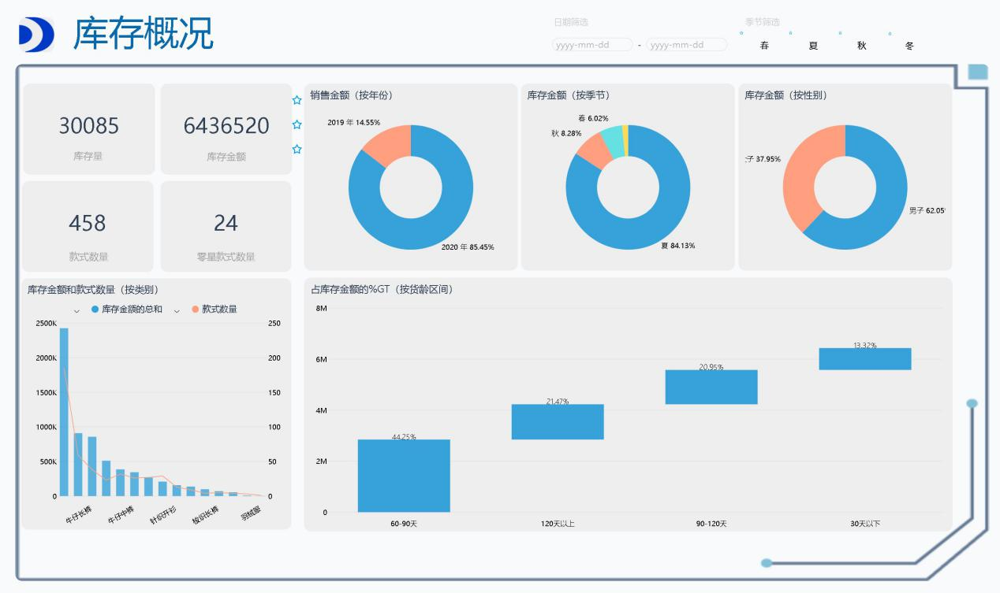
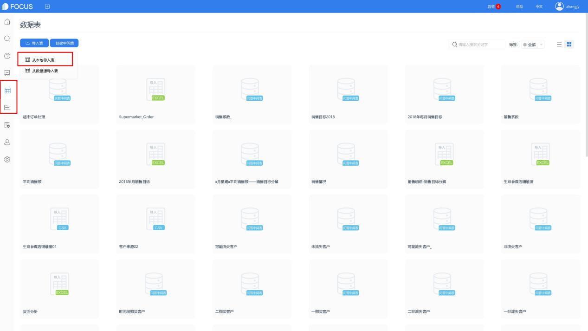
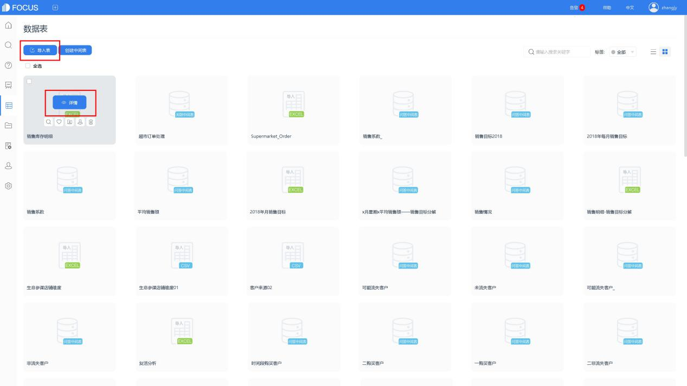
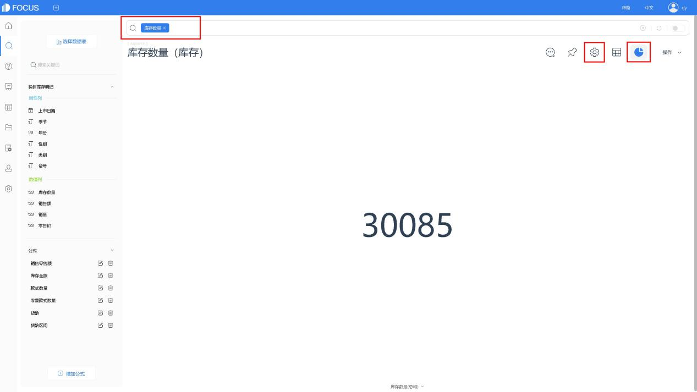
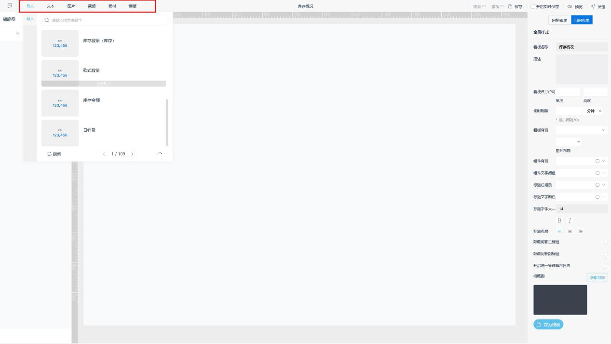
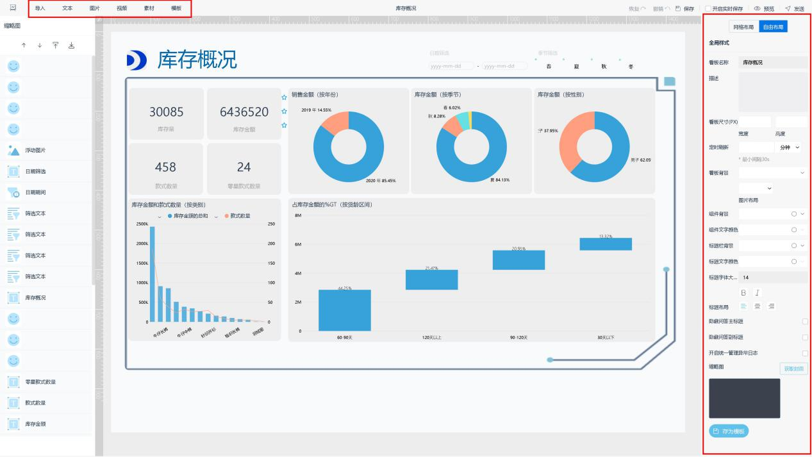

商品是销售的弹药，不足或不合适的弹药，无法使销售人员在战场上得到充分表现，获得良好的业绩。对于存货情况的分析，可以从库存状况、销售状况、仓储状况等角度进行分析。

今天，我们先来了解如何通过DataFocus，分析并制作一份库存概况的可视化报告。

## 1、创建数据源

登录DataFocus Cloud 后，我们先进入数据表管理模块，将工作表“销售库存明细”导入系统。

导入成功后，进入表详情，将年份的列类型改为“属性列”，再进入搜索模块，选择该表作为数据源表。

## 2、建立公式列

在搜索页面，点击增加公式按钮，新建公式列。

### 计算销售零售额、库存金额

将商品零售价分别乘以销量、库存数量，计算销售零售额和库存金额。

【销售零售额】销量\*零售价

【库存金额】库存数量\*零售价

### 计算款式数量

将库存为0的款式排除，对货号进行非重复计数，

【款式数量】unique\_count\_if(库存数量>0,货号)

### 计算零星款式数量

零星款式，是指库存数量低于一定量的款式，零星款式太多意味着可能有大量断码款式，需要及时处理。这里，我们定义库存数量少于6为零星款式。

【零星款式数量】unique\_count\_if(库存数量大于0 and库存数量小于6,货号)

### 计算货龄区间

我们先计算货龄，将计算日期截止到2020年6月30日。使用公式diff\_days计算天数差值，再“+1”将当天也算一天。

【货龄】diff\_days(" 2020-06-30" ,上市日期)+1

再新建公式，嵌套“货龄”公式列并使用公式if...then...else计算货龄区间。

【货龄区间】 if 货龄<=30 then" 30天以下" else if 货龄<=60 and 货龄>30 then" 30-60天" else if 货龄<=90 and 货龄>60 then" 60-90天"else if 货龄<=120 and 货龄>90 then" 90-120天"else" 120天以上"

## 搜索分析

### （1）库存数量、库存金额、款式数量、零星款式数量

可视化大屏中的总体数据情况，可以选择图表“KPI指标”进行显示。

制图时，双击或搜索框中输入列名，如“库存数量”，再于图形转换中切换为KPI指标，最后进行图表属性设置，并在操作栏下保存为历史问答，如图所示。

类似地，也可以对库存金额、款式数量、零星款式数量进行相同设置。

### 分别按年份、季节、性别查看库存金额

查看各年份的库存金额，双击列名“库存金额”“年份”，在“图形转换”中转换为环图，最后进入图表属性，进行标签等设置，在操作栏下保存为历史问答，即完成“按年份查看库存金额”的环图制作。类似地，可以按季节、按性别查看库存金额。

若原表中只有具体日期列，无单独的“年份”、“季节”数据，则可以使用关键词如“每年”、“每季度”对数据进行统计。

### 产品类别组合图

双击列“库存金额”、“款式数量”、“类别”，选择组合图，并在图表右侧的“配置图”设置中，将“款式数量”放置右y轴。最后，在图表列名称处点击排序按钮，将“库存金额”按降序显示，保存为历史问答。

### 货龄区间瀑布图

双击列名“货龄区间”、“库存金额”，转换为瀑布图，并设置数据标签，保存为历史问答。

## 4、库存概况大屏

历史问答制作完成后，即可开始可视化大屏的制作。

进入数据看板模块，创建并选择空白模板。创建成功后，跳转至编辑界面，导入刚制作好的历史问答。

并添加各类组件，如时间筛选框、文本筛选框、图片。调整组件位置、颜色、字体大小等等，最后进行保存，即可制作完成“库存概况可视化大屏”，即库存概况的可视化报告。

