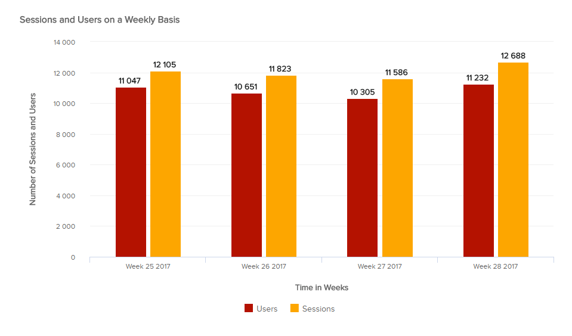
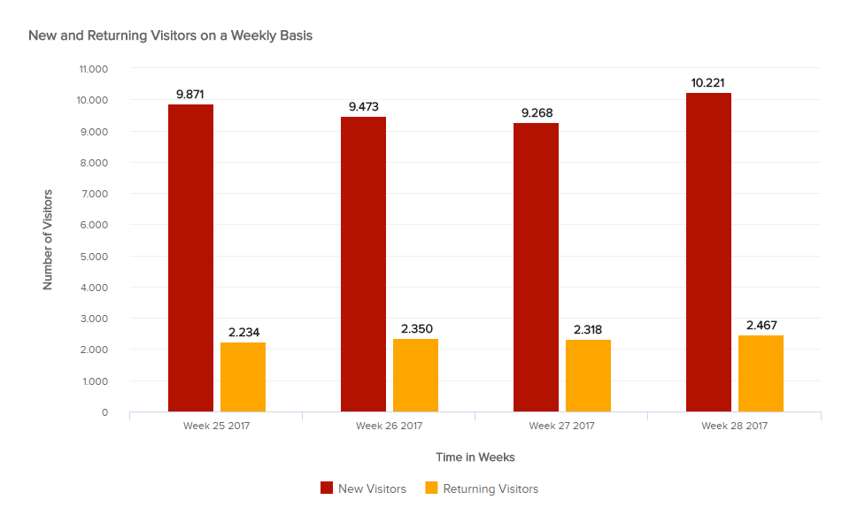
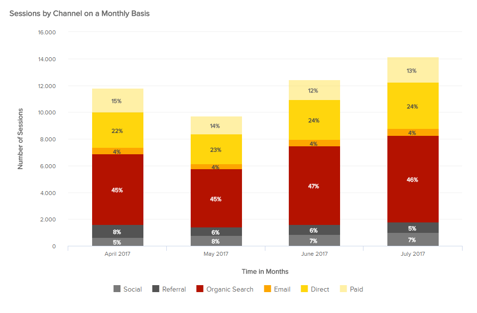
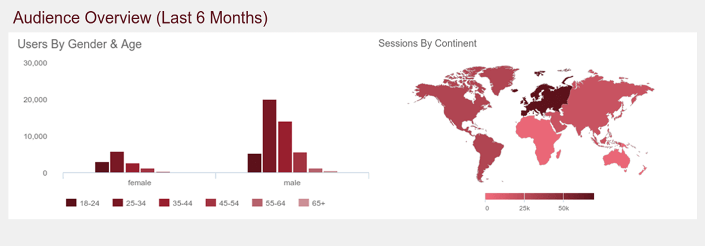
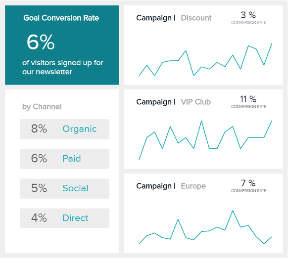

市场营销是公司中一个高度数据驱动的部门。一切的数字化使营销人员更容易了解消费者的行为，即使要付出代价：数据过载。拥有一个在线网站并不意味着再增加您对更广泛受众的知名度。这意味着要了解受众是谁、他们的兴趣、他们的行为方式，并利用这些知识尽可能地定制他们的体验。网站流量指标可帮助您衡量网站上发生的几乎所有事情，允许您调整和优化它以提高其性能。有效管理所有这些数据的最佳方法是使用[仪表板软件](https://www.datafocus.ai/infos/best-dashboard-software-features)，它可以让您在没有先验知识的情况下轻松探索、监控和报告您的数据。您可以构建[营销仪表板](https://www.datafocus.ai/infos/dashboard-examples-and-templates-marketing)只需单击几下，即可立即与您的团队分享您的见解。

通过跟踪正确的网站指标，您可以评估和识别数据中的相关模式。这是非常有价值的，因为如果没有衡量，营销就会变成一场猜谜游戏：如果你不检查结果，你怎么知道你的各种活动的成功（或失败）程度？在调整和制定可靠的营销策略时，网络分析指标至关重要。让我们回顾一下您应该跟踪的 10 个重要指标，以确保您的网站取得成功

## 提高网站性能需要衡量的 10 个网站指标

### 1) 总流量：访问者数量及其来源

\*\*点击放大\*\*

首先，这些网络分析指标中最重要的是访问您网站的人数：您的流量。会话数计算了在一定时间内访问您网站的每个用户，该受众分为两个不同的部分：新访问者和回访者。回访者是在特定时间范围内两次访问您的网站的人。

\*\*点击放大\*\*

回访者是衡量您的努力是否得到回报的一个很好的网站指标：它告诉您您的设计和用户体验是否足够吸引访问者回来。同样，如果您决定更改内容或结构，并且看到回访者减少，则可能意味着出现一防止再次访问的问题。

\*\*点击放大\*\*

使用网站流量指标评估的另一个有趣方面是您的访问者来自_哪里：搜索引擎（以及自然流量）？_推荐人（来自其他网站链接的人）？社交媒体平台？直接从网址栏？电子邮件活动？了解人们如何找到您的网站对于您了解在哪里投入时间、精力和金钱是很有价值的信息。您可以将这个指标与本文将进一步详细介绍的另一个指标一起评估：转化率。并行化流量来源以及它们的转化程度将帮助您更好地分配资源！

### 2) 访客人口统计

\*\*点击放大\*\*

既然您知道有多少人访问了您的网站，如果他们回来了，以及他们来自哪里，您可能想“个别地”了解更多关于他们的信息。我们的第二个网站指标侧重于访问者的人口统计，即他们的年龄、性别、地理位置和语言，以及他们在您的页面上使用的设备和系统。

如果您调查谁访问了您的页面，您将能够通过更好地定位您的受众来完善您的策略。事实上，您对 18-25 岁随时使用移动设备的用户和对55 岁以上的在工作时间从桌面设备访问的用户的称呼方式将大不相同。只有通过正确的定制，您的营销和广告活动才会变得更好。

此外，这将有助于您的博客和网站的内容规划，从而尽可能地接触到最多的人。最后，它还有助于您的网站设计：如果您的大部分流量来自移动设备，您最好有一个适合移动设备的响应式设计，否则您会赶走您的用户。

### 3) 移动流量与桌面流量

\*\*点击放大\*\*

这个非常简单的网站指标将来自移动和平板设备的流量与来自台式计算机的流量进行比较。跟踪这些数字对于您的网站设计非常重要，它应该适应您的用户的习惯。自 2016 年底以来，移动流量已超过桌面流量，这意味着消费者的互联网习惯发生了巨大变化：现在，人们随时随地都可以访问，或者几乎可以访问。虽然这对营销人员来说是个好消息，但对网站管理员来说却是一个真正的挑战：他们必须创建两个或三个版本的网站（自适应设计），以确保不同屏幕尺寸的用户拥有良好的用户体验。网站所有者还开发了响应式设计，一种根据使用的设备而变化的布局，以便用户获得最佳的观看体验。响应式设计是当今开发网站的最佳方式，因为现在谷歌使用网页的移动版本“用于索引和排名，以更好地帮助我们的 - 主要是移动端 - 用户找到他们正在寻找的东西”，他们在一篇博文中写道。

我们都记得臭名昭著的_Mobileggedon_，这是 2015 年的谷歌算法更新，因为它优先考虑让人们在智能手机和平板电脑上搜索移动友好的网站，这激怒了网站管理员。这导致页面排名的潜在下降，这不可避免地会损害公司获得新客户的机会。

但是，您可能缺乏时间和资源来开发多个版本的网站。如果您发现只有五分之一的观众来自平板电脑和智能手机，那么投资回报可能不值得。但是，如果您意识到三分之一或更多的访问者不是桌面访问者，您可能希望真正深入了解并开发一个适合移动设备的页面，这将更有可能将访问者转化为客户而不是将他们赶走。这种移动流量很大程度上取决于您的产品、行业和受众。当谈到订购外卖时，移动设备是首选（应用程序开发更是如此

### 4) 页面加载时间

\*\*点击放大\*\*

在各种网站指标中，在注意力持续时间越来越短的今天，这一指标尤为重要。客户很快就会根据一个公司的网站来判断其专业性。他们已经通过访问您的网站表现出对您的业务的兴趣——如果他们得到的第一件事是模糊的徽标或加载缓慢的欢迎信息，您可能会给他们一个相当“无聊”的印象。

确保您的平均加载时间（或加载您在浏览器屏幕中看到的大部分内容所需的时间）尽可能短，以免将用户吓跑。为此，您可以使用速度洞察工具来评估您的页面针对移动设备和网站的优化程度，以及需要改进的痛点以加快加载时间，这将不可避免地减少您的跳出率。如果某些页面的跳出率很高，则绝对应该检查页面加载时间。

另一个“隐藏”的、鲜为人知的加载时间长的问题是您的整体 SERP 排名。从 搜索引擎优化的角度来看，Google Adwords 在抓取网站时考虑了用户体验，加载时间缓慢会产生负面影响。因此，尽可能多地优化您的网站以最大限度地提高获得更好排名的机会非常重要，因为它会对网站产生负面影响，尤其是对于移动流量。但是，它可能并不总是取决于您：有时，在墨西哥，互联网交付托管在澳大利亚服务器上的内容的速度很慢，但有一个解决方案：CDN。CDN 是内容交付网络，它们的任务是通过将其内容的缓存版本存储在多个地理位置来虚拟缩短访问者和网站服务器之间的物理距离。每个位置，或存在点 (PoP) 拥有一定数量的缓存服务器，负责向其附近的访问者传递内容。这样，延迟会大大减少（并且用户满意度会提高！）。

一般来说，您应该根据两个特征检查您的页面加载时间：不同的重要登录页面，因为它们是您要关注的页面；以及不同的地理位置，尤其是当您是国际品牌时。

### 5) 用户行为指标：跳出率、会话持续时间和每个会话的页数

用户行为是另一项丰富的知识，可以帮助您大大改善您的网站。作为起点，您可以通过三个 Web 分析指标（即使还有更多指标）来分析用户行为：跳出率、平均会话持续时间和每个会话访问的页面数。

跳出率对应于您网站上单页会话的百分比，即用户直接从入口页面离开您的网站，因此只查看一页的用户百分比。每个会话的页面数计算用户在离开之前看到的页面数，而会话持续时间评估用户在您的网站上平均花费的时间。

但是，这些网站分析指标有一些特殊性需要详细说明——即会话持续时间。进一步分析和并行化度量结果也很重要，而不是单独查看每个结果并尝试推断行为。

首先，Google 对会话持续时间的计算有点偏差：它将会话持续时间除以会话数——到目前为止一切看起来都很好。问题是谷歌_无法_衡量用户在离开之前在网站_最后一页上花费的时间。_因此，如果一个会话只访问了几个页面，那么最后一个访问页面的丢失会对整个会话持续时间产生很大影响。如果网站的跳出率很高——而在入口页面上花费的时间可能是 30 分钟——会话将被计为 1，但时间计为 0。因为谷歌使用浏览下一页的时间来计算在当前页面上花费的时间，所以不可能知道人们在退出之前在最后一个（或唯一）页面上花费了多长时间。

这就是为什么将会话持续时间与跳出率同时查看很重要的原因，因为它不能单独为您提供对用户黏性的真实评估。高跳出率可能表示“糟糕”、不吸引人的内容或误导性广告。这很棘手，因为它也可能转化为高效的设计，人们可以直接在第一页上找到他们想要的东西。这就是为什么您还应该根据其他网站分析指标对其进行评估。一般来说，您的目标应该是跳出率低于 40%。如果超过 55%，则需要找出人们立即离开的原因。但同样，这取决于许多不同的因素：您的行业、相关的登录页面、目标等。如果跳出率很高，您还应该向下滚动的是该页面的滚动深度。这将为您提供更多有关用户行为和交互的信息。我们将在本文后面讨论滚动深度（见下一点）。

如果跳出率低且会话持续时间长，您就知道流量的质量很好，并且您可以比较不同流量来源的这些结果，以了解哪一个带来了更高质量的受众。但总的来说，如果您的跳出率很高（超过 80%），会话持续时间将不准确。

### 6) 网站交互指标：CTA 的点击率和滚动深度

我们的第六个网站指标侧重于用户在您的页面上的交互，也就是您有意创建的将客户转化为潜在客户的按钮：CTA 或号召性用语。

您的号召性用语可能因您的策略、目标，当然还有您的产品/服务/行业而异。它可以是点击下载白皮书的按钮，也可以是注册试用版、时事通讯或广告。您创建的每一个 CTA 都需要进行跟踪，以便您了解它们是否不仅有效，而且还可以比较哪些效果更好。

为此，您将查看他们的 CTR 或点击率，它衡量的是您的 CTA 的点击次数与其展示次数（或查看次数）的比率。要分析此指标，您可能需要对您所在行业的其他公司的点击率进行基准测试，并比较您与他们的表现。您还可以将您的点击率与您之前的历史点击率进行比较，并查看演变，尤其是在您对号召性用语进行更改之后。显然需要对这些变化进行评估，以从中学习并重现最佳实践。CTA 的更改可能与按钮或弹出窗口的颜色、显示的文本、图像、位置、设计、报价本身或所有这些组合有关。在一次全部更改它们之前，请考虑在单独的测试中单独更改它们，否则您将不知道真正的影响是什么。在具有相似流量的不同内容页面上进行 A/B 测试，并提供不同的展示位置和设计，可以帮助您确定导致 CTA 成功的因素。

您可以评估的另一件事是访问者在您的页面上的滚动深度。这衡量了他们在页面的下拉程度——25%、50%、75% 或 100% 的内容，这意味着他们阅读了所有内容。这主要是一个移动参数，因为滚动是使用智能手机或平板电脑浏览内容的主要方式。它被用作“代理”黏性指标，以帮助您衡量用户的黏性，从而确定在哪里投放广告/CTA 最好。

滚动深度还可以帮助您更好地重组您的内容，从而更有效地组织它：如果用户一直向下滚动到底部，然后单击常见问题解答，这可能意味着他们无法找到他们正在寻找的内容。通常，当您拥有长篇内容（例如博客文章）时，滚动深度是一个很好的黏性指标。

### 7) 转化率

我们的第七个网站指标是转化率。它衡量的是导致你预先设定的期望行为的访问百分比:购买东西、下载白皮书、订阅新闻通讯等。

如您所见，这些转化彼此不同，因此您不能将它们全部归于同一范畴，并将它们计入同一目标转化。您网站的不同页面可以针对不同的转化：例如，博客可能希望让订阅者添加到其列表中，而产品页面可能旨在注册新用户以进行试用。目标转化率是显示您的网站是否实现其业务目标的主要指标。

关于这些目标转换，你可以做的一件事是根据不同的标准对其进行细分，以了解您的用户及其行为。您可以对每个渠道的转化进行细分，并查看哪些转化带来了最佳结果。您还可以查看各种登录页的转化率。登录页面非常重要，您应该最大限度地对优化它们，以使它们发挥最大的作用。当然，请记住，如果您将不同登录页面相互比较，它们的目标转换也应该具有可比性：点击视频通常比输入电子邮件和名称进行注册更有效。

### 8) 每个会话的热门登录页面和页面停留时间

\*\*点击放大\*\*

您正在花时间开发一个高效的登录页面，以促进潜在客户的产生或转化——但您是否正在检查所有这些努力是否得到回报？

像上面讨论的大多数网络分析指标一样，根据某些标准对登录页进行排名，可以让您深入了解工作的效率，以及它是否实现了目标。测量每天、每周或每月的会话数量并观察其演变，可以让您更多地了解观众的行为：他们是在工作日还是周末访问更多？促销后流量是否出现高峰或突然中断？比较它们之间的登录页面，以查看哪些内容（尤其是博客）比其他内容更有效，从而重现此类最佳实践。

跟踪访问者在登录页上停留的时间也很重要：对于博客文章、带有课程的教育网站等，较长的页面停留时间意味着您提供的内容对读者有价值。然而，正如我们之前所见，由于谷歌的衡量方式，这个网站指标也有点偏差，但它仍然比平均会话持续时间更准确——当你的跳出率低于 50% 时更是如此。事实上，Google 会计算每次点击到另一个页面的页面时间，因为每次点击都带有一个时间戳（小时、分钟、秒），这有助于计算。但是退出页面是错误的，因为它没有“下一个时间戳”，所以没有考虑到这一点。衡量它的公式是页面上的平均时间 = 页面上的时间/（页面浏览量 - 退出）。但是谷歌试图通过只计算与页面有交互的用户来平衡这个缺陷，即不包括跳出——这是与会话持续时间的主要区别，这也使页面上的时间相对更准确。在上面的示例中，我们看到关于 5 个谷歌分析 KPI 的博客文章，页面停留时间和会话持续时间之间的差异很大：前者为 49.2 秒，后者为 271.6 秒。当我们查看跳出率时，我们发现它几乎是 90%：这意味着对于会话持续时间，90% 的数据是用“0”计算的，因为 Google 无法衡量它！

为了更轻松地跟踪这些指标，因为 谷歌不在页面上显示时间并且需要创建特定的细分，现代仪表板提供了交互式[仪表板功能](https://www.datafocus.ai/infos/interactive-dashboard-features)，例如条件格式，可以让您查看您想要的内容以及您想要的方式。例如，如果您想跟踪特定事件并了解跳出率的任何峰值或低点，设置[数据警报](https://www.datafocus.ai/infos/business-intelligence-data-alerts)以在发生任何变化时立即警告您——然后您可以做出相应的反应，而不会浪费时间。

### 9) 顶级推荐域

正如我们在第一个网站指标（总体流量）中看到的那样，推荐域是将访问者送到您的页面的网站。由于以下几个原因，链接汁非常重要：首先，如果推荐人具有较高的域权限，这尤其适用，它将帮助您在搜索引擎上获得更好的排名；其次，矛盾的是 ，它会减少你对搜索引擎的依赖。有许多指向您的链接，表明您做得很好并提供了有价值的内容。但要小心不良链接，例如付费让您的链接出现在与您的行业或产品无关的网站上，或者被低权威的垃圾邮件域名推荐——这是谷歌批准的。

了解谁经常推荐您并向您的网站发送大量流量可能会告诉您在哪里为广告活动分配资源，以利用已经对您感兴趣的受众。它还可以让您知道您在公关方面是否做得很好，以及以您的品牌为特色的访客博客是否在流量方面有所回报。一般来说，查看推荐列表可以让您更好地确定来自这些网站的受众的兴趣，他们通常阅读的内容（他们的登录页面），让您为他们优化内容并将他们转化为客户！

您必须仔细研究推荐人的各个方面，以避免利用不相关的推荐人。推荐流量的质量是您应该注意的另一件事，以便了解什么是最佳推荐人。检查您的社交媒体活动如何运作，它们是否给您的网站带来流量，质量是另一个最佳做法。

最后，看看你的哪些页面被引用最多。如果它们也在最顶端的登录页面列表上，则意味着这是你获得的最好的内容，您应该集中精力进行转换并且还应该复制这些内容。

### 10) 留存率

最后，我们的最后一个网站流量指标涉及电子商务和其他商业网站，用户也可以在这些网站上购买。

留存率是一个非常重要的客户指标，因为获得新客户的 成本是保留老客户的 5 倍。此外，现有客户更有可能将您推荐给朋友和家人，通过值得信赖的顾问帮助您扩大客户群。留存率可以按周、月或年计算。它衡量您的企业（和网站）从现有客户那里产生经常性收入的能力：在特定时间段内，将回头客的数量除以总客户数，就得到了您的比率。

留存率根据您的业务和行业的性质而有很大差异，这就是为什么您应该将其与类似公司的留存率进行比较。一家汽车经销商可能会在一个月或一年甚至两年内很少有回头客——这就是为什么它不能与快时尚品牌相提并论的原因。在任何情况下，目标都是尽可能高地保持留存率。

## 网站指标说明：谷歌分析自定义仪表板

\*\*点击放大\*\*

我们已经在这篇文章中看到，网站指标是丰富多样的。它们让您可以衡量网站的许多不同方面，以便您更好地了解哪些功能正常，哪些不可用，谁来以及如何来。所有这些见解将使您以最佳方式对其进行优化，从而提高其效率并在搜索引擎上获得更好的排名。

在上面的仪表板上，您可以看到对这些网站流量指标进行深思熟虑的利用的示例。它通过详细说明网站用户的人口统计数据、分析他们的行为（会话、频道来源、每次会话的页面以及跳出率）来关注网站的用户。要发现更多像这样的专业仪表板，请查看我们关于[谷歌分析仪表板](https://www.datafocus.ai/infos/dashboard-examples-and-templates-google-analytics)的文章。

要跟踪和管理所有这些指标，选择[营销分析软件](https://www.datafocus.ai/infos/business-intelligence-marketing)是最好的解决方案。它让您可以随时使用并创建专业的[业务仪表板](https://www.datafocus.ai/infos/dashboard-examples-and-templates)来可视化您的数据，让您有更多的空间专注于您最擅长的事情：营销、网站优化、内容制作，应有尽有。它还提供 30 天[免费试用](https://www.datafocus.ai/console/)，供您自行测试和查看。
