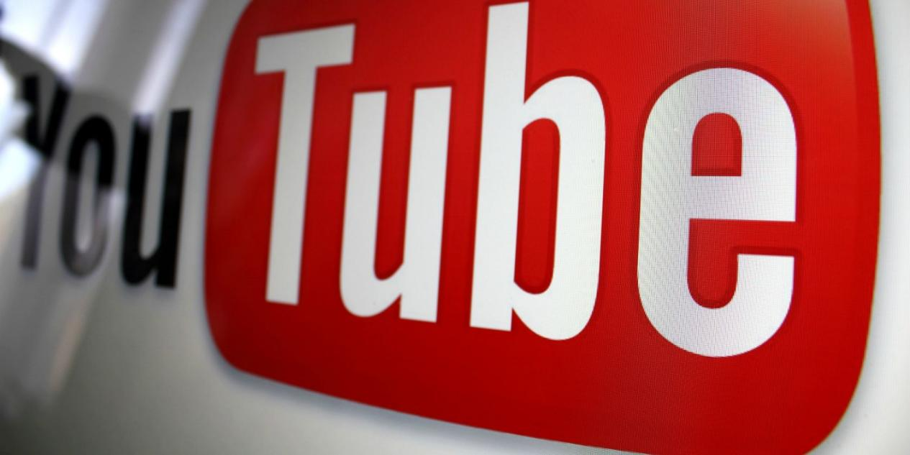
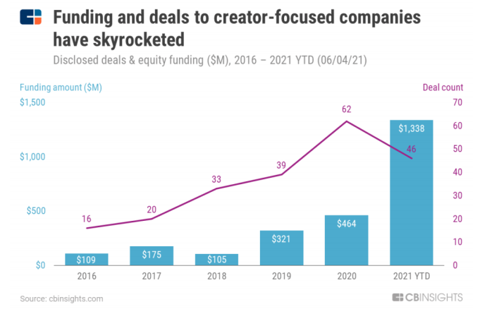
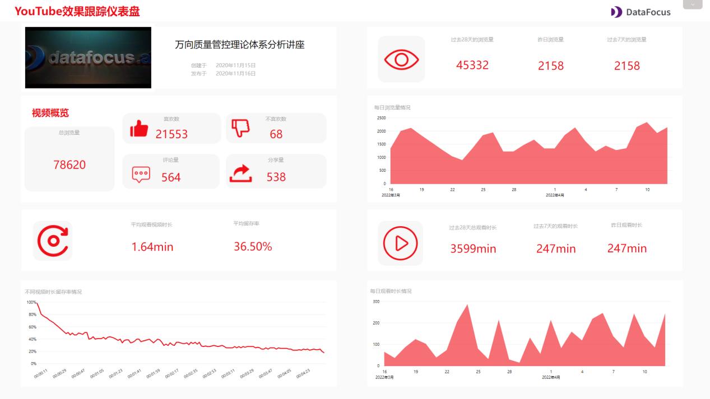
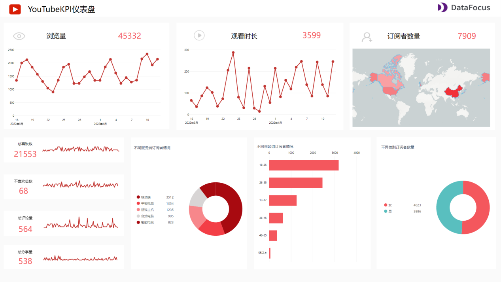
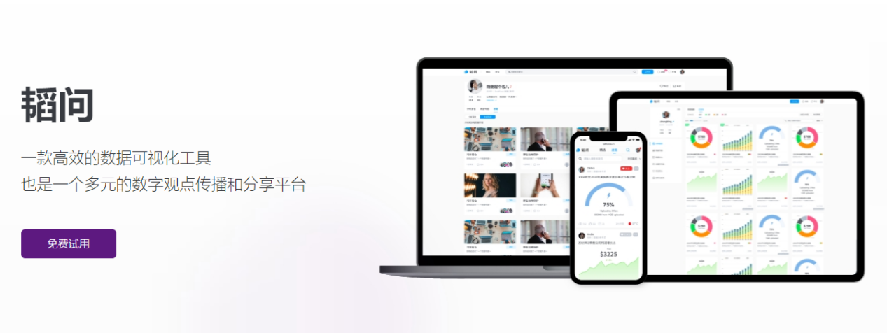

有人说，这是一个创作者的时代。这一点，正在被逐步验证。

国内的B站，国外的“油管”，越来越多的创作者涌入社交媒体中。

从被央视点名，坐拥千万身价的“李子柒”，到新晋现象级超级网红“张同学”，一阵又一阵的“网红潮”跟上了快速网络时代下迅速变换的传播风向。他们持续产出大众喜爱的优质视频，造就了生产精品内容的千万级大IP。

从一无所有的草根逆袭成为第二个“李子柒”，似乎真的不再是梦。

**YouTube关停原创部门后，“创作者经济”成为商业生态核心**

2022年开年，YouTube便宣布关闭原创节目部门，重心转向内容创作者。据YouTube首席商务官Kyncl表示，过去三年中YouTube向创作者、艺术家和媒体公司支付超过300亿美元。

日前，已超200万创作者与YouTube达成合作伙伴关系，为平台注入持续的流量、收入和生命力。

此外，不少以创作者为中心的公司，融资和交易都在急剧增长。一场创作者争夺战已吹响号角。

**内容创作者竞争激烈，各平台上演抢人大战**

全球各大流媒体平台都瞄准了“内容即价值”的路径——创作者能带来丰富、优质的内容从而带来更大的商业价值，纷纷对创作者们伸出了橄榄枝。

吸引创作者最直接的方式，就是“砸钱”。

早在2020年，Snapchat便宣布每日向短视频创作者发放100万美元奖金，每天在Spotlight上发短视频的创作者数量一度创下历史新高。

而2021年5月，YouTube也宣布创建Short Fund基金，并在1年内提供1亿美元的创作者奖励。相似的还有Instagram，11月宣布了Reels Surprise奖金计划，每周奖励150名美国创作者最高1万美元，鼓励其制作“鼓舞人心、有趣”的短视频。

奖励颇丰的背后无疑是创作者激烈的竞争。

**那么问题来了，如何在这几百万的创作者中脱颖而出？**

**得用户者得天下，用数据者得永生**

没有人是天生的大V，哪怕是李子柒，也不是毫无目的随心所欲地更新内容，而是符合自己兴趣爱好的同时，根据大众的喜好制作视频，甚至说背后还有一个专业的团队支撑。

虽说人们的喜好都是主观的，可客观的数据能够作为可量化的标准来为我们提供相关信息。

什么样的人爱看你的视频，爱看你的又是哪一类视频，这些都是创作者应该了解且值得优化的空间，而这背后涵盖的便是**一招鲜吃遍天的数据分析能力**。

或许你会说作为普通人，真的需要有数据分析这样高大上的能力吗？

答案毋庸置疑，真的需要！

数据能帮助我们科学有逻辑地做事，以结果为导向有目标地行动。就像做视频，了解用户喜爱的内容去有的放矢，才是成为百万大V的根本之道。

而选择一款合适的工具，更是对于做数据分析如虎添翼。

**YouTube可视化大屏成为涨粉利器**

YouTube可视化大屏是一个强大的工具，它将一个个图表放置于一张大屏上

，你可以跟踪频道信息、视频效果、观众行为，并根据大屏的数据信息思考得出有关如何优化视频的策略。

下面简单分享几个YouTube主题的可视化大屏。

## YouTube效果跟踪仪表盘

这张大屏主要是分析单个YouTube视频的相关数据，可以看到视频的基础互动数据，如浏览量、喜欢数、不喜欢数、评论量、分享量。这些数据关系到YouTube算法推荐，直接影响到视频的曝光，另外也反映了视频内容质量，便于优化视频。

此外还分析了浏览量变化和观看时长变化情况。浏览量和观看时长当然越高越好，这两个数据都会为视频“雪球效应”做铺垫。

最后还分析了观众留存情况。YouTube平台上尤其要关注前15秒的视频，这时候是留存率最高的时间，之后就会骤降。也就是说通过试验和优化视频，尤其在这15秒钟设置好内容，可以有效提升留存率，吸引用户观看更多的时间。

## YouTube频道效果仪表盘

这张大屏主要侧重于分析你的YouTube频道。

左上角显示的是总共多少订阅者，一段时间内涨了多少粉，掉了多少粉。旁边则主要显示观看次数，总共获得了多少次观看次数、每日平均观看次数、每日平均活跃用户数。根据不同时间的观看次数，你可以选择合适的发布时间，例如可以选择每天的下午18：00，这个时候观看人数会比其他时候多。

大屏右侧放置了观众的喜欢、不喜欢、评论、分享等视频互动数据，反应的是观众的参与度。喜欢和不喜欢都只需要观众点击即可，而评论和分享数据都更能体现内容的优质，它们需要用户主动耗费成本去行动，分享反映的是你的内容足够的有趣，以至于观众认可你的内容下并主动分享给了他们的朋友。

最后显示了视频流量的渠道，了解用户发现你视频的行为，才能更好地优化视频，以便用户更容易找到你的视频并观看。

## YouTubeKPI仪表盘

最后这张大屏主要了解的是你的用户画像是什么样的，是否与你的期望用户匹配。

大屏展示了观众的地区、年龄、性别、使用设备等信息。不同地区、不同年龄、不同性别人群关注点当然不同，观看视频的习惯也会不同。因此了解这些数据情况后，可以调整好视频内容的制作与发布，使其尽可能地贴近用户爱好与习惯，从而获得更多粉丝。

看完了大屏，是不是会有这样的疑问，这样简单美观又好用的可视化大屏工具使用起来方便吗？价格贵吗？

**轻松上手，简单好用，还有免费版**

相比于市面上很多的数据分析工具，这一款**无代码，通过搜索就可进行数据分析**的工具**DataFocus**可就容易得多了。

完全就是一种所见即所得的方式。在搜索框搜索“每日”“阅读量”即可看到视频每日阅读量情况。

这几乎是面向所有业务人员，哪怕是数据分析小白也能接受的交互方式。现在加入还能享受免费试用14天的优惠！

当然如果你只是想使用这款工具制作图表，完全没问题，这款工具最近还推出了免费版。网页一键登录，随时随地都可数据分析。

我们大多数人都不是天生的宠儿，没法“一夜爆红”，一发视频观看量就立刻爆100w+。

唯有脚踏实地做好优质内容，并通过合适的数据分析工具对视频内容进行反馈，重新调整内容俘获用户的心，方能成为下一个“李子柒”。

最后感谢阅读，欢迎点赞与转发。关注我，更多精彩尽在主页和评论区哦！
