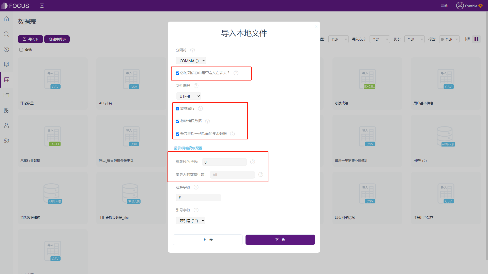
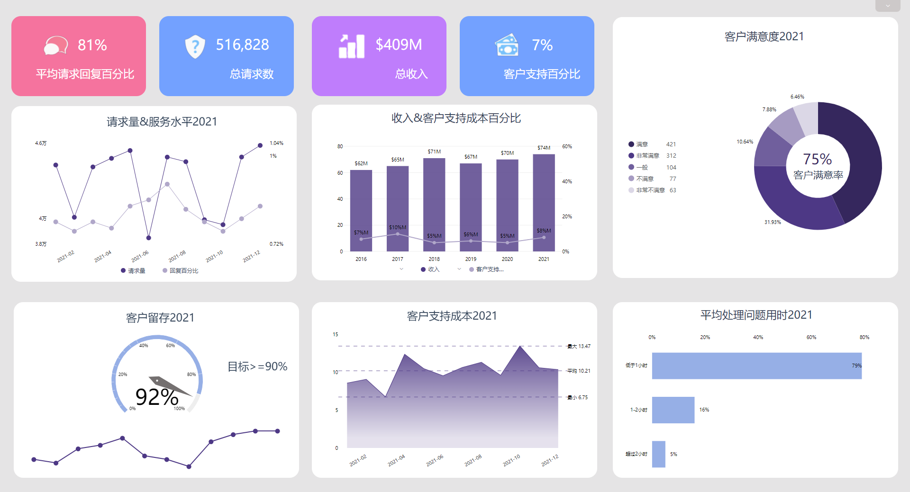

无论身处公司的哪个部门或以什么角色参与工作，数据分析对公司所有员工都至关重要。对于分析最新活动的投资回报的营销人员，或是审查使用数据的产品经理，识别、探索趋势和波动的能力都是帮助决策的一项基本技能。

但Splunk的一项全球调查表明，企业收集的所有数据中，有55%是“暗数据”，即收集但从未使用过的信息。这些未被使用的数据，有些是因为公司不知道它已经被收集，有些则是因为团队不知道如何进行分析。

同一项调查发现，76%的高管认为对现有员工进行数据科学培训将有助于解决公司的暗数据问题。如果员工了解如何分析不同类型的数据，公司将能够更好地利用收集到的信息。

幸运的是，数据分析是一项可以学习的技能。无需成为“数字人”、拥有高级统计学学位或通过数小时的深入培训来了解如何分析数据。相反，通过本篇指南，我们希望可以帮助您掌握一些基本的数据分析技能——从清理数据、选择正确的分析工具以及分析模式和趋势，以便能够得出准确的结论和可行性的见解。

### **定义你的目标**

在开始分析数据之前，第一步需要设定一些明确的目标。

设定的目标可能会因为所在的团队、收集的数据以及您在企业中的角色而有所不同，例如：

- 财务团队希望通过分析团队费用数据来寻找节约成本的机会
- 营销团队正在寻找通过查看潜在客户活动的变化来提高免费试用转化率的方法
- 技术团队需要了解有多少客户受到最近一次服务中断的影响，因此需要查看大量产品使用数据
- 产品团队需要在产品路线图中优先考虑新功能和错误修复，以便分析产品最近的支持情况以及了解对客户最重要的内容

这些目标可以引导收集什么样的数据、使用什么样的分析工具以及从数据集中获得什么样的见解。

### 清理数据并删除不需要的任何内容

数据分析结果的好坏取决于开始使用的数据。如果您获得的数据不完整、不准确或不一致，那么分析结果将可能会不完整或存在误导性。因此，收集到数据后的下一步，需要花费一定的时间进行清理，确保数据前后一致并且不包含重复信息。

查看小型数据集时，我们可以知道，在电子表格Excel中进行手动清理是最容易的。接下来，举几个清理数据的简单操作：

- 添加标题行以便于理解电子表格每一列信息的含义
- 如果数据集中存在同一记录的多个副本，可以删除重复的行或列
- 可以删除一部分在分析过程中不打算使用的行或列
- 标准化数据，统一数字、日期或货币等数值的表达方式

如果需要处理大量数据集，可以考虑借助一些专用的数据清理工具来加快数据处理的速度。或者借助一些自带前期数据处理功能的分析工具，例如DataFocus。

除此之外，还可以从源头上，选择实施数据治理策略，为公司如何收集和管理数据制定明确的指导方针，可以大大减少将来花费在清理数据上的时间。一些数据治理最佳实践包括：

1. 为何时以及如何收集数据创建标准流程
2. 采用标准化命名约定以减少数据中的不一致
3. 如果已采用自动化数据收集，需要注意任何错误消息及不正确的数据
4. 编辑和更新过去收集的数据，使其符合新标准

清理和标准化数据是分析数据的重要准备步骤。数据清理可以帮助用户不至于基于不正确的数据得出错误的结论，并且更有可能获得有用的见解。

### **构建数据分析工具包**

目前大多数公司依靠Excel或其他电子表格工具来存储和分析他们的数据，但是有许多不同的平台可以帮助您分析数据。使用何种类型的数据分析工具主要取决于两件事：

1. 需要分析的数据类型。定量数据通常是数字的，比较适合在电子表格和可视化工具中呈现。但定性数据（例如问卷答案、调查回复、支持票或社交媒体消息）是非结构化的，因此很难仅在电子表格中得出有用的见解。您需要一种对定性数据进行分类或结构化的工具，以便能够有效地对其进行分析。
2. 需要分析的数据量。如果每周或每月只分析一个小数据集，也许完全可以手动进行分析。但是，您处理的数据量越大，就越有可能需要投资于自动化数据分析工具。这些平台将减少人为错误的可能性并加快分析过程。

以下是对数据分析工具的分类，按照其最适合的特定类型进行划分：

- **Excel或Google表格**等电子表格是最传统的工具，非常适合小批量数据分析或数据检查，无需深入的技术知识即可开始
- 需要收集和分析中大型数据集以发现趋势、问题和决策的公司建议使用**商业智能(BI)工具**
- **预测分析工具**使用公司的历史数据和机器学习来预测绩效变化将如何影响未来结果
- **数据建模工具**表示信息如何在各种业务系统之间流动和连接。公司使用数据建模工具来查看哪些部门拥有哪些数据以及这些数据集如何交互
- **数据可视化工具**以表格、图形和其他多样化的形式表示信息，以便更轻松地发现数据集中的趋势

当然，现在市面上主流的商业智能BI工具，例如DataFocus，都是将数据建模、数据预处理、数据可视化以及权限控制等功能集成后的工具，基本一个工具就可以满足公司的日常分析需求。

### **在数据中寻找模式和趋势**

数据清洗完成，并且已经选定用到的分析工具，接下里，就可以开始数据分析过程了。

首先，在数据集中寻找趋势。这是最基础，也是最容易发现的。针对数字数据和结构化数据，选择借助可视化绘制图表是相对容易的；但如果是对于电子邮件、社交媒体信息等非结构化数据，可能需要使用不同的数据分析方法。您可以尝试以下几种数据分析方法：

- **文本分析**使用机器学习从非结构化文本数据中提取信息，例如电子邮件、社交媒体消息、支持票和产品评论等。主要涉及检测和解释这些非结构化数据中的模式。
- **情感分析**使用机器学习和自然语言处理来检测非结构化文本数据中的积极或消极情绪。公司经常使用情绪分析来衡量社交媒体消息、产品反馈和支持票中的品牌认知度。
- **主题分析**使用自然语言处理将预定义的标签分配给文本数据。它对于组织和结构化文本数据很有用。例如，您可以使用主题分析对支持反馈进行分类，帮助了解公司或产品的哪些领域给客户带来的问题最多。
- **队列分析**涉及在特定时间范围内检查相似客户组内的数据。公司可能会查看在同一个月内注册客户的产品使用变化。

其次，发现模式后，不要通过假设相关性就确定数据之间的因果关系。例如，在看到产品注册量激增的同时，社交媒体关注者也在大幅增加，可能会假设所有新用户都来自社交媒体。但是，通过跟踪链接跳转，发现很少有人通过社交媒体访问网站，更不用说注册产品了。因此，一定要花费时间收集足够的证据来检验事件的因果关系。

### **将当前数据与历史趋势进行比较**

当数据中的趋势和问题难以被识别时，可能是因为数据被孤立地查看。没有添加时间维度的对比，数据就只是目前展现的单一快照。

因此建议将当前数据与历史数据进行比较，将发现的趋势置于上下文中起承前启后的作用。当然，针对不存在历史数据的情况，例如一个全新的产品使用数据，可以通过行业基准进行比较。您可以寻找不同公司、公司不同部门或不同行业的绩效基准。

需要注意的一点：如果您使用的是基准数据，可能很难找到与您规模或阶段相似的公司。因此，请记住将这些数据用作参考点，而不是直接将您的表现与这些基准进行比较。

### **寻找与您的期望背道而驰的数据**

当您开始分析数据时，您就已经为想要学习的内容和期望找到的见解设定了明确的目标和假设。但这极有可能会导致确认偏差，因为您更有可能注意到支持您现有假设或假设趋势的数据。

基于此，需要寻找与期望背道而驰的趋势或数据点来保持开放的心态，还可以从原始数据中寻找异常值。当在数据中发现异常时，一定要进一步调查它们，得出解释。

同时，还应该看看数据中有多少异常值会扭曲你的结果。显著的异常值很容易扭曲数据的平均值，因此可能需要跟踪中位数取代平均值。或者可以在分析中将这些异常值剔除。

### **可视化数据并解释结果**

当数据以可视化图表的方式进行展现，会更加直观和灵活，也更容易理解和解释数据，这里我们可以借助DataFocus等BI可视化工具绘制多样化的图表。

DataFocus是国内首款搜索式BI工具，由一群热衷于技术的极客倾情7年打造而成，功能涵盖了一体式湖仓、ELT、下一代智能搜索式BI系统，数据链接器和转换器，并提供全功能的一站式数据分析服务。

同时支持远程数据共享和权限配置，通过历史问答和数据看板，公司团队的任何人都可以随时随地查看数据，大大加快了工作效率。

  

数据看板制作完成后可以保存成看板模板，为后续的分析减轻负担，上述的这些看板样式就是比较基础的看板样式，可以通过注册DataFocus后咨询客服人员免费获得。

**后续步骤：分析数据后要做什么**

分析完成后，如果你不对形成的洞察结果做任何事情，那么收集和分析得出的这些数据是没有意义的。因此，需要将您的发现用于：

- 根据当前的绩效数据设定切合公司实际的目标和KPI
- 改善客户体验，因为分析可以让您更好地了解客户的需求和行为
- 根据对产品使用情况和支持票证的分析，就产品路线图中的优先级做出数据驱动的决策
- 做出更理智、更有依据的业务决策，因为您将清楚地了解什么是有效的，什么是无效的

虽然数据分析可能是一项耗时的任务，但重要的是要记住这不是最终目标。数据分析的意义，是在于帮助用户能够做出明智的决策。
