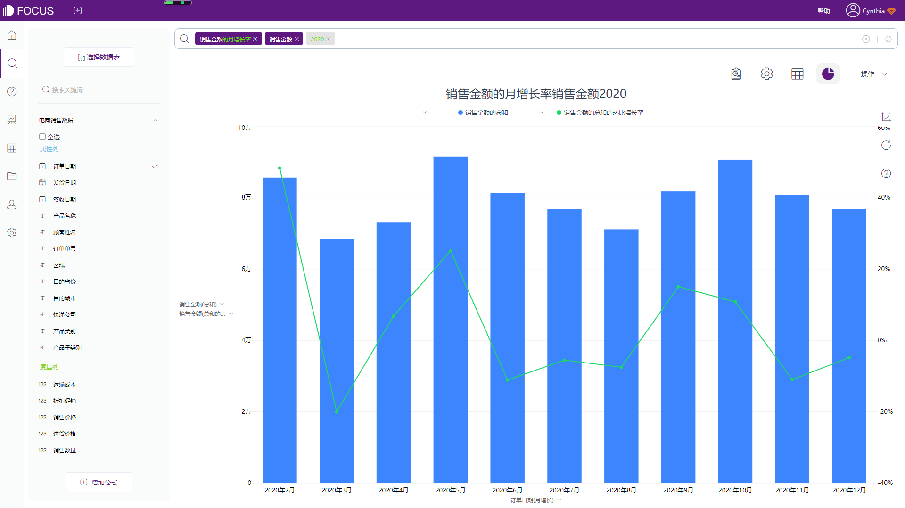
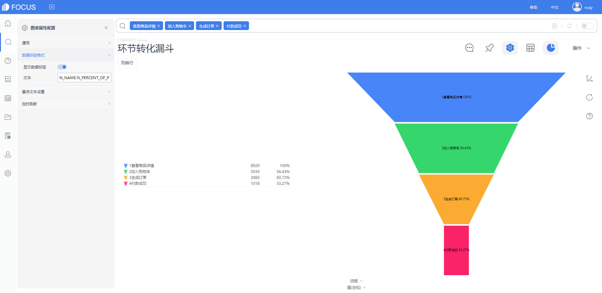

初中数学课上，老师教导我们可以用直接开平方法、配方法、公式法、因式分解法来解一元二次方程，这是由无数前辈的数据家们整理出来的专业解题方法，具备很强的参考性。

那么在遇到实际的数据分析需求时，我们是不是也可以借鉴一些前人积累的“经验技巧”呢？

本文介绍的就是一些通用的分析常见下可以帮助新手数据分析师快速上手，并且对后期构建数据分析模型也会产生一定帮助的5类数据分析方法。主要偏向于专业统计学中的思维层面，不同于基于业务的探索性数据分析。

## **一、公式法**

公式法就是通过计算公式层层拆解某个指标，从而梳理出该指标的影响因素。

举个例子更好的说明：A公司所属的明星产品B在正常销售月份出现了明显的利润下滑，针对这一情况，用公式法进行拆解；

- 利润=营业利润+营业外收入-营业外支出
- 营业利润=销售总量\*（商品单价-商品成本价）
- 销售总量=TB销售量+PXX销售量+JD销售量+...
- TB销售量=商品点开次数\*下单比率
- 商品点开次数=商品曝光量\*点击比率

1）影响利润下滑的因素：在营业外收入和营业外支出不变的情况下，营业利润的下降才会导致总利润的下滑；

2）影响营业利润的因素：是本销售月度的销量异常偏低？商品价格设置不合理？还是商品成本价格上涨？

3）影响总销售量的因素：通过和历史数据对比，找出本月哪个渠道的销售量出现异常；

......

以此类推，通过对利润的逐层拆解，找出实际影响指标的一个或多个因素，细化评估和分析的粒度。

## **二、对比法**

孤立的数据本身并不存在意义，利用对比产生差异，才可以使数据产生意义。对比法是非常常见并通用的方法，利用至少两组及以上的数据进行比较，可以对历史数据进行时间维度上的环比、同比、定基比的增长；也可以添加与竞争对手之间的数据对比等。

_截图来源：DataFocus（数据已脱敏）_

上图就是借助DataFocus系统制作的A公式产品的2020年全年销售额和环比增长情况。对比法可以直观展示数据的波动情况，帮助及时找出数据潜在规律，因此常常被数据分析师所使用。

## **三、象限法**

借助直角坐标系划分两种或以上的维度，直接转换出对应的策略，更好的协助实现落地推动。

象限法主打用策略驱动思维，主要应用于市场分析、产品分析、商品管理、客户管理等。例如经典的RFM客户管理模型，可以将用户按照最近一次消费(Recency)、消费频率(Frequency)、消费金额(Monetary)三个维度划分八个象限，进行客户分群，针对具体客户实施具体的运营策略。

## **四、二八法/帕累托分析**

金融经济学有一句著名的话：世界上20%的人，占有80%的财富。这就是经典的二八法则，也叫二八定律或帕累托法则。

将这句话转换到企业内部，就是企业中80%的利润来源于20%的重要客户或产品。因此我们的数据分析可以围绕着这20%的客户或重点产品展开。

_截图来源：DataFocus（数据已脱敏）_

如上图所示，将A公司的所有产品按照汇总的销售额进行排序，可以得出占比20%的核心产品，分析业务运营的主次问题，努力将剩余的80%往20%的方向靠，优化产品运营。

## **五、漏斗法**

漏斗法就是借助漏斗模型，分析每一环节的转换率，体现了一种流程化的思考模式，比较适用于用户注册和网站购物转化这种具有一定流程的分析模型。

_截图来源：DataFocus（数据已脱敏）_

上图所示是一个简易的营销漏斗，简单展示了客户从查看到付款的流程，具体流程的复杂程度还要参考实际业务。

**漏斗模型的核心思想是分解和量化。**

分解是指拆分业务流程的每一个步骤，量化则是用相邻环节的转化率衡量的。提升整体的转化率就是漏斗模型最终的目标。

当然，上述介绍的5中数据分析方法并不是独立的，可以试着将多种方法结合在一起使用，进行数据分析。

借助DataFocus系统将最后的分析结果用数据看板进行展示，用数据驱动决策。各位小伙伴有什么疑问欢迎在评论区留言哦~
