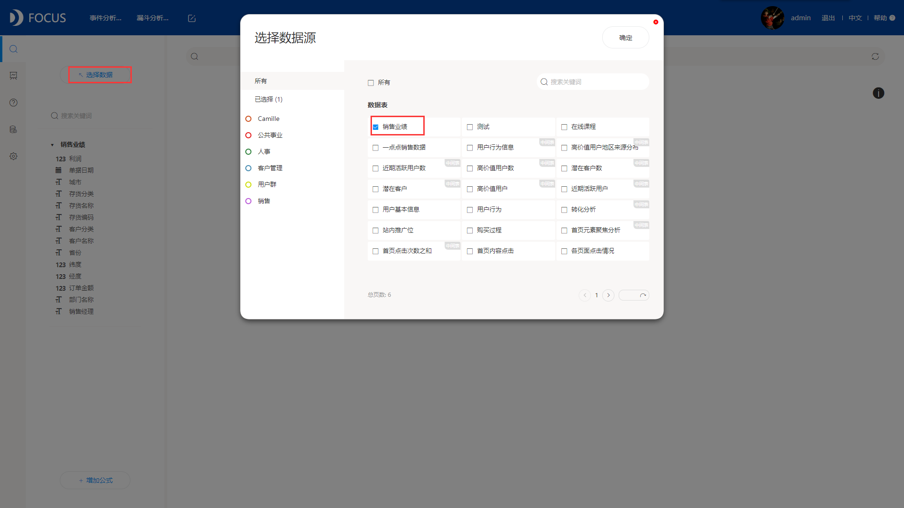
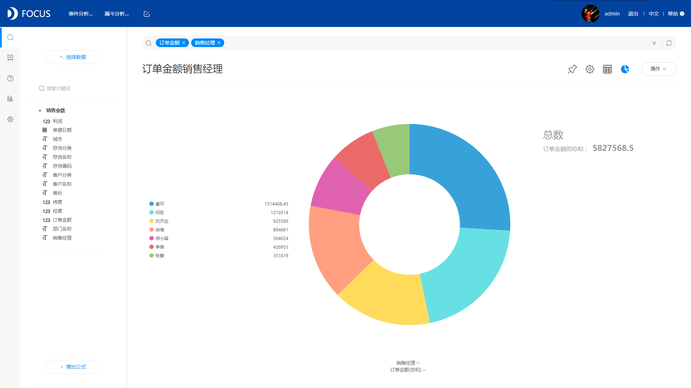
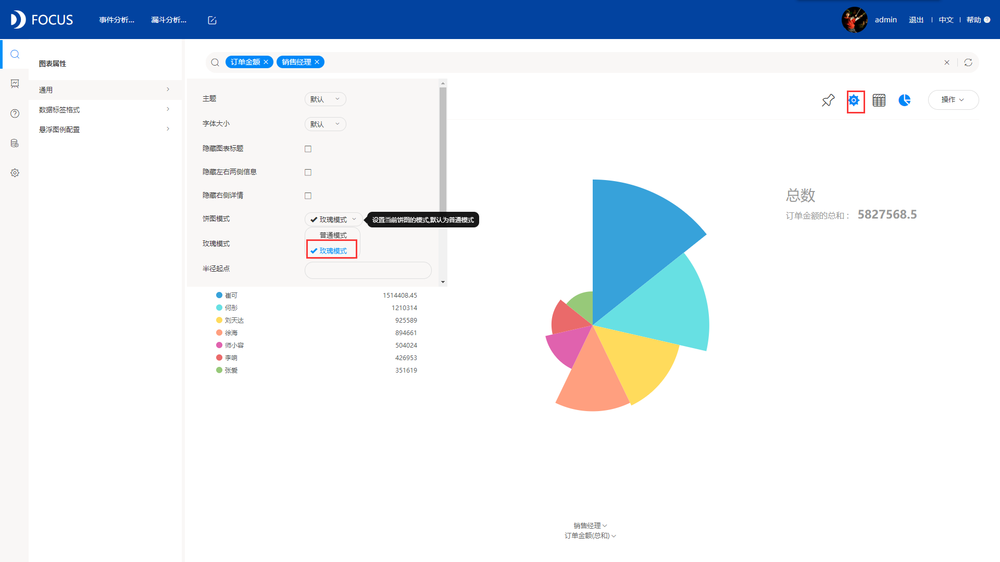

先给大家介绍一下我们今天要讲的南丁格尔玫瑰图，南丁格尔玫瑰图，是由南丁格尔发明的，她是英国护士和统计学家。其在英国军营工作时收集了在克里米亚战争时期的士兵在不同月份的死亡率和原因分布，通过玫瑰图的方式有效的打动了当时的高层管理人员，于是医疗改良的提案才受到了大力的支持，将士兵的死亡率从42%降低至2%，因此后来将此图形称为南丁格尔玫瑰图。

那南丁格尔玫瑰图一般用在什么场景呢？其实南丁格尔玫瑰图和饼图类似，算是饼图的一种变形，用法也一样，主要用在需要查看占比的场景中。两者唯一的区别是：饼图是通过角度判别占比大小，而玫瑰图可以通过半径大小或者扇形面积大小来判别。

下面我们就要实际动手制作玫瑰图了。在制作之前，首先我们先要准备好工具，此次我们采用操作非常简单又实用的DataFocus可视化工具。

1、选择数据源，在搜索页面选择要展示的数据源；

2、进行搜索分析展示数据，在左侧数据表中双击要展示的列；

3、图表转换，系统默认以环图展示搜索结果，将环图转换成饼图；

在这里可能会有疑问，为什么不直接选择玫瑰图呢？大家可以看到，在图形中并没有直接的玫瑰图，DataFocus中，玫瑰图算做是饼图的变形，所有我们只需要选择饼图，后面将饼图的属性配置下就可以转换成玫瑰图了。

4、配置图表属性。将饼图模式从“普通模式”改为“玫瑰模式”，图表即显示玫瑰图，另外，在玫瑰模式中，可以选择是按照面积来判别大小还是按照半径来判别大小；

饼图模式

玫瑰模式

至此，一个完整的南丁格尔玫瑰图就制作完成了，是不是很简单呢？
